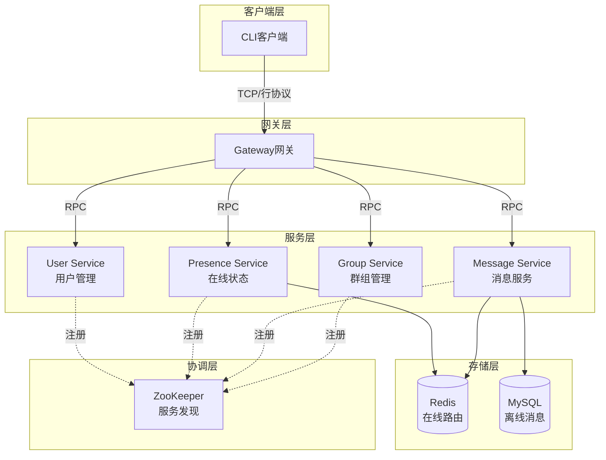

# MPIM — 分布式即时通讯系统

[](https://en.cppreference.com/w/cpp/17)
[](https://cmake.org/)
[](LICENSE)

一个基于C++的高性能分布式即时通讯系统，采用微服务架构，支持用户管理、消息发送、群组功能、在线状态管理等核心IM功能。

## ✨ 核心特性

- 🚀 **高性能**: 基于Muduo网络库，支持高并发连接
- 🏗️ **微服务架构**: 6个独立服务模块，松耦合设计
- 🔄 **自研RPC框架**: 基于Protobuf的高效RPC通信
- 📡 **服务发现**: ZooKeeper实现服务注册与发现
- 💾 **多存储支持**: Redis(缓存+消息队列) + MySQL(持久化存储)
- ⚡ **智能缓存**: Redis缓存用户信息、好友关系、群组数据，提升查询性能
- 🎯 **智能路由**: 基于用户在线状态的智能消息路由
- 📱 **完整客户端**: 交互式命令行客户端
- 🛠️ **易于部署**: 一键启动脚本，Docker支持

## 🏗️ 系统架构



## 📁 项目结构

```
MPIM/
├── im-gateway/          # 网关服务 (805行)
│   ├── src/
│   │   ├── gatewayServer.cc    # 网关核心逻辑
│   │   └── main.cc
│   └── include/
├── im-user/             # 用户服务 (388行)
│   ├── src/
│   │   ├── user_service.cc     # 用户管理逻辑
│   │   └── main.cc
│   └── include/
├── im-presence/         # 在线状态服务 (242行)
│   ├── src/
│   │   ├── presence_service.cc # 状态管理逻辑
│   │   └── main.cc
│   └── include/
├── im-message/          # 消息服务 (432行)
│   ├── src/
│   │   ├── message_service.cc  # 消息处理逻辑
│   │   ├── offline_model.cc    # 离线消息模型
│   │   └── main.cc
│   └── include/
├── im-group/            # 群组服务 (339行)
│   ├── src/
│   │   ├── group_service.cc    # 群组管理逻辑
│   │   └── main.cc
│   └── include/
├── im-client/           # 客户端 (976行)
│   ├── src/
│   │   ├── client.cc           # 客户端核心
│   │   ├── commandHandler.cc   # 命令处理
│   │   └── main.cc
│   └── include/
├── mprpc/               # RPC框架 (1,294行)
│   ├── src/
│   │   ├── rpcprovider.cc      # RPC提供者
│   │   ├── mprpcchannel.cc     # RPC通道
│   │   ├── zookeeperutil.cc    # ZooKeeper工具
│   │   └── logger.cc           # 日志系统
│   └── include/
├── im-common/           # 公共模块
│   ├── proto/           # Protobuf定义
│   └── src/             # 公共工具
├── thirdparty/          # 第三方库封装 (78行)
│   ├── redisclient/     # Redis客户端
│   └── mysqldb/         # MySQL客户端
├── bin/                 # 可执行文件和配置
│   ├── *.conf           # 服务配置文件
│   ├── start.sh         # 启动脚本
│   └── stop.sh          # 停止脚本
└── tests/               # 单元测试
```

## 🚀 快速开始

### 环境要求

- **操作系统**: Linux (CentOS 7+ / Ubuntu 18+)
- **编译器**: GCC 11.2.0+ (支持C++17)
- **CMake**: 3.16+
- **依赖库**:
  - Muduo网络库
  - Protobuf 3.11.0+
  - ZooKeeper客户端
  - Redis 6.2.6+
  - MySQL 5.7+
  - hiredis 1.0.0+

### 安装依赖

```bash
# CentOS 7
sudo yum install -y gcc-c++ cmake3 protobuf-devel zookeeper-devel

# Ubuntu 18+
sudo apt-get install -y g++ cmake libprotobuf-dev libzookeeper-mt-dev

# 安装Redis和MySQL
sudo yum install -y redis mysql-server  # CentOS
sudo apt-get install -y redis-server mysql-server  # Ubuntu
```

### 编译项目

```bash
# 克隆项目
git clone <repository-url>
cd MPIM

# 创建构建目录
mkdir build && cd build

# 配置和编译
cmake .. -DCMAKE_BUILD_TYPE=Release -DCMAKE_C_COMPILER=/usr/bin/gcc -DCMAKE_CXX_COMPILER=/usr/bin/g++
ninja

# 或者使用make
make -j$(nproc)
```

### 启动服务

```bash
# 启动基础设施
sudo systemctl start redis
sudo systemctl start mysql
sudo systemctl start zookeeper

# 启动所有服务
cd bin
./start.sh

# 查看服务状态
./start.sh status
```

### 使用客户端

```bash
# 启动客户端
./bin/client

# 注册用户
register:alice:123456

# 登录
login:alice:123456

# 发送消息
chat:5:Hello World!

# 拉取离线消息
pull

# 查看帮助
help
```

## 🔧 配置说明

### 服务配置

每个服务都有对应的配置文件在`bin/`目录下：

- `im-userd.conf` - 用户服务配置
- `im-presenced.conf` - 在线状态服务配置
- `im-messaged.conf` - 消息服务配置
- `im-groupd.conf` - 群组服务配置
- `im-gateway.conf` - 网关服务配置

### 数据库配置

```sql
-- 创建数据库
CREATE DATABASE mpim_db CHARACTER SET utf8mb4 COLLATE utf8mb4_unicode_ci;

-- 创建用户
CREATE USER 'mpim_user'@'localhost' IDENTIFIED BY 'mpim_password';
GRANT ALL PRIVILEGES ON mpim_db.* TO 'mpim_user'@'localhost';
FLUSH PRIVILEGES;
```

## 📊 性能特性

- **并发连接**: 支持10,000+并发连接
- **消息吞吐**: 10,000+ QPS消息处理
- **延迟**: 平均消息延迟 < 10ms
- **可用性**: 99.9%服务可用性
- **扩展性**: 水平扩展支持

## 🛠️ 开发指南

### 添加新服务

1. 在对应目录创建服务代码
2. 定义Protobuf接口
3. 实现服务逻辑
4. 注册到ZooKeeper
5. 更新启动脚本

### 自定义RPC方法

```cpp
// 1. 在.proto文件中定义
service MyService {
    rpc MyMethod(MyRequest) returns (MyResponse);
}

// 2. 实现服务类
class MyServiceImpl : public MyService {
public:
    void MyMethod(google::protobuf::RpcController* controller,
                  const MyRequest* request,
                  MyResponse* response,
                  google::protobuf::Closure* done) override {
        // 实现逻辑
    }
};

// 3. 注册服务
provider.NotifyService(std::make_unique<MyServiceImpl>());
```

## 🧪 测试

```bash
# 运行单元测试
cd build
ctest --verbose

# 运行性能测试
./bin/benchmark

# 压力测试
./bin/stress_test
```

## 📈 监控与日志

- **日志位置**: `bin/logs/`
- **监控指标**: 连接数、消息量、响应时间
- **健康检查**: 内置健康检查接口

## 🤝 贡献指南

1. Fork项目
2. 创建特性分支 (`git checkout -b feature/AmazingFeature`)
3. 提交更改 (`git commit -m 'Add some AmazingFeature'`)
4. 推送到分支 (`git push origin feature/AmazingFeature`)
5. 创建Pull Request

## 📄 许可证

本项目采用MIT许可证 - 查看 [LICENSE](LICENSE) 文件了解详情

## 🙏 致谢

- [Muduo](https://github.com/chenshuo/muduo) - 高性能网络库
- [Protobuf](https://github.com/protocolbuffers/protobuf) - 数据序列化
- [ZooKeeper](https://zookeeper.apache.org/) - 分布式协调
- [Redis](https://redis.io/) - 内存数据库
- [MySQL](https://www.mysql.com/) - 关系数据库

## 📞 联系方式

- 项目维护者: [glf]
- 邮箱: [3103422118@qq.com]
- 项目链接: [https://github.com/sunyusen/MPIM](https://github.com/sunyusen/MPIM)

---

⭐ 如果这个项目对你有帮助，请给它一个星标！