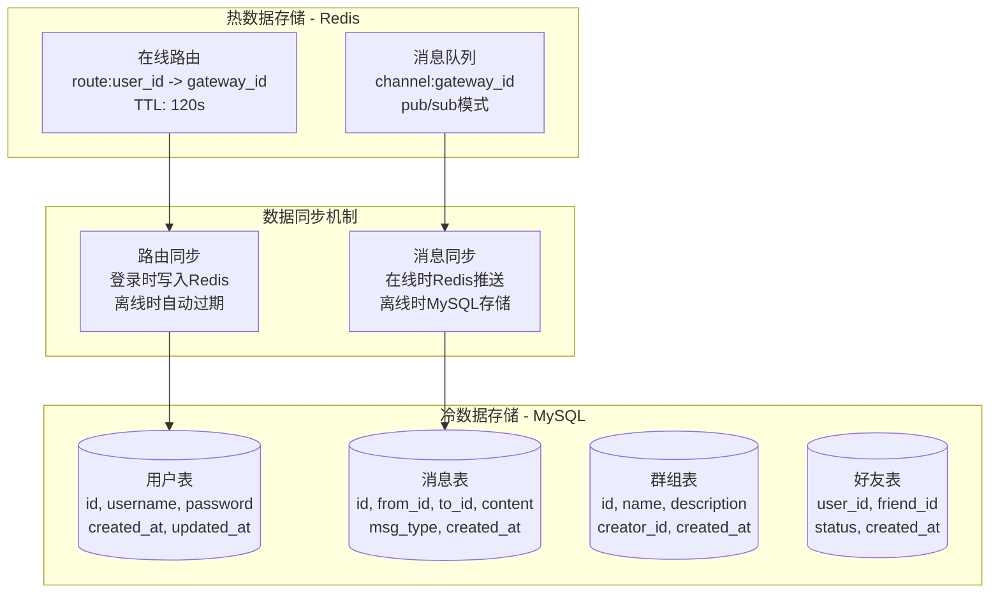

# 数据存储架构

## 存储架构概述

系统采用Redis+MySQL的混合存储架构，Redis存储热数据，MySQL存储冷数据，通过数据同步机制保证数据一致性。

## 数据存储架构图



## Redis数据设计

### 1. 在线路由存储
```redis
# 键格式: route:用户ID
# 值格式: 网关ID
# TTL: 120秒

SET route:123 "gateway-001" EX 120
SET route:456 "gateway-002" EX 120
```

**用途**: 快速查找用户当前连接的网关
**过期策略**: 自动过期，避免内存泄漏
**更新时机**: 用户登录时绑定，离线时自动清理

### 2. 消息队列存储
```redis
# 频道格式: channel:网关ID
# 消息格式: 序列化的消息数据

PUBLISH channel:10001 "serialized_message_data"
SUBSCRIBE channel:10001
```

**用途**: 实时消息投递
**特点**: 发布/订阅模式，支持多订阅者
**频道分配**: 10000 + hash(网关ID) % 50000

### 3. 会话缓存存储
```redis
# 键格式: user:用户ID:session
# 值格式: 会话信息JSON

HSET user:123:session session_id "abc123"
HSET user:123:session login_time "1640995200"
HSET user:123:session device_info "mobile"
```

**用途**: 用户会话管理
**过期策略**: 与路由同步过期
**更新时机**: 用户登录时创建，登出时删除

### 4. 在线用户统计
```redis
# 集合存储在线用户ID
SADD online_users 123 456 789
SCARD online_users  # 获取在线用户数
SISMEMBER online_users 123  # 检查用户是否在线
```

**用途**: 实时统计在线用户数
**更新时机**: 用户登录时添加，登出时删除

## MySQL数据设计

### 1. 用户表 (users)
```sql
CREATE TABLE users (
    id BIGINT PRIMARY KEY AUTO_INCREMENT,
    username VARCHAR(50) UNIQUE NOT NULL,
    password VARCHAR(255) NOT NULL,
    email VARCHAR(100),
    phone VARCHAR(20),
    avatar_url VARCHAR(255),
    status TINYINT DEFAULT 1 COMMENT '1:正常 0:禁用',
    created_at TIMESTAMP DEFAULT CURRENT_TIMESTAMP,
    updated_at TIMESTAMP DEFAULT CURRENT_TIMESTAMP ON UPDATE CURRENT_TIMESTAMP,
    INDEX idx_username (username),
    INDEX idx_status (status)
);
```

### 2. 消息表 (messages)
```sql
CREATE TABLE messages (
    id BIGINT PRIMARY KEY AUTO_INCREMENT,
    from_id BIGINT NOT NULL,
    to_id BIGINT NOT NULL,
    content TEXT NOT NULL,
    msg_type TINYINT DEFAULT 1 COMMENT '1:文本 2:图片 3:文件',
    group_id BIGINT DEFAULT NULL COMMENT '群组消息',
    msg_id VARCHAR(64) UNIQUE NOT NULL,
    status TINYINT DEFAULT 1 COMMENT '1:正常 0:已撤回',
    created_at TIMESTAMP DEFAULT CURRENT_TIMESTAMP,
    INDEX idx_from_to (from_id, to_id),
    INDEX idx_to_created (to_id, created_at),
    INDEX idx_group_created (group_id, created_at),
    INDEX idx_msg_id (msg_id)
);
```

### 3. 群组表 (groups)
```sql
CREATE TABLE groups (
    id BIGINT PRIMARY KEY AUTO_INCREMENT,
    name VARCHAR(100) NOT NULL,
    description TEXT,
    creator_id BIGINT NOT NULL,
    avatar_url VARCHAR(255),
    max_members INT DEFAULT 500,
    status TINYINT DEFAULT 1 COMMENT '1:正常 0:解散',
    created_at TIMESTAMP DEFAULT CURRENT_TIMESTAMP,
    updated_at TIMESTAMP DEFAULT CURRENT_TIMESTAMP ON UPDATE CURRENT_TIMESTAMP,
    INDEX idx_creator (creator_id),
    INDEX idx_status (status)
);
```

### 4. 群组成员表 (group_members)
```sql
CREATE TABLE group_members (
    id BIGINT PRIMARY KEY AUTO_INCREMENT,
    group_id BIGINT NOT NULL,
    user_id BIGINT NOT NULL,
    role TINYINT DEFAULT 1 COMMENT '1:普通成员 2:管理员 3:群主',
    join_time TIMESTAMP DEFAULT CURRENT_TIMESTAMP,
    status TINYINT DEFAULT 1 COMMENT '1:正常 0:已退出',
    UNIQUE KEY uk_group_user (group_id, user_id),
    INDEX idx_user (user_id),
    INDEX idx_group (group_id)
);
```

### 5. 好友表 (friends)
```sql
CREATE TABLE friends (
    id BIGINT PRIMARY KEY AUTO_INCREMENT,
    user_id BIGINT NOT NULL,
    friend_id BIGINT NOT NULL,
    status TINYINT DEFAULT 0 COMMENT '0:待确认 1:已同意 2:已拒绝',
    remark VARCHAR(50),
    created_at TIMESTAMP DEFAULT CURRENT_TIMESTAMP,
    updated_at TIMESTAMP DEFAULT CURRENT_TIMESTAMP ON UPDATE CURRENT_TIMESTAMP,
    UNIQUE KEY uk_user_friend (user_id, friend_id),
    INDEX idx_user (user_id),
    INDEX idx_friend (friend_id)
);
```

## 数据同步机制

### 1. 路由同步
```cpp
// 用户登录时同步路由到Redis
void PresenceServiceImpl::BindRoute(const BindRouteReq* req, BindRouteResp* resp) {
    std::string route_key = "route:" + std::to_string(req->user_id());
    std::string gateway_id = req->gateway_id();
    
    // 写入Redis，设置120秒TTL
    if (redis_.setex(route_key, 120, gateway_id)) {
        resp->mutable_result()->set_code(Code::Ok);
    } else {
        resp->mutable_result()->set_code(Code::INTERNAL);
    }
}
```

### 2. 消息同步
```cpp
// 在线消息通过Redis推送，离线消息存储到MySQL
void MessageServiceImpl::SendMessage(const SendReq* req, SendResp* resp) {
    // 查询接收者路由
    auto gateway_id = presence_service_->QueryRoute(req->msg().to());
    
    if (!gateway_id.empty()) {
        // 在线：通过Redis推送
        int channel = 10000 + hash(gateway_id) % 50000;
        redis_.publish(channel, req->msg().SerializeAsString());
    } else {
        // 离线：存储到MySQL
        OfflineMessageModel model;
        model.Insert(req->msg());
    }
}
```

### 3. 状态同步
```cpp
// 定期同步用户状态
void UserServiceImpl::SyncUserStatus() {
    // 从Redis获取在线用户
    auto online_users = redis_.smembers("online_users");
    
    // 更新MySQL中的最后在线时间
    for (const auto& user_id : online_users) {
        UpdateLastActiveTime(user_id);
    }
}
```

## 数据一致性保证

### 1. 最终一致性
- **Redis**: 实时数据，可能短暂不一致
- **MySQL**: 持久化数据，保证最终一致
- **同步机制**: 定期同步，保证数据最终一致

### 2. 事务处理
```cpp
// 用户注册事务
void UserServiceImpl::RegisterUser(const RegisterReq* req, RegisterResp* resp) {
    // 开始事务
    mysql_connection_->execute("START TRANSACTION");
    
    try {
        // 插入用户记录
        InsertUser(req->username(), req->password());
        
        // 创建用户会话
        CreateUserSession(user_id);
        
        // 提交事务
        mysql_connection_->execute("COMMIT");
        resp->mutable_result()->set_code(Code::Ok);
    } catch (const std::exception& e) {
        // 回滚事务
        mysql_connection_->execute("ROLLBACK");
        resp->mutable_result()->set_code(Code::INTERNAL);
    }
}
```

### 3. 数据校验
```cpp
// 数据完整性校验
bool DataValidator::ValidateUserData(const User& user) {
    if (user.username().empty() || user.password().empty()) {
        return false;
    }
    
    if (user.username().length() < 3 || user.username().length() > 50) {
        return false;
    }
    
    if (user.password().length() < 6) {
        return false;
    }
    
    return true;
}
```

## 性能优化

### 1. 索引优化
```sql
-- 复合索引优化查询
CREATE INDEX idx_messages_to_created ON messages(to_id, created_at);
CREATE INDEX idx_messages_from_to ON messages(from_id, to_id);
CREATE INDEX idx_group_members_user ON group_members(user_id);
```

### 2. 分页查询优化
```sql
-- 使用游标分页，避免OFFSET性能问题
SELECT * FROM messages 
WHERE to_id = ? AND id > ? 
ORDER BY id ASC 
LIMIT 20;
```

### 3. 缓存策略
```cpp
// 用户信息缓存
class UserCache {
public:
    User GetUser(int64_t user_id) {
        // 先查Redis缓存
        auto cached = redis_.hgetall("user:" + std::to_string(user_id));
        if (!cached.empty()) {
            return ParseUser(cached);
        }
        
        // 查MySQL并缓存
        User user = mysql_.GetUser(user_id);
        redis_.hmset("user:" + std::to_string(user_id), SerializeUser(user));
        redis_.expire("user:" + std::to_string(user_id), 3600); // 1小时过期
        
        return user;
    }
};
```

## 监控和运维

### 1. 数据监控
```cpp
// 数据量监控
class DataMonitor {
public:
    void RecordDataSize() {
        // Redis内存使用
        auto redis_memory = redis_.info("memory");
        
        // MySQL表大小
        auto table_sizes = mysql_.GetTableSizes();
        
        // 记录监控数据
        LOG_INFO << "Redis Memory: " << redis_memory;
        LOG_INFO << "MySQL Tables: " << table_sizes;
    }
};
```

### 2. 数据备份
```bash
#!/bin/bash
# 数据备份脚本

# Redis数据备份
redis-cli --rdb /backup/redis_$(date +%Y%m%d).rdb

# MySQL数据备份
mysqldump -u root -p mpim > /backup/mysql_$(date +%Y%m%d).sql

# 清理7天前的备份
find /backup -name "*.rdb" -mtime +7 -delete
find /backup -name "*.sql" -mtime +7 -delete
```
