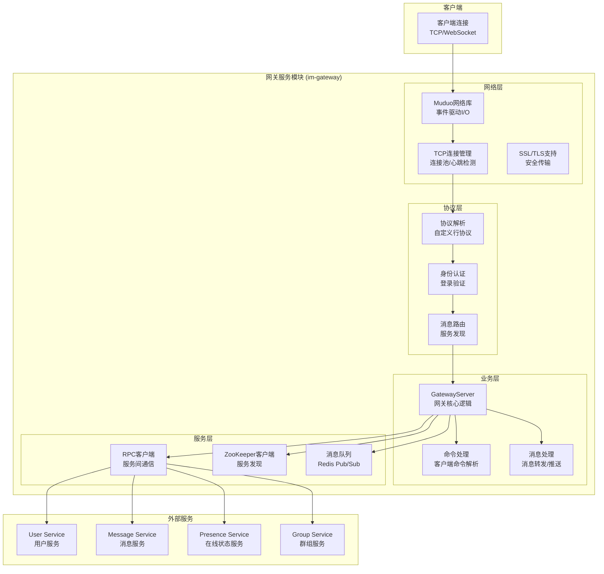
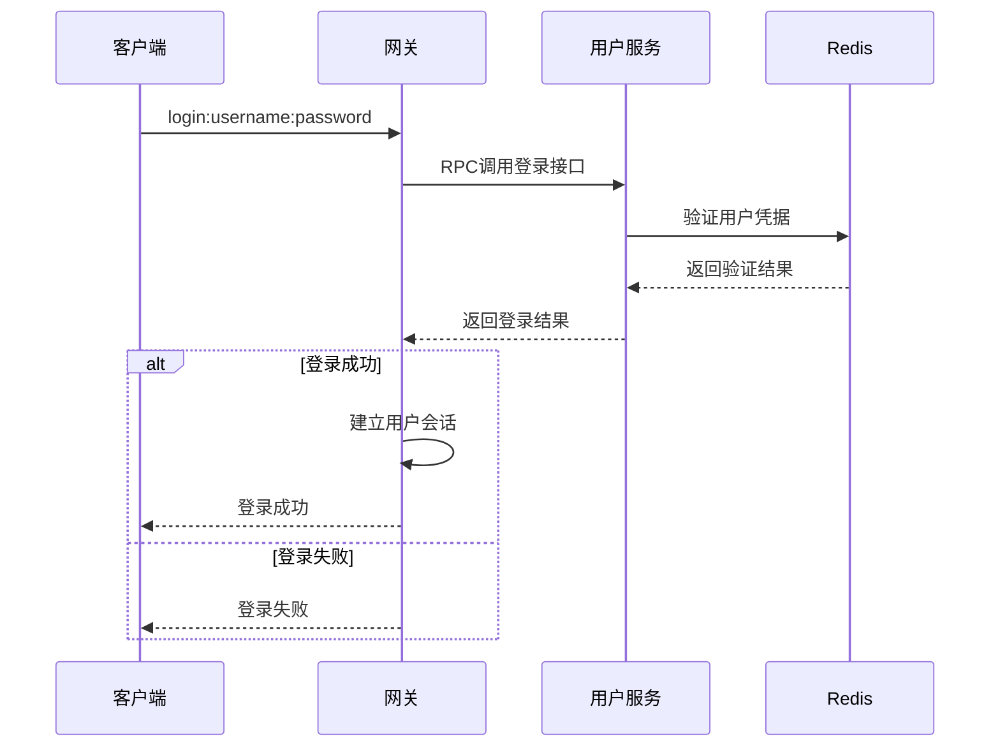
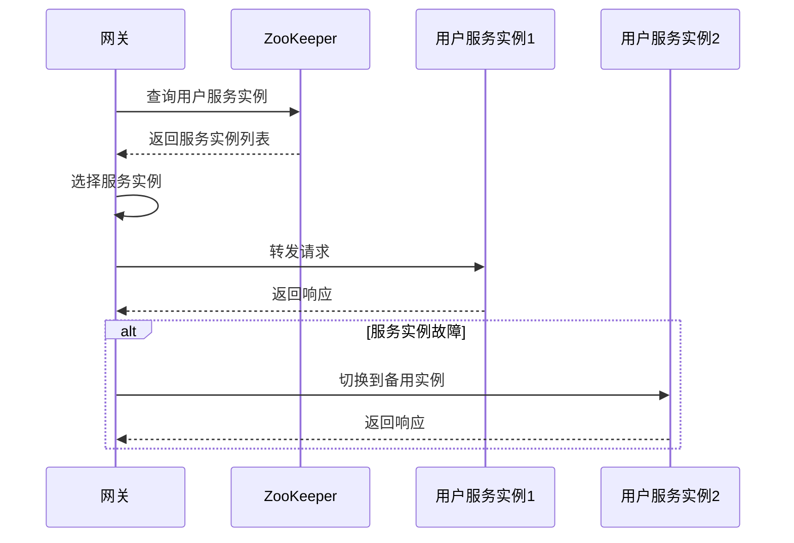
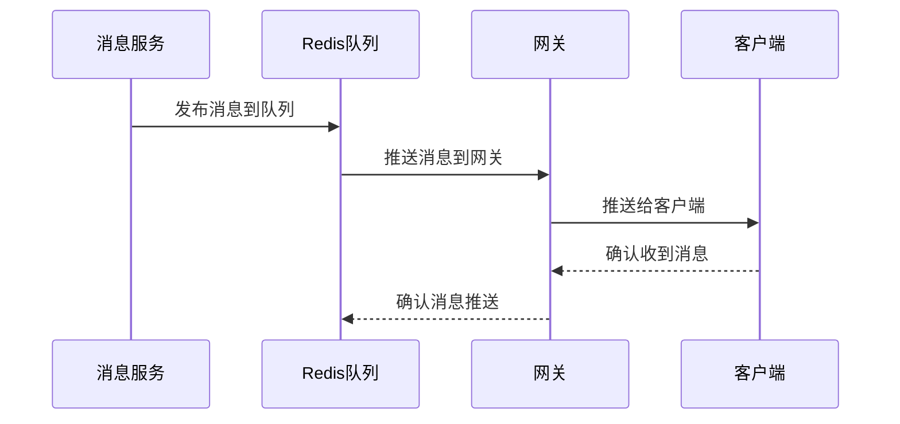
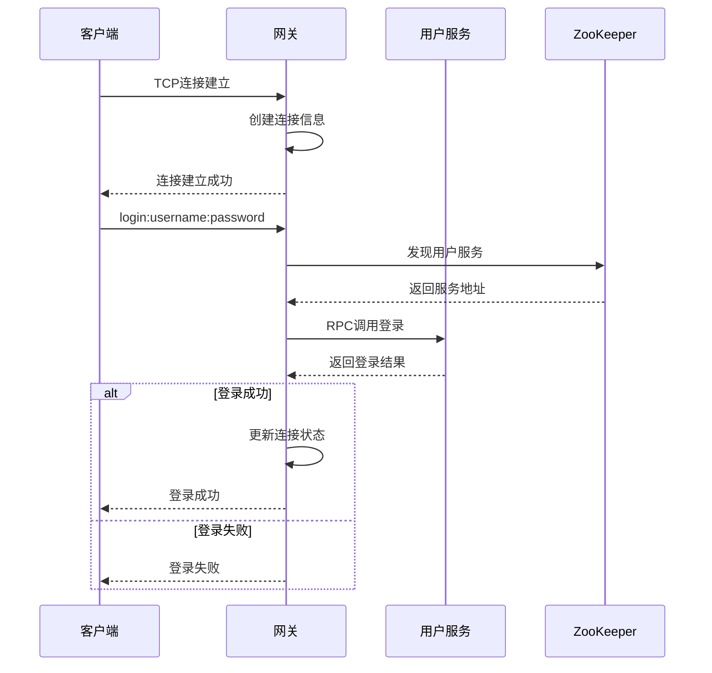
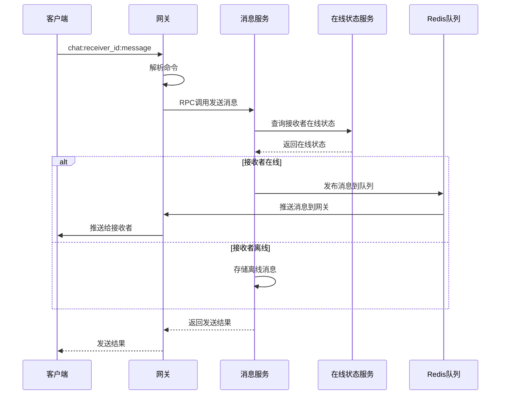
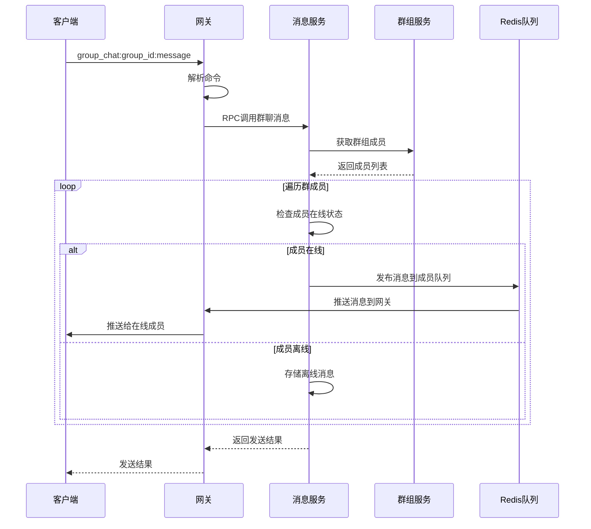

# 网关服务模块架构设计

## 概述

网关服务模块（im-gateway）是MPIM系统的接入层，负责客户端连接管理、协议解析、消息路由、负载均衡等关键功能。该模块基于Muduo网络库，支持高并发连接处理。

## 模块架构图



## 核心功能模块

### 1. 连接管理模块

#### 功能特性
- **连接建立**: 处理客户端TCP连接
- **连接维护**: 心跳检测、连接保活
- **连接池**: 管理活跃连接
- **连接清理**: 异常连接清理

#### 实现细节
```cpp
class GatewayServer {
private:
    muduo::net::TcpServer server_;
    muduo::net::EventLoop* loop_;
    std::map<int, TcpConnectionPtr> connections_;
    std::map<int64_t, int> user_connections_; // user_id -> fd
    
public:
    // 连接建立回调
    void onConnection(const muduo::net::TcpConnectionPtr& conn);
    
    // 消息接收回调
    void onMessage(const muduo::net::TcpConnectionPtr& conn,
                   muduo::net::Buffer* buf,
                   muduo::Timestamp time);
    
    // 连接断开回调
    void onDisconnection(const muduo::net::TcpConnectionPtr& conn);
};
```

#### 连接状态管理
```cpp
enum class ConnectionState {
    CONNECTED,      // 已连接
    AUTHENTICATED,  // 已认证
    ACTIVE,         // 活跃状态
    IDLE,           // 空闲状态
    CLOSING         // 关闭中
};

class ConnectionInfo {
public:
    int fd_;
    int64_t user_id_;
    ConnectionState state_;
    muduo::Timestamp last_activity_;
    std::string client_ip_;
    int client_port_;
};
```

### 2. 协议解析模块

#### 功能特性
- **行协议**: 基于换行符的消息分隔
- **命令解析**: 解析客户端命令
- **参数提取**: 提取命令参数
- **错误处理**: 协议错误处理

#### 协议格式
```
命令:参数1:参数2:参数3
```

#### 支持的命令
```
login:username:password          # 用户登录
register:username:password       # 用户注册
chat:receiver_id:message         # 发送消息
group_chat:group_id:message      # 群聊消息
pull                            # 拉取离线消息
logout                          # 用户登出
```

#### 实现细节
```cpp
class ProtocolParser {
public:
    // 解析消息
    bool parseMessage(const std::string& message, Command& cmd);
    
    // 解析登录命令
    bool parseLogin(const std::vector<std::string>& args, LoginCmd& cmd);
    
    // 解析聊天命令
    bool parseChat(const std::vector<std::string>& args, ChatCmd& cmd);
    
    // 解析群聊命令
    bool parseGroupChat(const std::vector<std::string>& args, GroupChatCmd& cmd);
};

struct Command {
    std::string type_;
    std::vector<std::string> args_;
    int64_t user_id_;
    int fd_;
};
```

### 3. 身份认证模块

#### 功能特性
- **登录验证**: 验证用户凭据
- **会话管理**: 管理用户会话
- **权限控制**: 控制用户权限
- **登出处理**: 处理用户登出

#### 实现细节
```cpp
class AuthenticationManager {
private:
    std::map<int64_t, int> user_sessions_; // user_id -> fd
    std::map<int, int64_t> fd_users_;      // fd -> user_id
    
public:
    // 用户登录
    bool authenticateUser(int fd, const std::string& username, 
                         const std::string& password);
    
    // 用户登出
    void logoutUser(int fd);
    
    // 检查用户是否已登录
    bool isUserAuthenticated(int fd);
    
    // 获取用户ID
    int64_t getUserId(int fd);
    
    // 获取用户连接
    int getUserConnection(int64_t user_id);
};
```

#### 认证流程


### 4. 消息路由模块

#### 功能特性
- **服务发现**: 通过ZooKeeper发现后端服务
- **负载均衡**: 在多个服务实例间负载均衡
- **消息转发**: 转发客户端消息到后端服务
- **响应处理**: 处理后端服务响应

#### 实现细节
```cpp
class MessageRouter {
private:
    std::shared_ptr<ZooKeeperUtil> zk_util_;
    std::map<std::string, std::vector<std::string>> service_instances_;
    
public:
    // 发现服务
    bool discoverService(const std::string& service_name);
    
    // 选择服务实例
    std::string selectServiceInstance(const std::string& service_name);
    
    // 转发消息
    bool forwardMessage(const std::string& service_name, 
                       const std::string& method,
                       const google::protobuf::Message& request,
                       google::protobuf::Message& response);
    
    // 处理响应
    void handleResponse(const std::string& response, int fd);
};
```

#### 服务发现流程


### 5. 消息推送模块

#### 功能特性
- **实时推送**: 向在线用户推送消息
- **消息队列**: 订阅Redis消息队列
- **批量推送**: 批量推送消息
- **推送确认**: 消息推送确认机制

#### 实现细节
```cpp
class MessagePusher {
private:
    std::shared_ptr<MessageQueue> message_queue_;
    std::map<int64_t, int> user_connections_;
    
public:
    // 订阅消息队列
    void subscribeToMessageQueue();
    
    // 推送消息
    void pushMessage(int64_t user_id, const std::string& message);
    
    // 批量推送
    void pushMessages(const std::map<int64_t, std::string>& messages);
    
    // 处理推送确认
    void handlePushConfirmation(int64_t user_id, int64_t message_id);
};
```

#### 消息推送流程


## 数据模型设计

### 连接信息结构
```cpp
struct ConnectionInfo {
    int fd_;                    // 文件描述符
    int64_t user_id_;          // 用户ID
    ConnectionState state_;     // 连接状态
    muduo::Timestamp last_activity_; // 最后活动时间
    std::string client_ip_;     // 客户端IP
    int client_port_;          // 客户端端口
    std::string session_id_;   // 会话ID
};
```

### 命令结构
```cpp
struct LoginCmd {
    std::string username_;
    std::string password_;
};

struct ChatCmd {
    int64_t receiver_id_;
    std::string message_;
};

struct GroupChatCmd {
    int64_t group_id_;
    std::string message_;
};
```

### 消息结构
```cpp
struct PushMessage {
    int64_t message_id_;
    int64_t sender_id_;
    int64_t receiver_id_;
    int64_t group_id_;
    std::string content_;
    std::string message_type_;
    int64_t timestamp_;
};
```

## 业务流程设计

### 客户端连接流程



### 消息发送流程



### 群聊消息流程



## 性能优化策略

### 1. 连接管理优化
- **连接池**: 使用连接池管理TCP连接
- **心跳检测**: 定期检测连接状态
- **连接复用**: 复用长连接减少开销
- **连接限制**: 限制单IP连接数

### 2. 消息处理优化
- **异步处理**: 消息处理异步化
- **批量处理**: 批量处理消息
- **消息缓存**: 缓存热点消息
- **压缩传输**: 消息压缩传输

### 3. 服务发现优化
- **缓存服务**: 缓存服务实例信息
- **健康检查**: 定期检查服务健康状态
- **故障转移**: 自动故障转移
- **负载均衡**: 智能负载均衡算法

### 4. 内存管理优化
- **对象池**: 使用对象池减少内存分配
- **内存复用**: 复用内存缓冲区
- **垃圾回收**: 定期清理无用对象
- **内存监控**: 监控内存使用情况

## 错误处理机制

### 1. 连接错误处理
```cpp
// 连接错误处理
void GatewayServer::onConnection(const TcpConnectionPtr& conn) {
    if (conn->connected()) {
        LOG_INFO << "New connection from " << conn->peerAddress().toIpPort();
        // 创建连接信息
        createConnectionInfo(conn);
    } else {
        LOG_INFO << "Connection closed: " << conn->peerAddress().toIpPort();
        // 清理连接信息
        cleanupConnection(conn);
    }
}
```

### 2. 协议错误处理
```cpp
// 协议错误处理
void GatewayServer::onMessage(const TcpConnectionPtr& conn, Buffer* buf, Timestamp time) {
    std::string message = buf->retrieveAllAsString();
    
    Command cmd;
    if (!protocol_parser_.parseMessage(message, cmd)) {
        LOG_WARN << "Invalid protocol: " << message;
        sendError(conn, "Invalid protocol");
        return;
    }
    
    // 处理命令
    handleCommand(conn, cmd);
}
```

### 3. 服务调用错误处理
```cpp
// 服务调用错误处理
bool MessageRouter::forwardMessage(const std::string& service_name, 
                                  const std::string& method,
                                  const google::protobuf::Message& request,
                                  google::protobuf::Message& response) {
    try {
        // 选择服务实例
        std::string service_addr = selectServiceInstance(service_name);
        if (service_addr.empty()) {
            LOG_ERROR << "No available service instance for " << service_name;
            return false;
        }
        
        // 调用服务
        return callService(service_addr, method, request, response);
    } catch (const std::exception& e) {
        LOG_ERROR << "Service call failed: " << e.what();
        return false;
    }
}
```

## 监控指标

### 1. 连接指标
- **连接数**: 当前连接数量
- **连接速率**: 每秒新建连接数
- **断开速率**: 每秒断开连接数
- **连接时长**: 平均连接时长

### 2. 消息指标
- **消息吞吐**: 每秒处理消息数
- **消息延迟**: 消息处理延迟
- **消息大小**: 平均消息大小
- **错误率**: 消息处理错误率

### 3. 服务指标
- **服务调用QPS**: 每秒服务调用数
- **服务响应时间**: 服务调用响应时间
- **服务可用性**: 服务可用性百分比
- **负载均衡**: 负载均衡效果

### 4. 系统指标
- **CPU使用率**: 网关CPU使用率
- **内存使用**: 网关内存使用
- **网络IO**: 网络输入输出量
- **文件描述符**: 文件描述符使用数

## 配置参数

### 服务配置
```ini
# 网关服务配置
[gateway_service]
port = 6000
thread_count = 4
max_connections = 10000
connection_timeout = 300

# 网络配置
[network]
tcp_keepalive = 60
tcp_nodelay = true
send_buffer_size = 65536
receive_buffer_size = 65536

# 服务发现配置
[service_discovery]
zookeeper_hosts = localhost:2181
service_discovery_interval = 30
health_check_interval = 10
```

### 负载均衡配置
```ini
# 负载均衡配置
[load_balancer]
algorithm = round_robin  # round_robin, least_connections, weighted
max_retries = 3
retry_interval = 1000
circuit_breaker_threshold = 5
```

## 部署说明

### 1. 编译构建
```bash
# 编译网关服务
cd im-gateway
mkdir build && cd build
cmake ..
make -j$(nproc)
```

### 2. 服务启动
```bash
# 启动网关服务
./bin/im-gateway -c ../conf/im-gateway.conf
```

### 3. 负载均衡配置
```nginx
# Nginx配置
upstream mpim_gateway {
    server 127.0.0.1:8000;
    server 127.0.0.1:8001;
    server 127.0.0.1:8002;
}

server {
    listen 80;
    location / {
        proxy_pass http://mpim_gateway;
        proxy_set_header Host $host;
        proxy_set_header X-Real-IP $remote_addr;
    }
}
```

### 4. 健康检查
```bash
# 检查服务状态
curl http://localhost:8000/health

# 检查连接数
netstat -an | grep :8000 | wc -l
```

## 总结

网关服务模块通过以下设计实现了高性能、高可用的接入层功能：

1. **高并发连接**: 基于Muduo网络库支持高并发连接
2. **协议解析**: 灵活的行协议解析机制
3. **身份认证**: 完善的用户身份认证和会话管理
4. **服务发现**: 基于ZooKeeper的服务发现和负载均衡
5. **消息路由**: 智能的消息路由和转发机制
6. **实时推送**: 基于Redis的实时消息推送
7. **错误处理**: 完善的错误处理和恢复机制
8. **监控完善**: 全面的性能和业务监控指标

该模块为IM系统提供了稳定可靠的接入层服务，能够支持大规模用户并发访问。
