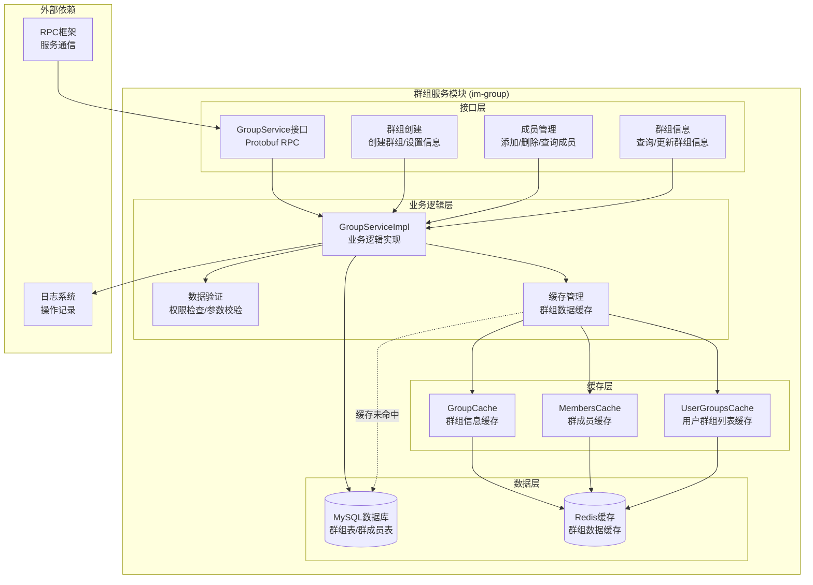
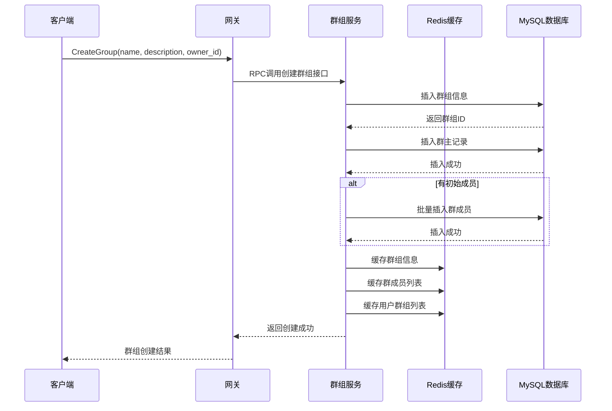
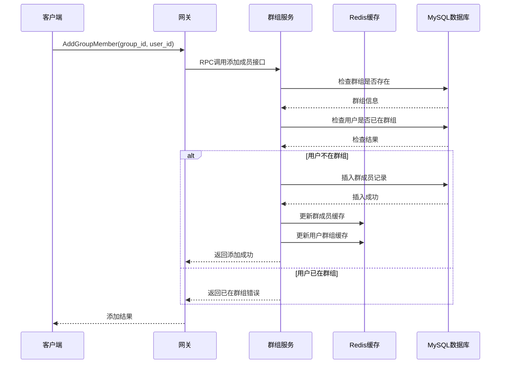
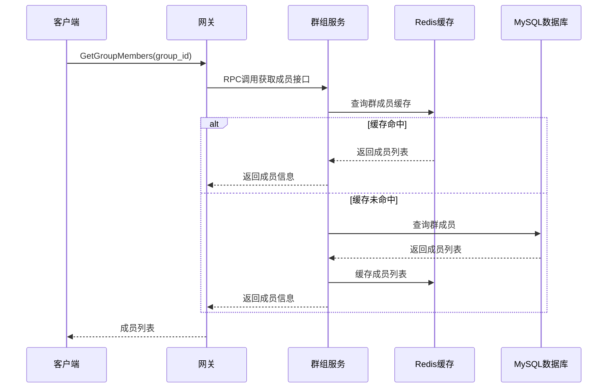

# 群组服务模块架构设计

## 概述

群组服务模块（im-group）负责群聊功能的管理，包括群组创建、成员管理、群组信息维护等核心功能。该模块同样采用Redis缓存优化，支持大规模群组管理。

## 模块架构图



## 核心功能模块

### 1. 群组创建模块

#### 功能特性
- **群组创建**: 创建新群组，设置群组信息
- **群主设置**: 自动设置创建者为群主
- **初始成员**: 创建时添加初始成员
- **权限验证**: 验证创建者权限

#### 实现细节
```cpp
class GroupServiceImpl {
public:
    // 创建群组
    void CreateGroup(google::protobuf::RpcController* controller,
                     const mpim::CreateGroupReq* request,
                     mpim::CreateGroupResp* response,
                     google::protobuf::Closure* done) override;
    
    // 获取群组信息
    void GetGroupInfo(google::protobuf::RpcController* controller,
                      const mpim::GetGroupInfoReq* request,
                      mpim::GetGroupInfoResp* response,
                      google::protobuf::Closure* done) override;
    
    // 更新群组信息
    void UpdateGroupInfo(google::protobuf::RpcController* controller,
                         const mpim::UpdateGroupInfoReq* request,
                         mpim::UpdateGroupInfoResp* response,
                         google::protobuf::Closure* done) override;
};
```

#### 缓存策略
- **群组信息**: 缓存1小时，减少群组信息查询
- **群主信息**: 缓存1小时，快速验证权限
- **群组列表**: 缓存30分钟，减少用户群组查询

### 2. 群成员管理模块

#### 功能特性
- **添加成员**: 邀请用户加入群组
- **移除成员**: 将用户从群组中移除
- **查询成员**: 获取群组成员列表
- **权限管理**: 群主/管理员权限控制

#### 实现细节
```cpp
// 添加群成员
void AddGroupMember(google::protobuf::RpcController* controller,
                    const mpim::AddGroupMemberReq* request,
                    mpim::AddGroupMemberResp* response,
                    google::protobuf::Closure* done) override;

// 获取群成员
void GetGroupMembers(google::protobuf::RpcController* controller,
                     const mpim::GetGroupMembersReq* request,
                     mpim::GetGroupMembersResp* response,
                     google::protobuf::Closure* done) override;

// 移除群成员
void RemoveGroupMember(google::protobuf::RpcController* controller,
                       const mpim::RemoveGroupMemberReq* request,
                       const mpim::RemoveGroupMemberResp* response,
                       google::protobuf::Closure* done) override;
```

#### 缓存策略
- **群成员列表**: 缓存30分钟，减少成员查询
- **用户群组列表**: 缓存30分钟，快速获取用户群组
- **成员关系**: 实时更新，保证数据一致性

### 3. 群组信息管理模块

#### 功能特性
- **群组信息查询**: 获取群组详细信息
- **群组信息更新**: 修改群组名称、描述等
- **群组状态管理**: 群组启用/禁用状态
- **群组统计**: 成员数量、活跃度等统计信息

#### 实现细节
```cpp
// 获取用户群组列表
void GetUserGroups(google::protobuf::RpcController* controller,
                   const mpim::GetUserGroupsReq* request,
                   mpim::GetUserGroupsResp* response,
                   google::protobuf::Closure* done) override;

// 删除群组
void DeleteGroup(google::protobuf::RpcController* controller,
                 const mpim::DeleteGroupReq* request,
                 const mpim::DeleteGroupResp* response,
                 google::protobuf::Closure* done) override;
```

### 4. 缓存管理模块

#### GroupCache类设计
```cpp
class GroupCache {
private:
    mpim::redis::CacheManager cache_manager_;
    std::atomic<bool> connected_;
    
public:
    // 群组信息缓存
    std::string GetGroupInfo(int64_t group_id);
    bool SetGroupInfo(int64_t group_id, const std::string& data, int ttl);
    bool DelGroupInfo(int64_t group_id);
    
    // 群成员缓存
    std::string GetGroupMembers(int64_t group_id);
    bool SetGroupMembers(int64_t group_id, const std::string& members_data, int ttl);
    bool DelGroupMembers(int64_t group_id);
    
    // 用户群组列表缓存
    std::string GetUserGroups(int64_t user_id);
    bool SetUserGroups(int64_t user_id, const std::string& groups_data, int ttl);
    bool DelUserGroups(int64_t user_id);
};
```

#### 缓存键设计
```
group:info:{group_id}         # 群组基本信息
group:members:{group_id}      # 群组成员列表
user:groups:{user_id}         # 用户群组列表
```

## 数据模型设计

### 数据库表结构

#### 群组表 (group)
```sql
CREATE TABLE `group` (
    id BIGINT PRIMARY KEY AUTO_INCREMENT,
    name VARCHAR(100) NOT NULL,
    description TEXT,
    owner_id BIGINT NOT NULL,
    max_members INT DEFAULT 500,
    status ENUM('active', 'inactive', 'deleted') DEFAULT 'active',
    created_at TIMESTAMP DEFAULT CURRENT_TIMESTAMP,
    updated_at TIMESTAMP DEFAULT CURRENT_TIMESTAMP ON UPDATE CURRENT_TIMESTAMP,
    FOREIGN KEY (owner_id) REFERENCES user(id)
);
```

#### 群成员表 (group_member)
```sql
CREATE TABLE group_member (
    id BIGINT PRIMARY KEY AUTO_INCREMENT,
    group_id BIGINT NOT NULL,
    user_id BIGINT NOT NULL,
    role ENUM('owner', 'admin', 'member') DEFAULT 'member',
    joined_at TIMESTAMP DEFAULT CURRENT_TIMESTAMP,
    UNIQUE KEY uk_group_user (group_id, user_id),
    FOREIGN KEY (group_id) REFERENCES `group`(id),
    FOREIGN KEY (user_id) REFERENCES user(id)
);
```

### Protobuf消息定义

#### 群组创建
```protobuf
message CreateGroupReq {
    string name = 1;
    string description = 2;
    int64 owner_id = 3;
    repeated int64 initial_members = 4;
}

message CreateGroupResp {
    Result result = 1;
    int64 group_id = 2;
    GroupInfo group_info = 3;
}
```

#### 群成员管理
```protobuf
message AddGroupMemberReq {
    int64 group_id = 1;
    int64 user_id = 2;
    int64 operator_id = 3;
}

message GetGroupMembersReq {
    int64 group_id = 1;
}

message GetGroupMembersResp {
    Result result = 1;
    repeated GroupMember members = 2;
}
```

#### 群组信息
```protobuf
message GroupInfo {
    int64 id = 1;
    string name = 2;
    string description = 3;
    int64 owner_id = 4;
    int32 member_count = 5;
    int32 max_members = 6;
    string status = 7;
    int64 created_at = 8;
}

message GroupMember {
    int64 user_id = 1;
    string role = 2;
    int64 joined_at = 3;
}
```

## 业务流程设计

### 群组创建流程



### 添加群成员流程



### 获取群成员流程



## 权限管理设计

### 角色定义
- **群主 (owner)**: 拥有群组所有权限
- **管理员 (admin)**: 可以管理群成员，不能删除群组
- **普通成员 (member)**: 只能查看群组信息

### 权限矩阵

| 操作 | 群主 | 管理员 | 普通成员 |
|------|------|--------|----------|
| 查看群组信息 | ✅ | ✅ | ✅ |
| 修改群组信息 | ✅ | ❌ | ❌ |
| 添加成员 | ✅ | ✅ | ❌ |
| 移除成员 | ✅ | ✅ | ❌ |
| 删除群组 | ✅ | ❌ | ❌ |
| 转让群主 | ✅ | ❌ | ❌ |

### 权限验证实现
```cpp
bool GroupServiceImpl::checkPermission(int64_t group_id, int64_t user_id, 
                                      const std::string& operation) {
    // 查询用户角色
    std::string role = getGroupMemberRole(group_id, user_id);
    
    if (role == "owner") {
        return true; // 群主拥有所有权限
    } else if (role == "admin") {
        return adminPermissions.count(operation) > 0;
    } else if (role == "member") {
        return memberPermissions.count(operation) > 0;
    }
    
    return false; // 无权限
}
```

## 性能优化策略

### 1. 缓存优化
- **分层缓存**: 群组信息 + 成员列表 + 用户群组列表
- **批量操作**: 批量添加/删除成员时批量更新缓存
- **缓存预热**: 热门群组数据预加载
- **智能过期**: 根据群组活跃度设置不同TTL

### 2. 数据库优化
- **复合索引**: (group_id, user_id) 复合索引
- **分页查询**: 大群组成员列表分页查询
- **读写分离**: 读操作使用从库
- **连接池**: 数据库连接池管理

### 3. 并发控制
- **乐观锁**: 使用版本号控制并发更新
- **分布式锁**: Redis分布式锁控制群组操作
- **事务管理**: 确保数据一致性
- **限流控制**: 防止恶意操作

## 错误处理机制

### 1. 业务错误处理
```cpp
// 群组不存在
if (!groupExists(group_id)) {
    response->mutable_result()->set_code(mpim::Code::NOT_FOUND);
    response->mutable_result()->set_msg("Group not found");
    return;
}

// 权限不足
if (!checkPermission(group_id, user_id, "add_member")) {
    response->mutable_result()->set_code(mpim::Code::PERMISSION_DENIED);
    response->mutable_result()->set_msg("Permission denied");
    return;
}

// 群组已满
if (getMemberCount(group_id) >= getMaxMembers(group_id)) {
    response->mutable_result()->set_code(mpim::Code::RESOURCE_EXHAUSTED);
    response->mutable_result()->set_msg("Group is full");
    return;
}
```

### 2. 系统错误处理
```cpp
// 数据库连接失败
if (!db_->isConnected()) {
    LOG_ERROR << "Database connection failed";
    response->mutable_result()->set_code(mpim::Code::INTERNAL);
    response->mutable_result()->set_msg("Service unavailable");
    return;
}

// Redis连接失败
if (!group_cache_.IsConnected()) {
    LOG_WARN << "Redis connection failed, falling back to database";
    // 降级到数据库查询
}
```

## 监控指标

### 1. 性能指标
- **群组创建QPS**: 每秒创建群组数量
- **成员操作QPS**: 每秒成员操作数量
- **平均响应时间**: 各操作平均延迟
- **缓存命中率**: 群组数据缓存命中率

### 2. 业务指标
- **群组总数**: 系统中群组数量
- **平均群组大小**: 群组平均成员数
- **活跃群组数**: 有消息的群组数量
- **成员操作成功率**: 成员管理操作成功率

### 3. 系统指标
- **数据库连接数**: 当前数据库连接数
- **Redis内存使用**: 群组缓存内存使用
- **错误率**: 各操作错误率统计
- **并发用户数**: 同时操作群组的用户数

## 配置参数

### 服务配置
```ini
# 群组服务配置
[group_service]
port = 6000
thread_count = 4
max_connections = 1000

# 群组限制配置
[group_limits]
max_members_default = 500
max_members_premium = 2000
max_groups_per_user = 100

# 缓存配置
[cache]
group_info_ttl = 3600        # 群组信息1小时
members_ttl = 1800           # 成员列表30分钟
user_groups_ttl = 1800       # 用户群组30分钟
```

### 数据库配置
```sql
-- 群组表索引
CREATE INDEX idx_group_owner ON `group`(owner_id);
CREATE INDEX idx_group_status ON `group`(status);

-- 群成员表索引
CREATE INDEX idx_group_member_group ON group_member(group_id);
CREATE INDEX idx_group_member_user ON group_member(user_id);
CREATE INDEX idx_group_member_role ON group_member(role);
```

## 部署说明

### 1. 编译构建
```bash
# 编译群组服务
cd im-group
mkdir build && cd build
cmake ..
make -j$(nproc)
```

### 2. 服务启动
```bash
# 启动群组服务
./bin/im-groupd -c ../conf/im-groupd.conf
```

### 3. 健康检查
```bash
# 检查服务状态
curl http://localhost:8004/health

# 检查群组功能
./bin/test_group_client
```

## 总结

群组服务模块通过以下设计实现了高效、稳定的群组管理功能：

1. **完整功能**: 群组创建、成员管理、信息维护等完整功能
2. **权限控制**: 基于角色的细粒度权限管理
3. **缓存优化**: Redis缓存显著提升查询性能
4. **数据一致性**: 事务保证和缓存同步机制
5. **错误处理**: 完善的业务和系统错误处理
6. **监控完善**: 全面的性能和业务监控指标

该模块为IM系统提供了强大的群聊功能支持，能够满足大规模群组管理的需求。
