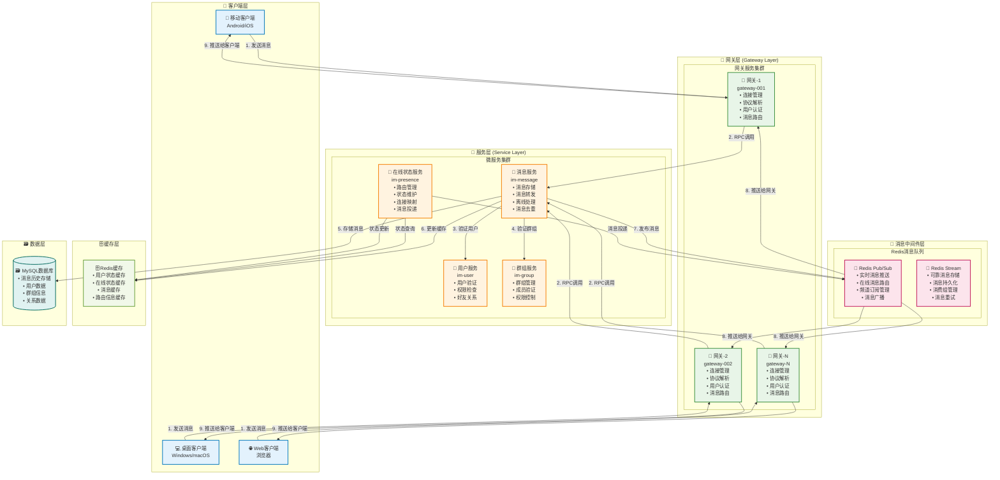
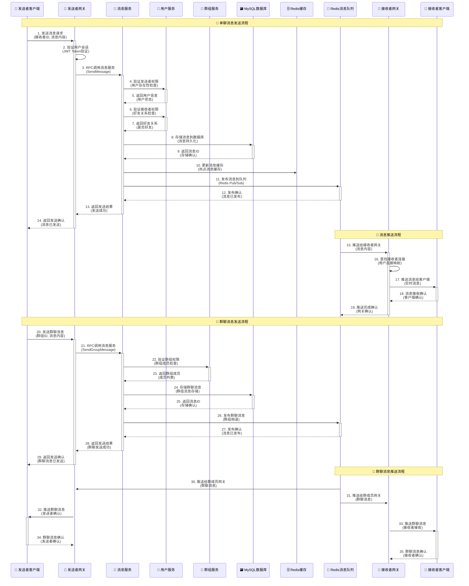
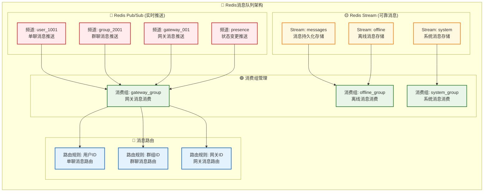

# MPIM消息流转架构 - 增强版

## 消息流转概述

MPIM系统采用基于Redis Pub/Sub的实时消息推送机制，结合MySQL持久化存储，实现了高性能、高可靠的消息传输服务。

## 消息流转架构图

### 1. 整体消息流转架构

### 2. 消息发送详细流程

### 3. 消息类型处理架构

```mermaid
graph TB
    subgraph "📨 消息类型处理"
        direction TB
        
        subgraph "💬 单聊消息"
            direction LR
            S1[发送者客户端] --> G1[发送者网关]
            G1 --> M1[消息服务]
            M1 --> U1[用户服务验证]
            M1 --> DB1[消息存储]
            M1 --> MQ1[消息队列]
            MQ1 --> G2[接收者网关]
            G2 --> R1[接收者客户端]
        end
        
        subgraph "👥 群聊消息"
            direction LR
            S2[发送者客户端] --> G3[发送者网关]
            G3 --> M2[消息服务]
            M2 --> G4[群组服务验证]
            M2 --> DB2[群聊消息存储]
            M2 --> MQ2[群聊消息队列]
            MQ2 --> G5[群成员网关1]
            MQ2 --> G6[群成员网关2]
            MQ2 --> G7[群成员网关N]
            G5 --> R2[群成员客户端1]
            G6 --> R3[群成员客户端2]
            G7 --> R4[群成员客户端N]
        end
        
        subgraph "📤 离线消息"
            direction LR
            S3[发送者客户端] --> G8[发送者网关]
            G8 --> M3[消息服务]
            M3 --> P1[在线状态服务]
            P1 --> CACHE1[状态缓存查询]
            CACHE1 --> P1
            P1 --> M3
            M3 --> DB3[离线消息存储]
            M3 --> MQ3[离线消息队列]
        end
        
        subgraph "🔄 消息同步"
            direction LR
            S4[客户端] --> G9[网关]
            G9 --> M4[消息服务]
            M4 --> DB4[历史消息查询]
            M4 --> CACHE2[消息缓存]
            M4 --> G9
            G9 --> S4
        end
    end
    
    %% 样式定义
    classDef singleChat fill:#e3f2fd,stroke:#0277bd,stroke-width:2px
    classDef groupChat fill:#e8f5e8,stroke:#388e3c,stroke-width:2px
    classDef offlineMsg fill:#fff3e0,stroke:#f57c00,stroke-width:2px
    classDef msgSync fill:#fce4ec,stroke:#c2185b,stroke-width:2px
    
    class S1,G1,M1,U1,DB1,MQ1,G2,R1 singleChat
    class S2,G3,M2,G4,DB2,MQ2,G5,G6,G7,R2,R3,R4 groupChat
    class S3,G8,M3,P1,CACHE1,DB3,MQ3 offlineMsg
    class S4,G9,M4,DB4,CACHE2 msgSync
```

### 4. 消息队列架构

## 消息流转特点

### 1. 实时性保障
- **WebSocket长连接**: 保持客户端与网关的实时连接
- **Redis Pub/Sub**: 毫秒级消息推送
- **异步处理**: 非阻塞消息处理
- **连接池**: 复用网络连接，减少延迟

### 2. 可靠性保障
- **消息持久化**: MySQL存储消息历史
- **消息去重**: 防止重复消息
- **离线消息**: 用户上线后推送离线消息
- **消息确认**: 客户端确认消息接收

### 3. 性能优化
- **缓存层**: Redis缓存热点数据
- **负载均衡**: 分散消息处理压力
- **异步处理**: 提高并发处理能力
- **消息批处理**: 批量处理消息

### 4. 扩展性设计
- **水平扩展**: 支持网关和服务水平扩展
- **消息分区**: 按用户ID或群组ID分区
- **消费组**: 支持多个消费者并行处理
- **动态路由**: 根据在线状态动态路由消息

## 总结

MPIM系统的消息流转架构采用了现代化的设计理念，通过分层架构、异步处理、缓存优化等技术手段，实现了高性能、高可靠、可扩展的即时通讯服务。系统能够支持大规模用户并发，提供毫秒级的消息推送服务，是一个典型的分布式消息系统架构实践。
