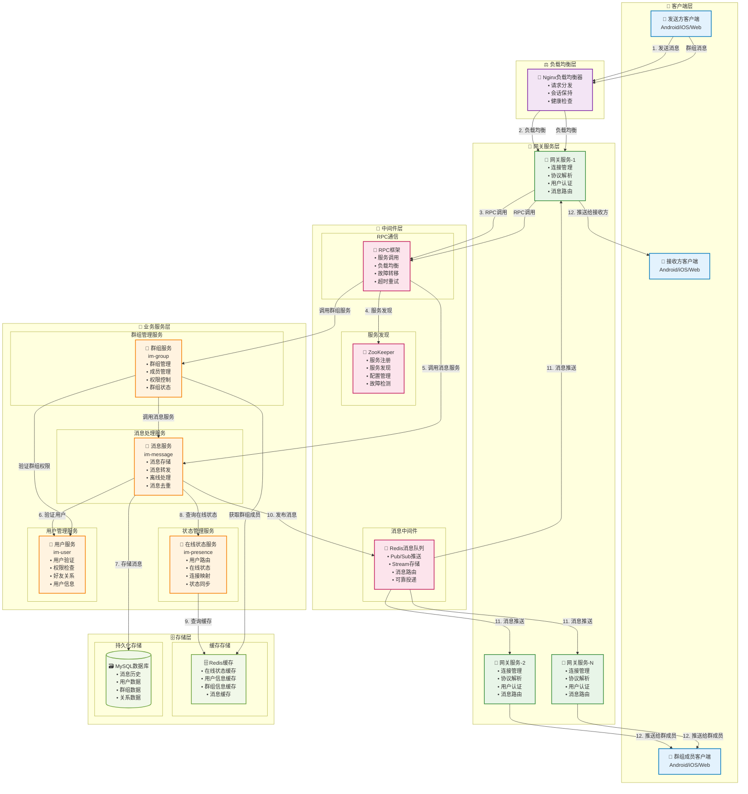
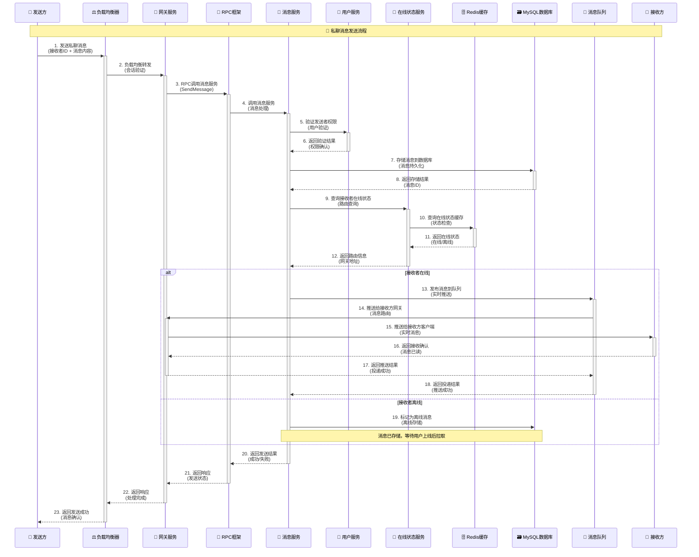
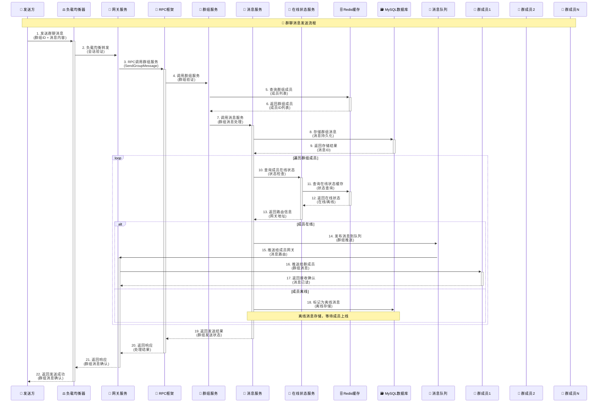
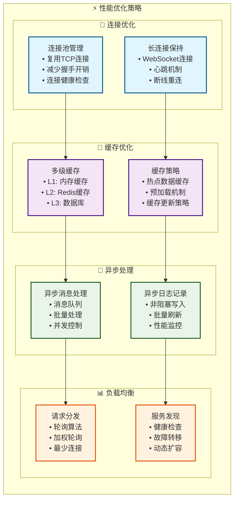
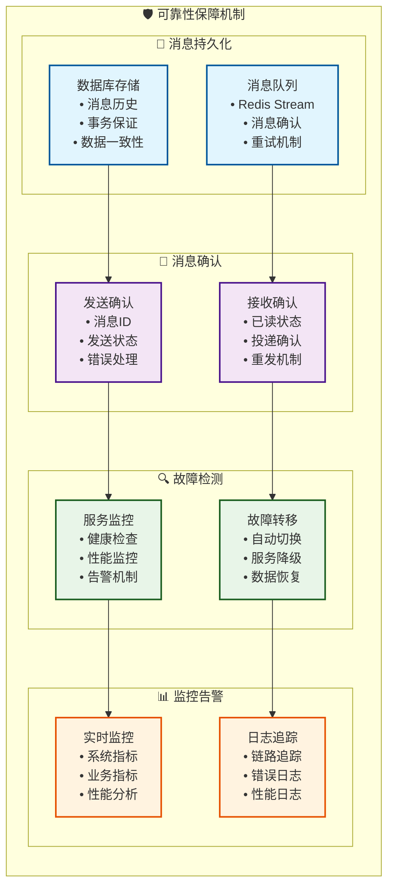

# MPIM消息流转架构 - 增强版

## 消息流转概述

MPIM系统支持多种消息类型的高效流转，包括私聊消息、群聊消息、系统通知等。系统采用异步处理机制，确保消息的可靠传递和实时推送。

## 消息流转架构图

### 1. 整体消息流转架构

### 2. 私聊消息流转时序图

### 3. 群聊消息流转时序图

### 4. 消息流转性能优化图

### 5. 消息可靠性保障图

## 消息流转特点

### 1. 高性能特性
- **异步处理**: 消息发送和接收异步处理，提高并发能力
- **连接复用**: 使用连接池复用TCP连接，减少建立连接开销
- **缓存优化**: 多级缓存减少数据库访问，提高响应速度
- **负载均衡**: 智能负载均衡分散请求压力

### 2. 高可靠性
- **消息持久化**: 消息存储到数据库，确保不丢失
- **消息确认**: 发送和接收都有确认机制
- **故障转移**: 自动故障检测和转移
- **重试机制**: 失败消息自动重试

### 3. 实时性保证
- **在线推送**: 在线用户实时推送消息
- **离线存储**: 离线用户消息存储，上线后拉取
- **状态同步**: 实时同步用户在线状态
- **消息路由**: 智能路由到正确的网关

### 4. 扩展性设计
- **水平扩展**: 支持服务实例水平扩展
- **垂直扩展**: 支持单机性能提升
- **模块化**: 各服务模块独立部署
- **配置化**: 支持动态配置调整

## 总结

MPIM消息流转架构通过分层设计、异步处理、缓存优化、负载均衡等技术手段，实现了高性能、高可靠、实时性强的消息传输服务。系统支持私聊、群聊等多种消息类型，具备良好的扩展性和维护性。