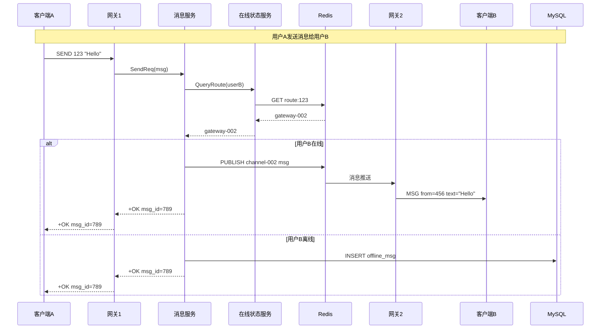
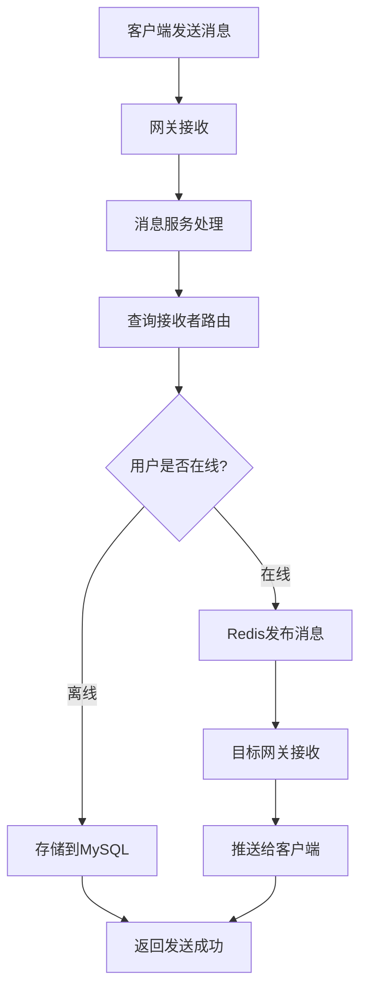
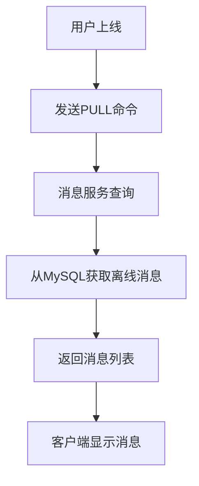

# 消息流转机制

## 消息流转概述

系统采用基于Redis pub/sub的实时消息投递机制，支持在线消息实时推送和离线消息存储。

## 消息流转时序图

## 消息流转详细流程

### 1. 用户登录流程

### 2. 在线消息发送流程

### 3. 离线消息拉取流程

## 关键技术实现

### 路由管理
- **存储格式**: `route:用户ID` -> `网关ID`
- **TTL设置**: 120秒自动过期
- **更新机制**: 用户登录时绑定，离线时自动清理

### 频道分配
- **算法**: `10000 + hash(网关ID) % 50000`
- **特点**: 唯一性、稳定性、可扩展性
- **范围**: 10000-59999，支持50000个网关实例

### 消息序列化
- **格式**: Protocol Buffers
- **内容**: 消息ID、发送者、接收者、内容、时间戳
- **优化**: 二进制序列化，体积小、解析快

## 容错机制

### 1. 网络异常处理
- **重连机制**: 自动重连Redis和ZooKeeper
- **超时处理**: 设置合理的超时时间
- **降级策略**: Redis不可用时降级到数据库

### 2. 服务异常处理
- **服务发现**: 通过ZooKeeper检测服务状态
- **负载均衡**: 自动切换到可用服务实例
- **故障转移**: 网关故障时重新分配用户

### 3. 消息可靠性
- **在线消息**: Redis pub/sub实时推送
- **离线消息**: MySQL持久化存储
- **消息确认**: 客户端确认消息接收

## 性能优化

### 1. 连接池优化
- **TCP连接复用**: 减少连接建立开销
- **连接池管理**: 动态调整连接数量
- **负载均衡**: 轮询+一致性哈希

### 2. 缓存优化
- **路由缓存**: 减少Redis查询次数
- **结果缓存**: ZK查询结果缓存
- **连接缓存**: 网关连接信息缓存

### 3. 批量处理
- **批量查询**: 一次查询多个用户路由
- **批量发送**: 批量发送离线消息
- **批量确认**: 批量确认消息接收

## 监控指标

### 1. 消息指标
- **发送成功率**: 在线消息发送成功率
- **投递延迟**: 消息从发送到接收的延迟
- **吞吐量**: 每秒处理的消息数量

### 2. 系统指标
- **连接数**: 当前在线连接数
- **服务状态**: 各服务的健康状态
- **资源使用**: CPU、内存、网络使用率

### 3. 业务指标
- **用户活跃度**: 日活、月活用户数
- **消息量**: 日发送消息数
- **群组活跃度**: 群组消息发送量
