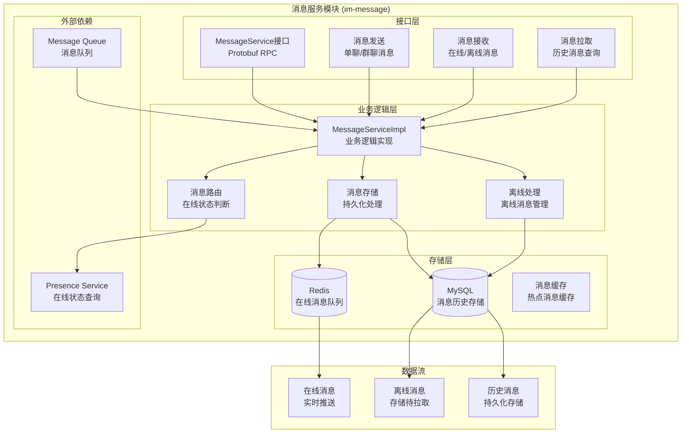
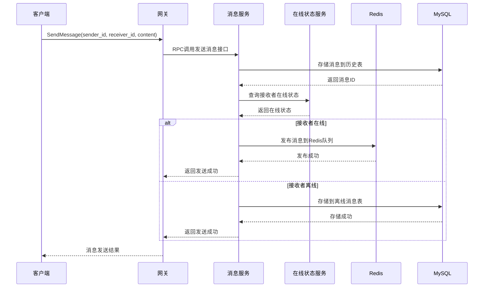
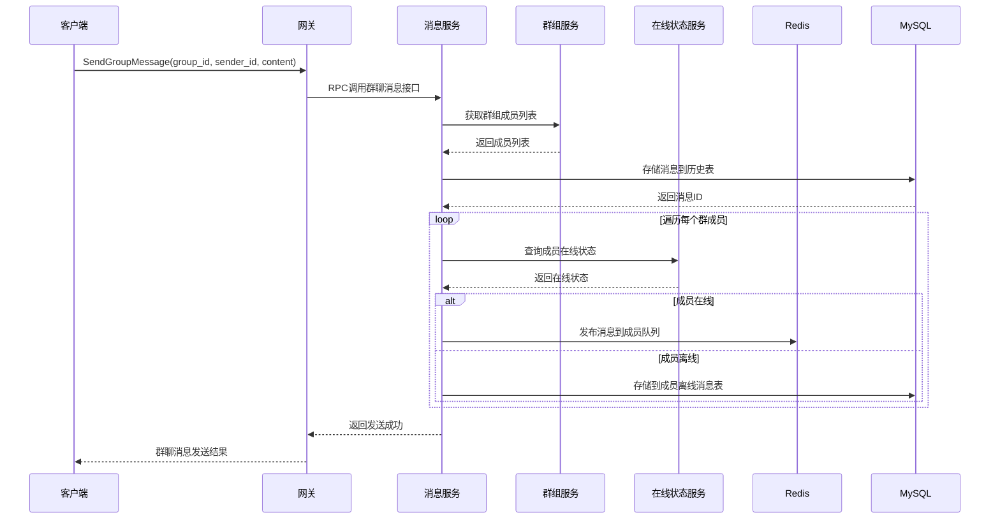
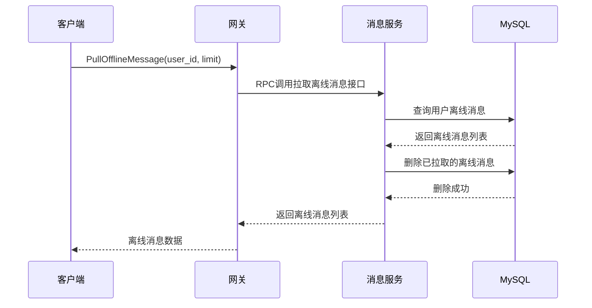

# 消息服务模块架构设计

## 概述

消息服务模块（im-message）是MPIM系统的核心模块，负责消息的存储、转发、离线消息处理等关键功能。该模块采用Redis+MySQL混合存储架构，支持高并发消息处理。

## 模块架构图



## 核心功能模块

### 1. 消息发送模块

#### 功能特性
- **单聊消息**: 一对一消息发送
- **群聊消息**: 群组消息广播
- **消息路由**: 基于在线状态的消息路由
- **消息存储**: 消息持久化存储
- **实时推送**: 在线用户实时消息推送

#### 实现细节
```cpp
class MessageServiceImpl {
public:
    // 发送单聊消息
    void SendMessage(google::protobuf::RpcController* controller,
                     const mpim::SendMessageReq* request,
                     mpim::SendMessageResp* response,
                     google::protobuf::Closure* done) override;
    
    // 发送群聊消息
    void SendGroupMessage(google::protobuf::RpcController* controller,
                          const mpim::SendGroupMessageReq* request,
                          mpim::SendGroupMessageResp* response,
                          google::protobuf::Closure* done) override;
    
    // 拉取离线消息
    void PullOfflineMessage(google::protobuf::RpcController* controller,
                            const mpim::PullOfflineMessageReq* request,
                            mpim::PullOfflineMessageResp* response,
                            google::protobuf::Closure* done) override;
};
```

#### 消息路由策略
- **在线用户**: 通过Redis Pub/Sub实时推送
- **离线用户**: 存储到MySQL离线消息表
- **群组消息**: 分别处理每个成员的在线状态
- **消息确认**: 支持消息送达确认机制

### 2. 离线消息处理模块

#### 功能特性
- **离线存储**: 离线用户消息存储
- **消息拉取**: 用户上线后拉取离线消息
- **消息清理**: 过期离线消息清理
- **批量处理**: 批量拉取离线消息

#### 实现细节
```cpp
class OfflineModel {
private:
    std::shared_ptr<MySQL> db_;
    
public:
    // 存储离线消息
    bool storeOfflineMessage(int64_t user_id, const std::string& message);
    
    // 拉取离线消息
    std::vector<OfflineMessage> pullOfflineMessages(int64_t user_id, int limit = 100);
    
    // 删除离线消息
    bool deleteOfflineMessage(int64_t message_id);
    
    // 清理过期消息
    bool cleanExpiredMessages(int days = 30);
};
```

#### 离线消息表设计
```sql
CREATE TABLE offline_message (
    id BIGINT PRIMARY KEY AUTO_INCREMENT,
    user_id BIGINT NOT NULL,
    sender_id BIGINT NOT NULL,
    group_id BIGINT DEFAULT NULL,
    message_type ENUM('text', 'image', 'file', 'voice') DEFAULT 'text',
    content TEXT NOT NULL,
    created_at TIMESTAMP DEFAULT CURRENT_TIMESTAMP,
    INDEX idx_user_created (user_id, created_at),
    FOREIGN KEY (user_id) REFERENCES user(id),
    FOREIGN KEY (sender_id) REFERENCES user(id)
);
```

### 3. 消息存储模块

#### 功能特性
- **消息持久化**: 所有消息持久化存储
- **消息索引**: 基于用户、时间、群组的索引
- **消息分页**: 支持分页查询历史消息
- **消息搜索**: 支持消息内容搜索

#### 实现细节
```cpp
class MessageStorage {
private:
    std::shared_ptr<MySQL> db_;
    
public:
    // 存储消息
    bool storeMessage(const Message& message);
    
    // 查询历史消息
    std::vector<Message> getHistoryMessages(int64_t user_id, int64_t group_id, 
                                           int64_t start_time, int limit);
    
    // 搜索消息
    std::vector<Message> searchMessages(int64_t user_id, const std::string& keyword,
                                       int64_t start_time, int64_t end_time);
    
    // 删除消息
    bool deleteMessage(int64_t message_id);
};
```

#### 消息历史表设计
```sql
CREATE TABLE message_history (
    id BIGINT PRIMARY KEY AUTO_INCREMENT,
    sender_id BIGINT NOT NULL,
    receiver_id BIGINT DEFAULT NULL,
    group_id BIGINT DEFAULT NULL,
    message_type ENUM('text', 'image', 'file', 'voice') DEFAULT 'text',
    content TEXT NOT NULL,
    status ENUM('sent', 'delivered', 'read') DEFAULT 'sent',
    created_at TIMESTAMP DEFAULT CURRENT_TIMESTAMP,
    INDEX idx_sender_created (sender_id, created_at),
    INDEX idx_receiver_created (receiver_id, created_at),
    INDEX idx_group_created (group_id, created_at),
    FOREIGN KEY (sender_id) REFERENCES user(id),
    FOREIGN KEY (receiver_id) REFERENCES user(id)
);
```

## 数据模型设计

### Protobuf消息定义

#### 消息发送
```protobuf
message SendMessageReq {
    int64 sender_id = 1;
    int64 receiver_id = 2;
    string content = 3;
    MessageType message_type = 4;
    int64 group_id = 5;  // 群聊消息时使用
}

message SendMessageResp {
    Result result = 1;
    int64 message_id = 2;
    int64 timestamp = 3;
}

message MessageType {
    enum Type {
        TEXT = 0;
        IMAGE = 1;
        FILE = 2;
        VOICE = 3;
    }
}
```

#### 消息拉取
```protobuf
message PullOfflineMessageReq {
    int64 user_id = 1;
    int32 limit = 2;
    int64 last_message_id = 3;
}

message PullOfflineMessageResp {
    Result result = 1;
    repeated OfflineMessage messages = 2;
    bool has_more = 3;
}

message OfflineMessage {
    int64 id = 1;
    int64 sender_id = 2;
    string sender_name = 3;
    int64 group_id = 4;
    string group_name = 5;
    string content = 6;
    MessageType message_type = 7;
    int64 created_at = 8;
}
```

## 业务流程设计

### 单聊消息发送流程



### 群聊消息发送流程



### 离线消息拉取流程



## 消息队列设计

### Redis Pub/Sub模式

#### 频道设计
```
user:{user_id}               # 用户个人消息频道
group:{group_id}             # 群组消息频道
system:notification          # 系统通知频道
```

#### 消息格式
```json
{
    "message_id": 12345,
    "sender_id": 1001,
    "receiver_id": 1002,
    "group_id": 2001,
    "content": "Hello World",
    "message_type": "text",
    "timestamp": 1640995200,
    "status": "sent"
}
```

### 消息确认机制

#### 确认流程
1. 消息发送到Redis队列
2. 网关接收消息并推送给客户端
3. 客户端确认收到消息
4. 网关更新消息状态为已送达
5. 服务端更新消息状态

#### 实现细节
```cpp
// 消息确认处理
void MessageServiceImpl::confirmMessage(int64_t message_id, int64_t user_id) {
    // 更新消息状态为已送达
    updateMessageStatus(message_id, "delivered");
    
    // 记录确认时间
    recordDeliveryTime(message_id, user_id);
}
```

## 性能优化策略

### 1. 存储优化
- **分表策略**: 按时间分表存储历史消息
- **索引优化**: 为查询字段建立合适索引
- **数据压缩**: 大文本消息压缩存储
- **定期清理**: 定期清理过期消息

### 2. 缓存优化
- **热点消息**: 缓存热门群组消息
- **用户状态**: 缓存用户在线状态
- **消息队列**: Redis队列批量处理
- **连接池**: 数据库连接池管理

### 3. 并发优化
- **异步处理**: 消息存储异步处理
- **批量操作**: 批量存储离线消息
- **连接复用**: 数据库连接复用
- **限流控制**: 防止消息洪峰

## 错误处理机制

### 1. 消息发送失败
```cpp
// 消息发送失败处理
if (!sendMessageToQueue(message)) {
    LOG_ERROR << "Failed to send message to queue: " << message_id;
    
    // 重试机制
    if (retryCount < MAX_RETRY) {
        return retrySendMessage(message);
    }
    
    // 降级处理：存储到离线消息
    return storeAsOfflineMessage(message);
}
```

### 2. 存储失败处理
```cpp
// 数据库存储失败处理
if (!storeMessageToDatabase(message)) {
    LOG_ERROR << "Failed to store message to database: " << message_id;
    
    // 重试机制
    if (retryCount < MAX_RETRY) {
        return retryStoreMessage(message);
    }
    
    // 错误返回
    response->mutable_result()->set_code(mpim::Code::INTERNAL);
    response->mutable_result()->set_msg("Message storage failed");
    return;
}
```

### 3. 队列满处理
```cpp
// Redis队列满处理
if (isQueueFull()) {
    LOG_WARN << "Message queue is full, storing as offline message";
    return storeAsOfflineMessage(message);
}
```

## 监控指标

### 1. 性能指标
- **消息发送QPS**: 每秒发送消息数量
- **消息拉取QPS**: 每秒拉取消息数量
- **平均响应时间**: 消息处理平均延迟
- **队列长度**: Redis消息队列长度

### 2. 业务指标
- **在线消息数**: 当前在线消息数量
- **离线消息数**: 当前离线消息数量
- **消息送达率**: 消息成功送达比例
- **消息延迟**: 消息发送到接收的延迟

### 3. 系统指标
- **数据库连接数**: 当前数据库连接数
- **Redis内存使用**: 消息队列内存使用
- **错误率**: 消息处理错误率
- **存储使用**: 消息存储空间使用

## 配置参数

### 服务配置
```ini
# 消息服务配置
[message_service]
port = 6000
thread_count = 8
max_connections = 2000

# 消息限制配置
[message_limits]
max_message_length = 4096
max_offline_messages = 1000
offline_message_ttl = 30  # 天

# 队列配置
[queue]
redis_host = 127.0.0.1
redis_port = 6379
queue_size = 10000
batch_size = 100
```

### 数据库配置
```sql
-- 消息表索引
CREATE INDEX idx_message_sender_time ON message_history(sender_id, created_at);
CREATE INDEX idx_message_receiver_time ON message_history(receiver_id, created_at);
CREATE INDEX idx_message_group_time ON message_history(group_id, created_at);

-- 离线消息表索引
CREATE INDEX idx_offline_user_time ON offline_message(user_id, created_at);
CREATE INDEX idx_offline_sender ON offline_message(sender_id);
```

## 部署说明

### 1. 编译构建
```bash
# 编译消息服务
cd im-message
mkdir build && cd build
cmake ..
make -j$(nproc)
```

### 2. 服务启动
```bash
# 启动消息服务
./bin/im-messaged -c ../conf/im-messaged.conf
```

### 3. 健康检查
```bash
# 检查服务状态
curl http://localhost:6000/health

# 检查消息功能
./bin/test_message_client
```

## 总结

消息服务模块通过以下设计实现了高效、可靠的消息处理功能：

1. **完整功能**: 单聊、群聊、离线消息等完整功能
2. **混合存储**: Redis+MySQL混合存储架构
3. **实时推送**: 基于Redis Pub/Sub的实时消息推送
4. **离线处理**: 完善的离线消息存储和拉取机制
5. **性能优化**: 多种性能优化策略
6. **错误处理**: 完善的错误处理和重试机制
7. **监控完善**: 全面的性能和业务监控指标

该模块为IM系统提供了核心的消息处理能力，能够支持大规模、高并发的消息传输需求。
