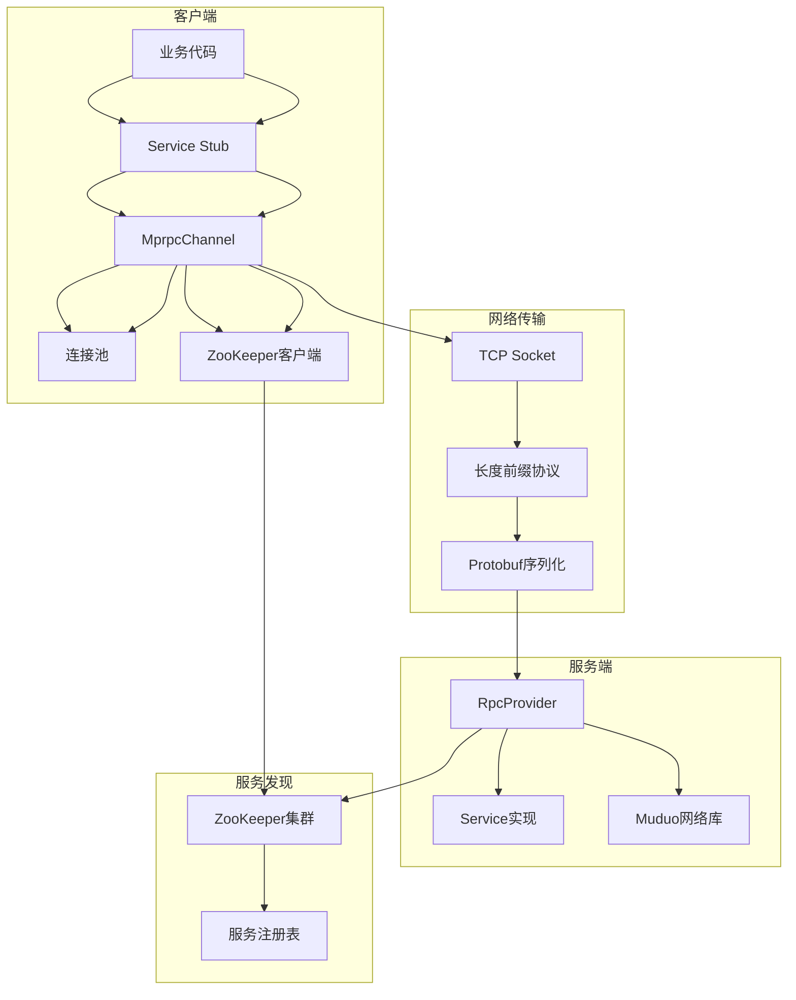
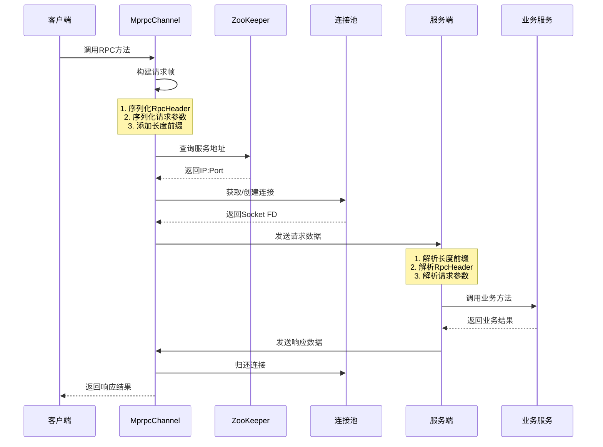
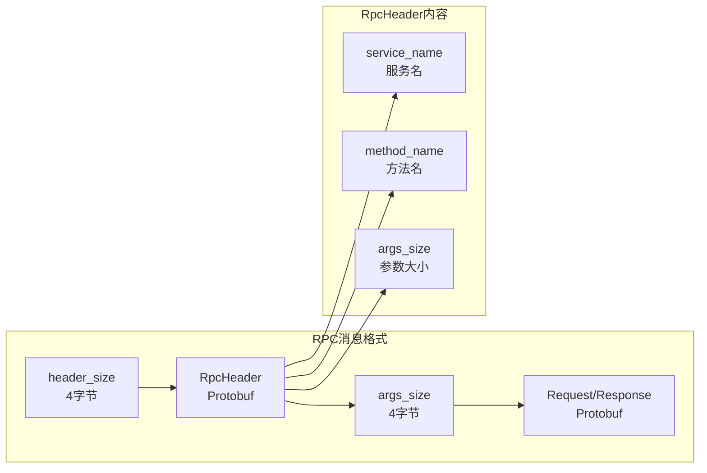
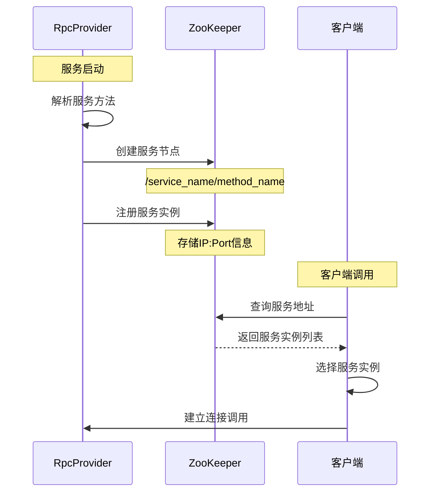
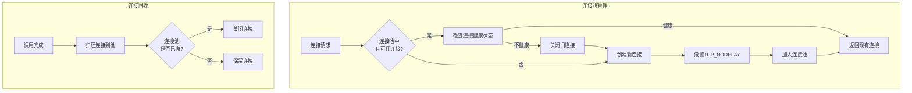
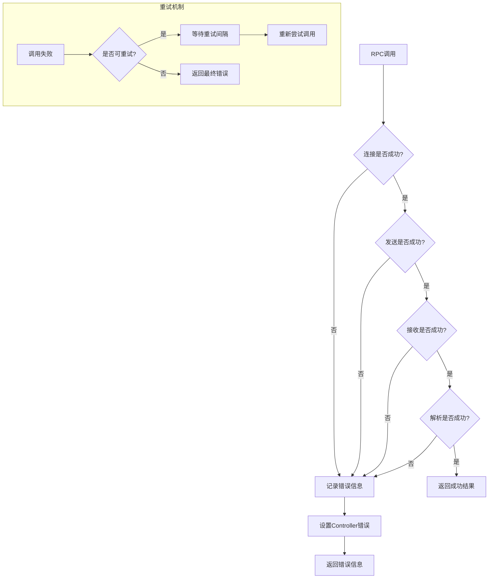
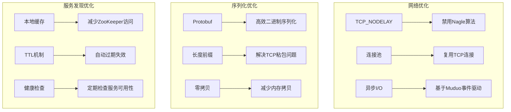

# mprpc调用流程图

## 1. 整体架构图

```mermaid
graph TB
    subgraph "客户端"
        A[业务代码] --> B[Service Stub]
        B --> C[MprpcChannel]
        C --> D[连接池]
        C --> E[ZooKeeper客户端]
    end
    
    subgraph "网络传输"
        F[TCP Socket]
        G[长度前缀协议]
        H[Protobuf序列化]
    end
    
    subgraph "服务端"
        I[RpcProvider]
        J[Service实现]
        K[Muduo网络库]
    end
    
    subgraph "服务发现"
        L[ZooKeeper集群]
        M[服务注册表]
    end
    
    A --> B
    B --> C
    C --> D
    C --> E
    C --> F
    F --> G
    G --> H
    H --> I
    I --> J
    I --> K
    E --> L
    L --> M
    I --> L
```

## 2. 详细调用流程

```mermaid
sequenceDiagram
    participant Client as 客户端
    participant Channel as MprpcChannel
    participant ZK as ZooKeeper
    participant Pool as 连接池
    participant Server as 服务端
    participant Service as 业务服务
    
    Client->>Channel: 调用RPC方法
    Channel->>Channel: 构建请求帧
    Note over Channel: 1. 序列化RpcHeader<br/>2. 序列化请求参数<br/>3. 添加长度前缀
    
    Channel->>ZK: 查询服务地址
    ZK-->>Channel: 返回IP:Port
    
    Channel->>Pool: 获取/创建连接
    Pool-->>Channel: 返回Socket FD
    
    Channel->>Server: 发送请求数据
    Note over Server: 1. 解析长度前缀<br/>2. 解析RpcHeader<br/>3. 解析请求参数
    
    Server->>Service: 调用业务方法
    Service-->>Server: 返回业务结果
    
    Server->>Channel: 发送响应数据
    Channel->>Pool: 归还连接
    Channel-->>Client: 返回响应结果
```

## 3. 消息格式图

```mermaid
graph LR
    subgraph "RPC消息格式"
        A[header_size<br/>4字节] --> B[RpcHeader<br/>Protobuf]
        B --> C[args_size<br/>4字节]
        C --> D[Request/Response<br/>Protobuf]
    end
    
    subgraph "RpcHeader内容"
        E[service_name<br/>服务名]
        F[method_name<br/>方法名]
        G[args_size<br/>参数大小]
    end
    
    B --> E
    B --> F
    B --> G
```

## 4. 服务注册发现流程

```mermaid
sequenceDiagram
    participant Provider as RpcProvider
    participant ZK as ZooKeeper
    participant Client as 客户端
    
    Note over Provider: 服务启动
    Provider->>Provider: 解析服务方法
    Provider->>ZK: 创建服务节点
    Note over ZK: /service_name/method_name
    
    Provider->>ZK: 注册服务实例
    Note over ZK: 存储IP:Port信息
    
    Note over Client: 客户端调用
    Client->>ZK: 查询服务地址
    ZK-->>Client: 返回服务实例列表
    Client->>Client: 选择服务实例
    Client->>Provider: 建立连接调用
```

## 5. 连接池管理

```mermaid
graph TB
    subgraph "连接池管理"
        A[连接请求] --> B{连接池中<br/>有可用连接?}
        B -->|是| C[检查连接健康状态]
        B -->|否| D[创建新连接]
        C -->|健康| E[返回现有连接]
        C -->|不健康| F[关闭旧连接]
        F --> D
        D --> G[设置TCP_NODELAY]
        G --> H[加入连接池]
        H --> E
    end
    
    subgraph "连接回收"
        I[调用完成] --> J[归还连接到池]
        J --> K{连接池<br/>是否已满?}
        K -->|是| L[关闭连接]
        K -->|否| M[保留连接]
    end
```

## 6. 错误处理流程

```mermaid
graph TB
    A[RPC调用] --> B{连接是否成功?}
    B -->|否| C[记录错误信息]
    B -->|是| D{发送是否成功?}
    D -->|否| C
    D -->|是| E{接收是否成功?}
    E -->|否| C
    E -->|是| F{解析是否成功?}
    F -->|否| C
    F -->|是| G[返回成功结果]
    
    C --> H[设置Controller错误]
    H --> I[返回错误信息]
    
    subgraph "重试机制"
        J[调用失败] --> K{是否可重试?}
        K -->|是| L[等待重试间隔]
        L --> M[重新尝试调用]
        K -->|否| N[返回最终错误]
    end
```

## 7. 性能优化点

```mermaid
graph TB
    subgraph "网络优化"
        A[TCP_NODELAY] --> B[禁用Nagle算法]
        C[连接池] --> D[复用TCP连接]
        E[异步I/O] --> F[基于Muduo事件驱动]
    end
    
    subgraph "序列化优化"
        G[Protobuf] --> H[高效二进制序列化]
        I[长度前缀] --> J[解决TCP粘包问题]
        K[零拷贝] --> L[减少内存拷贝]
    end
    
    subgraph "服务发现优化"
        M[本地缓存] --> N[减少ZooKeeper访问]
        O[TTL机制] --> P[自动过期失效]
        Q[健康检查] --> R[定期检查服务可用性]
    end
```

这些流程图展示了mprpc框架的完整工作流程，从客户端调用到服务端处理，再到服务注册发现的整个过程。
