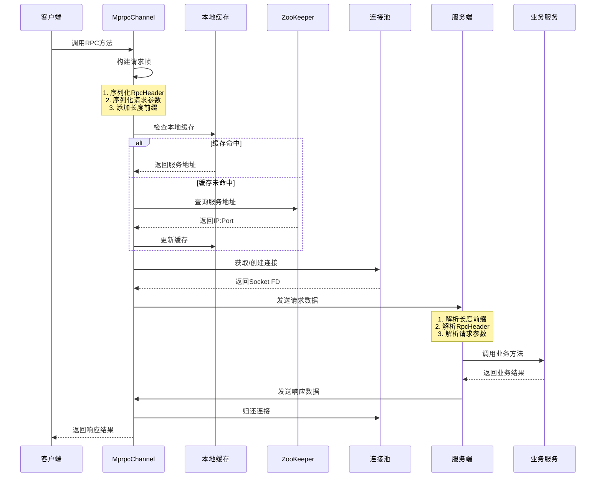
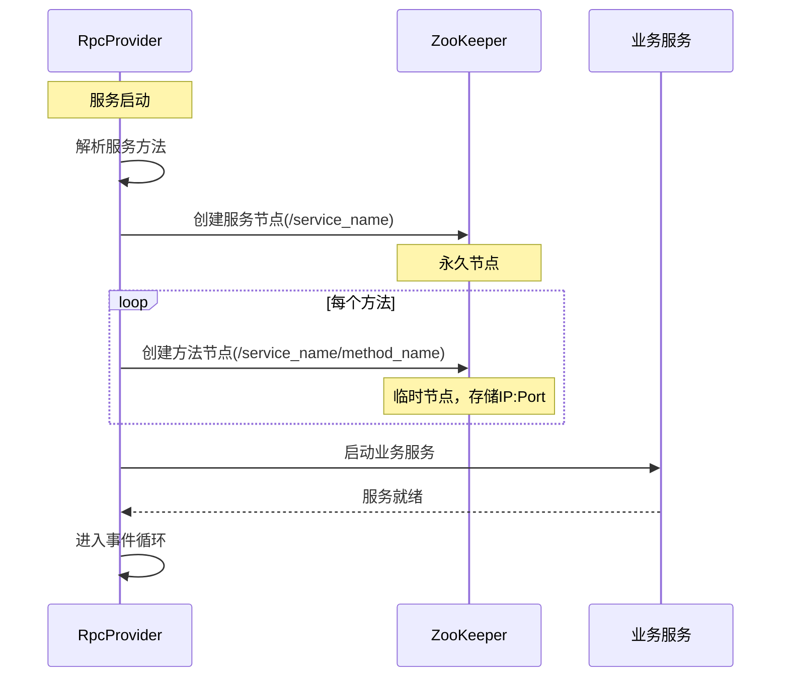
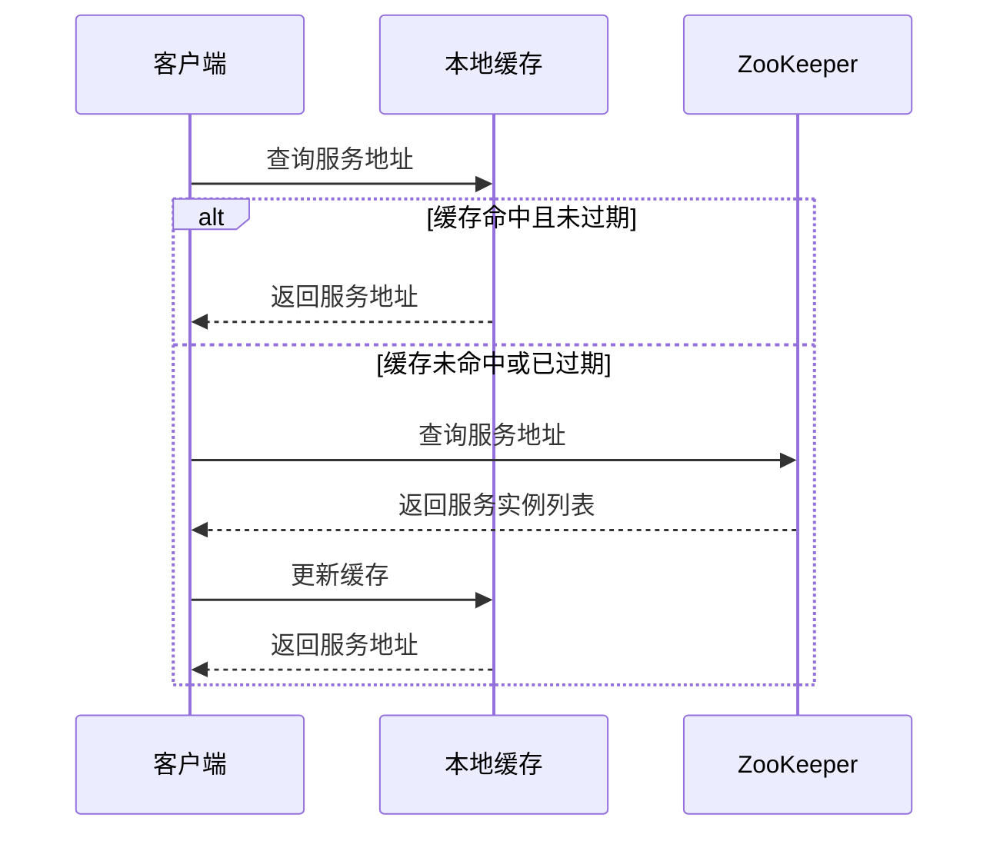
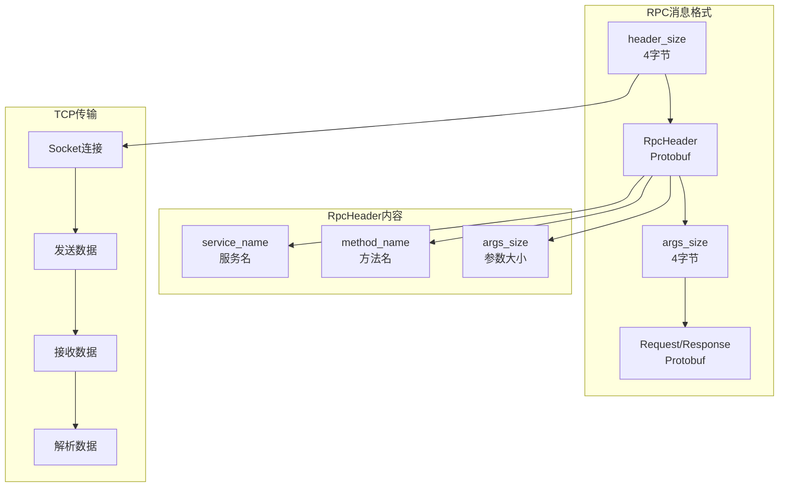
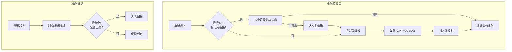
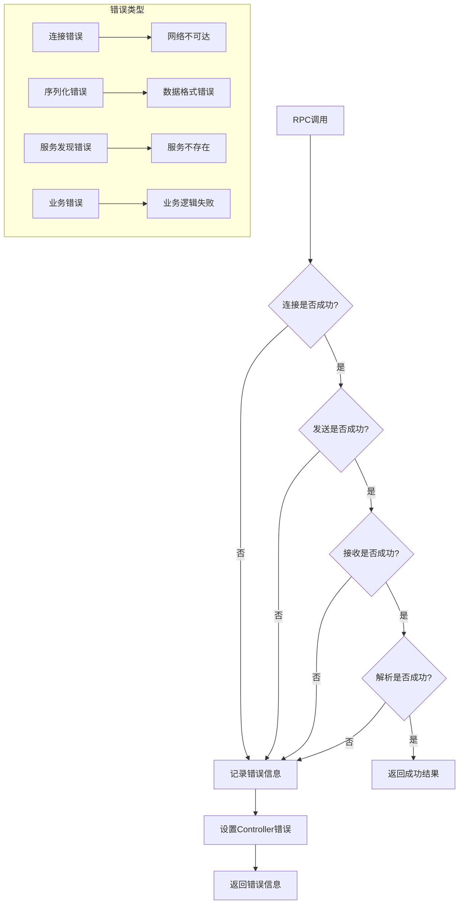
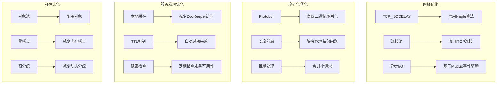
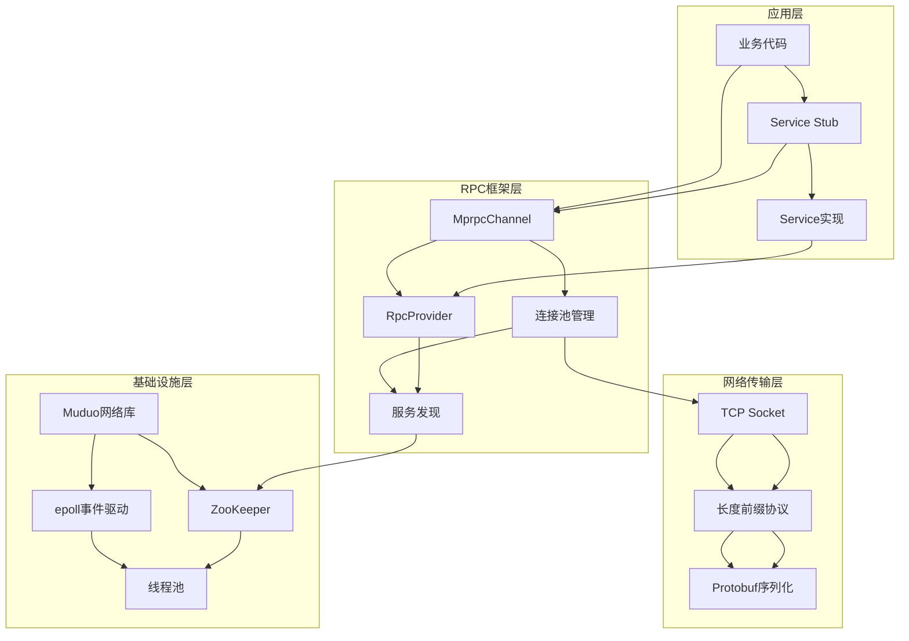

# mprpc调用序列图

## 1. 整体调用流程

```mermaid
sequenceDiagram
    participant Client as 客户端
    participant Channel as MprpcChannel
    participant Cache as 本地缓存
    participant ZK as ZooKeeper
    participant Pool as 连接池
    participant Server as 服务端
    participant Service as 业务服务
    
    Client->>Channel: 调用RPC方法
    Channel->>Channel: 构建请求帧
    Note over Channel: 1. 序列化RpcHeader<br/>2. 序列化请求参数<br/>3. 添加长度前缀
    
    Channel->>Cache: 检查本地缓存
    alt 缓存命中
        Cache-->>Channel: 返回服务地址
    else 缓存未命中
        Channel->>ZK: 查询服务地址
        ZK-->>Channel: 返回IP:Port
        Channel->>Cache: 更新缓存
    end
    
    Channel->>Pool: 获取/创建连接
    Pool-->>Channel: 返回Socket FD
    
    Channel->>Server: 发送请求数据
    Note over Server: 1. 解析长度前缀<br/>2. 解析RpcHeader<br/>3. 解析请求参数
    
    Server->>Service: 调用业务方法
    Service-->>Server: 返回业务结果
    
    Server->>Channel: 发送响应数据
    Channel->>Pool: 归还连接
    Channel-->>Client: 返回响应结果
```

## 2. 服务注册流程

```mermaid
sequenceDiagram
    participant Provider as RpcProvider
    participant ZK as ZooKeeper
    participant Service as 业务服务
    
    Note over Provider: 服务启动
    Provider->>Provider: 解析服务方法
    Provider->>ZK: 创建服务节点(/service_name)
    Note over ZK: 永久节点
    
    loop 每个方法
        Provider->>ZK: 创建方法节点(/service_name/method_name)
        Note over ZK: 临时节点，存储IP:Port
    end
    
    Provider->>Service: 启动业务服务
    Service-->>Provider: 服务就绪
    Provider->>Provider: 进入事件循环
```

## 3. 服务发现流程

```mermaid
sequenceDiagram
    participant Client as 客户端
    participant Cache as 本地缓存
    participant ZK as ZooKeeper
    
    Client->>Cache: 查询服务地址
    alt 缓存命中且未过期
        Cache-->>Client: 返回服务地址
    else 缓存未命中或已过期
        Client->>ZK: 查询服务地址
        ZK-->>Client: 返回服务实例列表
        Client->>Cache: 更新缓存
        Cache-->>Client: 返回服务地址
    end
```

## 4. 网络传输协议

```mermaid
graph TB
    subgraph "RPC消息格式"
        A[header_size<br/>4字节] --> B[RpcHeader<br/>Protobuf]
        B --> C[args_size<br/>4字节]
        C --> D[Request/Response<br/>Protobuf]
    end
    
    subgraph "RpcHeader内容"
        E[service_name<br/>服务名]
        F[method_name<br/>方法名]
        G[args_size<br/>参数大小]
    end
    
    B --> E
    B --> F
    B --> G
    
    subgraph "TCP传输"
        H[Socket连接] --> I[发送数据]
        I --> J[接收数据]
        J --> K[解析数据]
    end
    
    A --> H
```

## 5. 连接池管理

```mermaid
graph TB
    subgraph "连接池管理"
        A[连接请求] --> B{连接池中<br/>有可用连接?}
        B -->|是| C[检查连接健康状态]
        B -->|否| D[创建新连接]
        C -->|健康| E[返回现有连接]
        C -->|不健康| F[关闭旧连接]
        F --> D
        D --> G[设置TCP_NODELAY]
        G --> H[加入连接池]
        H --> E
    end
    
    subgraph "连接回收"
        I[调用完成] --> J[归还连接到池]
        J --> K{连接池<br/>是否已满?}
        K -->|是| L[关闭连接]
        K -->|否| M[保留连接]
    end
```

## 6. 错误处理流程

```mermaid
graph TB
    A[RPC调用] --> B{连接是否成功?}
    B -->|否| C[记录错误信息]
    B -->|是| D{发送是否成功?}
    D -->|否| C
    D -->|是| E{接收是否成功?}
    E -->|否| C
    E -->|是| F{解析是否成功?}
    F -->|否| C
    F -->|是| G[返回成功结果]
    
    C --> H[设置Controller错误]
    H --> I[返回错误信息]
    
    subgraph "错误类型"
        J[连接错误] --> K[网络不可达]
        L[序列化错误] --> M[数据格式错误]
        N[服务发现错误] --> O[服务不存在]
        P[业务错误] --> Q[业务逻辑失败]
    end
```

## 7. 性能优化点

```mermaid
graph TB
    subgraph "网络优化"
        A[TCP_NODELAY] --> B[禁用Nagle算法]
        C[连接池] --> D[复用TCP连接]
        E[异步I/O] --> F[基于Muduo事件驱动]
    end
    
    subgraph "序列化优化"
        G[Protobuf] --> H[高效二进制序列化]
        I[长度前缀] --> J[解决TCP粘包问题]
        K[批量处理] --> L[合并小请求]
    end
    
    subgraph "服务发现优化"
        M[本地缓存] --> N[减少ZooKeeper访问]
        O[TTL机制] --> P[自动过期失效]
        Q[健康检查] --> R[定期检查服务可用性]
    end
    
    subgraph "内存优化"
        S[对象池] --> T[复用对象]
        U[零拷贝] --> V[减少内存拷贝]
        W[预分配] --> X[减少动态分配]
    end
```

## 8. 架构层次图

```mermaid
graph TB
    subgraph "应用层"
        A[业务代码] --> B[Service Stub]
        B --> C[Service实现]
    end
    
    subgraph "RPC框架层"
        D[MprpcChannel] --> E[RpcProvider]
        F[连接池管理] --> G[服务发现]
    end
    
    subgraph "网络传输层"
        H[TCP Socket] --> I[长度前缀协议]
        I --> J[Protobuf序列化]
    end
    
    subgraph "基础设施层"
        K[Muduo网络库] --> L[ZooKeeper]
        M[epoll事件驱动] --> N[线程池]
    end
    
    A --> D
    B --> D
    C --> E
    D --> F
    E --> G
    F --> H
    G --> L
    H --> I
    I --> J
    K --> M
    L --> N
```

这些流程图展示了mprpc框架的完整工作流程，从服务注册发现到网络传输，再到连接池管理的整个过程。
