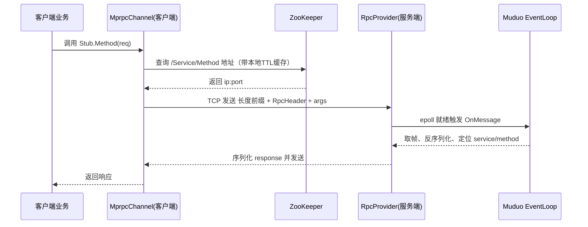

# mprpc RPC框架完整分析

## 1. RPC远程服务调用概述

### 1.1 什么是RPC？

RPC（Remote Procedure Call）是一种**进程间通信方式**，它通过网络从远程计算机程序上请求服务，而不需要了解底层网络技术的协议。RPC让程序能够像调用本地函数一样调用远程函数。

### 1.2 RPC框架对比

#### 主流RPC框架对比表

| 框架 | 语言支持 | 序列化方式 | 服务发现 | 网络协议 | 特点 |
|------|----------|------------|----------|----------|------|
| **Dubbo** | Java | Hessian/JSON | ZooKeeper | TCP | 阿里开源，企业级 |
| **Thrift** | 多语言 | Thrift Binary | 自定义 | TCP | Facebook开源，跨语言 |
| **gRPC** | 多语言 | Protobuf | 内置 | HTTP/2 | Google开源，现代 |
| **mprpc** | C++ | Protobuf | ZooKeeper | TCP | 本项目实现 |

#### I/O架构对比

##### Dubbo (Java)

- 基于Netty NIO
- 事件驱动模型
- 线程池处理业务逻辑
- 适合高并发场景

##### gRPC (多语言)

- 基于HTTP/2
- 多路复用
- 流式传输
- 现代网络协议

##### Thrift (多语言)

- 基于TTransport抽象
- 支持多种传输方式
- 跨语言兼容性好
- 性能较高

##### mprpc (C++)

- 基于Muduo网络库
- Reactor模式
- epoll事件驱动
- 适合C++高性能场景

## 2. mprpc架构设计

### 2.1 整体架构

```text
┌─────────────────────────────────────────────────────────────────┐
│                        mprpc RPC框架                            │
├─────────────────────────────────────────────────────────────────┤
│  客户端层                                                         │
│  ┌─────────────┐  ┌─────────────┐  ┌─────────────┐              │
│  │Service Stub │  │MprpcChannel │  │连接池管理    │              │
│  └─────────────┘  └─────────────┘  └─────────────┘              │
├─────────────────────────────────────────────────────────────────┤
│  网络传输层                                                       │
│  ┌─────────────┐  ┌─────────────┐  ┌─────────────┐              │
│  │TCP Socket   │  │长度前缀协议  │  │Protobuf序列化│              │
│  └─────────────┘  └─────────────┘  └─────────────┘              │
├─────────────────────────────────────────────────────────────────┤
│  服务端层                                                         │
│  ┌─────────────┐  ┌─────────────┐  ┌─────────────┐              │
│  │RpcProvider  │  │Muduo网络库  │  │Service实现  │              │
│  └─────────────┘  └─────────────┘  └─────────────┘              │
├─────────────────────────────────────────────────────────────────┤
│  服务发现层                                                       │
│  ┌─────────────┐  ┌─────────────┐  ┌─────────────┐              │
│  │ZooKeeper    │  │服务注册     │  │本地缓存     │              │
│  └─────────────┘  └─────────────┘  └─────────────┘              │
└─────────────────────────────────────────────────────────────────┘
```

### 2.2 模型选择：Reactor vs Proactor（本框架采用的是什么？）

#### 概念对比

- Reactor（就绪驱动）：内核只负责“通知就绪”，应用在就绪后主动执行读写。典型实现：Linux epoll + 事件循环（Muduo）。
- Proactor（完成驱动）：应用提交异步 I/O，内核完成后“通知完成”，回调中直接拿到结果。典型实现：Windows IOCP、Linux io_uring。

#### 本框架采用

- mprpc 服务端明确采用 Reactor 架构：Muduo 的 `EventLoop`/`TcpServer` 基于 epoll 的就绪通知；`OnConnection`/`OnMessage` 属于 Reactor 的事件处理器。
- 客户端当前使用阻塞 socket 的同步调用模型（非 Muduo），但协议与服务发现与服务端一致，可演进为 Muduo/异步实现。

#### 与“标准 Reactor”实现的差异

- 事件复用器：标准 Reactor 的“Demultiplexer”在本框架由 Muduo 封装（内部是 epoll）。
- 并发模型：采用“one loop per thread”+ 线程池（`TcpServer::setThreadNum(n)`），与单线程 Reactor 相比提升多核利用率。
- 业务与网络解耦：Muduo 将连接管理、缓冲区、回调生命周期管理抽象出来，减少粘连代码（相比手写 epoll 更安全）。
- Proactor 对比：本框架不会在内核完成 I/O 后直接获得结果，需要在就绪回调中主动 `read/write`，但可控性更强、易于调优。

#### 这种方案的好处

- 成熟稳定：Reactor + epoll 在 Linux 生态中经过大量验证，行为可预期。
- 高性能：零额外内核态异步队列开销，低延迟，线程模型清晰。
- 易扩展：回调粒度可控，便于按连接/按消息限流、观测、埋点。

### 2.3 设计理念

1. **简单易用** - 像调用本地函数一样调用远程函数
2. **高性能** - 基于Muduo网络库，支持高并发
3. **可扩展** - 支持服务注册发现，易于扩展
4. **可靠性** - 完整的错误处理和连接管理

## 3. 核心功能实现

### 3.0 总览时序（客户端→服务端）



### 3.1 服务注册和发现

#### 服务注册机制

**ZooKeeper节点结构**：

```text
/mpim
├── /UserService
│   ├── /Login -> 127.0.0.1:8010
│   ├── /Register -> 127.0.0.1:8010
│   └── /GetUserInfo -> 127.0.0.1:8010
├── /MessageService
│   ├── /SendMessage -> 127.0.0.1:8011
│   └── /GetMessage -> 127.0.0.1:8011
└── /GroupService
    ├── /CreateGroup -> 127.0.0.1:8013
    └── /JoinGroup -> 127.0.0.1:8013
```

**节点类型使用**：
- **永久节点**：服务名称节点（如`/UserService`）
- **临时节点**：服务实例节点（如`/UserService/Login`）

```cpp
// 服务注册代码
void RpcProvider::Run() {
    // 创建服务名称节点（永久节点）
    std::string service_path = "/" + service_name;
    zkCli.Create(service_path.c_str(), nullptr, 0);
    
    // 创建方法节点（临时节点）
    for (auto &mp : service_info.m_methodMap) {
        std::string method_path = service_path + "/" + mp.first;
        char method_path_data[128] = {0};
        sprintf(method_path_data, "%s:%d", ip.c_str(), port);
        // ZOO_EPHEMERAL 表示临时节点
        zkCli.Create(method_path.c_str(), method_path_data, 
                    strlen(method_path_data), ZOO_EPHEMERAL);
    }
}
```

#### 为什么选择 ZooKeeper（原理与优势）

- 强一致性（ZAB 协议）：服务注册表在节点故障时仍具一致性保障，避免读到脏地址。
- 会话+临时节点：当 Provider 宕机/网络隔离时，其临时节点自动删除，客户端不会继续拿到无效实例。
- Watch 机制：可在客户端订阅节点变化，配合本地缓存实现“变更驱动”的地址刷新。

```mermaid
graph LR
    subgraph ZooKeeper命名空间
        S[/UserService/]
        S --> M1[/Login/ -> 127.0.0.1:8010]
        S --> M2[/Register/ -> 127.0.0.1:8010]
    end
    Client[客户端] -- GetData/Watch --> S
    note right of Client: 本地缓存TTL=1s，或收到Watch事件立即刷新
```

#### 服务发现机制

**本地缓存实现**：
```cpp
// 文件: mprpc/src/mprpcchannel.cc
struct CacheEntry { 
    sockaddr_in addr; 
    std::chrono::steady_clock::time_point expire; 
};
static std::unordered_map<std::string, CacheEntry> s_addr_cache;
static std::mutex s_cache_mu;

bool MprpcChannel::resolveEndpoint(const std::string& service,
                                   const std::string& method,
                                   struct sockaddr_in& out,
                                   google::protobuf::RpcController* controller) {
    const std::string method_path = "/" + service + "/" + method;
    const auto now_tp = std::chrono::steady_clock::now();
    const auto ttl = std::chrono::milliseconds(1000); // 1秒TTL
    
    // 1. 检查本地缓存
    {
        std::lock_guard<std::mutex> lk(s_cache_mu);
        auto it = s_addr_cache.find(method_path);
        if (it != s_addr_cache.end() && now_tp < it->second.expire) {
            out = it->second.addr;
            return true; // 缓存命中
        }
    }
    
    // 2. 从ZooKeeper获取服务地址
    std::string host_data = s_zk.GetData(method_path.c_str());
    if (host_data.empty()) {
        controller->SetFailed(method_path + " is not exist!");
        return false;
    }
    
    // 3. 解析IP和端口
    int idx = host_data.find(":");
    std::string ip = host_data.substr(0, (size_t)idx);
    std::string port = host_data.substr(idx + 1, host_data.size() - idx);
    
    // 4. 构建sockaddr_in
    out.sin_family = AF_INET;
    out.sin_port = htons(atoi(port.c_str()));
    out.sin_addr.s_addr = inet_addr(ip.c_str());
    
    // 5. 更新缓存
    {
        std::lock_guard<std::mutex> lk(s_cache_mu);
        s_addr_cache[method_path] = {out, now_tp + ttl};
    }
    
    return true;
}
```

**服务发现文字说明**：客户端调用 `resolveEndpoint()` 时按以下顺序：

- 构造 `method_path = /{service}/{method}`；先查询本地缓存，命中且未过期则直接返回。
- 未命中或过期则向 ZooKeeper 调用 `GetData(method_path)` 读取 `ip:port` 字符串。
- 解析 `ip` 与 `port`，填充 `sockaddr_in`，并以 TTL 写回本地缓存。
- 后续调用在 TTL 内不再访问 ZK，降低中心压力；可扩展为 Watch 通知变更后立即刷新。

**缓存策略**：
- **TTL机制**：缓存1秒后过期
- **线程安全**：使用mutex保护缓存
- **自动更新**：过期后自动从ZooKeeper重新获取

#### ZooKeeper连接管理

**连接建立**：
```cpp
// 文件: mprpc/src/zookeeperutil.cc
void ZkClient::Start() {
    std::string host = MprpcApplication::GetInstance().GetConfig().Load("zookeeperip");
    std::string port = MprpcApplication::GetInstance().GetConfig().Load("zookeeperport");
    std::string connstr = host + ":" + port;
    
    // 使用promise/future等待连接建立
    std::promise<void> prom;
    auto fut = prom.get_future();
    
    m_zhandle = zookeeper_init(connstr.c_str(), global_watcher, 30000, nullptr, &prom, 0);
    if (m_zhandle == nullptr) {
        LOG_ERROR << "zookeeper_init error!";
        exit(EXIT_FAILURE);
    }
    
    // 等待连接建立
    fut.get();
    LOG_INFO << "ZooKeeper connected successfully";
}
```

**连接断开处理**：
```cpp
// 全局watcher处理连接状态
void global_watcher(zhandle_t *zh, int type, int state, const char *path, void *watcherCtx) {
    if (type == ZOO_SESSION_EVENT) {
        if (state == ZOO_CONNECTED_STATE) {
            // 连接建立成功
            auto* prom = static_cast<std::promise<void>*>(watcherCtx);
            if(prom) {
                prom->set_value();
            }
        } else if (state == ZOO_EXPIRED_SESSION_STATE) {
            // 会话过期，需要重新连接
            LOG_ERROR << "ZooKeeper session expired!";
        }
    }
}
```

> 深入阅读：稍后补充《ZooKeeper 深入解析与在 MPIM 中的实践》文档（占位）

### 3.2 网络通信

#### 客户端连接

**直接Socket连接**：
```cpp
// 文件: mprpc/src/mprpcchannel.cc
int MprpcChannel::getConnection(const std::string& key, const sockaddr_in& addr) {
    // 1. 检查连接池
    if (auto it = s_conn_pool.find(key); it != s_conn_pool.end()) {
        int fd = it->second;
        if (isConnectionAlive(fd)) {
            return fd; // 复用现有连接
        }
    }
    
    // 2. 创建新连接
    int clientfd = socket(AF_INET, SOCK_STREAM, 0);
    if (connect(clientfd, (sockaddr*)&addr, sizeof(addr)) < 0) {
        close(clientfd);
        return -1;
    }
    
    // 3. 设置TCP_NODELAY
    int flag = 1;
    setsockopt(clientfd, IPPROTO_TCP, TCP_NODELAY, &flag, sizeof(flag));
    
    return clientfd;
}
```

#### 服务端网络处理

**基于Muduo网络库**：
```cpp
// 文件: mprpc/src/rpcprovider.cc
void RpcProvider::Run() {
    std::string ip = MprpcApplication::GetInstance().GetConfig().Load("rpcserverip");
    uint16_t port = atoi(MprpcApplication::GetInstance().GetConfig().Load("rpcserverport").c_str());
    
    muduo::net::InetAddress address(ip, port);
    muduo::net::TcpServer server(&m_eventLoop, address, "RpcProvider");
    
    // 设置连接回调
    server.setConnectionCallback(std::bind(&RpcProvider::OnConnection, this, std::placeholders::_1));
    // 设置消息回调
    server.setMessageCallback(std::bind(&RpcProvider::OnMessage, this, std::placeholders::_1,
                                        std::placeholders::_2, std::placeholders::_3));
    server.setThreadNum(4); // 设置工作线程数
    server.start();
    m_eventLoop.loop(); // 进入事件循环
}
```

Muduo 用法与特点（为何选择）

- 事件驱动：`EventLoop` 封装 epoll/回调注册，避免手写状态机和边缘条件。
- 线程模型：`TcpServer::setThreadNum(n)` 多 IO 线程 + 业务线程，提升并发与 CPU 利用率。
- 安全高效：内置 `Buffer`、生命周期与上下文管理，减少内存/FD 泄漏风险。
- 生态成熟：广泛用于生产环境，文档与社区完善。

> 深入阅读：稍后补充《Muduo 网络库实践与最佳实践》文档（占位）

### 3.3 网络传输协议

#### 消息格式设计

**长度前缀协议**（解决TCP粘包问题）：
```
┌─────────────┬─────────────┬─────────────┬─────────────┐
│ header_size │   header    │  args_size  │    args     │
│   (4字节)   │ (protobuf)  │   (4字节)   │ (protobuf)  │
└─────────────┴─────────────┴─────────────┴─────────────┘
```

#### 粘包/拆包问题与解决

- 粘包/拆包是 TCP 字节流语义导致的接收方边界不明问题：发送端的多次 `send` 可能在接收端一次 `recv` 中合并（粘包），或一个应用消息被拆成多次 `recv`（拆包）。
- 常见解决方案：固定长度帧、分隔符（如 `\n`）、长度前缀（最常见）。
- 本框架在 mprpc 使用“长度前缀 + Protobuf”方案；在网关的文本协议中使用按行读取（`\n` 分隔）。

**RpcHeader定义**：
```protobuf
// 文件: mprpc/src/rpcheader.proto
syntax = "proto3";
package mprpc;

message RpcHeader {
    bytes service_name = 1; // 服务名
    bytes method_name = 2;  // 方法名
    uint32 args_size = 3;   // 参数大小
}
```

**消息构建**：
```cpp
// 文件: mprpc/src/mprpcchannel.cc
bool MprpcChannel::buildRequestFrame(const google::protobuf::MethodDescriptor* method,
                                     const google::protobuf::Message* request,
                                     std::string& out,
                                     google::protobuf::RpcController* controller) {
    // 1. 构建RPC头部
    mprpc::RpcHeader rpcHeader;
    rpcHeader.set_service_name(method->service()->name());
    rpcHeader.set_method_name(method->name());
    
    // 2. 序列化请求参数
    std::string args_str;
    if (!request->SerializeToString(&args_str)) {
        controller->SetFailed("serialize request error!");
        return false;
    }
    rpcHeader.set_args_size(args_str.size());
    
    // 3. 序列化头部
    std::string header_str;
    if (!rpcHeader.SerializeToString(&header_str)) {
        controller->SetFailed("serialize rpc header error!");
        return false;
    }
    
    // 4. 构建完整帧
    uint32_t header_size = (uint32_t)header_str.size();
    out.clear();
    out.reserve(4 + header_str.size() + args_str.size());
    out.append(std::string((char*)&header_size, 4));  // 长度前缀
    out.append(header_str);                            // 头部
    out.append(args_str);                              // 参数
    return true;
}
```

**消息解析**：
```cpp
// 文件: mprpc/src/rpcprovider.cc
void RpcProvider::OnMessage(const muduo::net::TcpConnectionPtr &conn,
                            muduo::net::Buffer *buffer, muduo::net::Timestamp) {
    while (true) {
        // 1. 读取头部长度
        if (buffer->readableBytes() < 4) break;
        uint32_t header_size = 0;
        ::memcpy(&header_size, buffer->peek(), 4);
        
        // 2. 读取完整头部
        if (buffer->readableBytes() < (size_t)(4 + header_size)) break;
        std::string rpc_header_str(buffer->peek() + 4, buffer->peek() + 4 + header_size);
        
        // 3. 解析头部
        mprpc::RpcHeader rpcHeader;
        if (!rpcHeader.ParseFromString(rpc_header_str)) {
            LOG_ERROR << "parse rpc header error!";
            break;
        }
        
        // 4. 读取参数
        uint32_t args_size = rpcHeader.args_size();
        size_t total = 4 + header_size + args_size;
        if (buffer->readableBytes() < total) break;
        
        std::string args_str(buffer->peek() + 4 + header_size, buffer->peek() + total);
        
        // 5. 从缓冲区移除已处理的数据
        buffer->retrieve(total);
        
        // 6. 处理请求
        std::string service_name = rpcHeader.service_name();
        std::string method_name = rpcHeader.method_name();
        CallMethod(service_name, method_name, args_str, conn);
    }
}
```

#### 为什么选择 Protobuf

- 高效二进制：更小的载荷、更快的编解码，适合 RPC 高频调用。
- 强 Schema：IDL 明确字段编号，天然支持前向/后向兼容。
- 广泛生态：工具链成熟，跨语言支持良好。

> 深入阅读：稍后补充《Protobuf 序列化机制与兼容性策略》文档（占位）

### 3.4 序列化/反序列化

**基于Protobuf**：
- **高效**：二进制序列化，比JSON/XML更高效
- **跨语言**：支持多种编程语言
- **向后兼容**：支持协议版本升级

### 3.5 连接池管理

**连接复用机制**：
```cpp
// 文件: mprpc/src/mprpcchannel.cc
static std::unordered_map<std::string, int> s_conn_pool;
static std::mutex s_pool_mu;

int MprpcChannel::getConnection(const std::string& key, const sockaddr_in& addr) {
    // 1. 检查连接池
    {
        std::lock_guard<std::mutex> lk(s_pool_mu);
        if (auto it = s_conn_pool.find(key); it != s_conn_pool.end()) {
            int fd = it->second;
            if (isConnectionAlive(fd)) {
                return fd; // 复用现有连接
            } else {
                s_conn_pool.erase(it); // 移除无效连接
            }
        }
    }
    
    // 2. 创建新连接
    int clientfd = socket(AF_INET, SOCK_STREAM, 0);
    if (connect(clientfd, (sockaddr*)&addr, sizeof(addr)) < 0) {
        close(clientfd);
        return -1;
    }
    
    // 3. 设置TCP_NODELAY
    int flag = 1;
    setsockopt(clientfd, IPPROTO_TCP, TCP_NODELAY, &flag, sizeof(flag));
    
    // 4. 加入连接池
    {
        std::lock_guard<std::mutex> lk(s_pool_mu);
        s_conn_pool[key] = clientfd;
    }
    
    return clientfd;
}

void MprpcChannel::returnConnection(const std::string& key, int clientfd) {
    // 连接归还到池中，不关闭连接
    // 实际实现中可以根据需要决定是否关闭连接
}
```

**连接池文字说明**：

- 以 `/{service}/{method}` 作为 Key 维护 FD 列表；调用优先复用健康连接，减少握手开销。
- 上层 `returnConnection(key, fd)` 将连接归还到池中，超过上限则关闭。
- 可扩展为：连接空闲超时回收、健康探测（心跳/半连接检测）、上限与配额策略等。

### 3.6 负载均衡

**多服务实例支持**：
- 通过ZooKeeper注册多个服务实例
- 客户端可以从多个实例中选择
- 当前实现为简单轮询（代码中未完全实现）

#### 现状与可扩展方案

- 现状：`/Service/Method` 当前为单实例地址；尚未切换到“子节点模式”。
- 子节点模式：每个实例创建一个临时子节点（如 `/UserService/Login/instance-xxxx`，节点 data=ip:port），客户端 `GetChildren` 获取实例集并本地选择。
- 策略选择：
  - 轮询（Round-Robin）：无状态、简单可靠。
  - 最少连接（Least-Connections）：长连接/请求时延差异大场景更均衡。
  - 一致性哈希：维持会话亲和，减少跨实例缓存失效。
- 动态更新：监听子节点变更事件，原子更新本地实例表，避免使用过期实例。

### 3.7 错误处理

**基本错误处理**：
```cpp
// 文件: mprpc/src/mprpcchannel.cc
void MprpcChannel::CallMethod(const google::protobuf::MethodDescriptor *method,
                              google::protobuf::RpcController *controller,
                              const google::protobuf::Message *request,
                              google::protobuf::Message *response,
                              google::protobuf::Closure *done) {
    // 1. 构建请求帧
    if (!buildRequestFrame(method, request, frame, controller))
        return; // 构建失败
    
    // 2. 解析服务地址
    if (!resolveEndpoint(service_name, method_name, server_addr, controller))
        return; // 服务发现失败
    
    // 3. 获取连接
    int clientfd = getConnection(key, server_addr);
    if (clientfd == -1) {
        controller->SetFailed("connect error!");
        return; // 连接失败
    }
    
    // 4. 发送请求
    if (!sendAll(clientfd, frame, controller)) {
        returnConnection(clientfd);
        return; // 发送失败
    }
    
    // 5. 接收响应
    if (!recvResponse(clientfd, response, controller)) {
        returnConnection(clientfd);
        return; // 接收失败
    }
    
    returnConnection(clientfd);
}
```

## 4. 性能优化

### 4.1 连接复用

**避免频繁建立/断开连接**：
- 使用连接池管理TCP连接
- 连接复用减少握手开销
- 提高并发性能

### 4.2 本地缓存

**减少ZooKeeper访问**：
- 缓存服务地址信息
- TTL机制自动过期
- 线程安全的缓存实现

### 4.3 异步I/O

**基于Muduo事件驱动**：
```cpp
// Muduo网络库使用epoll实现异步I/O
muduo::net::TcpServer server(&m_eventLoop, address, "RpcProvider");
server.setThreadNum(4); // 多线程处理
m_eventLoop.loop(); // 事件循环
```

**Reactor模式**：
- 单线程处理I/O事件
- 多线程处理业务逻辑
- 避免线程切换开销

#### 与 Proactor 的对比与取舍

- Proactor（如 io_uring）由内核完成 I/O，更适合磁盘/大批量 I/O 及极致低延迟场景，但编程模型较复杂，回退策略/错误处理需要更多工程化。
- 本项目选择 Reactor + epoll + Muduo，兼顾性能与可维护性；后续可在热点路径评估引入 io_uring 的收益。

### 4.4 TCP_NODELAY优化

**禁用Nagle算法**：
```cpp
int flag = 1;
setsockopt(clientfd, IPPROTO_TCP, TCP_NODELAY, &flag, sizeof(flag));
```

**Nagle算法原理**：
- 将多个小包合并成一个大包发送
- 减少网络包数量，提高网络利用率
- 但会增加延迟，不适合实时通信

**TCP_NODELAY作用**：
- 禁用Nagle算法
- 立即发送小包
- 降低延迟，提高响应速度
- 适合RPC这种对延迟敏感的场景

对应代码：

```cpp
// 服务端连接建立后禁用 Nagle
// 文件: mprpc/src/rpcprovider.cc
// 连接建立回调中：
conn->setTcpNoDelay(true);

// 客户端发起连接后设置 TCP_NODELAY（示例）
int flag = 1;
setsockopt(clientfd, IPPROTO_TCP, TCP_NODELAY, &flag, sizeof(flag));
```

### 4.5 其他可选优化（尚未实现，方向建议）

- Reader/Writer 线程分离与 NUMA 亲和、连接分片（sharding）。
- Buffer 复用与对象池，减少频繁分配/释放。
- 指标与可观测性：队列长度、消息大小分布、P99 延迟，驱动容量规划。

## 5. 使用示例

### 5.1 服务定义

```protobuf
// 文件: im-common/proto/user.proto
syntax = "proto3";
package mpim;

service UserService {
    rpc Login(LoginRequest) returns (LoginResponse);
    rpc Register(RegisterRequest) returns (RegisterResponse);
    rpc GetUserInfo(GetUserInfoRequest) returns (GetUserInfoResponse);
}

message LoginRequest {
    string username = 1;
    string password = 2;
}

message LoginResponse {
    bool success = 1;
    string message = 2;
    string token = 3;
}
```

### 5.2 服务实现

```cpp
// 文件: im-user/src/user_service.cc
class UserServiceImpl : public mpim::UserService {
public:
    void Login(::google::protobuf::RpcController* controller,
               const ::mpim::LoginRequest* request,
               ::mpim::LoginResponse* response,
               ::google::protobuf::Closure* done) override {
        std::string username = request->username();
        std::string password = request->password();
        
        // 业务逻辑
        if (validateUser(username, password)) {
            response->set_success(true);
            response->set_message("Login successful");
            response->set_token(generateToken(username));
        } else {
            response->set_success(false);
            response->set_message("Invalid credentials");
        }
        
        done->Run(); // 完成回调
    }
};
```

### 5.3 服务启动

```cpp
// 文件: im-user/src/main.cc
int main(int argc, char **argv) {
    // 初始化RPC框架
    MprpcApplication::Init(argc, argv);
    
    // 创建服务实现
    UserServiceImpl user_service;
    
    // 注册服务
    RpcProvider provider;
    provider.NotifyService(&user_service);
    
    // 启动服务
    provider.Run();
    return 0;
}
```

### 5.4 客户端调用

```cpp
// 文件: im-client/src/client.cc
int main() {
    // 初始化RPC框架
    MprpcApplication::Init(argc, argv);
    
    // 创建服务存根
    mpim::UserServiceRpc_Stub stub(new MprpcChannel());
    
    // 创建请求
    mpim::LoginRequest request;
    request.set_username("testuser");
    request.set_password("testpass");
    
    // 创建响应
    mpim::LoginResponse response;
    MprpcController controller;
    
    // 调用远程方法
    stub.Login(&controller, &request, &response, nullptr);
    
    if (controller.Failed()) {
        std::cout << "RPC调用失败: " << controller.ErrorText() << std::endl;
    } else {
        std::cout << "登录结果: " << response.success() << std::endl;
        std::cout << "消息: " << response.message() << std::endl;
    }
    
    return 0;
}
```

## 6. 总结

mprpc框架是一个基于C++的高性能RPC框架，具有以下特点：

1. **简单易用** - 像调用本地函数一样调用远程函数
2. **高性能** - 基于Muduo网络库，支持高并发
3. **可扩展** - 支持服务注册发现，易于扩展
4. **可靠性** - 完整的错误处理和连接管理

该框架实现了完整的RPC功能，包括服务注册发现、网络通信、序列化、连接池管理等，适合C++微服务架构中的服务间通信。
