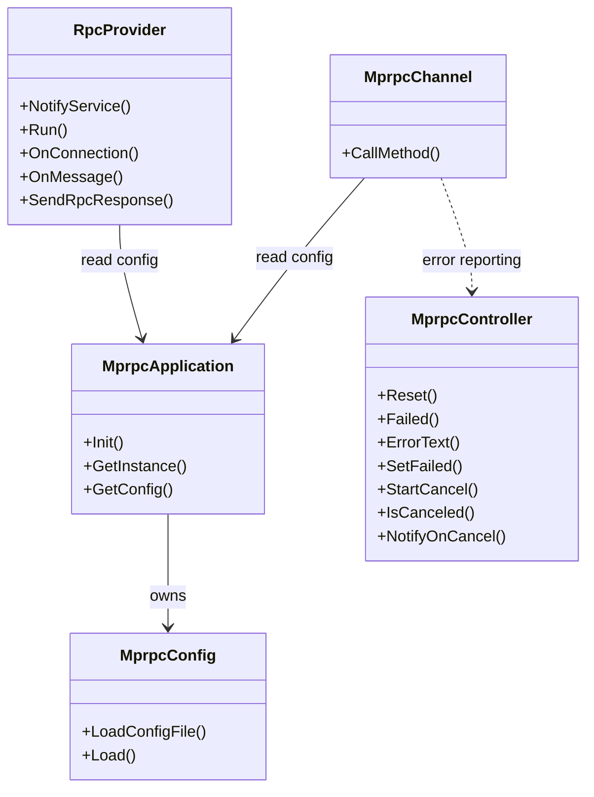
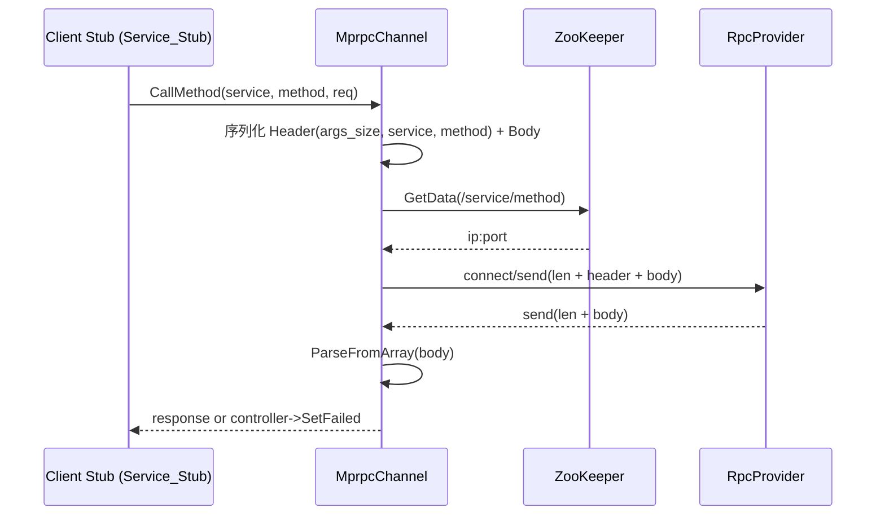
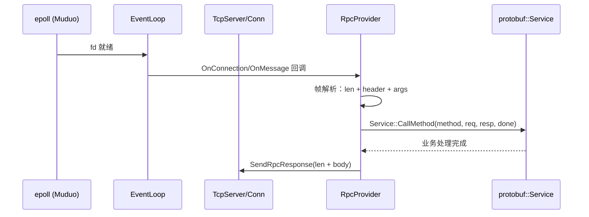

# mprpc 模块总览（类/方法级别）

本文基于仓库中实际代码，按“类 → 关键方法 → 调用关系”梳理 mprpc 的工作机制，并配套类图与时序图。

## 核心类与职责



说明：

- `MprpcApplication` 负责解析启动参数、加载配置（单例）。
- `MprpcConfig` 解析 `key=value` 配置（如 `rpcserverip/port`, `zookeeperip/port`）。
- `MprpcController` 承载本次 RPC 的错误状态与文本。
- `MprpcChannel` 是客户端桩（Stub）背后的通道：序列化请求 → 服务发现(ZK) → 连接池发送 → 读取响应 → 反序列化 → 返回。
- `RpcProvider` 是服务端：注册服务与方法 → 启动 Muduo `TcpServer` → 回调里解析帧、分发到对应 `Service::CallMethod` → `SendRpcResponse` 写回。

## 关键方法（代码出处）

- 应用初始化

```1:20:mprpc/src/mprpcapplication.cc
void MprpcApplication::Init(int argc, char **argv) {
  // 解析 -i 配置文件
  m_config.LoadConfigFile(config_file.c_str());
}
```

- 配置加载

```27:44:mprpc/src/mprpcconfig.cc
void MprpcConfig::LoadConfigFile(const char *config_file) {
  FILE *fp = fopen(config_file, "r");
  // ... 逐行解析、Trim、写入 m_configMap
  m_configMap.insert({key, value});
}
```

- 客户端调用主路径

```24:33:mprpc/src/mprpcchannel.cc
void MprpcChannel::CallMethod(const MethodDescriptor *method,
                              RpcController *controller,
                              const Message *request,
                              Message *response,
                              Closure *done) {
  // 1) 构造 header(args_size, service, method) + body
}
```

```72:120:mprpc/src/mprpcchannel.cc
// 2) ZK 地址解析 + 本地 TTL 缓存（s_addr_cache)
//    method 路径: /<service>/<method>
```

```121:163:mprpc/src/mprpcchannel.cc
// 3) 连接池（每个 method_path 维度）
// 4) 阻塞发送缓冲区；错误走 controller->SetFailed
```

```180:223:mprpc/src/mprpcchannel.cc
// 5) 读4字节长度 + 读 body → ParseFromArray(resp)
// 6) 成功则归还连接到池
```
- 服务端服务注册
```14:41:mprpc/src/rpcprovider.cc
void RpcProvider::NotifyService(google::protobuf::Service *service) {
  // 读取 ServiceDescriptor/MethodDescriptor，填充 m_serviceMap
}
```

 - 服务端启动与事件循环

```45:64:mprpc/src/rpcprovider.cc
void RpcProvider::Run() {
  muduo::net::TcpServer server(&m_eventLoop, address, "RpcProvider");
  server.setConnectionCallback(/* OnConnection */);
  server.setMessageCallback(/* OnMessage */);
  server.setThreadNum(4);
  // 注册到 ZK：/service_name/method_name -> ip:port (临时节点)
}
```

```96:99:mprpc/src/rpcprovider.cc
server.start();
m_eventLoop.loop();
```

 - 连接与读写回调

```101:113:mprpc/src/rpcprovider.cc
void RpcProvider::OnConnection(const TcpConnectionPtr &conn) {
  if (!conn->connected()) { conn->shutdown(); }
  else { conn->setTcpNoDelay(true); }
}
```

```124:203:mprpc/src/rpcprovider.cc
void RpcProvider::OnMessage(const TcpConnectionPtr &conn, Buffer *buffer, Timestamp) {
  // 帧长(4) + header + args，粘拆包安全；找到 service/method → 反序列化 → 调用 Service::CallMethod
}
```

```206:219:mprpc/src/rpcprovider.cc
void RpcProvider::SendRpcResponse(const TcpConnectionPtr &conn, Message *response) {
  // 写回：4字节长度 + body
}
```

## 客户端调用时序



## 服务器处理时序



## 常见问题与扩展点

- 粘包/拆包如何保证？
  - 客户端与服务端都使用“长度前缀 + protobuf”，读写均按长度切分。
- 连接复用为何按 method 维度？
  - Register 在 ZK 的粒度是 `/service/method`；按此复用能对不同方法做更细致的 L4/负载策略，也简化缓存键。
- 失败与重试？
  - 当前 `CallMethod` 在连接错误/发送接收失败时通过 `controller->SetFailed` 上报；如需重试/超时取消，可在通道层增加超时、回退策略。
- 与 Reactor 的关系？
  - Provider 运行在 Muduo Reactor 上；Channel 在客户端是阻塞发送/接收（可扩展为非阻塞或 io_uring）。
