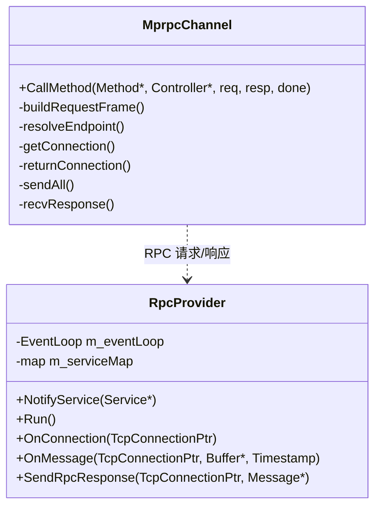
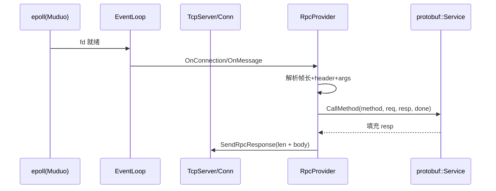
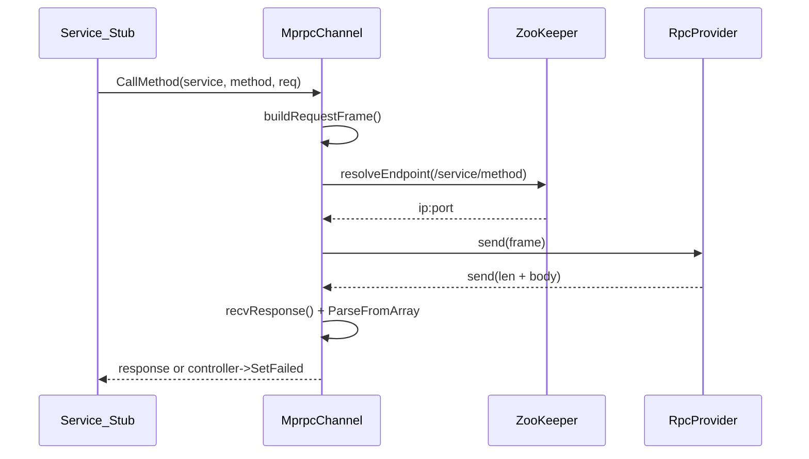
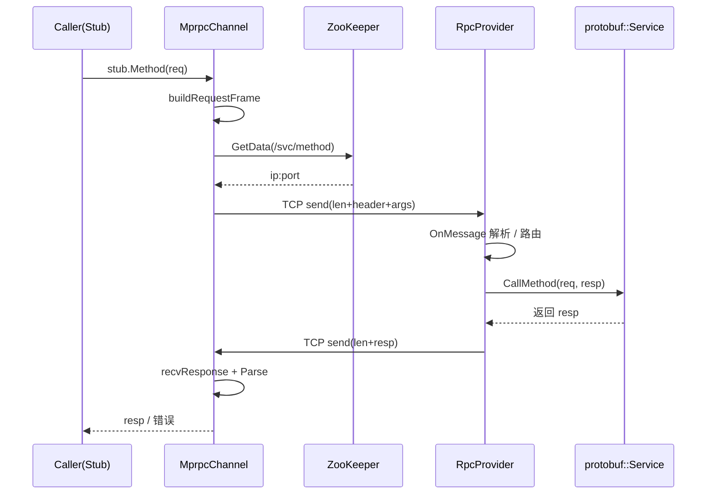

# mprpc 核心：RpcProvider 与 MprpcChannel（方法级详解 + 时序）

本文聚焦 mprpc 的两个核心类：`RpcProvider`（服务端）与 `MprpcChannel`（客户端通道）。内容基于当前仓库源码，给出方法级职责、关键代码引用以及端到端时序，便于对照代码学习与面试说明。

## 类概览（简化类图）



## RpcProvider（服务端）

负责对外暴露 RPC 服务：注册 `Service/Method` → 监听网络 → 在读事件中解析请求 → 路由到具体服务方法 → 序列化响应并发送。

### 关键成员

- `m_eventLoop`：Muduo 事件循环（Reactor）。
- `m_serviceMap`：`service_name -> { service*, method_name -> MethodDescriptor* }`。

### 方法职责与关键代码

NotifyService：收集服务与方法描述，填充 `m_serviceMap`

```14:41:mprpc/src/rpcprovider.cc
void RpcProvider::NotifyService(google::protobuf::Service *service) {
  const ServiceDescriptor* pserviceDesc = service->GetDescriptor();
  std::string service_name = pserviceDesc->name();
  for (int i = 0; i < pserviceDesc->method_count(); ++i) {
    const MethodDescriptor* m = pserviceDesc->method(i);
    service_info.m_methodMap.insert({m->name(), m});
  }
  service_info.m_service = service;
  m_serviceMap.emplace(service_name, std::move(service_info));
}
```

Run：创建 `TcpServer`、注册回调、在 ZK 注册节点、进入事件循环

```45:99:mprpc/src/rpcprovider.cc
muduo::net::TcpServer server(&m_eventLoop, address, "RpcProvider");
server.setConnectionCallback(std::bind(&RpcProvider::OnConnection, this, _1));
server.setMessageCallback(std::bind(&RpcProvider::OnMessage, this, _1, _2, _3));
server.setThreadNum(4);
// 注册到 ZK：/service_name/method_name -> ip:port (临时节点)
server.start();
m_eventLoop.loop();
```

OnConnection：连接建立/断开时的处理

```101:113:mprpc/src/rpcprovider.cc
if (!conn->connected()) { conn->shutdown(); } else { conn->setTcpNoDelay(true); }
```

OnMessage：读事件回调，完成解析与分发

```124:203:mprpc/src/rpcprovider.cc
// 1) 按帧长解析（4 字节 header_size）
// 2) 解析 RpcHeader，取 service_name/method_name/args_size
// 3) 反序列化请求对象，定位 service + method
// 4) 调用 service->CallMethod(method, nullptr, request, response, done)
```

SendRpcResponse：序列化响应并写回

```206:231:mprpc/src/rpcprovider.cc
// 发送 4 字节长度 + body，保持长连接
conn->send(std::string(lenbuf, 4));
conn->send(response_str);
```

### Provider 侧时序（Reactor 驱动）



## MprpcChannel（客户端通道）

把 Stub 调用转换为网络 RPC：构造请求帧 → 服务发现（ZK + TTL 缓存）→ 连接池获取连接 → 发送/接收 → 反序列化响应。

重构后：`CallMethod` 委托给 5 个私有 helper，阅读、测试与扩展性更好。

### 方法职责与代码位置

CallMethod：高层编排

```1:36:mprpc/src/mprpcchannel.cc
// 1) buildRequestFrame
// 2) resolveEndpoint
// 3) getConnection
// 4) sendAll
// 5) recvResponse
// 6) returnConnection
```

buildRequestFrame：序列化 header(args_size, service, method) + args → 帧

```37:73:mprpc/src/mprpcchannel.cc
mprpc::RpcHeader header; header.set_service_name(service_name);
header.set_method_name(method_name); header.set_args_size(args_str.size());
// out = 4B header_size + header + args
```

resolveEndpoint：ZK 查 `/service/method` + 本地缓存（1s）

```75:110:mprpc/src/mprpcchannel.cc
std::call_once(s_zk_once, [](){ s_zk.Start(); });
// 命中缓存直接返回；未命中从 ZK GetData，解析 ip:port，回填缓存
```

getConnection / returnConnection：方法维度连接池

```112:139:mprpc/src/mprpcchannel.cc
// 先从 map[key] 向量借 fd；没有则 socket+connect
// 归还时若池满则关闭
```

sendAll：阻塞发完整缓冲

```141:153:mprpc/src/mprpcchannel.cc
while (left > 0) { n = send(fd, p, left, 0); ... }
```

recvResponse：读 4 字节长度 + body，并解析到 `response`

```155:180:mprpc/src/mprpcchannel.cc
// 先读 4B 长度，再按长度读 body，ParseFromArray 到 response
```

### Channel 侧时序（调用链）



## 端到端交互（调用端 vs 被调端）



## 注意点与建议（结合当前实现）

- 长度字段使用本机字节序，跨端可能有隐患；可在 frame/recv 中改用 htonl/ntohl。
- `RpcProvider` 中 `request` 对象在成功路径未释放（建议使用 `std::unique_ptr`）。
- 同步阻塞 I/O 可能占用 Reactor 线程，网关处建议把 RPC 调用切到工作线程。
- `resolveEndpoint` 的 TTL 缓存简单有效；后续可加 ZK watch 监听节点变化。
