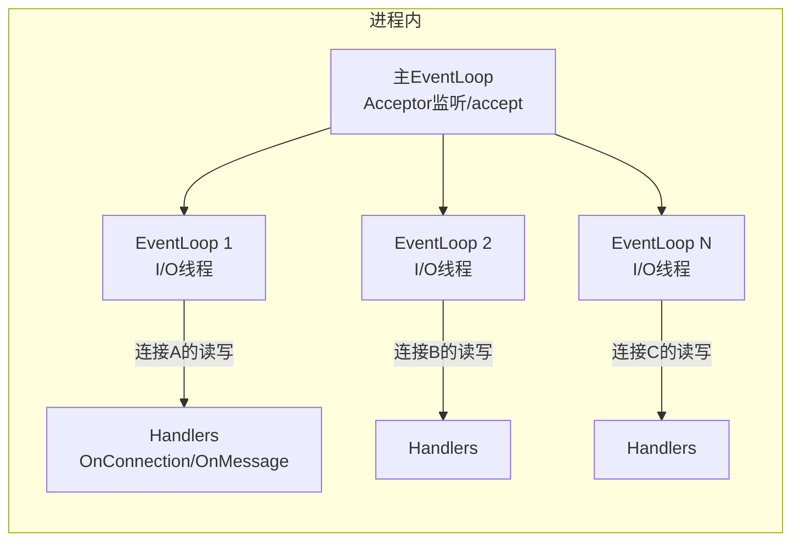

# Muduo 网络库深入解析与在 MPIM 中的实践

## 1. 概览

Muduo 是基于 Reactor 的 C++ 网络库，核心特点：事件驱动、one loop per thread、无锁串行化连接、回调驱动、易于扩展。MPIM 在网关与 RPC 服务端均使用 Muduo 实现多 Reactor 多线程 I/O 处理。

## 2. 线程模型与总体结构



- 主 EventLoop 负责监听/接受新连接（Acceptor）。
- 新连接以轮询/哈希方式分配到某个 I/O 线程的 EventLoop；该连接后续一生由此线程串行处理（无锁）。
- 业务可在独立线程池处理，避免阻塞 I/O 线程；重回 I/O 线程使用 `runInLoop/queueInLoop`。

## 3. 核心组件与回调

- EventLoop：事件循环；封装 epoll（`EpollPoller`）与定时器（`TimerQueue`）。
- TcpServer：对外的服务器对象；负责 Acceptor 管理、I/O 线程池、连接分配与回调注册。
- TcpConnection：表示一条 TCP 连接；线程亲和于所属 EventLoop；提供 `send/shutdown` 等接口与回调管理。
- Buffer：高效可增长缓冲区；避免频繁拷贝。

常用回调（均在连接所属 I/O 线程触发）：
- ConnectionCallback：连接建立/断开
- MessageCallback：可读事件（读到应用数据）
- WriteCompleteCallback：发送完成（低水位）
- HighWaterMarkCallback：发送缓冲区过大（背压）

## 4. 在 MPIM 中的使用映射

- RPC 服务端（`mprpc/src/rpcprovider.cc`）
  - `TcpServer server(&m_eventLoop, addr, ...)`
  - `server.setThreadNum(4)` 多 Reactor 多线程
  - 回调：`OnConnection`、`OnMessage`（长度前缀 + Protobuf）
  - `conn->setTcpNoDelay(true)` 降低交互延迟

- 网关（`im-gateway/src/gatewayServer.cc`）
  - `server_.setThreadNum(2)`；协议为按行文本协议
  - 订阅 Redis 通道，收到在线消息后写回客户端连接

## 5. 最佳实践

1) 不阻塞 I/O 线程
- I/O 线程只做收发与轻量解析；CPU 密集/阻塞操作放入业务线程池。
- 需要在 I/O 线程执行某操作时用 `conn->getLoop()->runInLoop(...)` 或 `queueInLoop(...)`。

2) 背压与水位
- 大量发送时使用 `HighWaterMarkCallback` 监控发送缓冲；超阈值可暂停上游或丢弃次要消息。
- 控制读取速度：必要时暂停读取（应用层协议级流控）。

3) 连接生命周期与线程亲和
- `TcpConnection` 仅能在其所属 EventLoop 线程操作；跨线程请用 `runInLoop/queueInLoop`。
- 使用 `shared_ptr` 语义与 `tie` 绑定，避免回调中对象提前析构导致悬挂。

4) 定时任务
- 使用 `EventLoop::runAfter/runEvery` 实现心跳/超时检测/定时清理。

5) TCP 优化
- `TCP_NODELAY`：禁用 Nagle 降低小包延迟（已在 Provider 设置；客户端也可配置）。
- `SO_REUSEADDR/SO_REUSEPORT`：快速复用端口、提升多进程场景的 accept 扩展性（可按需启用）。
- backlog/内核参数：`net.core.somaxconn`、`fs.file-max`、`ulimit -n`、`rmem_max/wmem_max`。

## 6. 典型收发模式（伪代码）

```cpp
// Message 回调：按“长度前缀帧”解析
void OnMessage(const TcpConnectionPtr& c, Buffer* b, Timestamp) {
    while (b->readableBytes() >= 4) {
        uint32_t len = 0; memcpy(&len, b->peek(), 4);
        if (b->readableBytes() < 4 + len) break;
        std::string frame(b->peek() + 4, b->peek() + 4 + len);
        b->retrieve(4 + len);
        dispatch(frame, c); // 反序列化 → 业务调度
    }
}

// 业务线程池执行耗时逻辑，完成后回到 I/O 线程安全发送
pool.submit([c, respStr]{
    // heavy work ...
    c->getLoop()->queueInLoop([c, respStr]{ c->send(respStr); });
});
```

## 7. 性能调优 checklist

- I/O 线程数：`TcpServer::setThreadNum(N)`；通常从 CPU 核数或“核数±1”起步压测。
- 业务线程池：重活下沉；I/O 线程只做收发与轻解析。
- 小包优化：`TCP_NODELAY`；聚合上行写（应用层批量）。
- 零拷贝：必要时评估 `sendfile/splice`（Muduo 自身不强求，按协议与路径决定）。
- 内核参数：`somaxconn`、`rmem_max/wmem_max`、`ip_local_port_range`、`tcp_tw_reuse`（按内核版本谨慎启用）。
- FD 限制：`ulimit -n` 与系统 file-max。

## 8. 常见坑

- 在回调里做阻塞 I/O/耗时计算 → 造成 I/O 线程卡顿、尾延迟飙升。
- 跨线程直接触碰 `TcpConnection` → 数据竞争/崩溃；一律用 `runInLoop/queueInLoop`。
- 不做背压控制 → 下游慢消费导致发送缓冲暴涨（内存飙升）。
- 无心跳/超时清理 → 空闲连接堆积。
- 大日志在热路径同步写 → 建议异步日志与等级过滤。

## 9. 与 mprpc 的结合要点

- 服务端：Muduo 负责连接与 I/O；mprpc 在 `OnMessage` 中做帧解析与 `Service.Method` 调度。
- 网关：Muduo 负责客户端长连；订阅 Redis 后将消息写回；Presence 绑定路由。
- 客户端：当前 `MprpcChannel` 为阻塞 socket；如需全链路 Reactor，可以 Muduo/异步客户端替换。

## 10. 参考与延伸

- Muduo 官方示例与《Linux 多线程服务端编程》实践
- 推荐一起阅读：
  - [mprpc RPC框架完整分析](mprpc-framework-complete.md)
  - [ZooKeeper 深入解析与在 MPIM 中的实践](zookeeper-deep-dive.md)

---

## 附录 · FAQ 速查

- Q: 单 Reactor 与多 Reactor 有何差异？
  - A: 单 Reactor 所有 I/O 在一个 EventLoop；多 Reactor 通过 `setThreadNum(N)` 创建 N 个 I/O 线程，连接按轮询分配，各线程内串行化处理，提升并行度与尾延迟表现。
- Q: `TcpServer::setThreadNum(N)` 设置的是业务线程吗？
  - A: 不是，是 I/O 线程（EventLoopThreadPool）。业务计算建议放入单独线程池，避免阻塞 I/O 线程。
- Q: 如何避免在回调中阻塞？
  - A: 将重活提交到业务线程池，结果回到 I/O 线程用 `queueInLoop` 发送。
- Q: 如何做背压？
  - A: 使用 `HighWaterMarkCallback` 监控发送缓冲，超阈暂停上游或丢弃非关键消息。


