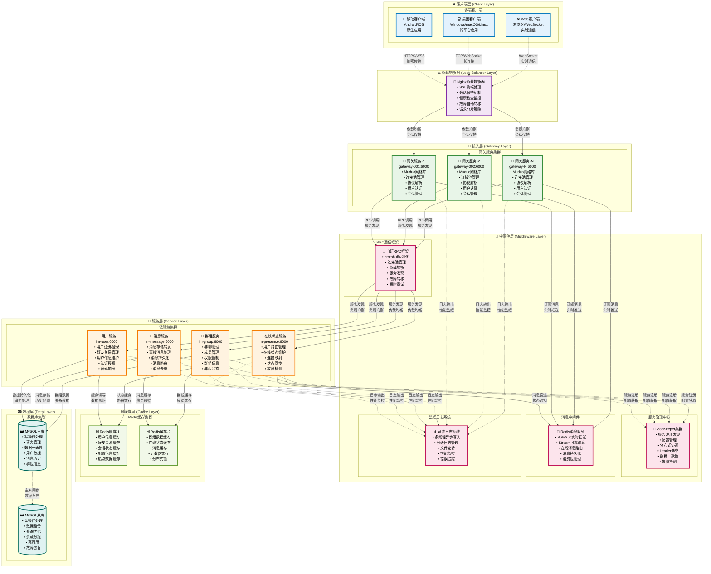
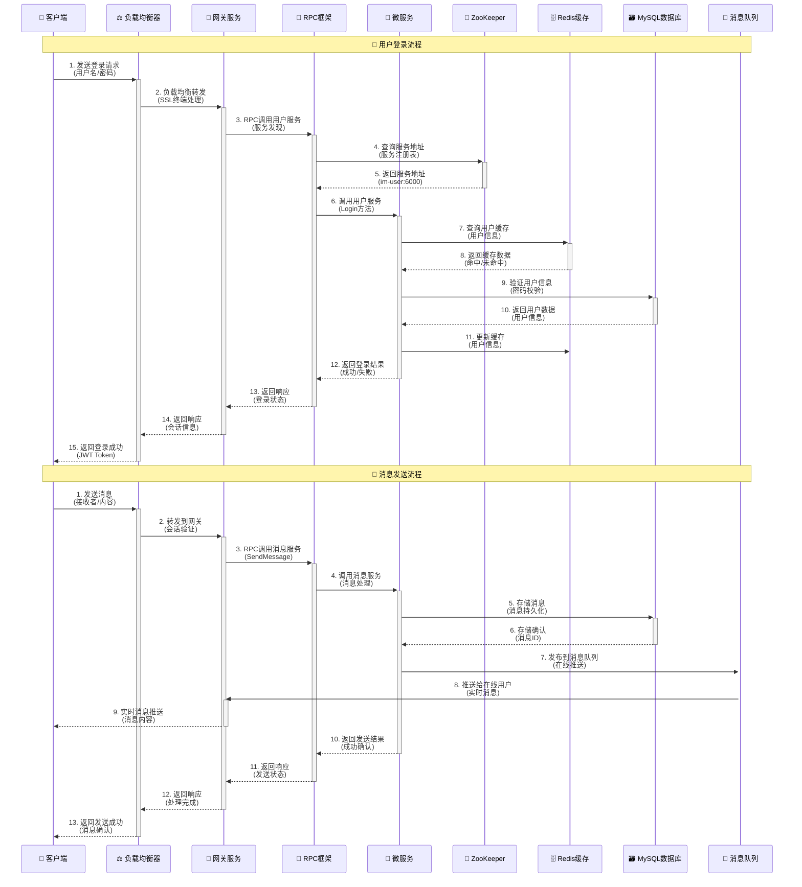
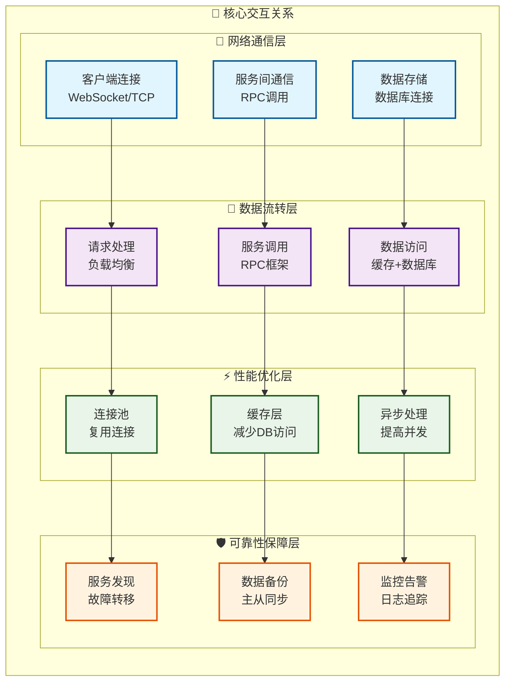

# MPIM系统整体架构 - 增强版

## 架构概述

MPIM是一个基于C++的分布式即时通讯系统，采用微服务架构设计，支持高并发、高可用的消息传输服务。系统采用分层架构，每层都有明确的职责和边界。

## 分层架构图

### 1. 整体分层架构

### 2. 数据流向时序图

### 3. 组件交互关系图

## 架构特点分析

### 1. 分层设计原则

- **职责单一**: 每层只负责特定的功能
- **松耦合**: 层与层之间通过接口交互
- **高内聚**: 同层组件紧密协作
- **可扩展**: 支持水平扩展和垂直扩展

### 2. 技术选型理由

- **C++**: 高性能、低延迟、内存控制精确
- **Muduo**: 高性能网络库、事件驱动、多线程
- **Redis**: 高性能缓存、消息队列、数据结构丰富
- **MySQL**: 关系型数据库、ACID特性、成熟稳定
- **ZooKeeper**: 分布式协调、服务发现、配置管理
- **mprpc**: [自研RPC框架](mprpc-framework-complete.md) - 基于Protobuf、支持服务发现、连接池管理

### 3. 性能优化策略

- **连接池**: 复用网络连接，减少建立连接开销
- **缓存层**: 减少数据库访问，提高响应速度
- **异步处理**: 提高并发处理能力
- **负载均衡**: 分散请求压力，提高系统吞吐量

### 4. 可靠性保障

- **服务发现**: 自动故障检测和转移
- **数据备份**: 主从同步，数据不丢失
- **监控告警**: 实时监控系统状态
- **日志追踪**: 问题定位和性能分析

## 相关文档

### RPC框架详细分析

- [mprpc RPC框架完整分析](mprpc-framework-complete.md) - mprpc RPC框架的完整技术分析
- [mprpc调用序列图](mprpc-call-sequence.md) - RPC调用的详细流程图和序列图

### 其他架构文档

- [用户服务架构](user-service-architecture.md) - 用户服务的详细设计
- [消息服务架构](message-service-architecture.md) - 消息服务的详细设计
- [群组服务架构](group-service-architecture.md) - 群组服务的详细设计

## 总结

MPIM系统采用现代化的微服务架构，通过分层设计实现了高性能、高可用、可扩展的即时通讯服务。系统各层职责明确，技术选型合理，性能优化到位，可靠性保障充分，是一个典型的分布式系统架构实践案例。
