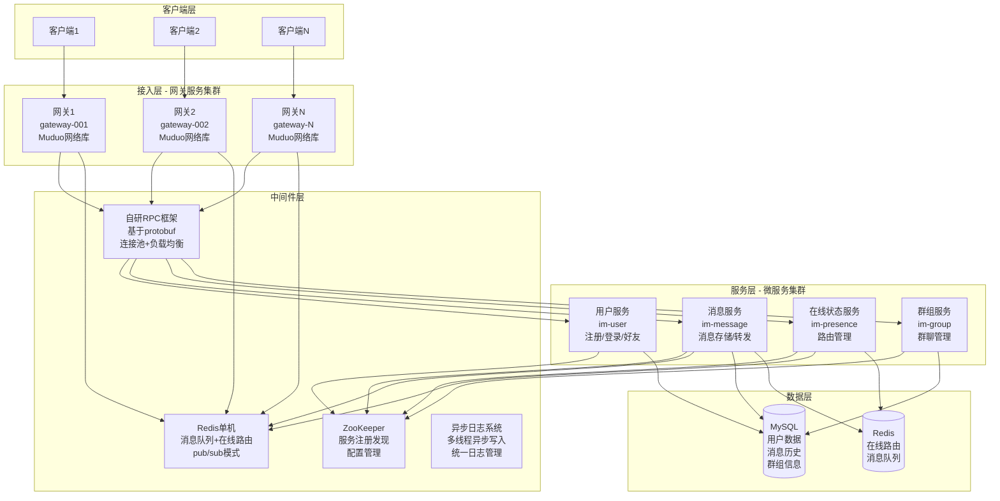

# 系统整体架构

## 架构概述

MPRPC+IM 是一个基于C++的分布式即时通讯系统，采用微服务架构设计，支持高并发、高可用的消息传输服务。

## 整体架构图

## 架构分层说明

### 接入层 (Gateway Layer)
- **职责**: 客户端连接管理、协议解析、用户认证
- **技术**: Muduo网络库、多线程并发处理、Nginx负载均衡
- **特点**: 高性能、高并发、支持负载均衡

### 服务层 (Service Layer)
- **用户服务**: 用户注册、登录、好友管理
- **消息服务**: 消息存储、转发、离线消息处理
- **在线状态服务**: 用户路由管理、在线状态维护
- **群组服务**: 群聊管理、群成员管理

### 中间件层 (Middleware Layer)
- **自研RPC框架**: 基于protobuf的服务间通信
- **ZooKeeper**: 服务注册发现、配置管理
- **Redis**: 消息队列、在线状态缓存
- **异步日志系统**: 统一日志管理、性能监控

### 数据层 (Data Layer)
- **MySQL**: 持久化数据存储（用户信息、消息历史）
- **Redis**: 热数据缓存（在线路由、消息队列）

## 技术特点

1. **微服务架构**: 服务解耦、独立部署、易于扩展
2. **高性能**: 基于C++和Muduo网络库，支持高并发
3. **高可用**: 服务集群部署，支持故障转移
4. **实时性**: 基于Redis pub/sub的毫秒级消息投递
5. **可扩展**: 支持水平扩展，动态负载均衡

## 性能指标

- **RPC性能**: 26,850 QPS (优化前: 622 QPS)
- **延迟**: P99 < 2.6ms (优化前: 33ms)
- **并发连接**: 支持10,000+ 并发连接
- **消息吞吐**: 支持100,000+ 消息/秒
