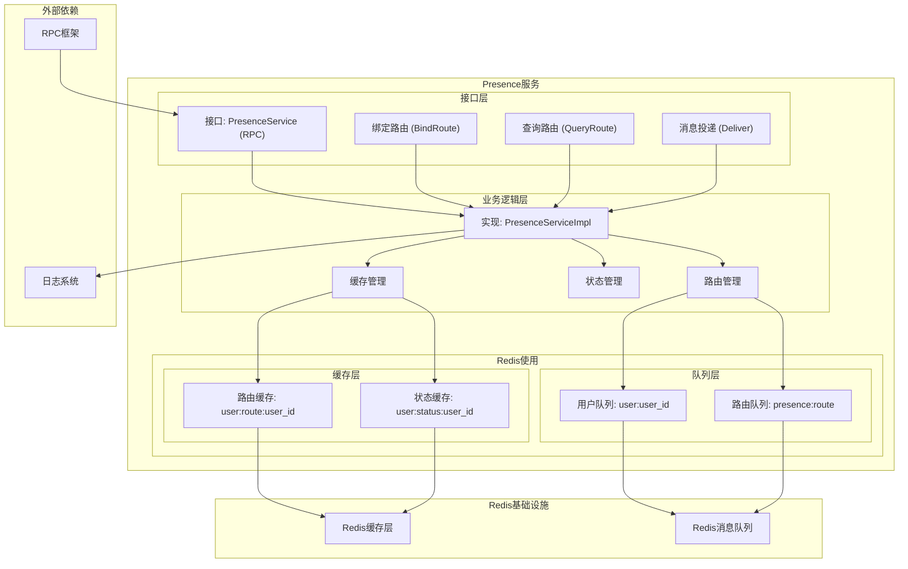
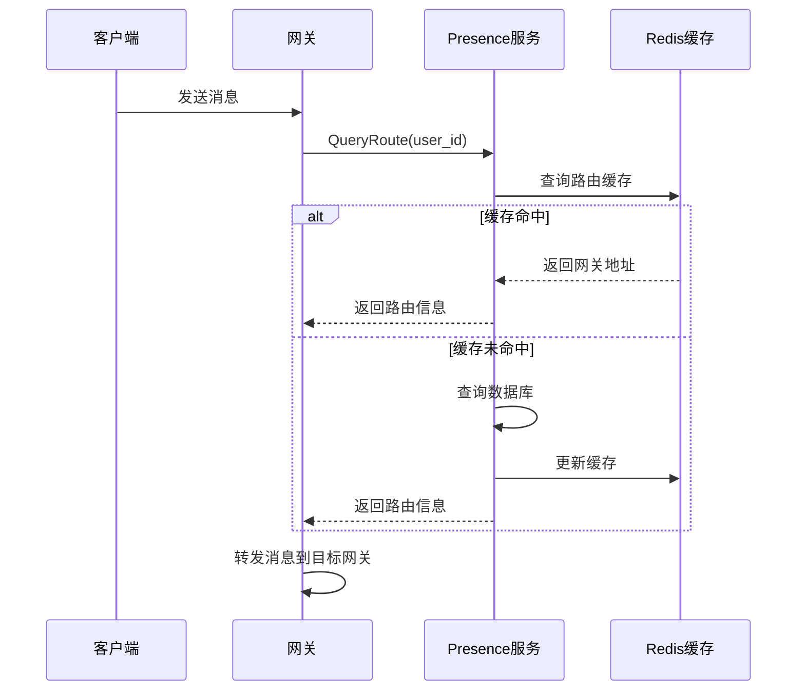
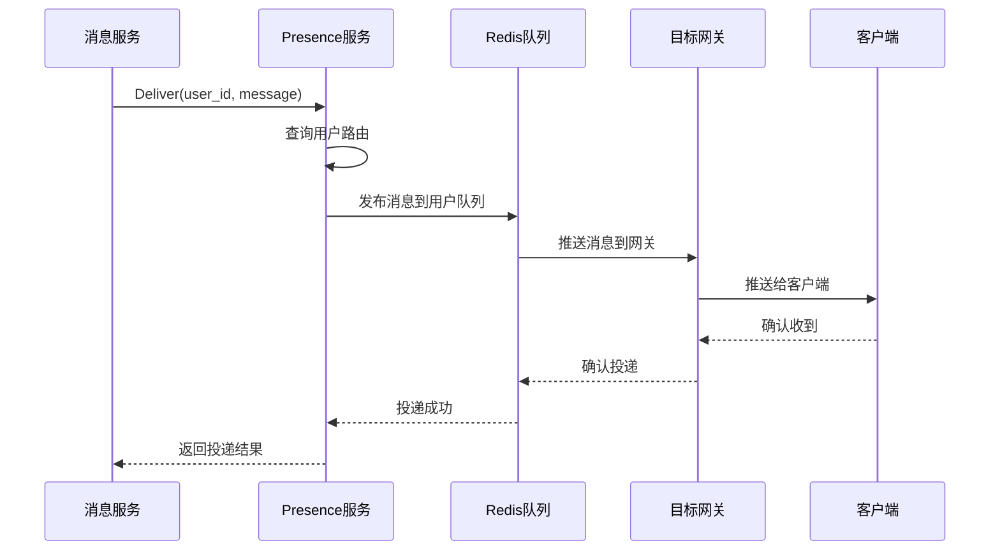
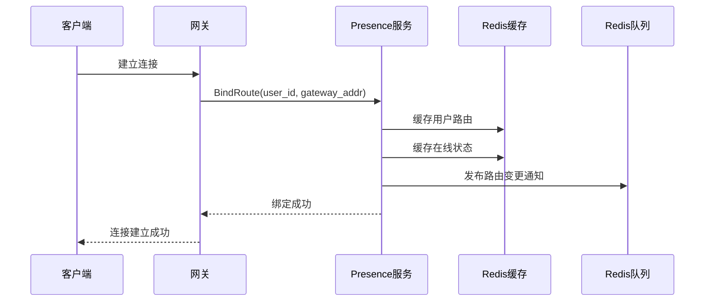
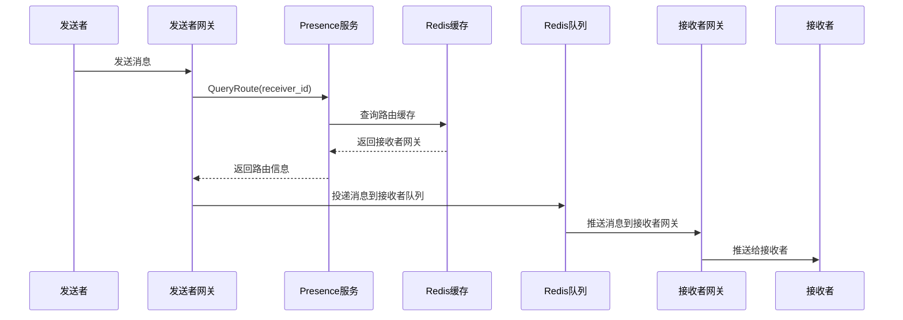

# Presence服务架构设计

## 概述

Presence服务（im-presence）是MPIM系统中负责在线状态管理和消息路由的核心服务。该服务同时使用Redis的缓存层和消息队列层，体现了Redis双重功能在单一服务中的协同使用。

## Presence服务架构图



## 核心功能模块

### 1. 路由绑定模块 (BindRoute)

#### 功能特性
- **用户路由绑定**: 将用户ID绑定到具体的网关实例
- **路由信息缓存**: 缓存用户路由信息到Redis
- **状态更新**: 更新用户在线状态
- **负载均衡**: 支持多个网关实例的负载均衡

#### 实现细节
```cpp
class PresenceServiceImpl {
public:
    // 绑定用户路由
    void BindRoute(google::protobuf::RpcController* controller,
                   const mpim::BindRouteReq* request,
                   mpim::BindRouteResp* response,
                   google::protobuf::Closure* done) override;
    
private:
    std::shared_ptr<CacheManager> cache_manager_;
    std::shared_ptr<MessageQueue> message_queue_;
};
```

#### 缓存策略
- **路由信息**: 缓存用户到网关的映射关系
- **在线状态**: 缓存用户在线状态信息
- **TTL管理**: 设置合理的过期时间

### 2. 路由查询模块 (QueryRoute)

#### 功能特性
- **路由查询**: 查询用户当前绑定的网关实例
- **缓存优先**: 优先从Redis缓存查询
- **降级处理**: 缓存未命中时的降级策略
- **性能优化**: 快速响应用户路由查询

#### 实现细节
```cpp
// 查询用户路由
void QueryRoute(google::protobuf::RpcController* controller,
                const mpim::QueryRouteReq* request,
                mpim::QueryRouteResp* response,
                google::protobuf::Closure* done) override;
```

#### 查询流程


### 3. 消息投递模块 (Deliver)

#### 功能特性
- **消息投递**: 将消息投递到用户所在网关
- **实时推送**: 基于Redis Pub/Sub的实时推送
- **消息确认**: 支持消息送达确认
- **错误处理**: 投递失败时的重试机制

#### 实现细节
```cpp
// 投递消息
void Deliver(google::protobuf::RpcController* controller,
             const mpim::DeliverReq* request,
             mpim::DeliverResp* response,
             google::protobuf::Closure* done) override;
```

#### 投递流程


## Redis双重功能使用

### 1. 缓存层使用

#### 路由信息缓存
```cpp
// 缓存用户路由信息
bool PresenceServiceImpl::cacheUserRoute(int64_t user_id, const std::string& gateway_addr) {
    std::string key = "user:route:" + std::to_string(user_id);
    return cache_manager_->Setex(key, 3600, gateway_addr); // 缓存1小时
}

// 查询用户路由信息
std::string PresenceServiceImpl::getUserRoute(int64_t user_id) {
    std::string key = "user:route:" + std::to_string(user_id);
    return cache_manager_->Get(key);
}
```

#### 在线状态缓存
```cpp
// 缓存用户在线状态
bool PresenceServiceImpl::cacheUserStatus(int64_t user_id, const std::string& status) {
    std::string key = "user:status:" + std::to_string(user_id);
    return cache_manager_->Setex(key, 3600, status); // 缓存1小时
}

// 查询用户在线状态
std::string PresenceServiceImpl::getUserStatus(int64_t user_id) {
    std::string key = "user:status:" + std::to_string(user_id);
    return cache_manager_->Get(key);
}
```

### 2. 消息队列层使用

#### 消息投递队列
```cpp
// 投递消息到用户队列
bool PresenceServiceImpl::deliverMessage(int64_t user_id, const std::string& message) {
    std::string channel = "user:" + std::to_string(user_id);
    return message_queue_->Publish(channel, message);
}

// 订阅用户消息队列
bool PresenceServiceImpl::subscribeUserMessages(int64_t user_id, 
                                               std::function<void(const std::string&)> callback) {
    std::string channel = "user:" + std::to_string(user_id);
    return message_queue_->Subscribe(channel, callback);
}
```

#### 路由管理队列
```cpp
// 发布路由变更通知
bool PresenceServiceImpl::notifyRouteChange(int64_t user_id, const std::string& new_gateway) {
    std::string channel = "presence:route";
    std::string message = std::to_string(user_id) + ":" + new_gateway;
    return message_queue_->Publish(channel, message);
}
```

## 数据模型设计

### Protobuf消息定义

#### 路由绑定
```protobuf
message BindRouteReq {
    int64 user_id = 1;
    string gateway_addr = 2;
    string client_ip = 3;
    int32 client_port = 4;
}

message BindRouteResp {
    Result result = 1;
    string route_key = 2;
}
```

#### 路由查询
```protobuf
message QueryRouteReq {
    int64 user_id = 1;
}

message QueryRouteResp {
    Result result = 1;
    string gateway_addr = 2;
    bool is_online = 3;
}
```

#### 消息投递
```protobuf
message DeliverReq {
    int64 user_id = 1;
    string message = 2;
    string message_type = 3;
}

message DeliverResp {
    Result result = 1;
    bool delivered = 2;
    int64 timestamp = 3;
}
```

## 业务流程设计

### 用户上线流程



### 消息路由流程



## 性能优化策略

### 1. 缓存优化
- **预热缓存**: 服务启动时预加载热点路由信息
- **批量操作**: 批量更新路由信息
- **TTL管理**: 合理设置缓存过期时间
- **缓存更新**: 路由变更时及时更新缓存

### 2. 消息队列优化
- **连接池**: 复用Redis连接
- **批量投递**: 批量投递消息
- **异步处理**: 消息投递异步化
- **错误重试**: 投递失败时的重试机制

### 3. 双重功能协调
- **资源隔离**: 使用不同的Redis数据库
- **监控分离**: 分别监控缓存和队列性能
- **故障隔离**: 一个功能故障不影响另一个功能

## 监控指标

### 1. 路由管理指标
- **路由查询QPS**: 每秒路由查询次数
- **路由绑定QPS**: 每秒路由绑定次数
- **路由命中率**: 路由缓存命中率
- **路由响应时间**: 路由查询平均延迟

### 2. 消息投递指标
- **消息投递QPS**: 每秒投递消息数
- **投递成功率**: 消息投递成功比例
- **投递延迟**: 消息投递平均延迟
- **队列长度**: 当前队列中消息数量

### 3. 系统指标
- **Redis连接数**: 当前Redis连接数
- **内存使用**: Redis内存使用情况
- **错误率**: 各操作错误率
- **并发用户数**: 当前在线用户数

## 配置参数

### 服务配置
```ini
# Presence服务配置
[presence_service]
port = 6000
thread_count = 4
max_connections = 1000

# 路由配置
[route]
route_ttl = 3600
status_ttl = 3600
max_retries = 3
retry_interval = 1000

# Redis配置
[redis_cache]
host = 127.0.0.1
port = 6379
database = 0
timeout = 5000

[redis_queue]
host = 127.0.0.1
port = 6379
database = 1
timeout = 5000
```

## 总结

Presence服务通过同时使用Redis的缓存层和消息队列层，实现了：

1. **高效路由管理**: 通过缓存层快速查询用户路由信息
2. **实时消息投递**: 通过消息队列层实现实时消息推送
3. **双重功能协同**: 缓存和队列功能相互配合，提升整体性能
4. **故障隔离**: 两个功能相互独立，提高系统可用性
5. **性能优化**: 针对不同功能采用不同的优化策略

该服务完美体现了Redis双重功能在单一服务中的协同使用，为MPIM系统提供了稳定可靠的路由管理和消息投递能力。

