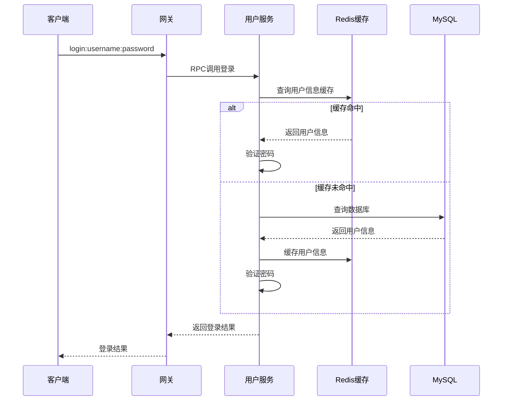
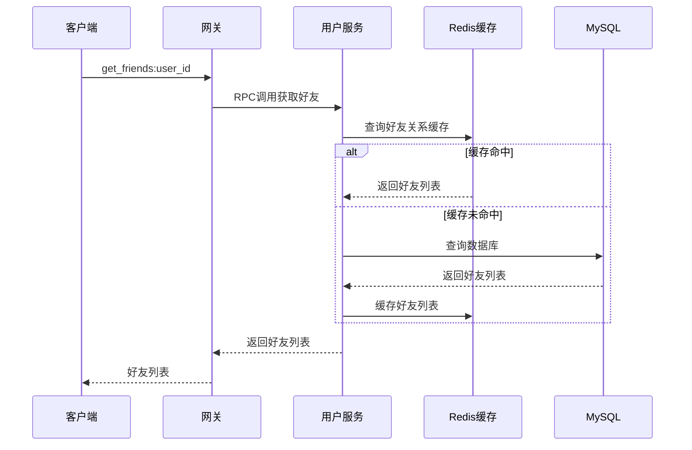
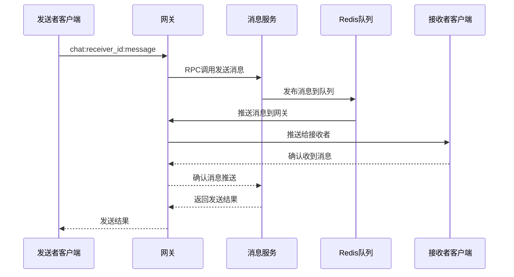
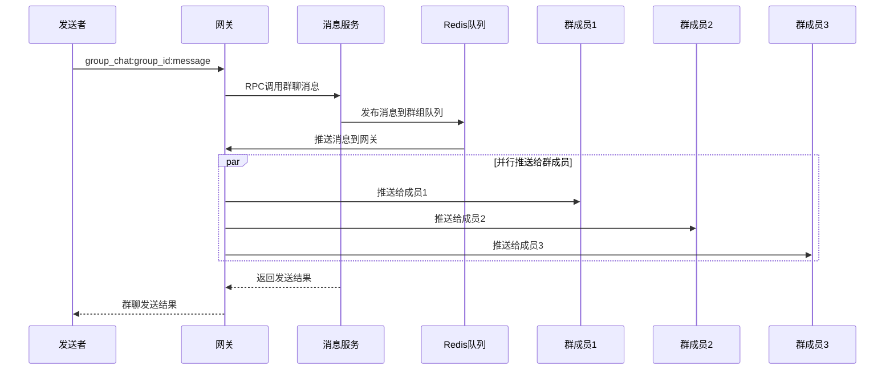

# Redis双重功能架构设计

## 概述

Redis在MPIM系统中承担双重角色，既是缓存层又是消息队列，为系统提供高性能的数据访问和实时通信能力。

## Redis双重功能架构图

```mermaid
graph TB
    subgraph "应用服务层"
        US[User Service<br/>用户服务]
        GS[Group Service<br/>群组服务]
        PS[Presence Service<br/>在线状态服务]
        MS[Message Service<br/>消息服务]
        GW[Gateway Service<br/>网关服务]
    end
    
    subgraph "缓存层"
        CACHE[Redis缓存层]
        subgraph "缓存类型"
            USER_CACHE[用户信息缓存<br/>user:info:{username}]
            FRIENDS_CACHE[好友关系缓存<br/>user:friends:{user_id}]
            STATUS_CACHE[在线状态缓存<br/>user:status:{user_id}]
            GROUP_CACHE[群组信息缓存<br/>group:info:{group_id}]
            MEMBERS_CACHE[群成员缓存<br/>group:members:{group_id}]
        end
    end
    
    subgraph "消息队列层"
        QUEUE[Redis消息队列]
        subgraph "队列类型"
            PUB_SUB[Pub/Sub消息队列<br/>实时消息推送]
            ROUTE_QUEUE[路由消息队列<br/>在线路由管理]
            OFFLINE_QUEUE[离线消息队列<br/>离线消息存储]
        end
    end
    
    subgraph "数据存储层"
        MYSQL[(MySQL数据库<br/>持久化存储)]
    end
    
    subgraph "客户端"
        CLI[客户端连接]
    end
    
    %% 缓存功能连接
    US --> USER_CACHE
    US --> FRIENDS_CACHE
    US --> STATUS_CACHE
    GS --> GROUP_CACHE
    GS --> MEMBERS_CACHE
    
    %% 消息队列功能连接
    PS --> PUB_SUB
    MS --> PUB_SUB
    MS --> OFFLINE_QUEUE
    GW --> ROUTE_QUEUE
    GW --> PUB_SUB
    
    %% 缓存降级连接
    USER_CACHE -.->|缓存未命中| MYSQL
    FRIENDS_CACHE -.->|缓存未命中| MYSQL
    GROUP_CACHE -.->|缓存未命中| MYSQL
    
    %% 消息推送连接
    PUB_SUB --> CLI
    ROUTE_QUEUE --> CLI
```

## Redis双重功能详细说明

### 1. 缓存层功能

#### 用户相关缓存
```
user:info:{username}          # 用户基本信息缓存
user:friends:{user_id}        # 好友关系集合缓存
user:status:{user_id}         # 用户在线状态缓存
user:exists:{username}        # 用户名存在性缓存
```

#### 群组相关缓存
```
group:info:{group_id}         # 群组基本信息缓存
group:members:{group_id}      # 群组成员列表缓存
user:groups:{user_id}         # 用户群组列表缓存
```

#### 缓存策略
- **TTL管理**: 不同数据类型设置不同过期时间
- **Cache-Aside模式**: 先查缓存，未命中时查数据库
- **降级处理**: Redis不可用时自动降级到数据库
- **数据一致性**: 写操作时同步更新缓存和数据库

### 2. 消息队列功能

#### 消息队列类型
```
user:{user_id}                # 用户个人消息队列
group:{group_id}              # 群组消息队列
system:notification          # 系统通知队列
presence:route:{user_id}      # 用户路由队列
```

#### 消息格式
```json
{
    "message_id": 12345,
    "sender_id": 1001,
    "receiver_id": 1002,
    "group_id": 2001,
    "content": "Hello World",
    "message_type": "text",
    "timestamp": 1640995200,
    "status": "sent"
}
```

#### 队列策略
- **Pub/Sub模式**: 实时消息推送
- **消息确认**: 支持消息送达确认
- **持久化**: 重要消息持久化存储
- **批量处理**: 批量消息处理优化

## 双重功能实现架构

### 1. 缓存管理器 (CacheManager)

```cpp
class CacheManager {
private:
    redisContext* context_;
    std::string ip_;
    int port_;
    
public:
    // 字符串操作
    bool Setex(const std::string& key, int ttl, const std::string& value);
    std::string Get(const std::string& key);
    bool Del(const std::string& key);
    
    // 哈希操作
    bool Hset(const std::string& key, const std::string& field, const std::string& value);
    std::string Hget(const std::string& key, const std::string& field);
    
    // 集合操作
    bool Sadd(const std::string& key, const std::string& member);
    bool Srem(const std::string& key, const std::string& member);
    std::vector<std::string> Smembers(const std::string& key);
};
```

### 2. 消息队列管理器 (MessageQueue)

```cpp
class MessageQueue {
private:
    redisContext* context_;
    std::atomic<bool> is_running_;
    std::thread observer_thread_;
    
public:
    // 发布消息
    bool Publish(const std::string& channel, const std::string& message);
    
    // 订阅频道
    bool Subscribe(const std::string& channel, 
                   std::function<void(const std::string&)> callback);
    
    // 停止订阅
    void Stop();
};
```

### 3. 业务缓存类

#### 用户缓存 (UserCache)
```cpp
class UserCache {
private:
    CacheManager cache_manager_;
    
public:
    // 用户信息缓存
    std::string GetUserInfo(const std::string& username);
    bool SetUserInfo(const std::string& username, const std::string& data, int ttl);
    
    // 好友关系缓存
    std::string GetFriends(int64_t user_id);
    bool SetFriends(int64_t user_id, const std::string& friends_data, int ttl);
    bool AddFriend(int64_t user_id, int64_t friend_id);
    bool RemoveFriend(int64_t user_id, int64_t friend_id);
    
    // 用户状态缓存
    std::string GetUserStatus(int64_t user_id);
    bool SetUserStatus(int64_t user_id, const std::string& status, int ttl);
};
```

#### 群组缓存 (GroupCache)
```cpp
class GroupCache {
private:
    CacheManager cache_manager_;
    
public:
    // 群组信息缓存
    std::string GetGroupInfo(int64_t group_id);
    bool SetGroupInfo(int64_t group_id, const std::string& data, int ttl);
    
    // 群成员缓存
    std::string GetGroupMembers(int64_t group_id);
    bool SetGroupMembers(int64_t group_id, const std::string& members_data, int ttl);
    
    // 用户群组列表缓存
    std::string GetUserGroups(int64_t user_id);
    bool SetUserGroups(int64_t user_id, const std::string& groups_data, int ttl);
};
```

## 双重功能使用场景

### 1. 缓存功能使用场景

#### 用户登录流程


#### 好友关系查询流程


### 2. 消息队列功能使用场景

#### 在线消息推送流程


#### 群聊消息广播流程


## 性能优化策略

### 1. 缓存优化
- **分层缓存**: 内存缓存 + Redis缓存
- **缓存预热**: 服务启动时预加载热点数据
- **缓存更新**: 写操作时同步更新缓存
- **TTL管理**: 合理设置过期时间

### 2. 消息队列优化
- **批量处理**: 批量发送和接收消息
- **消息压缩**: 大消息压缩传输
- **连接池**: 复用Redis连接
- **异步处理**: 消息处理异步化

### 3. 双重功能协调
- **资源隔离**: 缓存和队列使用不同的Redis数据库
- **优先级管理**: 重要消息优先处理
- **监控分离**: 分别监控缓存和队列性能
- **故障隔离**: 一个功能故障不影响另一个功能

## 监控指标

### 1. 缓存性能指标
- **缓存命中率**: 缓存查询命中比例
- **缓存响应时间**: 缓存操作平均延迟
- **缓存使用率**: Redis内存使用情况
- **缓存错误率**: 缓存操作失败率

### 2. 消息队列性能指标
- **消息吞吐量**: 每秒处理消息数
- **消息延迟**: 消息发送到接收的延迟
- **队列长度**: 当前队列中消息数量
- **消息丢失率**: 消息丢失比例

### 3. 综合性能指标
- **Redis连接数**: 当前Redis连接数
- **Redis内存使用**: Redis内存使用情况
- **Redis CPU使用**: Redis CPU使用率
- **Redis网络IO**: Redis网络输入输出量

## 配置建议

### Redis配置
```conf
# 内存配置
maxmemory 512mb
maxmemory-policy allkeys-lru

# 持久化配置
save 900 1
save 300 10
save 60 10000

# 网络配置
tcp-keepalive 60
timeout 300

# 数据库配置
databases 16
```

### 应用配置
```ini
# Redis连接配置
[redis]
host = 127.0.0.1
port = 6379
timeout = 5000
max_connections = 100

# 缓存配置
[cache]
user_info_ttl = 3600
friends_ttl = 1800
group_info_ttl = 3600
status_ttl = 3600

# 消息队列配置
[message_queue]
batch_size = 100
batch_timeout = 1000
max_retries = 3
```

## 总结

Redis在MPIM系统中成功承担了双重角色：

1. **缓存层功能**: 提供高性能的数据访问，减少数据库压力
2. **消息队列功能**: 提供实时消息推送和路由管理
3. **双重协调**: 两个功能相互配合，提升系统整体性能
4. **统一管理**: 通过统一的Redis客户端管理双重功能
5. **性能优化**: 针对不同功能采用不同的优化策略

这种设计既简化了系统架构，又充分发挥了Redis的性能优势，为MPIM系统提供了稳定可靠的数据存储和消息传输能力。
