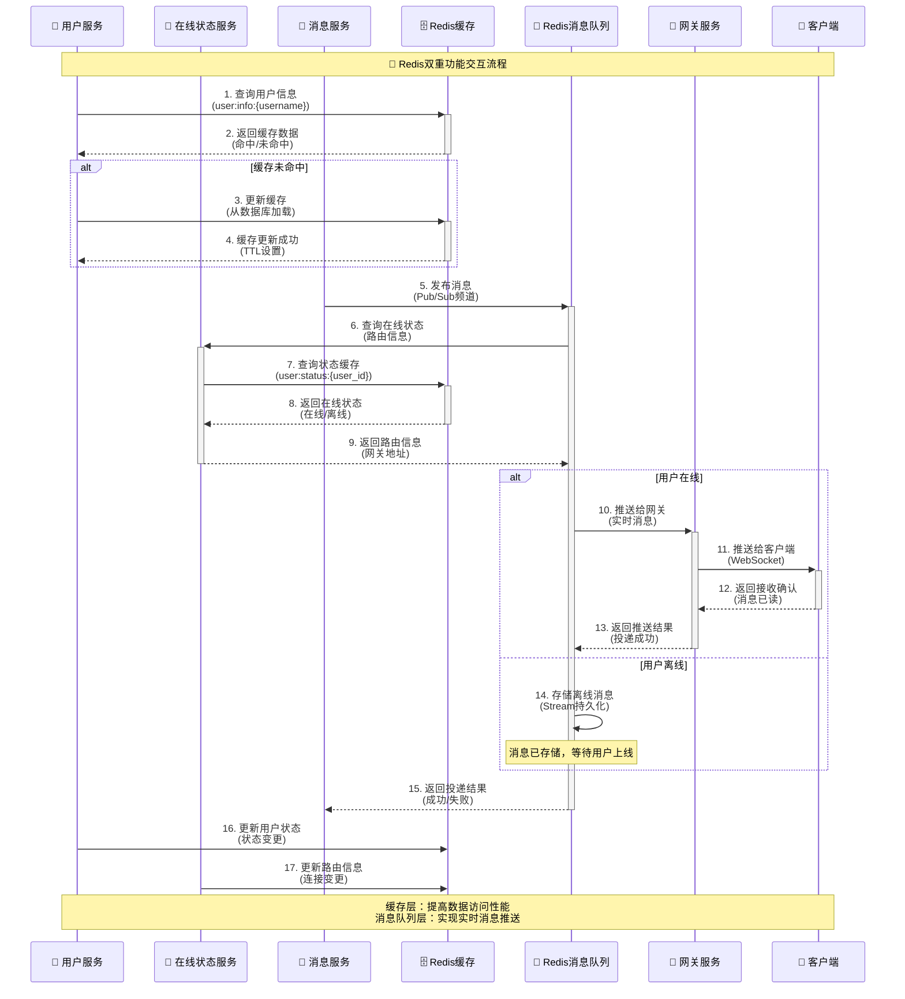
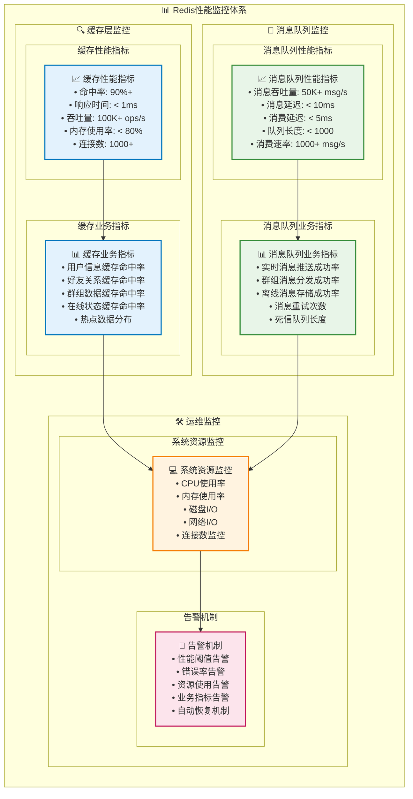

# Redis双重功能架构 - 增强版

## Redis在MPIM中的双重角色

Redis在MPIM系统中承担两个重要角色：**缓存层**和**消息队列层**。这种设计既提高了系统性能，又实现了实时消息推送功能。

## Redis双重功能架构图

### 1. 整体架构图

```mermaid
graph TB
    subgraph "🔧 业务服务层"
        direction TB
        subgraph "微服务集群"
            USER[👤 用户服务<br/>im-user:8001<br/>• 用户管理<br/>• 好友关系<br/>• 认证授权]
            PRES[📍 在线状态服务<br/>im-presence:8002<br/>• 路由管理<br/>• 状态维护<br/>• 连接映射]
            MSG[💬 消息服务<br/>im-message:8003<br/>• 消息存储<br/>• 消息转发<br/>• 离线处理]
            GROUP[👥 群组服务<br/>im-group:8004<br/>• 群组管理<br/>• 成员管理<br/>• 权限控制]
        end
    end
    
    subgraph "🚪 网关服务层"
        direction TB
        subgraph "网关集群"
            G1[🚪 网关服务-1<br/>gateway-001:8000<br/>• 连接管理<br/>• 协议解析<br/>• 消息路由]
            G2[🚪 网关服务-2<br/>gateway-002:8000<br/>• 连接管理<br/>• 协议解析<br/>• 消息路由]
            G3[🚪 网关服务-N<br/>gateway-N:8000<br/>• 连接管理<br/>• 协议解析<br/>• 消息路由]
        end
    end
    
    subgraph "🗄️ Redis集群 - 双重功能"
        direction TB
        
        subgraph "📊 缓存层功能 (Cache Layer)"
            direction TB
            subgraph "Redis缓存节点-1"
                CACHE1[🗄️ Redis缓存-1<br/>• 用户信息缓存<br/>• 好友关系缓存<br/>• 群组数据缓存<br/>• 配置信息缓存<br/>• 热点数据缓存]
            end
            
            subgraph "Redis缓存节点-2"
                CACHE2[🗄️ Redis缓存-2<br/>• 在线状态缓存<br/>• 会话状态缓存<br/>• 计数器缓存<br/>• 分布式锁<br/>• 临时数据缓存]
            end
        end
        
        subgraph "📨 消息队列层功能 (Message Queue Layer)"
            direction TB
            subgraph "Redis消息队列节点-1"
                MQ1[📨 Redis MQ-1<br/>• Pub/Sub实时推送<br/>• Stream可靠消息<br/>• 在线消息路由<br/>• 消息持久化<br/>• 消费组管理]
            end
            
            subgraph "Redis消息队列节点-2"
                MQ2[📨 Redis MQ-2<br/>• 群组消息推送<br/>• 系统通知<br/>• 状态变更通知<br/>• 消息广播<br/>• 事件驱动]
            end
        end
    end
    
    subgraph "🗃️ 数据层"
        direction TB
        DB[(🗃️ MySQL数据库<br/>• 用户数据<br/>• 消息历史<br/>• 群组信息<br/>• 关系数据)]
    end
    
    %% 缓存层连接关系
    USER -->|缓存读写<br/>数据预热| CACHE1
    PRES -->|状态缓存<br/>路由缓存| CACHE2
    MSG -->|消息缓存<br/>热点数据| CACHE1
    GROUP -->|群组缓存<br/>成员缓存| CACHE2
    
    %% 消息队列层连接关系
    PRES -->|消息投递<br/>状态通知| MQ1
    MSG -->|消息发布<br/>实时推送| MQ1
    GROUP -->|群组消息<br/>成员通知| MQ2
    
    %% 网关到消息队列
    G1 -->|订阅消息<br/>实时推送| MQ1
    G2 -->|订阅消息<br/>实时推送| MQ1
    G3 -->|订阅消息<br/>实时推送| MQ1
    
    G1 -->|群组消息<br/>系统通知| MQ2
    G2 -->|群组消息<br/>系统通知| MQ2
    G3 -->|群组消息<br/>系统通知| MQ2
    
    %% 服务到数据库
    USER -->|数据持久化<br/>事务处理| DB
    MSG -->|消息存储<br/>历史记录| DB
    GROUP -->|群组数据<br/>关系数据| DB
    
    %% 样式定义
    classDef serviceLayer fill:#e3f2fd,stroke:#0277bd,stroke-width:2px
    classDef gatewayLayer fill:#e8f5e8,stroke:#388e3c,stroke-width:2px
    classDef cacheLayer fill:#fce4ec,stroke:#c2185b,stroke-width:2px
    classDef mqLayer fill:#fff3e0,stroke:#f57c00,stroke-width:2px
    classDef dataLayer fill:#f1f8e9,stroke:#689f38,stroke-width:2px
    
    class USER,PRES,MSG,GROUP serviceLayer
    class G1,G2,G3 gatewayLayer
    class CACHE1,CACHE2 cacheLayer
    class MQ1,MQ2 mqLayer
    class DB dataLayer
```



### 2. Redis缓存层详细架构

```mermaid
graph TB
    subgraph "🗄️ Redis缓存层详细架构"
        direction TB
        
        subgraph "📊 缓存数据结构设计"
            direction TB
            subgraph "用户相关缓存"
                USER_CACHE[👤 用户信息缓存<br/>• user:info:{username}<br/>• 用户基本信息<br/>• 登录状态<br/>• 权限信息<br/>• TTL: 3600s]
                FRIEND_CACHE[👥 好友关系缓存<br/>• user:friends:{user_id}<br/>• 好友列表<br/>• 好友状态<br/>• 关系类型<br/>• TTL: 1800s]
            end
            
            subgraph "群组相关缓存"
                GROUP_CACHE[👥 群组信息缓存<br/>• group:info:{group_id}<br/>• 群组基本信息<br/>• 群组设置<br/>• 群组状态<br/>• TTL: 3600s]
                MEMBER_CACHE[👥 群组成员缓存<br/>• group:members:{group_id}<br/>• 成员列表<br/>• 成员权限<br/>• 加入时间<br/>• TTL: 1800s]
            end
            
            subgraph "状态相关缓存"
                STATUS_CACHE[📍 在线状态缓存<br/>• user:status:{user_id}<br/>• 在线状态<br/>• 最后活跃时间<br/>• 连接信息<br/>• TTL: 300s]
                ROUTE_CACHE[🛣️ 路由信息缓存<br/>• route:{user_id}<br/>• 网关地址<br/>• 连接ID<br/>• 路由状态<br/>• TTL: 60s]
            end
        end
        
        subgraph "🔄 缓存策略设计"
            direction TB
            subgraph "缓存更新策略"
                CACHE_UPDATE[🔄 缓存更新策略<br/>• Cache-Aside模式<br/>• 写时更新<br/>• 读时回填<br/>• 失效更新<br/>• 批量更新]
            end
            
            subgraph "缓存淘汰策略"
                CACHE_EVICT[🗑️ 缓存淘汰策略<br/>• LRU算法<br/>• TTL过期<br/>• 内存限制<br/>• 热点保持<br/>• 冷数据清理]
            end
            
            subgraph "缓存一致性"
                CACHE_CONSIST[⚖️ 缓存一致性<br/>• 最终一致性<br/>• 版本控制<br/>• 冲突解决<br/>• 数据同步<br/>• 一致性检查]
            end
        end
        
        subgraph "⚡ 性能优化设计"
            direction TB
            subgraph "缓存预热"
                CACHE_WARM[🔥 缓存预热<br/>• 启动时预热<br/>• 热点数据预加载<br/>• 定时刷新<br/>• 智能预测<br/>• 批量加载]
            end
            
            subgraph "缓存监控"
                CACHE_MONITOR[📊 缓存监控<br/>• 命中率监控<br/>• 响应时间监控<br/>• 内存使用监控<br/>• 性能分析<br/>• 告警机制]
            end
        end
    end
    
    %% 连接关系
    USER_CACHE --> CACHE_UPDATE
    FRIEND_CACHE --> CACHE_UPDATE
    GROUP_CACHE --> CACHE_UPDATE
    MEMBER_CACHE --> CACHE_UPDATE
    STATUS_CACHE --> CACHE_UPDATE
    ROUTE_CACHE --> CACHE_UPDATE
    
    CACHE_UPDATE --> CACHE_EVICT
    CACHE_EVICT --> CACHE_CONSIST
    CACHE_CONSIST --> CACHE_WARM
    CACHE_WARM --> CACHE_MONITOR
    
    %% 样式定义
    classDef userCache fill:#e3f2fd,stroke:#0277bd,stroke-width:2px
    classDef groupCache fill:#e8f5e8,stroke:#388e3c,stroke-width:2px
    classDef statusCache fill:#fff3e0,stroke:#f57c00,stroke-width:2px
    classDef strategy fill:#fce4ec,stroke:#c2185b,stroke-width:2px
    classDef performance fill:#f1f8e9,stroke:#689f38,stroke-width:2px
    
    class USER_CACHE,FRIEND_CACHE userCache
    class GROUP_CACHE,MEMBER_CACHE groupCache
    class STATUS_CACHE,ROUTE_CACHE statusCache
    class CACHE_UPDATE,CACHE_EVICT,CACHE_CONSIST strategy
    class CACHE_WARM,CACHE_MONITOR performance
```

### 3. Redis消息队列层详细架构

```mermaid
graph TB
    subgraph "📨 Redis消息队列层详细架构"
        direction TB
        
        subgraph "📡 消息队列设计"
            direction TB
            subgraph "Pub/Sub实时推送"
                PUBSUB[📢 Pub/Sub实时推送<br/>• 频道: gateway:{gateway_id}<br/>• 实时消息推送<br/>• 在线状态通知<br/>• 系统消息广播<br/>• 无持久化保证]
            end
            
            subgraph "Stream可靠消息"
                STREAM[📨 Stream可靠消息<br/>• 流: message_stream<br/>• 消息持久化存储<br/>• 消费组管理<br/>• 消息确认机制<br/>• 重试机制]
            end
        end
        
        subgraph "🔄 消息路由设计"
            direction TB
            subgraph "消息路由策略"
                ROUTE_STRATEGY[🛣️ 消息路由策略<br/>• 用户ID路由<br/>• 群组ID路由<br/>• 网关ID路由<br/>• 优先级路由<br/>• 负载均衡路由]
            end
            
            subgraph "消息分发机制"
                DISTRIBUTE[📤 消息分发机制<br/>• 单播消息<br/>• 多播消息<br/>• 广播消息<br/>• 组播消息<br/>• 条件分发]
            end
        end
        
        subgraph "⚡ 性能优化设计"
            direction TB
            subgraph "消息批处理"
                BATCH[📦 消息批处理<br/>• 批量发送<br/>• 批量接收<br/>• 批量确认<br/>• 批量处理<br/>• 批量存储]
            end
            
            subgraph "消息压缩"
                COMPRESS[🗜️ 消息压缩<br/>• 数据压缩<br/>• 协议优化<br/>• 重复数据消除<br/>• 增量更新<br/>• 智能压缩]
            end
        end
        
        subgraph "🛡️ 可靠性保障"
            direction TB
            subgraph "消息确认机制"
                ACK[✅ 消息确认机制<br/>• 发送确认<br/>• 接收确认<br/>• 处理确认<br/>• 超时重试<br/>• 死信队列]
            end
            
            subgraph "故障恢复"
                RECOVER[🔄 故障恢复<br/>• 自动重连<br/>• 消息重发<br/>• 状态恢复<br/>• 数据同步<br/>• 故障转移]
            end
        end
    end
    
    %% 连接关系
    PUBSUB --> ROUTE_STRATEGY
    STREAM --> ROUTE_STRATEGY
    ROUTE_STRATEGY --> DISTRIBUTE
    DISTRIBUTE --> BATCH
    BATCH --> COMPRESS
    COMPRESS --> ACK
    ACK --> RECOVER
    
    %% 样式定义
    classDef messageQueue fill:#e3f2fd,stroke:#0277bd,stroke-width:2px
    classDef routing fill:#e8f5e8,stroke:#388e3c,stroke-width:2px
    classDef performance fill:#fff3e0,stroke:#f57c00,stroke-width:2px
    classDef reliability fill:#fce4ec,stroke:#c2185b,stroke-width:2px
    
    class PUBSUB,STREAM messageQueue
    class ROUTE_STRATEGY,DISTRIBUTE routing
    class BATCH,COMPRESS performance
    class ACK,RECOVER reliability
```

### 4. Redis双重功能交互图



### 5. Redis性能监控图



## Redis双重功能特点

### 1. 缓存层特点
- **高性能**: 响应时间 < 1ms，命中率 90%+
- **多级缓存**: 支持不同TTL的缓存策略
- **智能预热**: 启动时预加载热点数据
- **一致性保证**: 最终一致性，支持版本控制

### 2. 消息队列层特点
- **实时推送**: 基于Pub/Sub的毫秒级推送
- **可靠投递**: 基于Stream的可靠消息存储
- **智能路由**: 支持多种路由策略
- **故障恢复**: 自动重连和消息重发

### 3. 双重功能协同
- **数据共享**: 缓存和消息队列共享Redis实例
- **性能优化**: 减少网络开销，提高处理效率
- **资源复用**: 统一管理Redis连接和配置
- **监控统一**: 统一的性能监控和告警

### 4. 扩展性设计
- **水平扩展**: 支持Redis集群扩展
- **垂直扩展**: 支持单机性能提升
- **模块化**: 缓存和消息队列功能独立
- **配置化**: 支持动态配置调整

## 总结

Redis在MPIM系统中通过双重功能设计，既提供了高性能的数据缓存服务，又实现了可靠的实时消息推送功能。这种设计充分利用了Redis的多数据结构特性，实现了系统性能的最大化和资源的最优利用。
