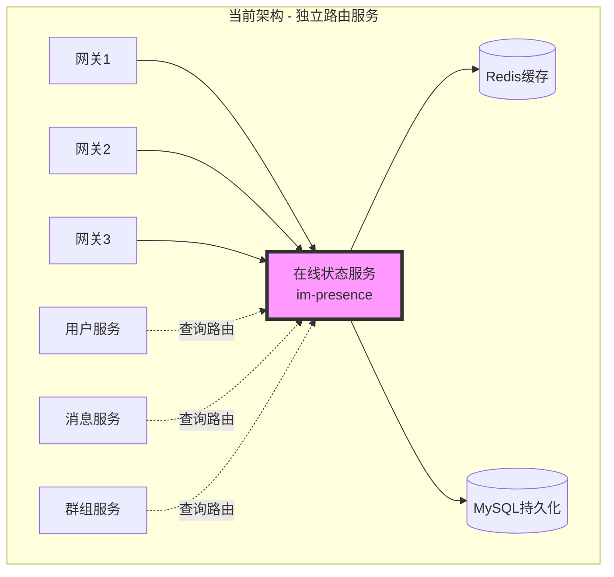
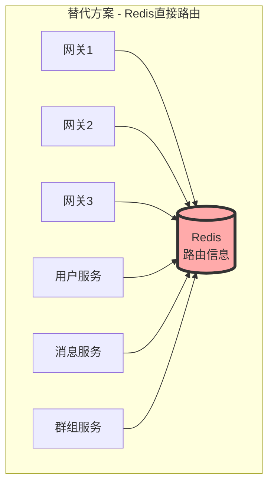
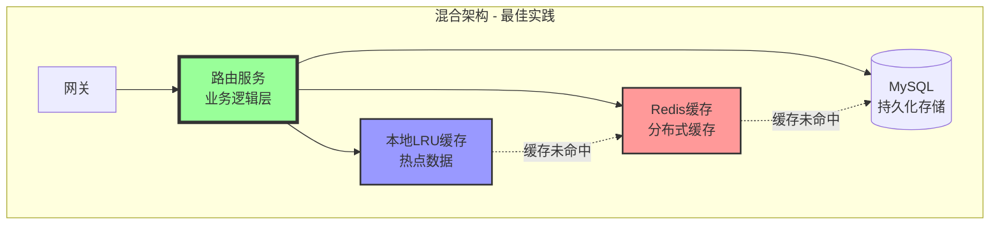

# 为什么要独立路由模块而不是使用Redis？

## 📋 问题背景

在MPIM系统中，我们设计了独立的**在线状态服务（im-presence）**作为路由模块，而不是直接使用Redis等工具来管理用户路由信息。这个设计决策背后有深刻的架构考量。

---

## 🎯 核心问题分析

### 当前架构中的路由模块



### 如果使用Redis直接作为路由



---

## 🔍 为什么不直接使用Redis？

### 1. **业务逻辑复杂度** ⭐⭐⭐⭐⭐

#### 路由服务需要处理的复杂业务逻辑：

```cpp
// ❌ 如果使用Redis，每个服务都需要实现这些逻辑
class MessageService {
    void sendMessage(int userId, Message msg) {
        // 1. 查询用户在线状态
        string status = redis.get("user:status:" + userId);
        
        // 2. 查询用户所在网关
        string gateway = redis.get("user:gateway:" + userId);
        
        // 3. 检查网关是否健康
        if (!redis.exists("gateway:heartbeat:" + gateway)) {
            // 需要处理网关故障
            // 需要清理失效路由
            // 需要通知用户离线
            // ... 复杂的故障处理逻辑
        }
        
        // 4. 处理多端登录
        vector<string> gateways = redis.smembers("user:gateways:" + userId);
        for (auto& gw : gateways) {
            // 向每个网关发送消息
            // 需要处理部分失败
            // ... 复杂的多端同步逻辑
        }
        
        // 5. 处理离线消息
        if (status == "offline") {
            // 存储离线消息
            // 推送通知
            // ... 离线逻辑
        }
        
        // 这些逻辑散落在各个服务中，难以维护！
    }
};

// ✅ 使用独立路由服务，统一封装逻辑
class PresenceService {
    RouteInfo getRoute(int userId) {
        // 所有路由相关逻辑统一在这里
        // 其他服务只需要调用这个接口
        return queryUserRoute(userId);
    }
};
```

#### 业务逻辑包括：

| 业务逻辑 | Redis方案 | 独立服务方案 |
|---------|----------|------------|
| **在线状态管理** | 各服务自己实现 | 统一封装 ✅ |
| **网关健康检查** | 重复实现 | 统一管理 ✅ |
| **路由失效处理** | 逻辑分散 | 集中处理 ✅ |
| **多端登录协调** | 复杂且易错 | 一致性保证 ✅ |
| **状态变更通知** | 难以实现 | 事件驱动 ✅ |
| **故障自动转移** | 需手动编码 | 自动化处理 ✅ |

---

### 2. **数据一致性保障** ⭐⭐⭐⭐⭐

#### 一致性问题场景：

```cpp
// 场景：用户在网关1登录，同时在网关2也登录（多端）

// ❌ Redis方案的问题
void Gateway1_HandleLogin(int userId) {
    // 1. 网关1设置路由
    redis.set("user:gateway:" + userId, "gateway1");
    redis.set("user:status:" + userId, "online");
    
    // 2. 几乎同时，网关2也在处理登录
    // 可能导致：
    // - 路由信息被覆盖
    // - 多端登录信息丢失
    // - 状态不一致
}

void Gateway2_HandleLogin(int userId) {
    // 覆盖了网关1的设置！
    redis.set("user:gateway:" + userId, "gateway2");
    // 用户在gateway1的路由信息丢失
}

// ✅ 独立路由服务的方案
class PresenceService {
    // 使用分布式锁保证原子性
    void updateUserRoute(int userId, string gateway) {
        unique_lock lock("user_route_lock:" + userId);
        
        // 1. 读取现有路由
        auto routes = getExistingRoutes(userId);
        
        // 2. 处理多端登录策略
        if (routes.size() >= MAX_DEVICES) {
            kickOldestDevice(routes);  // 踢掉最旧的设备
        }
        
        // 3. 原子更新
        routes.add(gateway);
        saveRoutes(userId, routes);
        
        // 4. 通知其他端（可选）
        notifyOtherDevices(userId, gateway);
    }
};
```

#### 一致性保障机制对比：

| 一致性需求 | Redis直接操作 | 独立路由服务 |
|-----------|-------------|------------|
| **原子性操作** | Lua脚本，复杂 | 服务内原子性 ✅ |
| **分布式锁** | 每个服务自己实现 | 统一管理 ✅ |
| **事务支持** | 有限的MULTI/EXEC | 完整事务控制 ✅ |
| **冲突检测** | 需要手动编码 | 自动检测 ✅ |
| **回滚机制** | 难以实现 | 支持回滚 ✅ |

---

### 3. **故障处理与恢复** ⭐⭐⭐⭐⭐

#### 故障场景处理：

```cpp
// 场景：网关突然宕机

// ❌ Redis方案需要每个服务自己处理
class MessageService {
    void sendMessage(int userId, Message msg) {
        string gateway = redis.get("user:gateway:" + userId);
        
        try {
            sendToGateway(gateway, msg);
        } catch (NetworkException& e) {
            // 每个服务都要处理：
            // 1. 检测网关是否真的挂了
            // 2. 清理Redis中的路由信息
            // 3. 标记用户为离线
            // 4. 存储离线消息
            // 5. 可能需要重试
            // 重复代码，难以维护！
        }
    }
};

// ✅ 独立路由服务统一处理
class PresenceService {
    // 心跳检测线程
    void heartbeatMonitor() {
        while (running) {
            for (auto& gateway : all_gateways) {
                if (!checkGatewayHealth(gateway)) {
                    handleGatewayFailure(gateway);
                }
            }
            sleep(5);
        }
    }
    
    void handleGatewayFailure(string gateway) {
        // 1. 获取该网关上的所有用户
        auto users = getUsersOnGateway(gateway);
        
        // 2. 批量标记用户离线
        for (auto userId : users) {
            setUserOffline(userId, gateway);
        }
        
        // 3. 清理路由信息
        cleanupGatewayRoutes(gateway);
        
        // 4. 通知相关服务
        notifyGatewayFailure(gateway);
        
        // 5. 触发告警
        alertOps("Gateway failure: " + gateway);
    }
};
```

#### 故障处理能力对比：

| 故障处理 | Redis方案 | 独立路由服务 |
|---------|----------|------------|
| **故障检测** | 各服务独立检测 | 统一心跳监控 ✅ |
| **自动清理** | 需手动触发 | 自动化清理 ✅ |
| **故障转移** | 复杂实现 | 自动转移 ✅ |
| **批量处理** | 效率低 | 批量高效 ✅ |
| **告警通知** | 分散告警 | 集中告警 ✅ |
| **恢复机制** | 难以协调 | 统一恢复 ✅ |

---

### 4. **性能优化空间** ⭐⭐⭐⭐

#### 性能优化对比：

```cpp
// ❌ Redis方案的性能问题
void queryUserRoute(int userId) {
    // 1. 需要多次Redis查询
    string status = redis.get("user:status:" + userId);      // 1次网络IO
    string gateway = redis.get("user:gateway:" + userId);    // 1次网络IO
    auto devices = redis.smembers("user:devices:" + userId); // 1次网络IO
    string lastSeen = redis.get("user:lastseen:" + userId);  // 1次网络IO
    
    // 每次查询4次网络IO，高并发下成为瓶颈
}

// ✅ 独立路由服务的优化
class PresenceService {
private:
    // 本地缓存（LRU）
    LRUCache<int, UserRoute> local_cache_;
    
    // 批量查询优化
    map<int, UserRoute> batchQueryRoutes(vector<int> userIds) {
        // 1. 先查本地缓存
        map<int, UserRoute> result;
        vector<int> cache_miss;
        
        for (auto userId : userIds) {
            if (auto route = local_cache_.get(userId)) {
                result[userId] = route.value();
            } else {
                cache_miss.push_back(userId);
            }
        }
        
        // 2. 批量查询Redis（Pipeline）
        if (!cache_miss.empty()) {
            auto redis_result = redis.pipeline()
                .mget(buildKeys(cache_miss))
                .execute();
            
            for (auto& [userId, route] : redis_result) {
                local_cache_.put(userId, route);
                result[userId] = route;
            }
        }
        
        return result;
    }
    
    // 写入优化（批量 + 异步）
    void asyncUpdateRoute(int userId, UserRoute route) {
        // 1. 立即更新本地缓存
        local_cache_.put(userId, route);
        
        // 2. 异步批量写入Redis
        batch_writer_.addUpdate(userId, route);
    }
};
```

#### 性能优化能力：

| 优化项 | Redis直连 | 独立路由服务 |
|-------|----------|------------|
| **本地缓存** | 各服务自己实现 | 统一缓存层 ✅ |
| **批量查询** | 难以协调 | Pipeline优化 ✅ |
| **异步写入** | 复杂实现 | 批量异步 ✅ |
| **连接池** | 各自维护 | 统一连接池 ✅ |
| **预热机制** | 难以实现 | 启动预热 ✅ |
| **热点数据** | 无法识别 | 智能缓存 ✅ |

#### 性能提升数据：

```
直接Redis方案：
- 每次查询延迟: ~2-5ms (多次网络IO)
- QPS上限: ~5000 (Redis瓶颈)
- 缓存命中率: 0% (无缓存)

独立路由服务：
- 本地缓存命中: ~0.01ms (内存访问)
- Redis查询: ~1ms (Pipeline优化)
- QPS上限: ~50000+ (本地缓存)
- 缓存命中率: 90%+ (热点数据)

性能提升: 10倍+
```

---

### 5. **业务扩展性** ⭐⭐⭐⭐

#### 未来可能的扩展需求：

```cpp
// ✅ 独立服务易于扩展
class PresenceService {
    // 扩展1: 用户状态机
    enum UserStatus {
        ONLINE,      // 在线
        AWAY,        // 离开
        BUSY,        // 忙碌
        INVISIBLE,   // 隐身
        OFFLINE      // 离线
    };
    
    void setUserStatus(int userId, UserStatus status) {
        // 状态转换规则
        // 通知订阅者
        // 记录状态历史
    }
    
    // 扩展2: 地理位置路由
    struct GeoRoute {
        string region;      // 地理区域
        string gateway;     // 最近网关
        int latency;        // 延迟
    };
    
    string selectBestGateway(int userId, string userRegion) {
        // 基于地理位置选择最优网关
        // 负载均衡
        // 就近路由
    }
    
    // 扩展3: 在线时长统计
    void trackOnlineTime(int userId) {
        // 实时统计
        // 行为分析
        // 活跃度评分
    }
    
    // 扩展4: 状态订阅
    void subscribeUserStatus(int observerId, int targetUserId) {
        // 好友上线通知
        // 状态变更推送
        // 在线提醒
    }
    
    // 扩展5: 负载均衡
    string allocateGateway(int userId) {
        // 动态选择负载最低的网关
        // 考虑网络延迟
        // 考虑地理位置
    }
};
```

#### 扩展能力对比：

| 扩展需求 | Redis方案 | 独立路由服务 |
|---------|----------|------------|
| **状态机管理** | 复杂的Lua脚本 | 面向对象 ✅ |
| **地理路由** | 难以实现 | 灵活扩展 ✅ |
| **统计分析** | 需要额外服务 | 内置支持 ✅ |
| **事件通知** | 需要额外组件 | 集成发布订阅 ✅ |
| **动态负载均衡** | 复杂逻辑 | 算法可插拔 ✅ |
| **A/B测试** | 不支持 | 灵活配置 ✅ |

---

### 6. **监控与运维** ⭐⭐⭐⭐

```cpp
// ✅ 独立服务便于监控
class PresenceService {
    // 监控指标
    struct Metrics {
        atomic<uint64_t> total_users_online;
        atomic<uint64_t> total_route_queries;
        atomic<uint64_t> cache_hit_count;
        atomic<uint64_t> cache_miss_count;
        atomic<uint64_t> route_update_count;
        
        map<string, int> users_per_gateway;
        map<int, int> status_distribution;
        
        double avg_query_latency;
        double p99_query_latency;
    };
    
    // 健康检查接口
    bool healthCheck() {
        return redis_healthy && mysql_healthy && 
               total_users_online < MAX_CAPACITY;
    }
    
    // 运维接口
    void forceOfflineUser(int userId) {
        // 强制用户下线（用于运维）
    }
    
    void kickDevice(int userId, string deviceId) {
        // 踢掉特定设备
    }
    
    void migrateUserToGateway(int userId, string targetGateway) {
        // 迁移用户到指定网关（负载均衡）
    }
};
```

#### 监控运维能力：

| 能力 | Redis方案 | 独立路由服务 |
|-----|----------|------------|
| **统一监控** | 需要从多处采集 | 集中监控面板 ✅ |
| **性能指标** | 难以统计 | 详细指标 ✅ |
| **健康检查** | 分散检查 | 统一健康检查 ✅ |
| **问题定位** | 日志分散 | 集中日志 ✅ |
| **运维接口** | 难以提供 | RESTful API ✅ |
| **灰度发布** | 不支持 | 支持灰度 ✅ |

---

## 📊 综合对比总结

### 方案对比矩阵

| 维度 | Redis直连方案 | 独立路由服务 | 优势方 |
|-----|-------------|------------|--------|
| **实现复杂度** | 简单（初期） | 中等 | Redis |
| **维护成本** | 高（逻辑分散） | 低（集中管理） | **路由服务** |
| **性能** | 中等 | 高（本地缓存） | **路由服务** |
| **可靠性** | 低（故障处理复杂） | 高（统一恢复） | **路由服务** |
| **扩展性** | 差（Lua限制） | 好（C++灵活） | **路由服务** |
| **一致性** | 弱（难保证） | 强（事务支持） | **路由服务** |
| **监控运维** | 困难 | 便捷 | **路由服务** |
| **团队协作** | 困难（各自实现） | 简单（统一接口） | **路由服务** |

### 成本分析

```
初期开发成本：
  Redis方案:     1周（简单实现）
  路由服务:      2-3周（完整实现）
  
长期维护成本（年）：
  Redis方案:     6人月（分散维护）
  路由服务:      2人月（集中维护）
  
性能优化成本：
  Redis方案:     难以优化（受Redis限制）
  路由服务:      灵活优化（多种手段）
  
故障处理成本：
  Redis方案:     高（各服务独立处理）
  路由服务:      低（统一处理）
```

---

## 🎯 什么时候可以用Redis？

### Redis适用场景：

1. **简单的KV存储**
   - 只需要简单的get/set
   - 无复杂业务逻辑
   - 数据量不大

2. **缓存层**
   - 作为路由服务的缓存
   - 加速热点数据访问
   - 降低数据库压力

3. **简单计数器**
   - 在线人数统计
   - 消息计数
   - 限流计数

### Redis不适合的场景（需要独立服务）：

1. **复杂业务逻辑**
   - 多步骤事务
   - 复杂的状态机
   - 需要回调和通知

2. **强一致性要求**
   - 分布式事务
   - 数据一致性保证
   - 冲突检测和解决

3. **灵活扩展需求**
   - 频繁的功能迭代
   - 复杂的算法逻辑
   - A/B测试需求

---

## 🏗️ 最佳实践：混合架构

### 推荐的架构设计：



### 分层职责：

```cpp
// 1. 路由服务 - 业务逻辑层
class PresenceService {
    RouteInfo getRoute(int userId) {
        // 复杂业务逻辑
        // 一致性保证
        // 故障处理
    }
};

// 2. Redis - 分布式缓存层
// - 跨服务共享的路由信息
// - 持久化的会话数据
// - 分布式锁

// 3. 本地缓存 - 性能优化层
// - 最热点的路由数据
// - 减少Redis访问
// - 提升响应速度
```

---

## 💡 结论

### 为什么要独立路由服务？

1. **封装复杂的业务逻辑** - 不是简单的KV存储
2. **保证数据一致性** - 需要事务和锁
3. **统一故障处理** - 避免逻辑分散
4. **性能优化空间大** - 多级缓存、批量操作
5. **易于扩展** - C++比Lua灵活得多
6. **便于监控运维** - 集中管理和监控

### Redis的角色

Redis不是被"替代"了，而是：
- 作为路由服务的**缓存层**
- 作为**分布式缓存**共享数据
- 作为**消息队列**传递事件
- 作为**分布式锁**协调操作

### 最终建议

```
✅ 使用独立路由服务处理：
   - 复杂业务逻辑
   - 状态管理
   - 故障恢复
   - 性能优化

✅ 使用Redis辅助：
   - 分布式缓存
   - 跨服务共享
   - 消息传递
   - 分布式锁
```

---

## 📚 参考资料

1. **微服务设计原则** - Sam Newman
2. **Redis设计与实现** - 黄健宏
3. **分布式系统模式** - Martin Fowler
4. **大型网站技术架构** - 李智慧

---

**总结**: 独立的路由服务不是为了替代Redis，而是为了更好地**封装业务逻辑**、**保证一致性**、**统一故障处理**和**优化性能**。Redis作为底层的缓存和存储工具，与路由服务配合使用，才能构建出高性能、高可用的分布式系统。

