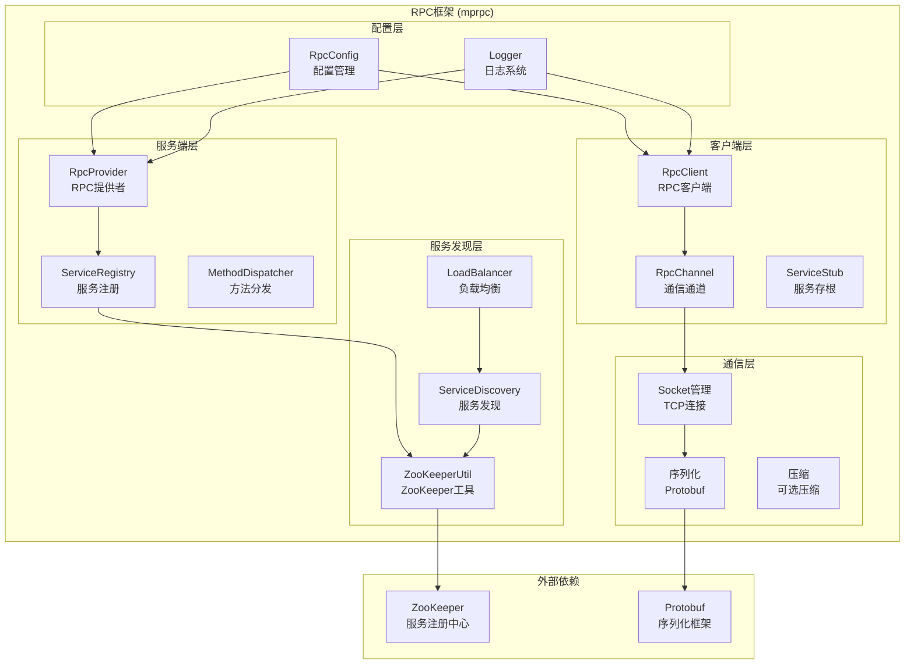
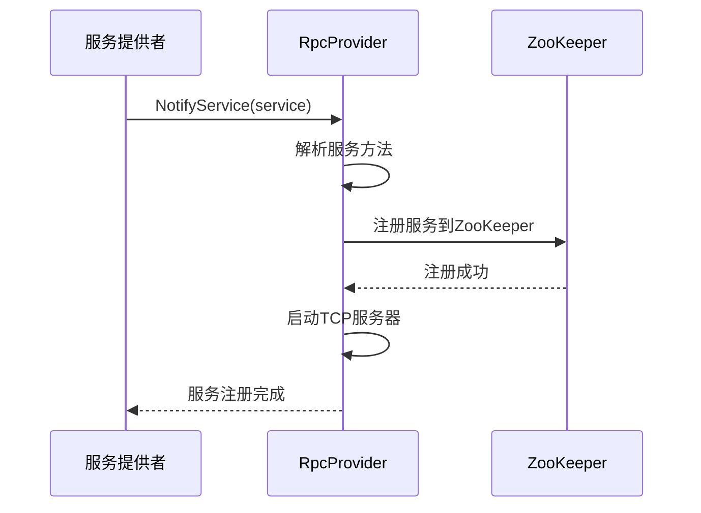

# RPC框架详细设计文档

## 概述

MPIM系统采用自研的RPC框架（mprpc），基于Protobuf实现高效的服务间通信。该框架支持服务发现、负载均衡、连接池、序列化等核心功能，为微服务架构提供可靠的通信基础。

## 框架架构图



## 核心组件设计

### 1. RPC客户端 (RpcClient)

#### 功能特性
- **服务调用**: 调用远程服务方法
- **连接管理**: 管理到服务端的连接
- **负载均衡**: 在多个服务实例间负载均衡
- **故障转移**: 自动故障转移和重试

#### 实现细节
```cpp
class RpcClient {
private:
    std::shared_ptr<ZooKeeperUtil> zk_util_;
    std::map<std::string, std::shared_ptr<RpcChannel>> channels_;
    std::shared_ptr<LoadBalancer> load_balancer_;
    
public:
    // 初始化RPC客户端
    bool Init(const std::string& config_file);
    
    // 调用远程服务
    template<typename T>
    bool CallMethod(const std::string& service_name,
                   const std::string& method_name,
                   const google::protobuf::Message& request,
                   T& response);
    
    // 异步调用
    template<typename T>
    void CallMethodAsync(const std::string& service_name,
                        const std::string& method_name,
                        const google::protobuf::Message& request,
                        std::function<void(T&)> callback);
};
```

#### 使用示例
```cpp
// 同步调用
mpim::LoginReq request;
request.set_username("alice");
request.set_password("123456");

mpim::LoginResp response;
RpcClient client;
client.Init("rpc.conf");
client.CallMethod("UserService", "Login", request, response);

// 异步调用
client.CallMethodAsync<mpim::LoginResp>("UserService", "Login", request,
    [](mpim::LoginResp& resp) {
        if (resp.result().code() == mpim::Code::Ok) {
            std::cout << "Login successful: " << resp.username() << std::endl;
        }
    });
```

### 2. RPC通道 (RpcChannel)

#### 功能特性
- **连接管理**: 管理到特定服务实例的连接
- **消息传输**: 发送和接收RPC消息
- **序列化**: 消息序列化和反序列化
- **错误处理**: 网络错误和协议错误处理

#### 实现细节
```cpp
class RpcChannel : public google::protobuf::RpcChannel {
private:
    std::string service_addr_;
    int socket_fd_;
    std::shared_ptr<SocketManager> socket_manager_;
    
public:
    // 构造函数
    RpcChannel(const std::string& service_addr);
    
    // 调用远程方法
    void CallMethod(const google::protobuf::MethodDescriptor* method,
                   google::protobuf::RpcController* controller,
                   const google::protobuf::Message* request,
                   google::protobuf::Message* response,
                   google::protobuf::Closure* done) override;
    
    // 发送消息
    bool SendMessage(const std::string& message);
    
    // 接收消息
    bool ReceiveMessage(std::string& message);
    
    // 关闭连接
    void Close();
};
```

#### 消息格式
```cpp
struct RpcHeader {
    uint32_t service_name_len;
    uint32_t method_name_len;
    uint32_t args_len;
    // 实际数据
    char service_name[service_name_len];
    char method_name[method_name_len];
    char args[args_len];
};
```

### 3. RPC提供者 (RpcProvider)

#### 功能特性
- **服务注册**: 注册服务到ZooKeeper
- **方法分发**: 分发RPC调用到具体方法
- **服务发现**: 发现其他服务
- **健康检查**: 定期健康检查

#### 实现细节
```cpp
class RpcProvider {
private:
    std::shared_ptr<ZooKeeperUtil> zk_util_;
    std::map<std::string, std::shared_ptr<google::protobuf::Service>> services_;
    std::shared_ptr<MethodDispatcher> method_dispatcher_;
    muduo::net::TcpServer server_;
    
public:
    // 注册服务
    void NotifyService(std::shared_ptr<google::protobuf::Service> service);
    
    // 启动RPC服务
    void Run();
    
    // 处理RPC请求
    void onMessage(const muduo::net::TcpConnectionPtr& conn,
                   muduo::net::Buffer* buf,
                   muduo::Timestamp time);
    
    // 服务发现
    std::string DiscoverService(const std::string& service_name);
};
```

#### 服务注册流程


### 4. 服务发现 (ServiceDiscovery)

#### 功能特性
- **服务注册**: 注册服务实例到ZooKeeper
- **服务发现**: 发现可用的服务实例
- **健康检查**: 定期检查服务健康状态
- **故障转移**: 自动故障转移

#### 实现细节
```cpp
class ServiceDiscovery {
private:
    std::shared_ptr<ZooKeeperUtil> zk_util_;
    std::map<std::string, std::vector<std::string>> service_instances_;
    std::map<std::string, std::shared_ptr<LoadBalancer>> load_balancers_;
    
public:
    // 注册服务
    bool RegisterService(const std::string& service_name,
                        const std::string& service_addr);
    
    // 发现服务
    std::vector<std::string> DiscoverService(const std::string& service_name);
    
    // 选择服务实例
    std::string SelectServiceInstance(const std::string& service_name);
    
    // 健康检查
    void HealthCheck();
    
    // 故障转移
    void Failover(const std::string& service_name, const std::string& failed_addr);
};
```

#### ZooKeeper节点结构
```
/mprpc
├── UserService
│   ├── 127.0.0.1:6000
│   ├── 127.0.0.1:6001
│   └── 127.0.0.1:6002
├── MessageService
│   ├── 127.0.0.1:6000
│   └── 127.0.0.1:6001
└── GroupService
    ├── 127.0.0.1:6000
    └── 127.0.0.1:6001
```

### 5. 负载均衡 (LoadBalancer)

#### 功能特性
- **轮询算法**: 轮询选择服务实例
- **最少连接**: 选择连接数最少的实例
- **加权轮询**: 根据权重选择实例
- **一致性哈希**: 基于一致性哈希的选择

#### 实现细节
```cpp
class LoadBalancer {
public:
    virtual ~LoadBalancer() = default;
    virtual std::string SelectInstance(const std::vector<std::string>& instances) = 0;
};

class RoundRobinBalancer : public LoadBalancer {
private:
    std::atomic<int> current_index_;
    
public:
    std::string SelectInstance(const std::vector<std::string>& instances) override {
        if (instances.empty()) return "";
        int index = current_index_.fetch_add(1) % instances.size();
        return instances[index];
    }
};

class LeastConnectionsBalancer : public LoadBalancer {
private:
    std::map<std::string, int> connection_counts_;
    std::mutex mutex_;
    
public:
    std::string SelectInstance(const std::vector<std::string>& instances) override {
        std::lock_guard<std::mutex> lock(mutex_);
        if (instances.empty()) return "";
        
        std::string selected = instances[0];
        int min_connections = connection_counts_[selected];
        
        for (const auto& instance : instances) {
            int connections = connection_counts_[instance];
            if (connections < min_connections) {
                min_connections = connections;
                selected = instance;
            }
        }
        
        connection_counts_[selected]++;
        return selected;
    }
};
```

## 序列化设计

### 1. 消息格式

#### RPC消息头
```cpp
struct RpcHeader {
    uint32_t service_name_len;    // 服务名长度
    uint32_t method_name_len;     // 方法名长度
    uint32_t args_len;            // 参数长度
    uint32_t checksum;            // 校验和
    // 实际数据
    char data[0];
};
```

#### 消息体
```cpp
struct RpcMessage {
    RpcHeader header;
    std::string service_name;
    std::string method_name;
    std::string args;  // Protobuf序列化后的数据
};
```

### 2. 序列化实现

```cpp
class RpcSerializer {
public:
    // 序列化RPC消息
    static std::string Serialize(const RpcMessage& message);
    
    // 反序列化RPC消息
    static bool Deserialize(const std::string& data, RpcMessage& message);
    
    // 计算校验和
    static uint32_t CalculateChecksum(const std::string& data);
    
    // 验证校验和
    static bool VerifyChecksum(const std::string& data, uint32_t checksum);
};
```

### 3. 压缩支持

```cpp
class RpcCompressor {
public:
    // 压缩数据
    static std::string Compress(const std::string& data);
    
    // 解压数据
    static std::string Decompress(const std::string& compressed_data);
    
    // 检查是否需要压缩
    static bool ShouldCompress(const std::string& data, size_t threshold = 1024);
};
```

## 错误处理机制

### 1. 网络错误处理

```cpp
enum class RpcErrorCode {
    SUCCESS = 0,
    CONNECTION_FAILED = 1,
    TIMEOUT = 2,
    SERIALIZATION_ERROR = 3,
    DESERIALIZATION_ERROR = 4,
    SERVICE_NOT_FOUND = 5,
    METHOD_NOT_FOUND = 6,
    INVALID_REQUEST = 7,
    INTERNAL_ERROR = 8
};

class RpcException : public std::exception {
private:
    RpcErrorCode error_code_;
    std::string error_message_;
    
public:
    RpcException(RpcErrorCode code, const std::string& message)
        : error_code_(code), error_message_(message) {}
    
    const char* what() const noexcept override {
        return error_message_.c_str();
    }
    
    RpcErrorCode GetErrorCode() const { return error_code_; }
};
```

### 2. 重试机制

```cpp
class RpcRetryPolicy {
private:
    int max_retries_;
    int retry_interval_ms_;
    std::function<bool(RpcErrorCode)> should_retry_;
    
public:
    RpcRetryPolicy(int max_retries = 3, int retry_interval_ms = 1000)
        : max_retries_(max_retries), retry_interval_ms_(retry_interval_ms) {}
    
    // 执行重试
    template<typename Func>
    auto ExecuteWithRetry(Func&& func) -> decltype(func()) {
        for (int i = 0; i < max_retries_; ++i) {
            try {
                return func();
            } catch (const RpcException& e) {
                if (i == max_retries_ - 1 || !should_retry_(e.GetErrorCode())) {
                    throw;
                }
                std::this_thread::sleep_for(std::chrono::milliseconds(retry_interval_ms_));
            }
        }
        throw RpcException(RpcErrorCode::INTERNAL_ERROR, "Max retries exceeded");
    }
};
```

### 3. 熔断器模式

```cpp
class CircuitBreaker {
private:
    enum class State { CLOSED, OPEN, HALF_OPEN };
    
    State state_;
    int failure_count_;
    int failure_threshold_;
    std::chrono::steady_clock::time_point last_failure_time_;
    std::chrono::milliseconds timeout_;
    
public:
    CircuitBreaker(int failure_threshold = 5, std::chrono::milliseconds timeout = std::chrono::seconds(60))
        : state_(State::CLOSED), failure_count_(0), failure_threshold_(failure_threshold), timeout_(timeout) {}
    
    // 检查是否可以调用
    bool CanCall() {
        if (state_ == State::CLOSED) {
            return true;
        } else if (state_ == State::OPEN) {
            if (std::chrono::steady_clock::now() - last_failure_time_ > timeout_) {
                state_ = State::HALF_OPEN;
                return true;
            }
            return false;
        } else { // HALF_OPEN
            return true;
        }
    }
    
    // 记录成功调用
    void RecordSuccess() {
        failure_count_ = 0;
        state_ = State::CLOSED;
    }
    
    // 记录失败调用
    void RecordFailure() {
        failure_count_++;
        last_failure_time_ = std::chrono::steady_clock::now();
        if (failure_count_ >= failure_threshold_) {
            state_ = State::OPEN;
        }
    }
};
```

## 性能优化策略

### 1. 连接池管理

```cpp
class ConnectionPool {
private:
    std::map<std::string, std::queue<std::shared_ptr<RpcChannel>>> pools_;
    std::mutex mutex_;
    int max_connections_per_service_;
    
public:
    ConnectionPool(int max_connections = 10) : max_connections_per_service_(max_connections) {}
    
    // 获取连接
    std::shared_ptr<RpcChannel> GetConnection(const std::string& service_addr);
    
    // 归还连接
    void ReturnConnection(const std::string& service_addr, std::shared_ptr<RpcChannel> channel);
    
    // 创建新连接
    std::shared_ptr<RpcChannel> CreateConnection(const std::string& service_addr);
};
```

### 2. 异步调用优化

```cpp
class AsyncRpcClient {
private:
    std::shared_ptr<muduo::net::EventLoop> loop_;
    std::map<uint64_t, std::function<void(google::protobuf::Message*)>> callbacks_;
    std::atomic<uint64_t> request_id_;
    
public:
    // 异步调用
    template<typename T>
    void CallMethodAsync(const std::string& service_name,
                        const std::string& method_name,
                        const google::protobuf::Message& request,
                        std::function<void(T&)> callback) {
        uint64_t req_id = request_id_.fetch_add(1);
        callbacks_[req_id] = [callback](google::protobuf::Message* msg) {
            T* response = dynamic_cast<T*>(msg);
            if (response) {
                callback(*response);
            }
        };
        
        // 发送异步请求
        SendAsyncRequest(service_name, method_name, request, req_id);
    }
};
```

### 3. 批量调用优化

```cpp
class BatchRpcClient {
private:
    std::vector<RpcRequest> pending_requests_;
    std::mutex mutex_;
    std::chrono::milliseconds batch_timeout_;
    
public:
    // 添加批量请求
    void AddRequest(const RpcRequest& request);
    
    // 执行批量请求
    void ExecuteBatch();
    
    // 设置批量超时
    void SetBatchTimeout(std::chrono::milliseconds timeout) {
        batch_timeout_ = timeout;
    }
};
```

## 监控和指标

### 1. 性能指标

```cpp
class RpcMetrics {
private:
    std::atomic<uint64_t> total_requests_;
    std::atomic<uint64_t> successful_requests_;
    std::atomic<uint64_t> failed_requests_;
    std::atomic<uint64_t> total_latency_ms_;
    std::map<std::string, std::atomic<uint64_t>> service_requests_;
    
public:
    // 记录请求
    void RecordRequest(const std::string& service_name, bool success, uint64_t latency_ms);
    
    // 获取QPS
    double GetQPS(const std::string& service_name = "");
    
    // 获取平均延迟
    double GetAverageLatency(const std::string& service_name = "");
    
    // 获取成功率
    double GetSuccessRate(const std::string& service_name = "");
    
    // 重置指标
    void Reset();
};
```

### 2. 健康检查

```cpp
class HealthChecker {
private:
    std::map<std::string, std::chrono::steady_clock::time_point> last_check_time_;
    std::map<std::string, bool> service_health_;
    std::chrono::milliseconds check_interval_;
    
public:
    // 检查服务健康状态
    bool CheckServiceHealth(const std::string& service_name);
    
    // 获取服务健康状态
    bool IsServiceHealthy(const std::string& service_name);
    
    // 设置检查间隔
    void SetCheckInterval(std::chrono::milliseconds interval) {
        check_interval_ = interval;
    }
};
```

## 配置管理

### 1. 配置文件格式

```ini
# RPC配置
[rpc]
zookeeper_hosts = localhost:2181
connection_timeout = 5000
request_timeout = 10000
max_retries = 3
retry_interval = 1000

# 负载均衡配置
[load_balancer]
algorithm = round_robin
max_connections_per_service = 10
connection_pool_size = 100

# 压缩配置
[compression]
enabled = true
threshold = 1024
algorithm = gzip

# 监控配置
[monitoring]
metrics_enabled = true
health_check_interval = 30000
```

### 2. 配置类实现

```cpp
class RpcConfig {
private:
    std::map<std::string, std::string> config_;
    
public:
    // 加载配置
    bool LoadConfig(const std::string& config_file);
    
    // 获取配置值
    std::string GetValue(const std::string& key, const std::string& default_value = "");
    
    // 获取整数值
    int GetIntValue(const std::string& key, int default_value = 0);
    
    // 获取布尔值
    bool GetBoolValue(const std::string& key, bool default_value = false);
};
```

## 部署和运维

### 1. 服务部署

```bash
# 启动ZooKeeper
./bin/zkServer.sh start

# 启动RPC服务
./bin/im-userd -c conf/im-userd.conf
./bin/im-messaged -c conf/im-messaged.conf
./bin/im-groupd -c conf/im-groupd.conf

# 启动网关
./bin/im-gateway -c conf/im-gateway.conf
```

### 2. 监控脚本

```bash
#!/bin/bash
# 监控RPC服务状态

# 检查ZooKeeper
zkCli.sh -server localhost:2181 <<< "ls /mprpc"

# 检查服务健康状态
curl http://localhost:6000/health
curl http://localhost:6000/health
curl http://localhost:6000/health

# 检查连接数
netstat -an | grep :6000 | wc -l
```

### 3. 故障排查

```bash
# 查看RPC调用日志
tail -f logs/rpc.log | grep ERROR

# 检查网络连接
netstat -an | grep ESTABLISHED

# 检查ZooKeeper连接
echo "stat" | nc localhost 2181
```

## 总结

RPC框架通过以下设计实现了高效、可靠的服务间通信：

1. **高性能**: 基于Protobuf的高效序列化
2. **高可用**: 服务发现、负载均衡、故障转移
3. **易用性**: 简单的API接口和配置
4. **可扩展**: 支持多种负载均衡算法和扩展点
5. **可监控**: 完善的监控指标和健康检查
6. **容错性**: 重试机制、熔断器、降级处理
7. **性能优化**: 连接池、异步调用、批量处理

该框架为MPIM系统的微服务架构提供了坚实的通信基础，支持大规模、高并发的服务调用需求。
