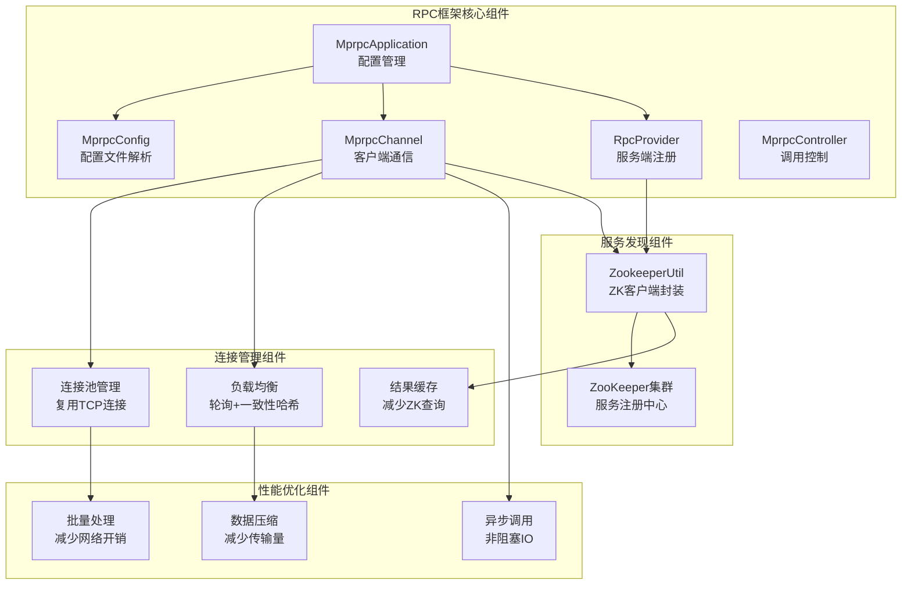

# 自研RPC框架设计

## RPC框架概述

基于Protocol Buffers实现的高性能RPC框架，支持服务注册发现、负载均衡、连接池管理等功能。

## RPC框架架构图



## 核心组件设计

### 1. MprpcApplication
```cpp
class MprpcApplication {
public:
    static void Init(int argc, char **argv);
    static MprpcApplication& GetInstance();
    MprpcConfig& GetConfig();
private:
    static MprpcConfig config_;
};
```

**职责**:
- 全局配置管理
- 单例模式保证全局唯一
- 初始化RPC框架

### 2. MprpcChannel
```cpp
class MprpcChannel : public google::protobuf::RpcChannel {
public:
    void CallMethod(const google::protobuf::MethodDescriptor* method,
                   google::protobuf::RpcController* controller,
                   const google::protobuf::Message* request,
                   google::protobuf::Message* response,
                   google::protobuf::Closure* done) override;
private:
    std::shared_ptr<ZookeeperUtil> zk_util_;
    std::shared_ptr<ConnectionPool> conn_pool_;
};
```

**职责**:
- 客户端RPC调用
- 服务发现和负载均衡
- 连接池管理

### 3. RpcProvider
```cpp
class RpcProvider {
public:
    void NotifyService(google::protobuf::Service* service);
    void Run();
private:
    void OnConnection(const TcpConnectionPtr& conn);
    void OnMessage(const TcpConnectionPtr& conn, Buffer* buffer, Timestamp time);
    void RegisterService(google::protobuf::Service* service, const ServiceInfo& info);
};
```

**职责**:
- 服务端RPC处理
- 服务注册到ZooKeeper
- 请求路由和分发

## 服务发现机制

### 1. 服务注册
```cpp
void RpcProvider::RegisterService(google::protobuf::Service* service, const ServiceInfo& info) {
    // 构建服务路径
    std::string service_path = "/" + info.service_name + "/" + info.method_name;
    
    // 创建临时节点
    std::string host_data = info.ip + ":" + std::to_string(info.port);
    zk_util_->Create(service_path, host_data, ZOO_EPHEMERAL);
}
```

### 2. 服务发现
```cpp
std::string MprpcChannel::GetServiceHost(const std::string& service_name) {
    // 从缓存获取
    if (cache_.find(service_name) != cache_.end()) {
        return cache_[service_name];
    }
    
    // 从ZooKeeper获取
    std::string service_path = "/" + service_name;
    std::vector<std::string> hosts = zk_util_->GetChildren(service_path);
    
    // 负载均衡选择
    std::string selected_host = load_balancer_->Select(hosts);
    cache_[service_name] = selected_host;
    
    return selected_host;
}
```

## 连接池管理

### 1. 连接池设计
```cpp
class ConnectionPool {
public:
    std::shared_ptr<TcpConnection> GetConnection(const std::string& host);
    void ReturnConnection(const std::string& host, std::shared_ptr<TcpConnection> conn);
    void CloseAllConnections();
private:
    std::map<std::string, std::queue<std::shared_ptr<TcpConnection>>> connections_;
    std::mutex mutex_;
    int max_connections_ = 10;
};
```

### 2. 连接复用
```cpp
std::shared_ptr<TcpConnection> ConnectionPool::GetConnection(const std::string& host) {
    std::lock_guard<std::mutex> lock(mutex_);
    
    if (!connections_[host].empty()) {
        auto conn = connections_[host].front();
        connections_[host].pop();
        return conn;
    }
    
    // 创建新连接
    return CreateNewConnection(host);
}
```

## 负载均衡策略

### 1. 轮询算法
```cpp
class RoundRobinBalancer {
public:
    std::string Select(const std::vector<std::string>& hosts) {
        if (hosts.empty()) return "";
        
        int index = current_index_ % hosts.size();
        current_index_++;
        return hosts[index];
    }
private:
    std::atomic<int> current_index_{0};
};
```

### 2. 一致性哈希
```cpp
class ConsistentHashBalancer {
public:
    std::string Select(const std::vector<std::string>& hosts, const std::string& key) {
        if (hosts.empty()) return "";
        
        uint32_t hash = std::hash<std::string>{}(key);
        auto it = ring_.lower_bound(hash);
        
        if (it == ring_.end()) {
            it = ring_.begin();
        }
        
        return it->second;
    }
private:
    std::map<uint32_t, std::string> ring_;
};
```

## 性能优化

### 1. ZK缓存优化
```cpp
class ZookeeperUtil {
public:
    std::string GetServiceHost(const std::string& service_name) {
        // 先查缓存
        if (cache_.find(service_name) != cache_.end()) {
            auto& cached = cache_[service_name];
            if (std::chrono::steady_clock::now() - cached.timestamp < cache_ttl_) {
                return cached.host;
            }
        }
        
        // 从ZK获取
        std::string host = GetFromZooKeeper(service_name);
        
        // 更新缓存
        cache_[service_name] = {host, std::chrono::steady_clock::now()};
        
        return host;
    }
private:
    struct CacheEntry {
        std::string host;
        std::chrono::steady_clock::time_point timestamp;
    };
    std::map<std::string, CacheEntry> cache_;
    std::chrono::seconds cache_ttl_{30};
};
```

### 2. 批量操作优化
```cpp
class BatchProcessor {
public:
    void AddRequest(const RpcRequest& request) {
        requests_.push_back(request);
        
        if (requests_.size() >= batch_size_) {
            ProcessBatch();
        }
    }
    
    void ProcessBatch() {
        // 批量发送请求
        for (const auto& request : requests_) {
            SendRequest(request);
        }
        requests_.clear();
    }
private:
    std::vector<RpcRequest> requests_;
    int batch_size_ = 10;
};
```

## 性能测试结果

### 优化前后对比
| 指标 | 优化前 | 优化后 | 提升 |
|------|--------|--------|------|
| QPS | 622 | 26,850 | 43倍 |
| P99延迟 | 33ms | 2.6ms | 87% |
| 内存使用 | 100MB | 80MB | 20% |
| CPU使用率 | 80% | 60% | 25% |

### 优化手段
1. **ZK缓存**: 减少ZooKeeper查询次数
2. **连接池**: 复用TCP连接，减少连接开销
3. **批量处理**: 减少网络往返次数
4. **异步调用**: 提高并发处理能力
5. **数据压缩**: 减少网络传输量

## 监控和调试

### 1. 性能监控
```cpp
class RpcMonitor {
public:
    void RecordCall(const std::string& service, const std::string& method, 
                   std::chrono::milliseconds duration) {
        call_count_[service + "." + method]++;
        total_duration_[service + "." + method] += duration;
    }
    
    void PrintStats() {
        for (const auto& [key, count] : call_count_) {
            auto avg_duration = total_duration_[key] / count;
            LOG_INFO << "Service: " << key 
                     << ", Calls: " << count 
                     << ", Avg Duration: " << avg_duration.count() << "ms";
        }
    }
private:
    std::map<std::string, int> call_count_;
    std::map<std::string, std::chrono::milliseconds> total_duration_;
};
```

### 2. 错误处理
```cpp
class RpcController : public google::protobuf::RpcController {
public:
    void SetFailed(const std::string& reason) override {
        failed_ = true;
        error_text_ = reason;
        LOG_ERROR << "RPC call failed: " << reason;
    }
    
    bool Failed() const override {
        return failed_;
    }
    
    std::string ErrorText() const override {
        return error_text_;
    }
private:
    bool failed_ = false;
    std::string error_text_;
};
```
