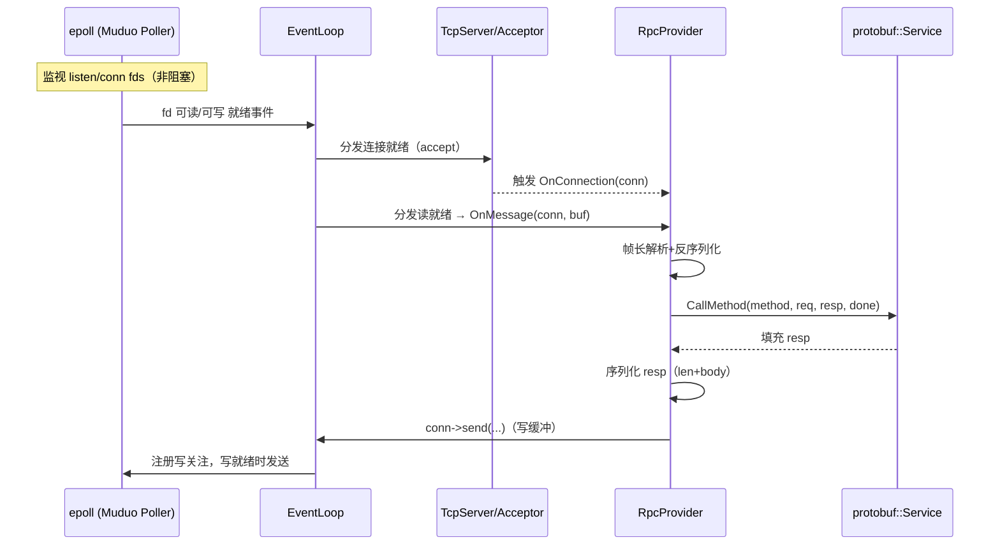

## mprpc 与 Reactor 模型的对应关系

本文基于当前仓库的真实代码，梳理自研 RPC 框架 mprpc 在服务器端（Provider）如何落地到经典的 Reactor（就绪驱动，epoll）模型。

### 结论
- mprpc 构建在 Muduo 之上，采用非阻塞 socket + epoll 的事件驱动架构；核心即 Reactor：
  - EventLoop 作为事件分发器（Initiation Dispatcher）
  - TcpServer/Acceptor 管理监听与接入
  - 回调函数 `OnConnection/OnMessage` 承担具体 Handler 逻辑

### 代码对应

事件循环与服务器启动：
```55:63:mprpc/src/rpcprovider.cc
muduo::net::TcpServer server(&m_eventLoop, address, "RpcProvider");
server.setConnectionCallback(std::bind(&RpcProvider::OnConnection, this, std::placeholders::_1));
server.setMessageCallback(std::bind(&RpcProvider::OnMessage, this, std::placeholders::_1,
                                    std::placeholders::_2, std::placeholders::_3));
// I/O 线程数
server.setThreadNum(4);
```

进入事件循环：
```96:99:mprpc/src/rpcprovider.cc
server.start();
m_eventLoop.loop();
```

连接事件处理：
```101:113:mprpc/src/rpcprovider.cc
void RpcProvider::OnConnection(const muduo::net::TcpConnectionPtr &conn)
{
  if (!conn->connected()) { conn->shutdown(); }
  else { conn->setTcpNoDelay(true); }
}
```

读事件处理（读取 → 帧解析 → 方法派发 → 回包）：
```124:136:mprpc/src/rpcprovider.cc
void RpcProvider::OnMessage(const muduo::net::TcpConnectionPtr &conn,
                            muduo::net::Buffer *buffer, muduo::Timestamp)
{
  while (true) {
    if (buffer->readableBytes() < 4) break;
    uint32_t header_size = 0;
    ::memcpy(&header_size, buffer->peek(), 4);
    if (buffer->readableBytes() < (size_t)(4 + header_size)) break;
    ...
```

调用业务方法并准备响应：
```154:172:mprpc/src/rpcprovider.cc
auto it = m_serviceMap.find(service_name);
...
google::protobuf::Service *service = it->second.m_service;
const google::protobuf::MethodDescriptor *method = mit->second;
google::protobuf::Message *request = service->GetRequestPrototype(method).New();
...
service->CallMethod(method, nullptr, request, response, done);
```

发送响应（长度前缀 + body）：
```207:219:mprpc/src/rpcprovider.cc
std::string response_str;
if(response && response->SerializeToString(&response_str)){
  uint32_t len = (uint32_t)response_str.size();
  char lenbuf[4]; ::memcpy(lenbuf, &len, 4);
  conn->send(std::string(lenbuf, 4));
  conn->send(response_str);
}
```

### 概念对齐表
- Reactor 的 Initiation Dispatcher → `muduo::net::EventLoop`
- Synchronous Demultiplexer（epoll） → Muduo `Poller`（库内封装）
- Acceptor（监听/接入） → `muduo::net::TcpServer` 内部的 `Acceptor`
- Event Handler 注册 → `setConnectionCallback` / `setMessageCallback`
- Concrete Handler → `RpcProvider::OnConnection` / `RpcProvider::OnMessage`

### 事件流时序图（Provider 侧）


### 与 Proactor（io_uring）差异
- Reactor 返回“就绪”，应用在回调中进行 `read/parse/send`；
- Proactor（如 io_uring）返回“完成”，应用直接拿结果。项目当前未使用 io_uring。

### 进一步扩展（可选）
- 写回压测与背压：为 `conn->send` 配置高水位回调，避免慢客户端拖垮内存。
- 多路复用参数：根据延迟/吞吐调整 `server.setThreadNum(N)` 与 I/O 线程绑核策略。
- 零拷贝：大报文链路可考虑 `sendfile/MSG_ZEROCOPY`（当前项目未启用）。


