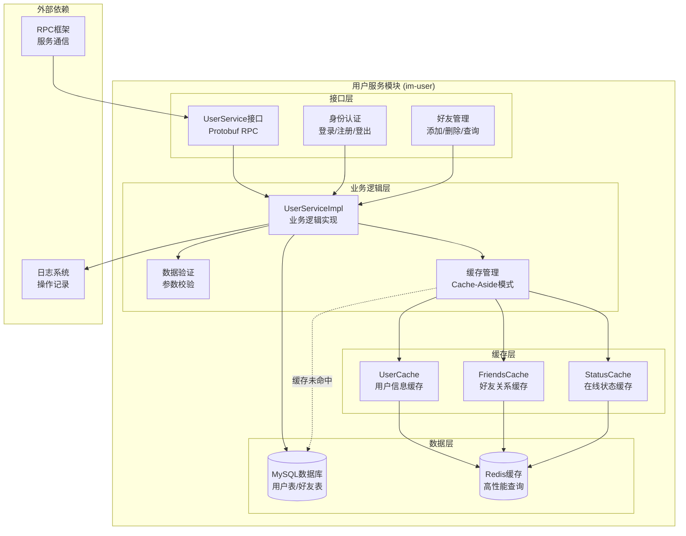
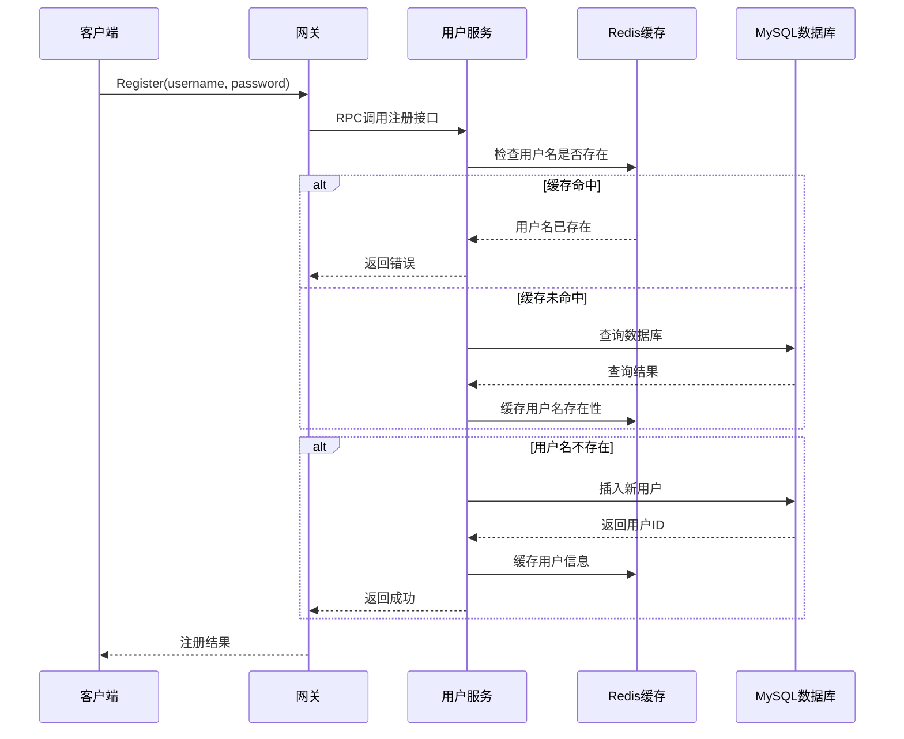
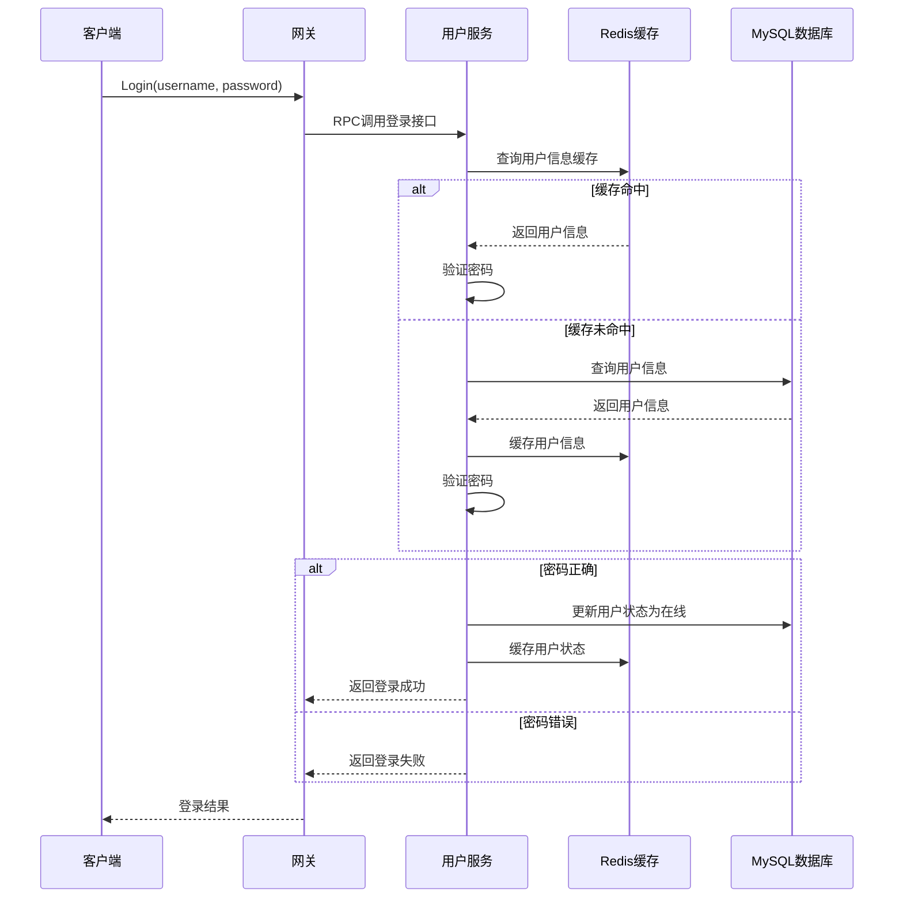
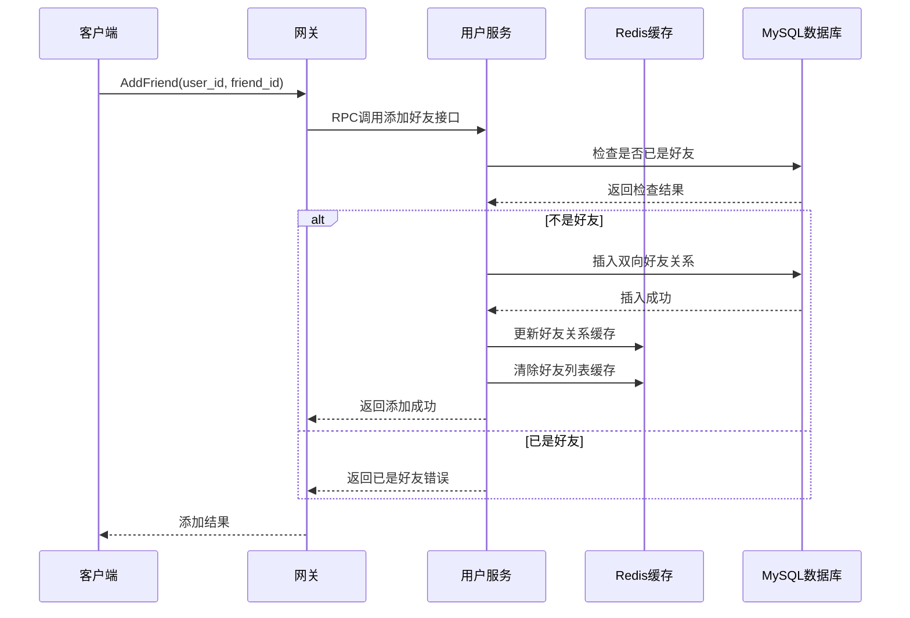

# 用户服务模块架构设计

## 概述

用户服务模块（im-user）是MPIM系统的核心模块之一，负责用户生命周期管理、身份认证、好友关系管理等核心功能。该模块采用Redis缓存优化，显著提升查询性能。

## 模块架构图



## 核心功能模块

### 1. 用户认证模块

#### 功能特性
- **用户注册**: 用户名唯一性检查、密码加密存储
- **用户登录**: 身份验证、会话管理、状态更新
- **用户登出**: 状态清理、会话失效
- **密码管理**: 安全存储、验证机制

#### 实现细节
```cpp
class UserServiceImpl {
public:
    // 用户注册
    void Register(google::protobuf::RpcController* controller,
                  const mpim::RegisterReq* request,
                  mpim::RegisterResp* response,
                  google::protobuf::Closure* done) override;
    
    // 用户登录
    void Login(google::protobuf::RpcController* controller,
               const mpim::LoginReq* request,
               mpim::LoginResp* response,
               google::protobuf::Closure* done) override;
    
    // 用户登出
    void Logout(google::protobuf::RpcController* controller,
                const mpim::LogoutReq* request,
                const mpim::LogoutResp* response,
                google::protobuf::Closure* done) override;
};
```

#### 缓存策略
- **用户名存在性**: 缓存5分钟，避免重复注册查询
- **用户信息**: 缓存1小时，减少登录时数据库查询
- **用户状态**: 缓存1小时，快速更新在线/离线状态

### 2. 好友关系管理模块

#### 功能特性
- **添加好友**: 双向好友关系建立
- **删除好友**: 双向好友关系解除
- **查询好友**: 获取好友列表
- **好友验证**: 关系存在性检查

#### 实现细节
```cpp
// 添加好友
void AddFriend(google::protobuf::RpcController* controller,
               const mpim::AddFriendReq* request,
               mpim::AddFriendResp* response,
               google::protobuf::Closure* done) override;

// 获取好友列表
void GetFriends(google::protobuf::RpcController* controller,
                const mpim::GetFriendsReq* request,
                mpim::GetFriendsResp* response,
                google::protobuf::Closure* done) override;

// 删除好友
void RemoveFriend(google::protobuf::RpcController* controller,
                  const mpim::RemoveFriendReq* request,
                  mpim::RemoveFriendResp* response,
                  google::protobuf::Closure* done) override;
```

#### 缓存策略
- **好友关系**: 使用Redis Set存储，支持实时增删
- **好友列表**: 缓存30分钟，减少频繁查询
- **关系验证**: 优先从缓存查询，提升响应速度

### 3. 缓存管理模块

#### UserCache类设计
```cpp
class UserCache {
private:
    mpim::redis::CacheManager cache_manager_;
    std::atomic<bool> connected_;
    
public:
    // 用户信息缓存
    std::string GetUserInfo(const std::string& username);
    bool SetUserInfo(const std::string& username, const std::string& data, int ttl);
    bool DelUserInfo(const std::string& username);
    
    // 好友关系缓存
    std::string GetFriends(int64_t user_id);
    bool SetFriends(int64_t user_id, const std::string& friends_data, int ttl);
    bool AddFriend(int64_t user_id, int64_t friend_id);
    bool RemoveFriend(int64_t user_id, int64_t friend_id);
    bool DelFriends(int64_t user_id);
    
    // 用户状态缓存
    std::string GetUserStatus(int64_t user_id);
    bool SetUserStatus(int64_t user_id, const std::string& status, int ttl);
    bool DelUserStatus(int64_t user_id);
    
    // 用户名存在性缓存
    bool IsUsernameExists(const std::string& username);
    bool SetUsernameExists(const std::string& username, bool exists, int ttl);
};
```

#### 缓存键设计
```
user:info:{username}          # 用户基本信息
user:friends:{user_id}        # 好友关系集合
user:status:{user_id}         # 用户在线状态
user:exists:{username}        # 用户名存在性
```

## 数据模型设计

### 数据库表结构

#### 用户表 (user)
```sql
CREATE TABLE user (
    id BIGINT PRIMARY KEY AUTO_INCREMENT,
    name VARCHAR(50) NOT NULL UNIQUE,
    password VARCHAR(100) NOT NULL,
    state ENUM('online', 'offline') DEFAULT 'offline',
    created_at TIMESTAMP DEFAULT CURRENT_TIMESTAMP,
    updated_at TIMESTAMP DEFAULT CURRENT_TIMESTAMP ON UPDATE CURRENT_TIMESTAMP
);
```

#### 好友关系表 (friend)
```sql
CREATE TABLE friend (
    id BIGINT PRIMARY KEY AUTO_INCREMENT,
    userid BIGINT NOT NULL,
    friendid BIGINT NOT NULL,
    created_at TIMESTAMP DEFAULT CURRENT_TIMESTAMP,
    UNIQUE KEY uk_user_friend (userid, friendid),
    FOREIGN KEY (userid) REFERENCES user(id),
    FOREIGN KEY (friendid) REFERENCES user(id)
);
```

### Protobuf消息定义

#### 用户注册
```protobuf
message RegisterReq {
    string username = 1;
    string password = 2;
}

message RegisterResp {
    Result result = 1;
    int64 user_id = 2;
}
```

#### 用户登录
```protobuf
message LoginReq {
    string username = 1;
    string password = 2;
}

message LoginResp {
    Result result = 1;
    int64 user_id = 2;
    string username = 3;
}
```

#### 好友管理
```protobuf
message AddFriendReq {
    int64 user_id = 1;
    int64 friend_id = 2;
}

message GetFriendsReq {
    int64 user_id = 1;
}

message GetFriendsResp {
    Result result = 1;
    repeated int64 friend_ids = 2;
}
```

## 业务流程设计

### 用户注册流程



### 用户登录流程



### 好友管理流程



## 性能优化策略

### 1. 缓存优化
- **多级缓存**: 内存缓存 + Redis缓存
- **缓存预热**: 服务启动时预加载热点数据
- **缓存更新**: 写操作时同步更新缓存
- **TTL管理**: 合理设置过期时间，平衡一致性和性能

### 2. 数据库优化
- **索引优化**: 为查询字段建立合适索引
- **连接池**: 使用数据库连接池减少连接开销
- **查询优化**: 避免N+1查询，使用批量操作
- **分页查询**: 大数据量查询使用分页

### 3. 并发优化
- **无锁设计**: 使用原子操作和CAS
- **读写分离**: 读操作优先使用缓存
- **异步处理**: 非关键操作异步执行
- **限流控制**: 防止恶意请求

## 错误处理机制

### 1. 缓存故障处理
```cpp
// 缓存降级处理
if (!user_cache_.IsConnected()) {
    LOG_WARN << "Redis connection failed, falling back to database";
    return queryFromDatabase();
}
```

### 2. 数据库故障处理
```cpp
// 数据库连接重试
if (!db_->update(sql)) {
    LOG_ERROR << "Database update failed, retrying...";
    // 重试逻辑
    if (retryCount < MAX_RETRY) {
        return retryOperation();
    }
    return false;
}
```

### 3. 参数验证
```cpp
// 输入参数验证
if (request->username().empty() || request->password().empty()) {
    response->mutable_result()->set_code(mpim::Code::INVALID);
    response->mutable_result()->set_msg("Invalid parameters");
    return;
}
```

## 监控指标

### 1. 性能指标
- **QPS**: 每秒请求数
- **响应时间**: 平均/P99延迟
- **缓存命中率**: 缓存查询命中比例
- **错误率**: 请求失败比例

### 2. 业务指标
- **注册成功率**: 用户注册成功比例
- **登录成功率**: 用户登录成功比例
- **好友操作成功率**: 好友管理操作成功比例
- **在线用户数**: 当前在线用户数量

### 3. 系统指标
- **内存使用**: Redis内存使用情况
- **数据库连接数**: 当前数据库连接数
- **CPU使用率**: 服务CPU使用情况
- **网络IO**: 网络输入输出量

## 配置参数

### 服务配置
```ini
# 用户服务配置
[user_service]
port = 6000
thread_count = 4
max_connections = 1000

# 数据库配置
[database]
host = localhost
port = 3306
database = mpim_db
username = mpim_user
password = mpim_password
max_connections = 20

# Redis配置
[redis]
host = 127.0.0.1
port = 6379
timeout = 5000
max_connections = 100
```

### 缓存配置
```cpp
// 缓存TTL配置
const int USER_INFO_TTL = 3600;        // 用户信息1小时
const int FRIENDS_TTL = 1800;          // 好友关系30分钟
const int USER_STATUS_TTL = 3600;      // 用户状态1小时
const int USERNAME_EXISTS_TTL = 300;   // 用户名存在性5分钟
```

## 部署说明

### 1. 编译构建
```bash
# 编译用户服务
cd im-user
mkdir build && cd build
cmake ..
make -j$(nproc)
```

### 2. 服务启动
```bash
# 启动用户服务
./bin/im-userd -c ../conf/im-userd.conf
```

### 3. 健康检查
```bash
# 检查服务状态
curl http://localhost:6000/health

# 检查Redis连接
redis-cli ping
```

## 总结

用户服务模块通过以下设计实现了高性能、高可用的用户管理功能：

1. **分层架构**: 清晰的接口层、业务层、缓存层、数据层分离
2. **缓存优化**: Redis缓存显著提升查询性能，减少数据库压力
3. **数据一致性**: Cache-Aside模式保证数据一致性
4. **错误处理**: 完善的降级和重试机制
5. **监控完善**: 全面的性能、业务、系统监控指标

该模块为整个IM系统提供了稳定可靠的用户管理基础服务。
