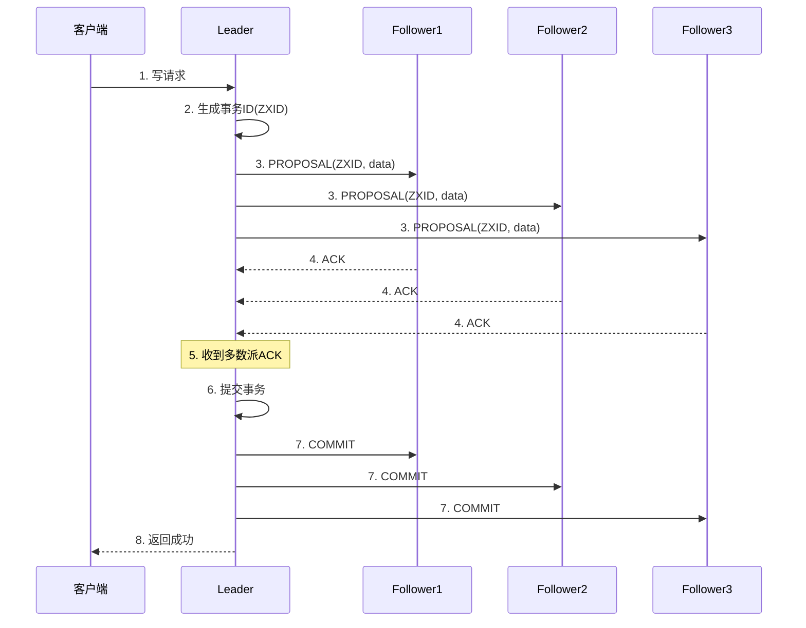
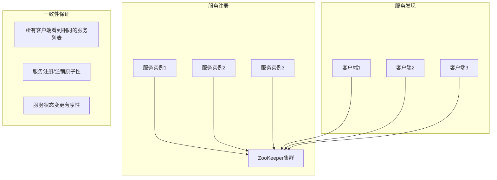

# ZooKeeper一致性保证机制

## 概述

ZooKeeper通过其内部的一致性算法来保证数据一致性，为MPIM项目提供可靠的服务注册发现和分布式协调功能。

## ZAB协议 (ZooKeeper Atomic Broadcast)

### 1. ZAB协议特点

ZooKeeper使用ZAB协议来保证数据一致性，这是ZooKeeper的核心一致性算法。

#### 核心特性：
- **原子性**: 要么所有节点都收到更新，要么都不收到
- **顺序性**: 所有更新按顺序执行
- **单一主节点**: 只有一个Leader处理写请求
- **多数派原则**: 需要大多数节点确认才能提交

### 2. ZAB协议工作流程



### 3. ZAB协议阶段

#### 3.1 发现阶段 (Discovery)
- **Leader选举**: 选举出新的Leader
- **数据同步**: 同步Leader和Follower的数据
- **状态确认**: 确认所有节点状态一致

#### 3.2 同步阶段 (Synchronization)
- **事务广播**: Leader广播事务到所有Follower
- **ACK确认**: 等待大多数Follower确认
- **事务提交**: 提交事务并通知所有节点

#### 3.3 广播阶段 (Broadcast)
- **正常服务**: 处理客户端请求
- **事务处理**: 按照ZAB协议处理事务
- **状态维护**: 维护集群状态一致性

## 一致性保证层次

### 1. 数据一致性

#### 1.1 顺序一致性
```cpp
// ZooKeeper保证所有更新按全局顺序执行
// 每个事务都有唯一的ZXID (ZooKeeper Transaction ID)
struct ZXID {
    uint64_t epoch;    // 选举轮次
    uint64_t counter;  // 事务计数器
};
```

#### 1.2 原子性
```cpp
// 更新要么全部成功要么全部失败
int ZooKeeper::create(const char* path, const char* data, 
                     int datalen, const struct ACL_vector* acl,
                     int flags, char* path_buffer, int path_buffer_len) {
    // 1. 客户端发送写请求到Leader
    // 2. Leader生成全局唯一的事务ID (ZXID)
    // 3. Leader将写请求广播给所有Follower
    // 4. 等待大多数Follower确认
    // 5. 提交事务并通知所有节点
    // 6. 返回结果给客户端
}
```

#### 1.3 单一系统映像
```cpp
// 所有节点看到相同的数据视图
int ZooKeeper::get(const char* path, int watch, char* buffer, 
                   int* buffer_len, struct Stat* stat) {
    // 1. 客户端可以从任意节点读取
    // 2. 每个节点都维护完整的数据副本
    // 3. 读操作总是返回最新的已提交数据
    // 4. 保证读操作的单调性
}
```

### 2. 会话一致性

#### 2.1 会话超时
```cpp
// 客户端会话超时后自动清理临时节点
void ZkClient::Start() {
    // 30秒会话超时
    m_zhandle = zookeeper_init(connstr.c_str(), global_watcher, 30000, nullptr, &prom, 0);
}
```

#### 2.2 会话恢复
```cpp
// 客户端重连后恢复会话状态
void global_watcher(zhandle_t *zh, int type, int state, const char *path, void *watcherCtx) {
    if (type == ZOO_SESSION_EVENT) {
        if (state == ZOO_CONNECTED_STATE) {
            // 会话恢复，重新注册服务
            auto* prom = static_cast<std::promise<void>*>(watcherCtx);
            if(prom) {
                prom->set_value();
            }
        }
    }
}
```

#### 2.3 心跳机制
```cpp
// 定期发送心跳维持会话
// ZooKeeper客户端每1/3超时时间发送一次ping消息
// 30秒超时 -> 每10秒发送心跳
```

### 3. 配置一致性

#### 3.1 配置同步
```cpp
// 所有节点配置保持一致
// 配置变更通过ZAB协议原子性传播
```

#### 3.2 配置更新
```cpp
// 配置变更原子性传播
// 所有节点同时应用配置变更
```

#### 3.3 配置持久化
```cpp
// 配置信息持久化存储
// 节点重启后恢复配置状态
```

## 在MPIM项目中的一致性保证

### 1. 服务注册一致性

#### 1.1 服务注册原子性
```cpp
// 在RpcProvider::NotifyService中
void RpcProvider::NotifyService(google::protobuf::Service *service) {
    ZkClient zkCli;
    zkCli.Start();
    
    // 原子性注册服务
    for (auto &sp : m_serviceMap) {
        // 创建服务路径（永久节点）
        std::string service_path = "/" + sp.first;
        zkCli.Create(service_path.c_str(), nullptr, 0);
        
        // 注册每个方法（临时节点）
        for (auto &mp : sp.second.m_methodMap) {
            std::string method_path = service_path + "/" + mp.first;
            char method_path_data[128] = {0};
            sprintf(method_path_data, "%s:%d", ip.c_str(), port);
            zkCli.Create(method_path.c_str(), method_path_data, 
                        strlen(method_path_data), ZOO_EPHEMERAL);
        }
    }
}
```

**一致性保证**：
- **原子性**: 服务注册要么成功要么失败
- **顺序性**: 服务注册按顺序执行
- **持久性**: 注册信息持久化存储

#### 1.2 服务发现一致性
```cpp
// 在MprpcChannel::CallMethod中
std::string method_path = "/" + service_name + "/" + method_name;
std::string host_data = s_zk.GetData(method_path.c_str());
if (host_data == "") {
    controller->SetFailed(method_path + " is not exist!");
    return;
}
```

**一致性保证**：
- **强一致性**: 所有客户端看到相同的服务列表
- **实时性**: 服务状态变化实时通知
- **可靠性**: 服务故障自动剔除

### 2. 分布式协调一致性

#### 2.1 服务状态同步


#### 2.2 配置管理一致性
- **配置中心**: 统一管理所有服务配置
- **配置同步**: 配置变更实时同步到所有节点
- **配置版本**: 通过版本号保证配置一致性

## 一致性保证的局限性

### 1. 性能限制

#### 1.1 写性能
- **单点写入**: 所有写操作必须通过Leader
- **网络延迟**: 需要等待大多数节点确认
- **吞吐量**: 写吞吐量受限于网络带宽

#### 1.2 读性能
- **本地读取**: 读操作可以从任意节点执行
- **数据同步**: 需要保证数据同步延迟
- **缓存策略**: 合理使用缓存提高性能

### 2. 可用性限制

#### 2.1 Leader故障
- **服务不可写**: Leader故障时服务不可写
- **自动选举**: 自动选举新的Leader
- **恢复时间**: 选举过程需要时间

#### 2.2 网络分区
- **分区容错**: 网络分区时可能服务不可用
- **多数派原则**: 需要大多数节点可用
- **脑裂问题**: 需要防止脑裂问题

### 3. 一致性权衡

#### 3.1 CAP定理
- **一致性 (Consistency)**: 强一致性保证
- **可用性 (Availability)**: 高可用性设计
- **分区容错 (Partition Tolerance)**: 网络分区容错

#### 3.2 一致性级别
- **强一致性**: 所有节点数据完全一致
- **最终一致性**: 最终所有节点数据一致
- **弱一致性**: 允许短暂的数据不一致

## 监控和诊断

### 1. 一致性监控

#### 1.1 数据一致性检查
```cpp
// 检查所有节点数据是否一致
bool checkDataConsistency() {
    // 比较所有节点的数据
    // 检查ZXID是否一致
    // 验证数据完整性
}
```

#### 1.2 性能监控
```cpp
// 监控ZAB协议性能
struct ZABMetrics {
    uint64_t proposal_count;    // 提案数量
    uint64_t commit_count;      // 提交数量
    uint64_t ack_delay;         // ACK延迟
    uint64_t commit_delay;      // 提交延迟
};
```

### 2. 故障诊断

#### 2.1 一致性故障
- **数据不一致**: 检查ZAB协议执行
- **选举问题**: 检查Leader选举过程
- **网络问题**: 检查网络连接状态

#### 2.2 性能问题
- **延迟过高**: 检查网络延迟和节点性能
- **吞吐量低**: 检查Leader性能和网络带宽
- **内存使用**: 检查内存使用情况

## 最佳实践

### 1. 一致性设计

#### 1.1 数据模型设计
- **层次化结构**: 使用清晰的层次结构
- **原子操作**: 设计原子性操作
- **版本控制**: 使用版本号控制并发

#### 1.2 操作设计
- **幂等性**: 设计幂等性操作
- **事务性**: 使用事务保证原子性
- **回滚机制**: 实现操作回滚机制

### 2. 性能优化

#### 2.1 读写分离
- **读操作**: 从任意节点读取
- **写操作**: 通过Leader写入
- **缓存策略**: 合理使用缓存

#### 2.2 批量操作
- **批量写入**: 批量处理写操作
- **批量读取**: 批量处理读操作
- **事务合并**: 合并相关事务

### 3. 故障处理

#### 3.1 故障检测
- **健康检查**: 定期检查节点健康状态
- **监控告警**: 设置监控告警机制
- **自动恢复**: 实现自动故障恢复

#### 3.2 故障恢复
- **数据恢复**: 从备份恢复数据
- **服务恢复**: 重新启动服务
- **状态同步**: 同步节点状态

## 总结

ZooKeeper通过ZAB协议提供了一致性保证：

1. **ZAB协议**: 原子广播协议，保证更新原子性和顺序性
2. **多数派原则**: 需要大多数节点确认才能提交
3. **单一Leader**: 只有一个Leader处理写请求
4. **强一致性**: 所有节点看到相同的数据视图

在MPIM项目中，ZooKeeper的一致性保证确保了：
- **服务注册发现**: 可靠的服务注册发现机制
- **配置管理**: 一致的配置信息管理
- **分布式协调**: 可靠的分布式协调功能

ZooKeeper的一致性保证是MPIM系统稳定运行的重要基础，确保了服务发现和配置管理的可靠性。
