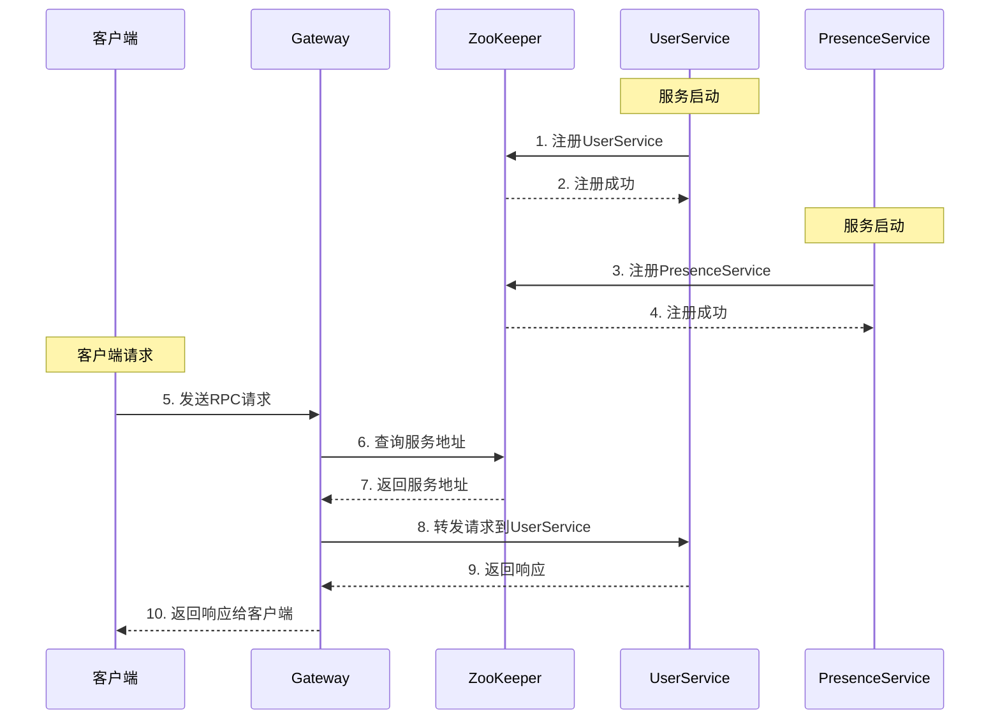

# ZooKeeper在MPIM项目中的角色分析

## 概述

ZooKeeper在MPIM项目中承担着**服务注册中心**和**分布式协调**的核心角色，为微服务架构提供可靠的服务治理能力。

## 核心角色

### 1. 服务注册中心 (Service Registry)

ZooKeeper作为服务注册中心，管理所有微服务的注册信息。

#### 1.1 服务注册
```cpp
// 服务启动时注册到ZooKeeper
void RpcProvider::NotifyService(google::protobuf::Service *service) {
    ZkClient zkCli;
    zkCli.Start();
    
    // 注册服务类型（永久节点）
    std::string service_path = "/" + sp.first;  // 例如: /UserServiceRpc
    zkCli.Create(service_path.c_str(), nullptr, 0);
    
    // 注册服务实例（临时节点）
    for (auto &mp : sp.second.m_methodMap) {
        std::string method_path = service_path + "/" + mp.first;
        char method_path_data[128] = {0};
        sprintf(method_path_data, "%s:%d", ip.c_str(), port);
        zkCli.Create(method_path.c_str(), method_path_data, 
                    strlen(method_path_data), ZOO_EPHEMERAL);
    }
}
```

#### 1.2 服务发现
```cpp
// 客户端从ZooKeeper发现服务
void MprpcChannel::CallMethod(const google::protobuf::MethodDescriptor *method,
                              google::protobuf::RpcController *controller,
                              const google::protobuf::Message *request,
                              google::protobuf::Message *response,
                              google::protobuf::Closure *done) {
    // 构建服务路径
    std::string method_path = "/" + service_name + "/" + method_name;
    
    // 从ZooKeeper获取服务地址
    std::string host_data = s_zk.GetData(method_path.c_str());
    if (host_data == "") {
        controller->SetFailed(method_path + " is not exist!");
        return;
    }
    
    // 解析服务地址
    int idx = host_data.find(":");
    std::string ip = host_data.substr(0, idx);
    uint16_t port = atoi(host_data.substr(idx + 1).c_str());
    
    // 建立连接并发送请求
    // ...
}
```

### 2. 配置中心 (Configuration Center)

ZooKeeper存储和管理系统配置信息。

#### 2.1 配置存储
```cpp
// 存储服务配置
struct ServiceConfig {
    std::string service_name;
    std::string ip;
    int port;
    std::string version;
    std::map<std::string, std::string> properties;
};

// 配置路径结构
// /config/services/UserServiceRpc -> {"ip":"127.0.0.1","port":6000,"version":"1.0.0"}
// /config/services/GroupServiceRpc -> {"ip":"127.0.0.1","port":6000,"version":"1.0.0"}
```

#### 2.2 配置同步
```cpp
// 配置变更通知
void config_watcher(zhandle_t *zh, int type, int state, const char *path, void *watcherCtx) {
    if (type == ZOO_CHANGED_EVENT) {
        // 配置变更，重新加载配置
        reloadConfig(path);
    }
}
```

### 3. 分布式协调 (Distributed Coordination)

ZooKeeper提供分布式协调功能。

#### 3.1 服务状态管理
```cpp
// 服务状态监控
class ServiceMonitor {
public:
    void startMonitoring() {
        // 监控服务节点状态
        zoo_awget_children(m_zhandle, "/services", service_watcher, this, 
                          service_children_completion, this);
    }
    
private:
    static void service_watcher(zhandle_t *zh, int type, int state, 
                               const char *path, void *watcherCtx) {
        if (type == ZOO_CHILD_EVENT) {
            // 服务列表变更
            updateServiceList();
        }
    }
};
```

#### 3.2 分布式锁
```cpp
// 分布式锁实现
class DistributedLock {
public:
    bool acquireLock(const std::string& lock_path) {
        // 创建临时顺序节点
        std::string lock_node = lock_path + "/lock-";
        char path_buffer[256];
        int ret = zoo_create(m_zhandle, lock_node.c_str(), "", 0,
                           &ZOO_OPEN_ACL_UNSAFE, ZOO_EPHEMERAL_SEQUENTIAL,
                           path_buffer, sizeof(path_buffer));
        
        if (ret == ZOK) {
            m_lock_path = path_buffer;
            return checkLockOwnership();
        }
        return false;
    }
    
    void releaseLock() {
        if (!m_lock_path.empty()) {
            zoo_delete(m_zhandle, m_lock_path.c_str(), -1);
            m_lock_path.clear();
        }
    }
    
private:
    std::string m_lock_path;
};
```

## 在MPIM架构中的位置

### 1. 整体架构图

```
┌─────────────────────────────────────────────────────────────────┐
│                        MPIM系统架构                             │
└─────────────────────────────────────────────────────────────────┘

┌─────────────┐    ┌─────────────┐    ┌─────────────┐    ┌─────────────┐
│  im-client  │    │ im-gateway  │    │  im-user   │    │ im-presence │
│             │    │             │    │            │    │             │
│  RPC调用    │───▶│  服务发现   │───▶│  服务注册   │───▶│  服务注册   │
│             │    │             │    │            │    │             │
└─────────────┘    └─────────────┘    └─────────────┘    └─────────────┘
         │                   │                   │                   │
         │                   │                   │                   │
         ▼                   ▼                   ▼                   ▼
┌─────────────────────────────────────────────────────────────────┐
│                    ZooKeeper集群                                │
│                                                                 │
│  ┌─────────────┐  ┌─────────────┐  ┌─────────────┐            │
│  │   Leader    │  │  Follower   │  │  Follower   │            │
│  │             │  │             │  │             │            │
│  │ 处理写请求   │  │  处理读请求  │  │  处理读请求  │            │
│  │ 数据同步    │  │  数据同步    │  │  数据同步    │            │
│  └─────────────┘  └─────────────┘  └─────────────┘            │
│                                                                 │
│  服务注册信息:                                                   │
│  /UserServiceRpc/Login -> "127.0.0.1:6000"                    │
│  /GroupServiceRpc/CreateGroup -> "127.0.0.1:6000"             │
│  /MessageServiceRpc/SendMessage -> "127.0.0.1:6000"           │
│  /PresenceServiceRpc/BindRoute -> "127.0.0.1:6000"            │
└─────────────────────────────────────────────────────────────────┘
```

### 2. 服务注册发现流程



## 具体实现分析

### 1. ZkClient类实现

```cpp
class ZkClient {
public:
    ZkClient();
    ~ZkClient();
    
    // 启动连接ZooKeeper服务器
    void Start();
    
    // 创建ZooKeeper节点
    void Create(const char* path, const char* data, int datalen, int state = 0);
    
    // 获取节点数据
    std::string GetData(const char* path);
    
private:
    zhandle_t* m_zhandle;  // ZooKeeper客户端句柄
};
```

#### 1.1 连接管理
```cpp
void ZkClient::Start() {
    // 从配置文件读取ZooKeeper地址
    std::string host = MprpcApplication::GetInstance().GetConfig().Load("zookeeperip");
    std::string port = MprpcApplication::GetInstance().GetConfig().Load("zookeeperport");
    std::string connstr = host + ":" + port;
    
    // 设置日志级别
    zoo_set_debug_level(ZOO_LOG_LEVEL_ERROR);
    
    // 异步连接ZooKeeper
    std::promise<void> prom;
    auto fut = prom.get_future();
    m_zhandle = zookeeper_init(connstr.c_str(), global_watcher, 30000, nullptr, &prom, 0);
    
    // 等待连接建立
    fut.get();
}
```

#### 1.2 节点操作
```cpp
void ZkClient::Create(const char *path, const char *data, int datalen, int state) {
    char path_buffer[128];
    int bufferlen = sizeof(path_buffer);
    int flag;
    
    // 检查节点是否已存在
    flag = zoo_exists(m_zhandle, path, 0, nullptr);
    if (ZNONODE == flag) {
        // 创建节点
        const char* node_data = (data == nullptr) ? "" : data;
        int node_datalen = (data == nullptr) ? 0 : datalen;
        flag = zoo_create(m_zhandle, path, node_data, node_datalen,
                         &ZOO_OPEN_ACL_UNSAFE, state, path_buffer, bufferlen);
        if (flag == ZOK) {
            LOG_DEBUG << "znode create success... path: " << path;
        } else {
            LOG_ERROR << "znode create error... path: " << path << " flag: " << flag;
        }
    }
}
```

### 2. 服务注册实现

#### 2.1 服务提供者注册
```cpp
// 在RpcProvider::NotifyService中
void RpcProvider::NotifyService(google::protobuf::Service *service) {
    // 连接ZooKeeper
    ZkClient zkCli;
    zkCli.Start();
    
    // 注册服务
    for (auto &sp : m_serviceMap) {
        // 创建服务路径（永久节点）
        std::string service_path = "/" + sp.first;
        zkCli.Create(service_path.c_str(), nullptr, 0);
        
        // 注册每个方法（临时节点）
        for (auto &mp : sp.second.m_methodMap) {
            std::string method_path = service_path + "/" + mp.first;
            char method_path_data[128] = {0};
            sprintf(method_path_data, "%s:%d", ip.c_str(), port);
            zkCli.Create(method_path.c_str(), method_path_data, 
                        strlen(method_path_data), ZOO_EPHEMERAL);
        }
    }
}
```

#### 2.2 服务消费者发现
```cpp
// 在MprpcChannel::CallMethod中
void MprpcChannel::CallMethod(const google::protobuf::MethodDescriptor *method,
                              google::protobuf::RpcController *controller,
                              const google::protobuf::Message *request,
                              google::protobuf::Message *response,
                              google::protobuf::Closure *done) {
    // 单例ZooKeeper客户端
    static std::once_flag s_zk_once;
    static ZkClient s_zk;
    std::call_once(s_zk_once, [](){ s_zk.Start(); });
    
    // 构建方法路径
    std::string method_path = "/" + service_name + "/" + method_name;
    
    // 地址缓存
    struct CacheEntry { 
        sockaddr_in addr; 
        steady_clock::time_point expire; 
    };
    static std::mutex s_cache_mu;
    static std::unordered_map<std::string, CacheEntry> s_addr_cache;
    
    // 检查缓存
    sockaddr_in server_addr{};
    bool need_resolve = true;
    const auto now_tp = steady_clock::now();
    const auto ttl = milliseconds(1000); // 1秒TTL
    
    {
        std::lock_guard<std::mutex> lk(s_cache_mu);
        auto it = s_addr_cache.find(method_path);
        if (it != s_addr_cache.end() && now_tp < it->second.expire) {
            server_addr = it->second.addr;
            need_resolve = false;
        }
    }
    
    if (need_resolve) {
        // 从ZooKeeper获取服务地址
        std::string host_data = s_zk.GetData(method_path.c_str());
        if (host_data == "") {
            controller->SetFailed(method_path + " is not exist!");
            return;
        }
        
        // 解析IP和端口
        int idx = host_data.find(":");
        std::string ip = host_data.substr(0, idx);
        uint16_t port = atoi(host_data.substr(idx + 1).c_str());
        
        server_addr.sin_family = AF_INET;
        server_addr.sin_port = htons(port);
        server_addr.sin_addr.s_addr = inet_addr(ip.c_str());
        
        // 更新缓存
        std::lock_guard<std::mutex> lk(s_cache_mu);
        s_addr_cache[method_path] = CacheEntry{server_addr, now_tp + ttl};
    }
    
    // 建立连接并发送请求
    // ...
}
```

## 性能优化

### 1. 地址缓存机制

```cpp
// 地址缓存结构
struct CacheEntry { 
    sockaddr_in addr; 
    steady_clock::time_point expire; 
};

// 全局缓存
static std::unordered_map<std::string, CacheEntry> s_addr_cache;
static std::mutex s_cache_mu;

// 缓存TTL: 1秒
const auto ttl = milliseconds(1000);
```

### 2. 连接池优化

```cpp
// 连接池：按 service/method 复用 socket
static std::unordered_map<std::string, std::vector<int>> s_conn_pool;
static const size_t kMaxPoolPerKey = 64;
```

### 3. 单例ZooKeeper客户端

```cpp
// 单例 ZK + 地址缓存，减少每次调用的服务发现开销
static std::once_flag s_zk_once;
static ZkClient s_zk;
std::call_once(s_zk_once, [](){ s_zk.Start(); });
```

## 故障处理

### 1. 服务实例故障

- **自动检测**: 临时节点自动删除
- **服务剔除**: 客户端无法发现故障服务
- **自动恢复**: 服务重启后自动重新注册

### 2. ZooKeeper集群故障

- **高可用**: 集群部署保证可用性
- **故障转移**: Leader故障时自动选举新Leader
- **数据一致性**: ZAB协议保证数据一致性

### 3. 网络分区

- **分区容错**: 网络分区时保证数据一致性
- **服务降级**: 分区恢复后自动同步

## 监控和运维

### 1. 日志管理

```cpp
// 设置ZooKeeper客户端日志级别
zoo_set_debug_level(ZOO_LOG_LEVEL_ERROR);

// 使用统一日志系统
LOG_INFO << "ZooKeeper client started successfully";
LOG_DEBUG << "Creating service path: " << service_path;
```

### 2. 健康检查

- **连接状态**: 监控ZooKeeper连接状态
- **节点状态**: 监控服务节点注册状态
- **性能指标**: 监控服务发现性能

### 3. 运维工具

- **zkCli**: ZooKeeper命令行工具
- **监控面板**: 服务注册发现状态监控
- **告警机制**: 服务异常自动告警

## 最佳实践

### 1. 节点设计

- **层次化**: 使用清晰的层次结构
- **命名规范**: 统一的节点命名规范
- **数据格式**: 标准化的节点数据格式

### 2. 性能优化

- **缓存机制**: 合理使用地址缓存
- **连接复用**: 复用ZooKeeper连接
- **批量操作**: 批量注册服务

### 3. 安全考虑

- **访问控制**: 设置适当的ACL权限
- **网络安全**: 使用SSL/TLS加密
- **认证机制**: 实现服务认证

## 总结

ZooKeeper在MPIM项目中承担着关键角色：

1. **服务注册中心**: 管理所有微服务的注册信息
2. **服务发现机制**: 提供动态服务发现功能
3. **配置中心**: 存储和管理系统配置
4. **分布式协调**: 提供基础协调功能

**核心价值**：
- **解耦**: 服务提供者和消费者通过ZooKeeper解耦
- **动态性**: 服务实例可以动态上下线
- **可靠性**: 提供高可用的服务发现机制
- **一致性**: 保证所有客户端看到一致的服务视图

ZooKeeper是MPIM微服务架构的重要基础设施，为整个分布式系统提供了可靠的服务治理能力。
