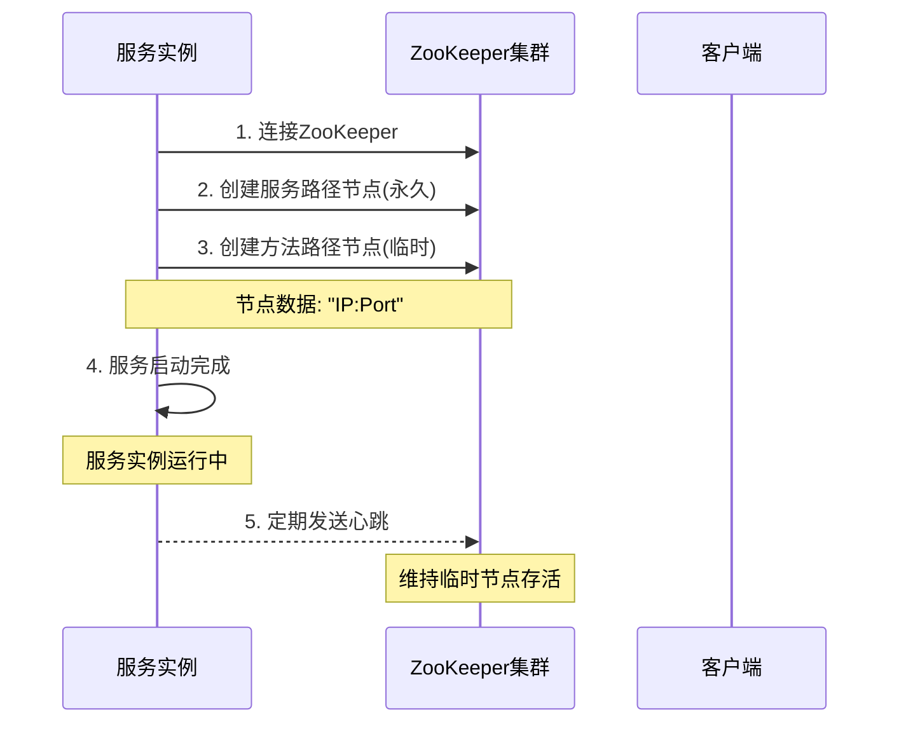
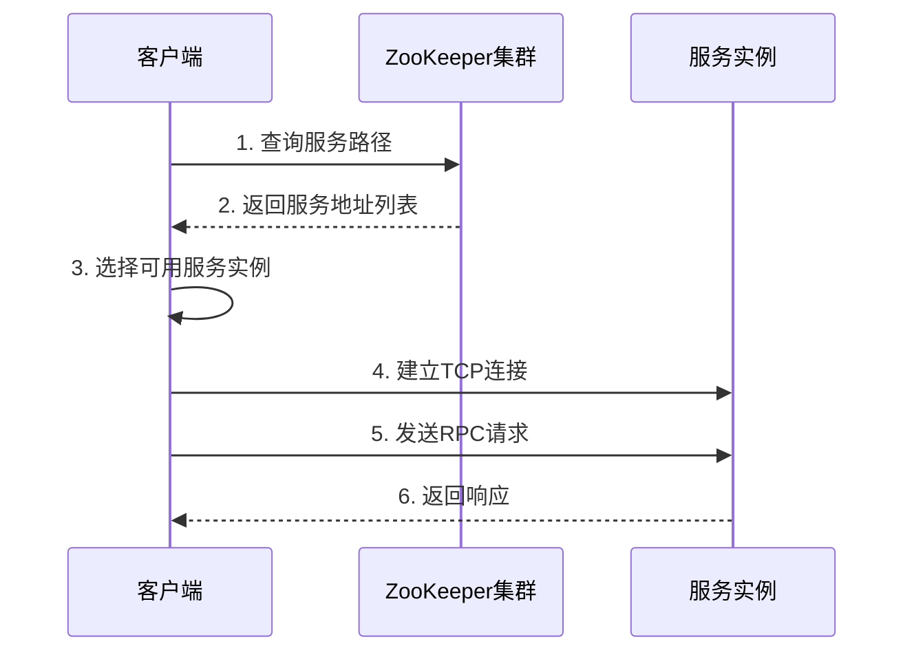

# ZooKeeper服务发现架构

## 概述

ZooKeeper在MPIM项目中充当**服务注册中心**和**服务发现机制**的核心组件，为微服务架构提供可靠的服务注册发现功能。

## 架构设计

### 1. ZooKeeper集群架构

```
┌─────────────────────────────────────────────────────────────────┐
│                    ZooKeeper集群                                │
│                                                                 │
│  ┌─────────────┐  ┌─────────────┐  ┌─────────────┐            │
│  │   Leader    │  │  Follower   │  │  Follower   │            │
│  │             │  │             │  │             │            │
│  │ 处理写请求   │  │  处理读请求  │  │  处理读请求  │            │
│  │ 数据同步    │  │  数据同步    │  │  数据同步    │            │
│  └─────────────┘  └─────────────┘  └─────────────┘            │
│                                                                 │
│  服务注册信息存储:                                               │
│  /UserServiceRpc/Login -> "127.0.0.1:6000"                    │
│  /GroupServiceRpc/CreateGroup -> "127.0.0.1:6000"             │
│  /MessageServiceRpc/SendMessage -> "127.0.0.1:6000"           │
│  /PresenceServiceRpc/BindRoute -> "127.0.0.1:6000"            │
└─────────────────────────────────────────────────────────────────┘
```

### 2. 服务注册发现流程

#### 2.1 服务注册流程



#### 2.2 服务发现流程



## 核心组件

### 1. ZkClient类

```cpp
class ZkClient {
public:
    ZkClient();
    ~ZkClient();
    
    // 启动连接ZooKeeper服务器
    void Start();
    
    // 创建ZooKeeper节点
    void Create(const char* path, const char* data, int datalen, int state = 0);
    
    // 获取节点数据
    std::string GetData(const char* path);
    
private:
    zhandle_t* m_zhandle;  // ZooKeeper客户端句柄
};
```

### 2. 服务注册实现

```cpp
// 在RpcProvider::NotifyService中
void RpcProvider::NotifyService(google::protobuf::Service *service) {
    // 连接ZooKeeper
    ZkClient zkCli;
    zkCli.Start();
    
    // 注册服务
    for (auto &sp : m_serviceMap) {
        // 创建服务路径（永久节点）
        std::string service_path = "/" + sp.first;
        zkCli.Create(service_path.c_str(), nullptr, 0);
        
        // 注册每个方法（临时节点）
        for (auto &mp : sp.second.m_methodMap) {
            std::string method_path = service_path + "/" + mp.first;
            char method_path_data[128] = {0};
            sprintf(method_path_data, "%s:%d", ip.c_str(), port);
            zkCli.Create(method_path.c_str(), method_path_data, 
                        strlen(method_path_data), ZOO_EPHEMERAL);
        }
    }
}
```

### 3. 服务发现实现

```cpp
// 在MprpcChannel::CallMethod中
void MprpcChannel::CallMethod(const google::protobuf::MethodDescriptor *method,
                              google::protobuf::RpcController *controller,
                              const google::protobuf::Message *request,
                              google::protobuf::Message *response,
                              google::protobuf::Closure *done) {
    // 构建方法路径
    std::string method_path = "/" + service_name + "/" + method_name;
    
    // 从ZooKeeper获取服务地址
    std::string host_data = s_zk.GetData(method_path.c_str());
    if (host_data == "") {
        controller->SetFailed(method_path + " is not exist!");
        return;
    }
    
    // 解析IP和端口
    int idx = host_data.find(":");
    std::string ip = host_data.substr(0, idx);
    uint16_t port = atoi(host_data.substr(idx + 1).c_str());
    
    // 建立连接并发送请求
    // ...
}
```

## 节点结构设计

### 1. 层次化节点结构

```
/
├── UserServiceRpc/                    # 永久节点：服务名
│   ├── Login -> "127.0.0.1:6000"     # 临时节点：方法名+IP:Port
│   ├── Register -> "127.0.0.1:6000"
│   ├── GetFriends -> "127.0.0.1:6000"
│   └── AddFriend -> "127.0.0.1:6000"
├── GroupServiceRpc/                   # 永久节点：服务名
│   ├── CreateGroup -> "127.0.0.1:6000"
│   ├── JoinGroup -> "127.0.0.1:6000"
│   └── GetGroupMembers -> "127.0.0.1:6000"
├── MessageServiceRpc/                 # 永久节点：服务名
│   ├── SendMessage -> "127.0.0.1:8002"
│   └── GetOfflineMessages -> "127.0.0.1:8002"
└── PresenceServiceRpc/                # 永久节点：服务名
    ├── BindRoute -> "127.0.0.1:8003"
    ├── QueryRoute -> "127.0.0.1:8003"
    └── Deliver -> "127.0.0.1:8003"
```

### 2. 节点类型说明

| 节点类型 | 标志 | 特点 | 用途 |
|---------|------|------|------|
| 永久节点 | 默认 | 服务下线后仍然存在 | 服务类型路径 |
| 临时节点 | ZOO_EPHEMERAL | 服务下线后自动删除 | 服务实例路径 |

## 性能优化

### 1. 地址缓存机制

```cpp
// 地址缓存结构
struct CacheEntry { 
    sockaddr_in addr; 
    steady_clock::time_point expire; 
};

// 全局缓存
static std::unordered_map<std::string, CacheEntry> s_addr_cache;
static std::mutex s_cache_mu;

// 缓存TTL: 1秒
const auto ttl = milliseconds(1000);
```

### 2. 连接池优化

```cpp
// 连接池：按 service/method 复用 socket
static std::unordered_map<std::string, std::vector<int>> s_conn_pool;
static const size_t kMaxPoolPerKey = 64;
```

### 3. 单例ZooKeeper客户端

```cpp
// 单例 ZK + 地址缓存，减少每次调用的服务发现开销
static std::once_flag s_zk_once;
static ZkClient s_zk;
std::call_once(s_zk_once, [](){ s_zk.Start(); });
```

## 配置管理

### 1. ZooKeeper连接配置

```cpp
// 从配置文件读取ZooKeeper地址
std::string host = MprpcApplication::GetInstance().GetConfig().Load("zookeeperip");
std::string port = MprpcApplication::GetInstance().GetConfig().Load("zookeeperport");
std::string connstr = host + ":" + port;  // 例如: "127.0.0.1:2181"
```

### 2. 会话管理

```cpp
// 会话超时设置
m_zhandle = zookeeper_init(connstr.c_str(), global_watcher, 30000, nullptr, &prom, 0);

// 心跳机制
// ZooKeeper客户端每1/3超时时间发送一次ping消息
// 30秒超时 -> 每10秒发送心跳
```

## 故障处理

### 1. 服务实例故障

- **自动检测**: 临时节点自动删除
- **服务剔除**: 客户端无法发现故障服务
- **自动恢复**: 服务重启后自动重新注册

### 2. ZooKeeper集群故障

- **高可用**: 集群部署保证可用性
- **故障转移**: Leader故障时自动选举新Leader
- **数据一致性**: ZAB协议保证数据一致性

### 3. 网络分区

- **多数派原则**: 需要大多数节点确认
- **分区容错**: 网络分区时保证数据一致性
- **服务降级**: 分区恢复后自动同步

## 监控和运维

### 1. 日志管理

```cpp
// 设置ZooKeeper客户端日志级别
zoo_set_debug_level(ZOO_LOG_LEVEL_ERROR);

// 使用统一日志系统
LOG_INFO << "ZooKeeper client started successfully";
LOG_DEBUG << "Creating service path: " << service_path;
```

### 2. 健康检查

- **连接状态**: 监控ZooKeeper连接状态
- **节点状态**: 监控服务节点注册状态
- **性能指标**: 监控服务发现性能

### 3. 运维工具

- **zkCli**: ZooKeeper命令行工具
- **监控面板**: 服务注册发现状态监控
- **告警机制**: 服务异常自动告警

## 最佳实践

### 1. 节点设计

- **层次化**: 使用清晰的层次结构
- **命名规范**: 统一的节点命名规范
- **数据格式**: 标准化的节点数据格式

### 2. 性能优化

- **缓存机制**: 合理使用地址缓存
- **连接复用**: 复用ZooKeeper连接
- **批量操作**: 批量注册服务

### 3. 安全考虑

- **访问控制**: 设置适当的ACL权限
- **网络安全**: 使用SSL/TLS加密
- **认证机制**: 实现服务认证

## 总结

ZooKeeper在MPIM项目中提供了：

1. **可靠的服务注册发现**: 高可用的服务注册发现机制
2. **动态服务管理**: 支持服务的动态上下线
3. **一致性保证**: 强一致性的服务视图
4. **性能优化**: 多种性能优化机制
5. **故障容错**: 完善的故障处理机制

ZooKeeper是MPIM微服务架构的重要基础设施，为整个分布式系统提供了可靠的服务治理能力。
