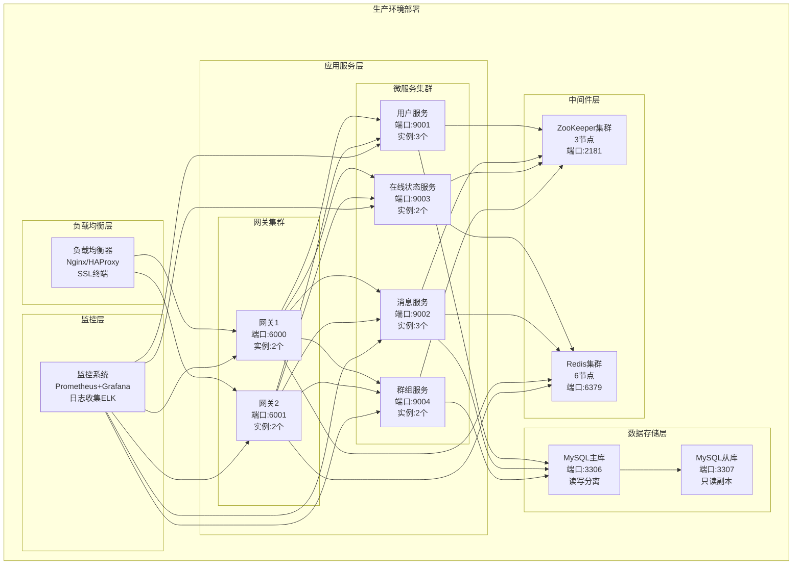

# 部署架构设计

## 部署架构概述

系统采用微服务架构，支持容器化部署，包含负载均衡、应用服务、中间件、数据存储和监控等层次。

## 生产环境部署架构图



## 服务配置

### 1. 网关服务配置
```yaml
# gateway-config.yaml
gateway:
  server:
    port: 8001
    threads: 4
    max_connections: 10000
  
  redis:
    host: redis-cluster
    port: 6379
    password: ""
    pool_size: 20
  
  rpc:
    zookeeper: "zk1:2181,zk2:2181,zk3:2181"
    timeout: 5000
    retry_times: 3
```

### 2. 用户服务配置
```yaml
# user-service-config.yaml
user_service:
  server:
    port: 9001
    threads: 8
  
  database:
    host: mysql-master
    port: 3306
    username: mpim_user
    password: mpim_pass
    database: mpim
    pool_size: 20
  
  rpc:
    zookeeper: "zk1:2181,zk2:2181,zk3:2181"
    service_name: "UserService"
```

### 3. 消息服务配置
```yaml
# message-service-config.yaml
message_service:
  server:
    port: 9002
    threads: 8
  
  database:
    host: mysql-master
    port: 3306
    username: mpim_user
    password: mpim_pass
    database: mpim
    pool_size: 20
  
  redis:
    host: redis-cluster
    port: 6379
    password: ""
    pool_size: 20
  
  rpc:
    zookeeper: "zk1:2181,zk2:2181,zk3:2181"
    service_name: "MessageService"
```

## Docker容器化部署

### 1. Dockerfile
```dockerfile
# Dockerfile
FROM centos:7

# 安装依赖
RUN yum update -y && \
    yum install -y gcc-c++ make cmake git && \
    yum install -y mysql-devel redis hiredis-devel && \
    yum clean all

# 设置工作目录
WORKDIR /app

# 复制源码
COPY . .

# 编译项目
RUN mkdir build && cd build && \
    cmake .. && \
    make -j4

# 设置启动脚本
COPY docker/start.sh /app/start.sh
RUN chmod +x /app/start.sh

# 暴露端口
EXPOSE 8001 9001 9002 9003 9004

# 启动服务
CMD ["/app/start.sh"]
```

### 2. Docker Compose
```yaml
# docker-compose.yml
version: '3.8'

services:
  # ZooKeeper集群
  zk1:
    image: zookeeper:3.6
    ports:
      - "2181:2181"
    environment:
      ZOO_MY_ID: 1
      ZOO_SERVERS: server.1=zk1:2888:3888;2181 server.2=zk2:2888:3888;2181 server.3=zk3:2888:3888;2181
    volumes:
      - zk1_data:/data
      - zk1_logs:/datalog

  zk2:
    image: zookeeper:3.6
    ports:
      - "2182:2181"
    environment:
      ZOO_MY_ID: 2
      ZOO_SERVERS: server.1=zk1:2888:3888;2181 server.2=zk2:2888:3888;2181 server.3=zk3:2888:3888;2181
    volumes:
      - zk2_data:/data
      - zk2_logs:/datalog

  zk3:
    image: zookeeper:3.6
    ports:
      - "2183:2181"
    environment:
      ZOO_MY_ID: 3
      ZOO_SERVERS: server.1=zk1:2888:3888;2181 server.2=zk2:2888:3888;2181 server.3=zk3:2888:3888;2181
    volumes:
      - zk3_data:/data
      - zk3_logs:/datalog

  # Redis集群
  redis1:
    image: redis:6.2
    ports:
      - "6379:6379"
    command: redis-server --port 6379 --cluster-enabled yes --cluster-config-file nodes-6379.conf --cluster-node-timeout 5000 --appendonly yes
    volumes:
      - redis1_data:/data

  redis2:
    image: redis:6.2
    ports:
      - "6380:6379"
    command: redis-server --port 6379 --cluster-enabled yes --cluster-config-file nodes-6379.conf --cluster-node-timeout 5000 --appendonly yes
    volumes:
      - redis2_data:/data

  # MySQL主从
  mysql-master:
    image: mysql:8.0
    ports:
      - "3306:3306"
    environment:
      MYSQL_ROOT_PASSWORD: rootpass
      MYSQL_DATABASE: mpim
      MYSQL_USER: mpim_user
      MYSQL_PASSWORD: mpim_pass
    volumes:
      - mysql_master_data:/var/lib/mysql
      - ./docker/mysql/master.cnf:/etc/mysql/conf.d/master.cnf

  mysql-slave:
    image: mysql:8.0
    ports:
      - "3307:3306"
    environment:
      MYSQL_ROOT_PASSWORD: rootpass
      MYSQL_DATABASE: mpim
      MYSQL_USER: mpim_user
      MYSQL_PASSWORD: mpim_pass
    volumes:
      - mysql_slave_data:/var/lib/mysql
      - ./docker/mysql/slave.cnf:/etc/mysql/conf.d/slave.cnf

  # 应用服务
  gateway1:
    build: .
    ports:
      - "8001:8001"
    environment:
      - SERVICE_TYPE=gateway
      - GATEWAY_ID=gateway-001
      - PORT=8001
    depends_on:
      - zk1
      - redis1
      - mysql-master

  gateway2:
    build: .
    ports:
      - "8002:8002"
    environment:
      - SERVICE_TYPE=gateway
      - GATEWAY_ID=gateway-002
      - PORT=8002
    depends_on:
      - zk1
      - redis1
      - mysql-master

  user-service:
    build: .
    ports:
      - "9001:9001"
    environment:
      - SERVICE_TYPE=user
      - PORT=9001
    depends_on:
      - zk1
      - mysql-master

  message-service:
    build: .
    ports:
      - "9002:9002"
    environment:
      - SERVICE_TYPE=message
      - PORT=9002
    depends_on:
      - zk1
      - redis1
      - mysql-master

  presence-service:
    build: .
    ports:
      - "9003:9003"
    environment:
      - SERVICE_TYPE=presence
      - PORT=9003
    depends_on:
      - zk1
      - redis1

  group-service:
    build: .
    ports:
      - "9004:9004"
    environment:
      - SERVICE_TYPE=group
      - PORT=9004
    depends_on:
      - zk1
      - mysql-master

volumes:
  zk1_data:
  zk1_logs:
  zk2_data:
  zk2_logs:
  zk3_data:
  zk3_logs:
  redis1_data:
  redis2_data:
  mysql_master_data:
  mysql_slave_data:
```

## Kubernetes部署

### 1. 命名空间
```yaml
# namespace.yaml
apiVersion: v1
kind: Namespace
metadata:
  name: mpim
```

### 2. 配置映射
```yaml
# configmap.yaml
apiVersion: v1
kind: ConfigMap
metadata:
  name: mpim-config
  namespace: mpim
data:
  gateway-config.yaml: |
    gateway:
      server:
        port: 8001
        threads: 4
        max_connections: 10000
      redis:
        host: redis-cluster
        port: 6379
        pool_size: 20
      rpc:
        zookeeper: "zk1:2181,zk2:2181,zk3:2181"
        timeout: 5000
```

### 3. 服务部署
```yaml
# gateway-deployment.yaml
apiVersion: apps/v1
kind: Deployment
metadata:
  name: gateway
  namespace: mpim
spec:
  replicas: 2
  selector:
    matchLabels:
      app: gateway
  template:
    metadata:
      labels:
        app: gateway
    spec:
      containers:
      - name: gateway
        image: mpim:latest
        ports:
        - containerPort: 8001
        env:
        - name: SERVICE_TYPE
          value: "gateway"
        - name: GATEWAY_ID
          value: "gateway-001"
        - name: PORT
          value: "8001"
        resources:
          requests:
            memory: "256Mi"
            cpu: "250m"
          limits:
            memory: "512Mi"
            cpu: "500m"
        livenessProbe:
          httpGet:
            path: /health
            port: 8001
          initialDelaySeconds: 30
          periodSeconds: 10
        readinessProbe:
          httpGet:
            path: /ready
            port: 8001
          initialDelaySeconds: 5
          periodSeconds: 5
```

### 4. 服务暴露
```yaml
# gateway-service.yaml
apiVersion: v1
kind: Service
metadata:
  name: gateway-service
  namespace: mpim
spec:
  selector:
    app: gateway
  ports:
  - port: 8001
    targetPort: 8001
  type: LoadBalancer
```

## 监控和日志

### 1. Prometheus监控
```yaml
# prometheus-config.yaml
global:
  scrape_interval: 15s

scrape_configs:
  - job_name: 'mpim-gateway'
    static_configs:
      - targets: ['gateway-service:8001']
    metrics_path: /metrics
    scrape_interval: 5s

  - job_name: 'mpim-services'
    static_configs:
      - targets: ['user-service:9001', 'message-service:9002', 'presence-service:9003', 'group-service:9004']
    metrics_path: /metrics
    scrape_interval: 5s
```

### 2. Grafana仪表板
```json
{
  "dashboard": {
    "title": "MPIM系统监控",
    "panels": [
      {
        "title": "QPS监控",
        "type": "graph",
        "targets": [
          {
            "expr": "rate(http_requests_total[5m])",
            "legendFormat": "{{service}}"
          }
        ]
      },
      {
        "title": "延迟监控",
        "type": "graph",
        "targets": [
          {
            "expr": "histogram_quantile(0.99, rate(http_request_duration_seconds_bucket[5m]))",
            "legendFormat": "P99延迟"
          }
        ]
      }
    ]
  }
}
```

### 3. ELK日志收集
```yaml
# filebeat-config.yaml
filebeat.inputs:
- type: log
  enabled: true
  paths:
    - /var/log/mpim/*.log
  fields:
    service: mpim
  fields_under_root: true

output.elasticsearch:
  hosts: ["elasticsearch:9200"]
  index: "mpim-logs-%{+yyyy.MM.dd}"

processors:
- add_host_metadata:
    when.not.contains.tags: forwarded
```

## 自动化部署

### 1. CI/CD流水线
```yaml
# .github/workflows/deploy.yml
name: Deploy MPIM

on:
  push:
    branches: [main]

jobs:
  build-and-deploy:
    runs-on: ubuntu-latest
    steps:
    - uses: actions/checkout@v2
    
    - name: Build Docker image
      run: |
        docker build -t mpim:${{ github.sha }} .
        docker tag mpim:${{ github.sha }} mpim:latest
    
    - name: Deploy to Kubernetes
      run: |
        kubectl apply -f k8s/
        kubectl set image deployment/gateway gateway=mpim:${{ github.sha }}
        kubectl set image deployment/user-service user-service=mpim:${{ github.sha }}
        kubectl set image deployment/message-service message-service=mpim:${{ github.sha }}
        kubectl set image deployment/presence-service presence-service=mpim:${{ github.sha }}
        kubectl set image deployment/group-service group-service=mpim:${{ github.sha }}
```

### 2. 健康检查
```bash
#!/bin/bash
# health-check.sh

# 检查服务健康状态
check_service() {
    local service=$1
    local port=$2
    
    if curl -f http://localhost:$port/health > /dev/null 2>&1; then
        echo "✓ $service is healthy"
        return 0
    else
        echo "✗ $service is unhealthy"
        return 1
    fi
}

# 检查所有服务
check_service "Gateway" 8001
check_service "User Service" 9001
check_service "Message Service" 9002
check_service "Presence Service" 9003
check_service "Group Service" 9004

# 检查依赖服务
check_service "Redis" 6379
check_service "MySQL" 3306
check_service "ZooKeeper" 2181
```

## 扩容和缩容

### 1. 水平扩容
```bash
# 扩容网关服务
kubectl scale deployment gateway --replicas=4

# 扩容用户服务
kubectl scale deployment user-service --replicas=5

# 扩容消息服务
kubectl scale deployment message-service --replicas=5
```

### 2. 自动扩缩容
```yaml
# hpa.yaml
apiVersion: autoscaling/v2
kind: HorizontalPodAutoscaler
metadata:
  name: gateway-hpa
  namespace: mpim
spec:
  scaleTargetRef:
    apiVersion: apps/v1
    kind: Deployment
    name: gateway
  minReplicas: 2
  maxReplicas: 10
  metrics:
  - type: Resource
    resource:
      name: cpu
      target:
        type: Utilization
        averageUtilization: 70
  - type: Resource
    resource:
      name: memory
      target:
        type: Utilization
        averageUtilization: 80
```

## 备份和恢复

### 1. 数据备份
```bash
#!/bin/bash
# backup.sh

# 备份MySQL数据
mysqldump -h mysql-master -u root -p mpim > /backup/mysql_$(date +%Y%m%d).sql

# 备份Redis数据
redis-cli --rdb /backup/redis_$(date +%Y%m%d).rdb

# 备份配置文件
tar -czf /backup/config_$(date +%Y%m%d).tar.gz /etc/mpim/

# 清理7天前的备份
find /backup -name "*.sql" -mtime +7 -delete
find /backup -name "*.rdb" -mtime +7 -delete
find /backup -name "*.tar.gz" -mtime +7 -delete
```

### 2. 灾难恢复
```bash
#!/bin/bash
# disaster-recovery.sh

# 恢复MySQL数据
mysql -h mysql-master -u root -p mpim < /backup/mysql_20240101.sql

# 恢复Redis数据
redis-cli --rdb /backup/redis_20240101.rdb

# 恢复配置文件
tar -xzf /backup/config_20240101.tar.gz -C /

# 重启服务
kubectl rollout restart deployment/gateway
kubectl rollout restart deployment/user-service
kubectl rollout restart deployment/message-service
kubectl rollout restart deployment/presence-service
kubectl rollout restart deployment/group-service
```
