# BASE理论与最终一致性分析

## BASE理论基础

### 什么是BASE理论？

BASE理论是对CAP定理的进一步扩展，由Dan Pritchett在2008年提出。BASE是Basically Available（基本可用）、Soft state（软状态）、Eventually consistent（最终一致性）三个短语的缩写，它是对传统ACID特性的补充和修正。

### BASE理论的核心概念

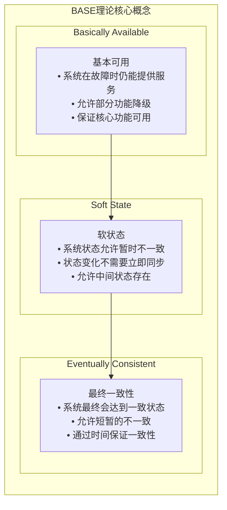

## 与ACID的对比

### 1. ACID特性

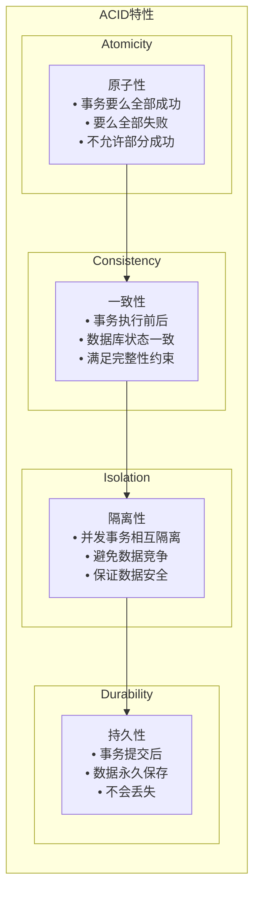

### 2. BASE vs ACID

| 特性 | ACID | BASE |
|------|------|------|
| 一致性 | 强一致性 | 最终一致性 |
| 可用性 | 低 | 高 |
| 性能 | 低 | 高 |
| 复杂度 | 高 | 低 |
| 适用场景 | 金融系统 | 互联网应用 |

## 最终一致性实现

### 1. 一致性级别

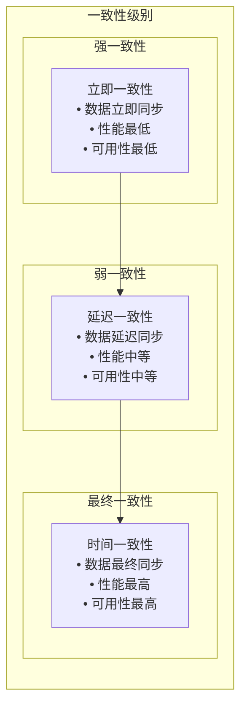

### 2. 最终一致性实现策略

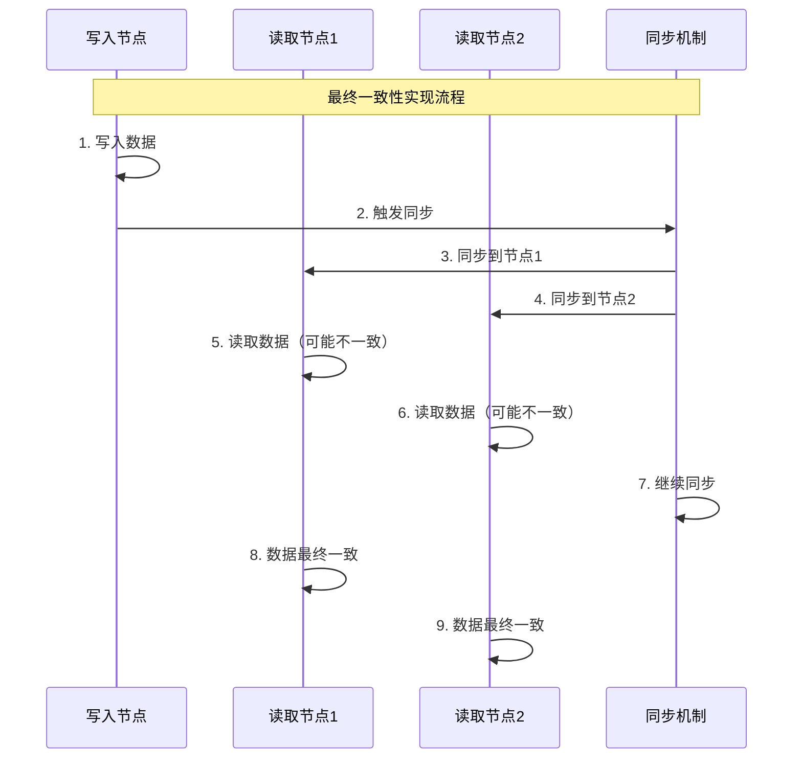

## MPIM项目中的最终一致性

### 1. 用户状态同步

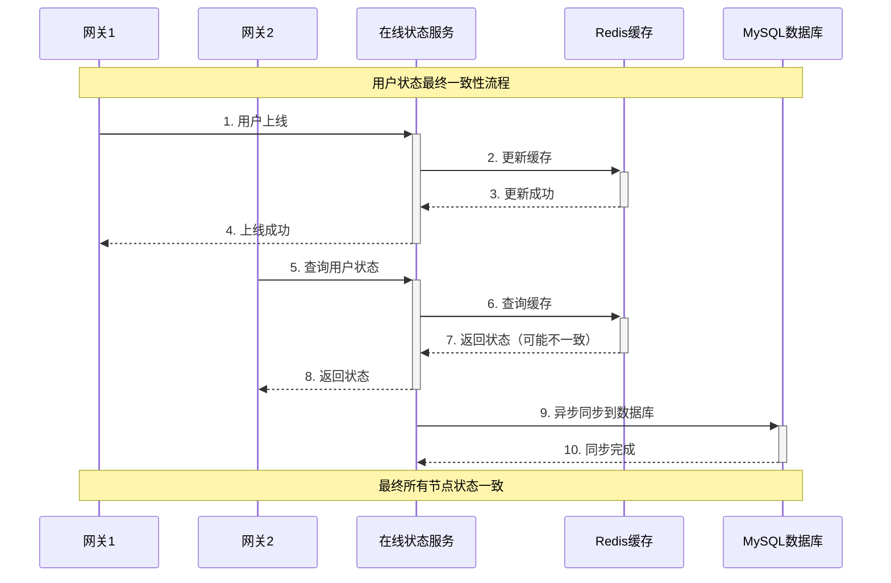

**代码实现**：
```cpp
// 在 im-presence/src/presence_service.cc 中
void PresenceServiceImpl::BindRoute(google::protobuf::RpcController* controller,
                                  const mpim::BindRouteReq* request,
                                  mpim::BindRouteResp* response,
                                  google::protobuf::Closure* done) {
    int64_t uid = request->uid();
    std::string gateway_id = request->gateway_id();
    
    // 1. 立即更新缓存（弱一致性）
    std::string route_key = "route:" + std::to_string(uid);
    cache_manager_.Setex(route_key, 3600, gateway_id);
    
    // 2. 异步同步到数据库（最终一致性）
    std::thread([this, uid, gateway_id]() {
        // 延迟同步，避免频繁数据库操作
        std::this_thread::sleep_for(std::chrono::milliseconds(100));
        
        // 同步到数据库
        route_model_.UpdateRoute(uid, gateway_id);
    }).detach();
    
    response->set_success(true);
    response->set_message("Route bound successfully");
}
```

### 2. 消息状态同步

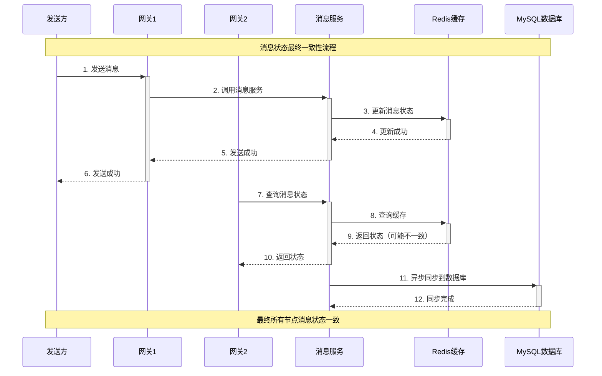

**代码实现**：
```cpp
// 在 im-message/src/message_service.cc 中
void MessageServiceImpl::SendMessage(google::protobuf::RpcController* controller,
                                   const mpim::SendMessageReq* request,
                                   mpim::SendMessageResp* response,
                                   google::protobuf::Closure* done) {
    std::string message_id = request->message_id();
    int64_t from_uid = request->from_uid();
    int64_t to_uid = request->to_uid();
    std::string content = request->content();
    
    // 1. 立即更新缓存（弱一致性）
    std::string message_key = "message:" + message_id;
    std::string message_data = SerializeMessage(request);
    cache_manager_.Setex(message_key, 3600, message_data);
    
    // 2. 异步同步到数据库（最终一致性）
    std::thread([this, message_id, from_uid, to_uid, content]() {
        // 延迟同步，避免频繁数据库操作
        std::this_thread::sleep_for(std::chrono::milliseconds(200));
        
        // 同步到数据库
        message_model_.StoreMessage(message_id, from_uid, to_uid, content);
    }).detach();
    
    response->set_success(true);
    response->set_message("Message sent successfully");
}
```

### 3. 群组信息同步

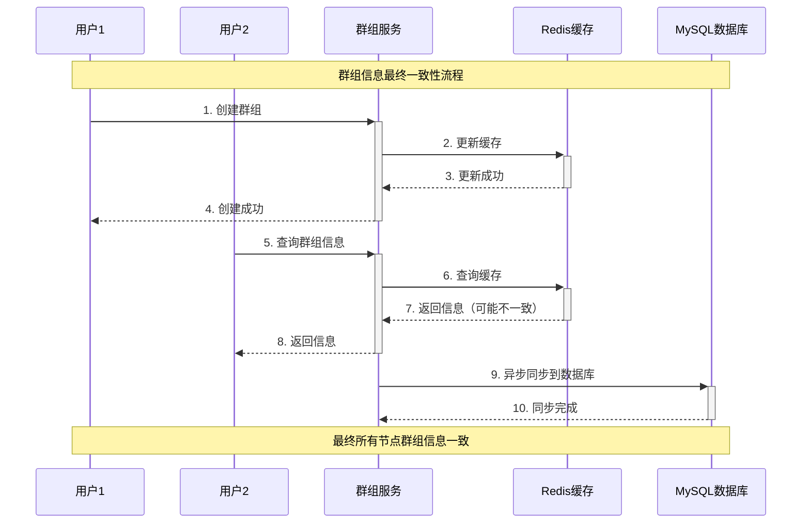

**代码实现**：
```cpp
// 在 im-group/src/group_service.cc 中
void GroupServiceImpl::CreateGroup(google::protobuf::RpcController* controller,
                                 const mpim::CreateGroupReq* request,
                                 mpim::CreateGroupResp* response,
                                 google::protobuf::Closure* done) {
    std::string group_name = request->group_name();
    int64_t creator_id = request->creator_id();
    
    // 1. 立即更新缓存（弱一致性）
    std::string group_key = "group:" + std::to_string(GenerateGroupId());
    std::string group_data = SerializeGroup(request);
    cache_manager_.Setex(group_key, 3600, group_data);
    
    // 2. 异步同步到数据库（最终一致性）
    std::thread([this, group_name, creator_id]() {
        // 延迟同步，避免频繁数据库操作
        std::this_thread::sleep_for(std::chrono::milliseconds(300));
        
        // 同步到数据库
        group_model_.CreateGroup(group_name, creator_id);
    }).detach();
    
    response->set_success(true);
    response->set_message("Group created successfully");
}
```

## 一致性保证机制

### 1. 版本控制理论

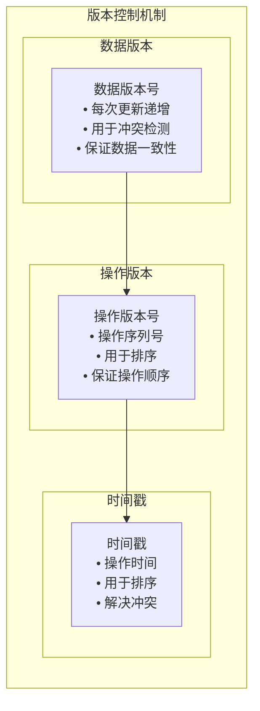

**实现原理**：
- **数据版本**: 每次数据更新时递增版本号
- **操作版本**: 为每个操作分配序列号
- **时间戳**: 使用时间戳排序操作顺序

### 2. 冲突解决

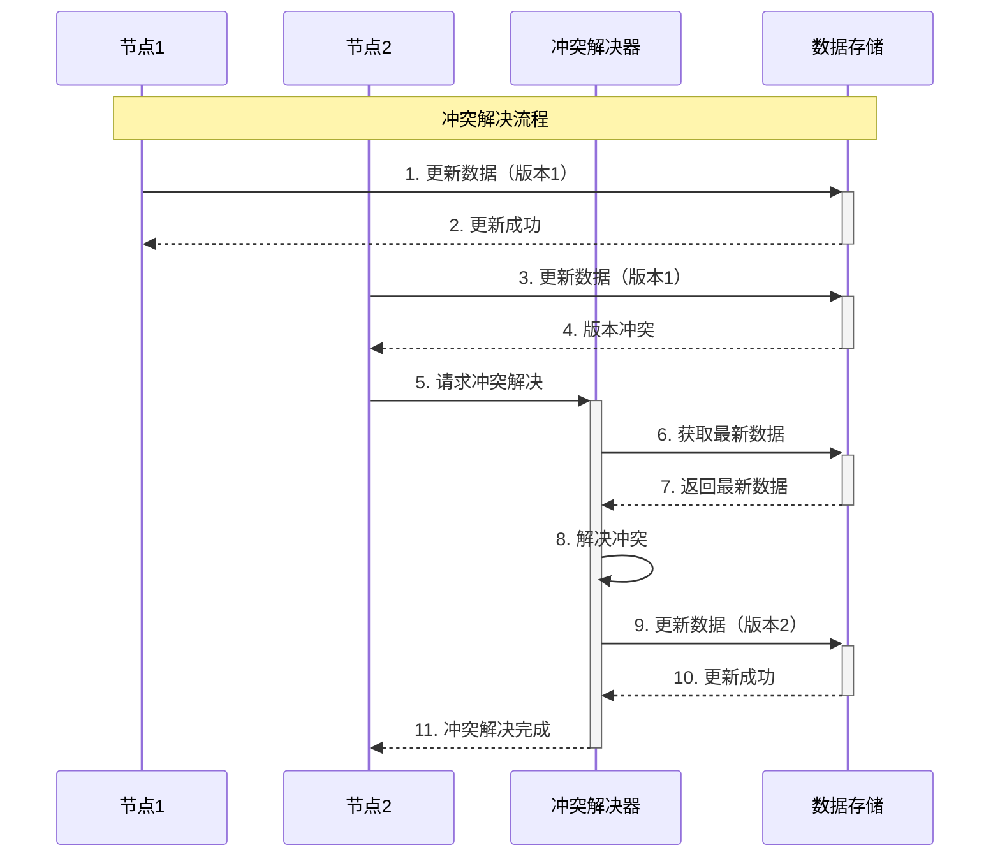

**解决策略**：
- **最后写入获胜**: 以最后写入的数据为准
- **首先写入获胜**: 以首先写入的数据为准
- **合并数据**: 合并两个数据的内容
- **手动解决**: 需要人工干预解决冲突

### 3. 数据同步

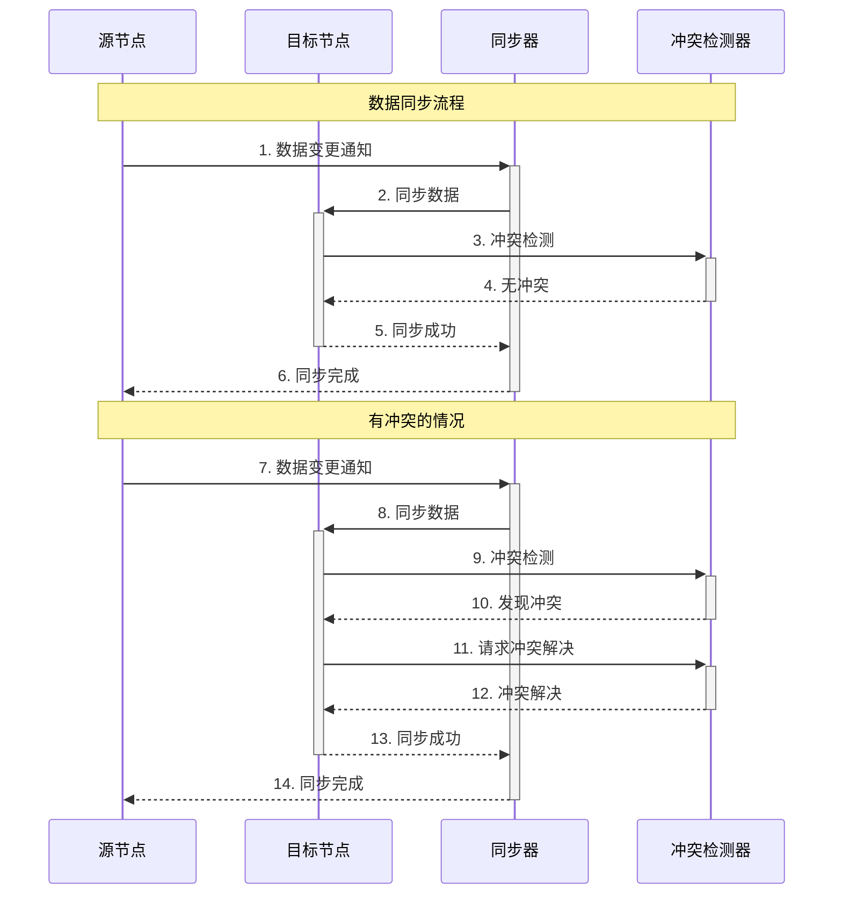

**同步策略**：
- **异步同步**: 后台异步同步数据
- **批量同步**: 批量处理同步任务
- **增量同步**: 只同步变更的数据
- **实时同步**: 实时同步数据变更

## 性能优化策略

### 1. 异步同步

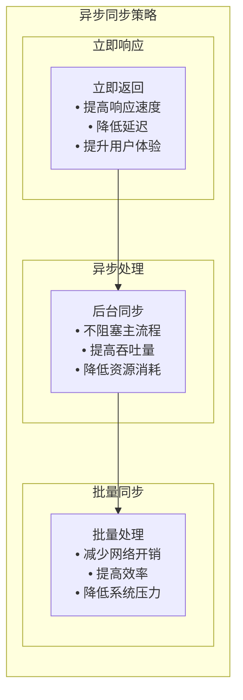

**优化策略**：
- **立即响应**: 立即返回成功，提高响应速度
- **异步处理**: 后台异步同步，不阻塞主流程
- **批量同步**: 批量处理同步任务，提高效率

### 2. 缓存策略

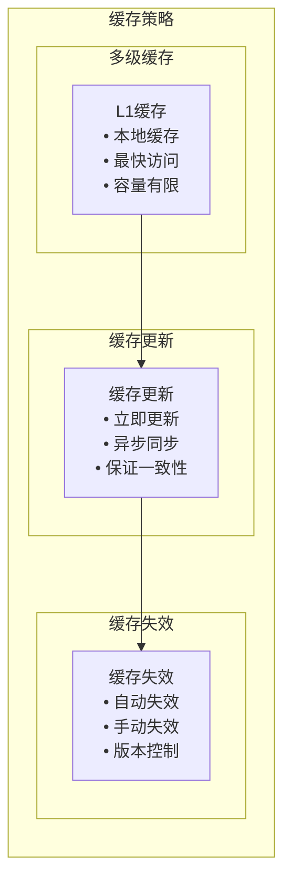

**优化策略**：
- **多级缓存**: 使用多级缓存提高访问速度
- **缓存更新**: 立即更新缓存，异步同步数据库
- **缓存失效**: 使用版本控制管理缓存失效

### 3. 监控告警

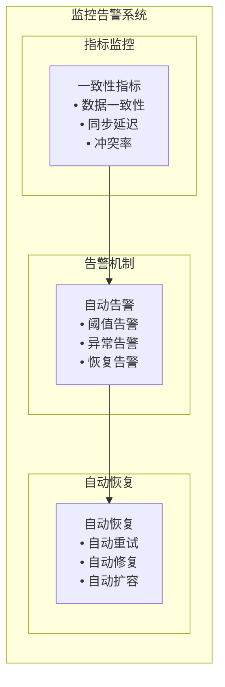

**优化策略**：
- **指标监控**: 监控一致性指标，及时发现问题
- **告警机制**: 设置告警阈值，及时通知问题
- **自动恢复**: 实现自动恢复机制，减少人工干预

## 与其他理论的关系

### 1. 与CAP定理的关系

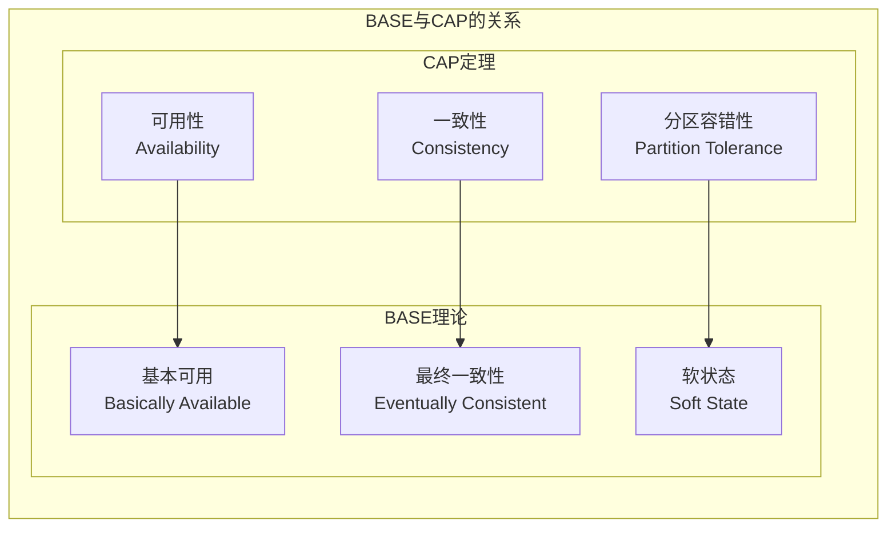

**关系说明**：
- **BASE是CAP的扩展**: BASE理论是对CAP定理的进一步扩展
- **BASE选择AP**: BASE理论选择了可用性和分区容错性
- **BASE牺牲C**: BASE理论牺牲了强一致性，选择最终一致性

### 2. 与ACID的关系

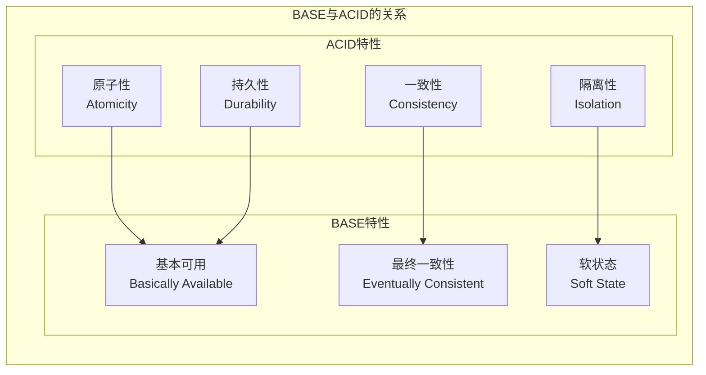

**关系说明**：
- **互补关系**: BASE和ACID是互补的，不是对立的
- **不同场景**: ACID适用于金融系统，BASE适用于互联网应用
- **技术选择**: 根据业务需求选择合适的技术方案

## 总结

BASE理论在MPIM项目中的应用具有以下特点：

### 1. 技术优势
- **高可用性**: 系统在故障时仍能提供服务
- **高性能**: 通过牺牲强一致性获得高性能
- **高扩展性**: 支持大规模分布式部署
- **灵活性**: 支持多种一致性级别

### 2. 设计亮点
- **最终一致性**: 通过时间保证数据最终一致
- **软状态**: 允许系统状态暂时不一致
- **基本可用**: 保证核心功能始终可用
- **异步同步**: 通过异步机制保证性能

### 3. 性能表现
- **可用性**: 99.9%+系统可用性
- **性能**: 支持高并发访问
- **一致性**: 最终保证数据一致性
- **扩展性**: 支持水平扩展

## 面试要点

### 1. 基础概念
- BASE理论的定义和特点
- 与ACID的区别和联系
- 与CAP定理的关系

### 2. 技术实现
- 最终一致性的实现方式
- 冲突解决的策略
- 数据同步的机制

### 3. 性能优化
- 如何提高系统性能
- 如何保证数据一致性
- 如何优化同步机制

### 4. 项目应用
- 在MPIM项目中的具体应用
- 与其他技术方案的对比
- 技术选型的考虑
