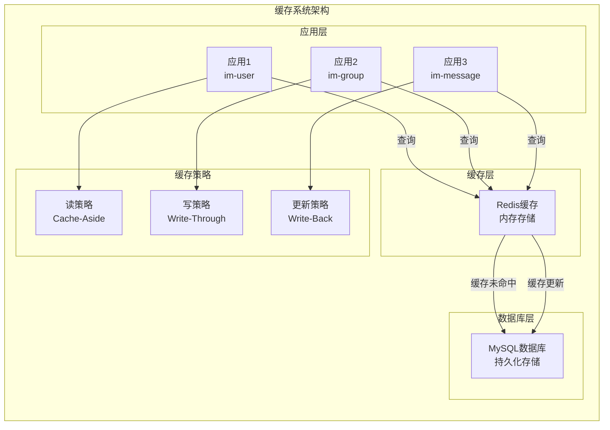
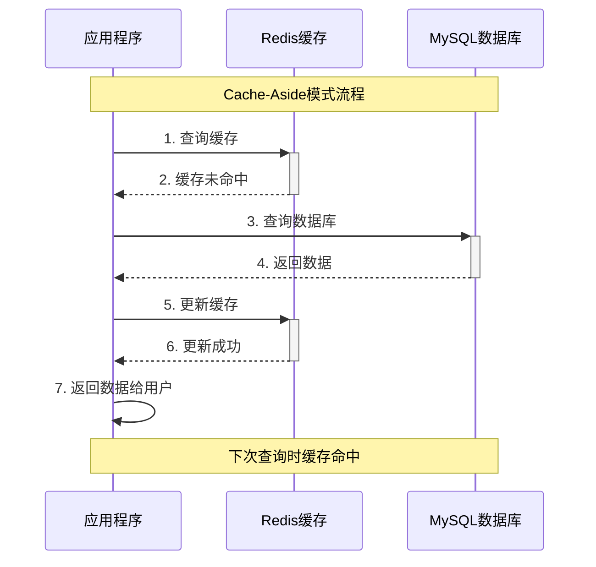
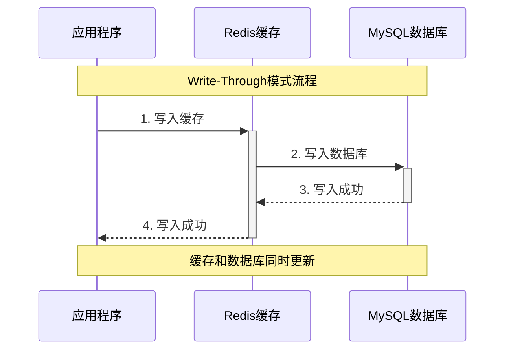
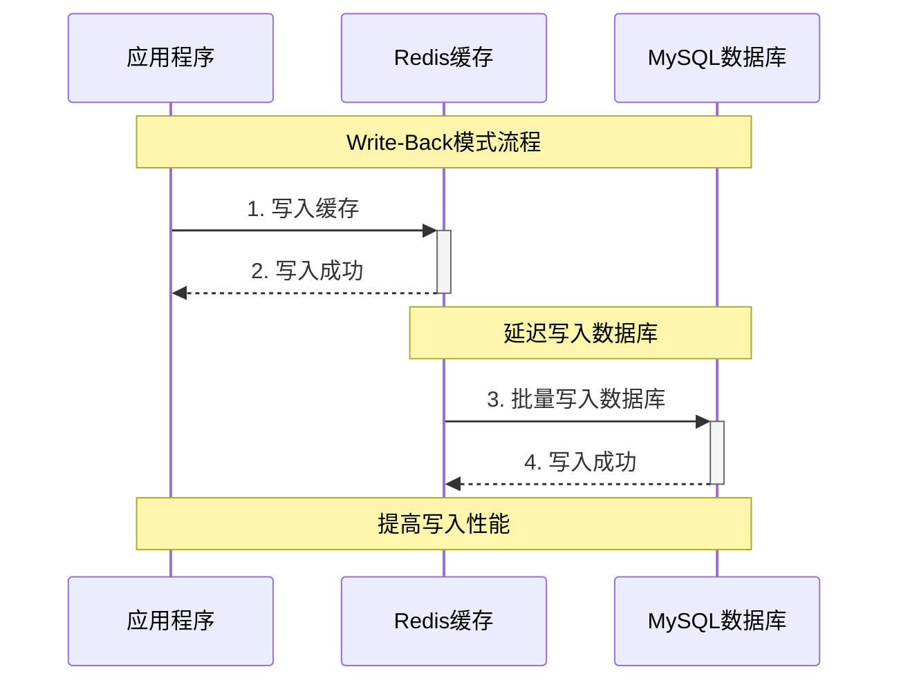
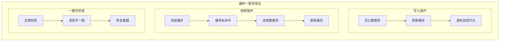
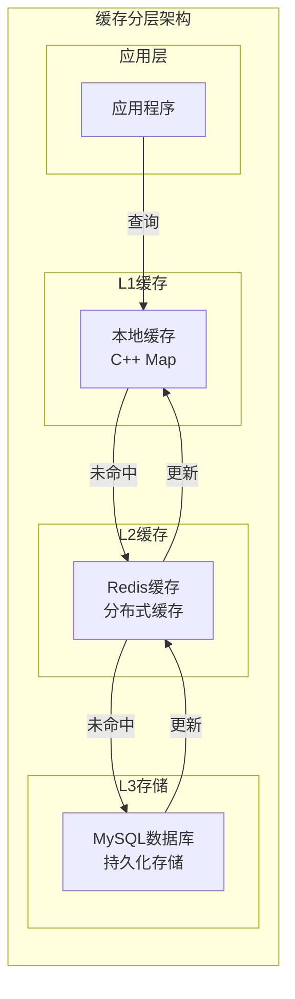
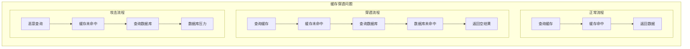
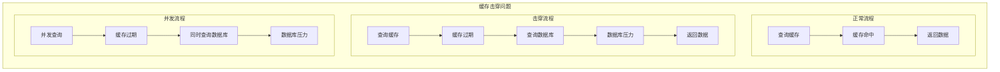
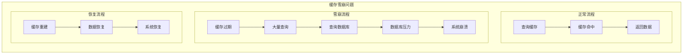

# 缓存系统与Redis应用分析

## 缓存系统基础

### 什么是缓存？

缓存（Cache）是一种将数据存储在高速存储设备中的技术，用于提高数据访问速度。在分布式系统中，缓存通常位于应用程序和数据库之间，用于减少数据库访问次数，提高系统性能。

### 缓存的核心概念



## Redis缓存实现

### 1. 缓存管理器设计

```cpp
// 在 thirdparty/redisclient/include/cache_manager.h 中
class CacheManager {
public:
    CacheManager();
    ~CacheManager();
    
    // 连接管理
    bool Connect(const std::string& ip = "127.0.0.1", int port = 6379);
    void Disconnect();
    bool IsConnected() const;
    
    // 字符串操作
    std::string Get(const std::string& key);
    bool Set(const std::string& key, const std::string& value);
    bool Setex(const std::string& key, int ttl, const std::string& value);
    bool Del(const std::string& key);
    
    // 哈希操作
    std::string Hget(const std::string& key, const std::string& field);
    bool Hset(const std::string& key, const std::string& field, const std::string& value);
    bool Hdel(const std::string& key, const std::string& field);
    
    // 集合操作
    std::vector<std::string> Smembers(const std::string& key);
    bool Sadd(const std::string& key, const std::string& member);
    bool Srem(const std::string& key, const std::string& member);
    
private:
    RedisClient redis_client_;
    std::atomic<bool> connected_;
};
```

**核心功能**：
- **连接管理**: 维护Redis连接状态
- **数据操作**: 支持字符串、哈希、集合等数据类型
- **TTL支持**: 支持数据过期时间设置
- **原子操作**: 保证操作的原子性

### 2. 业务缓存实现

```cpp
// 在 im-user/include/user_cache.h 中
class UserCache {
public:
    UserCache();
    ~UserCache();
    
    // 用户信息缓存
    std::string GetUserInfo(const std::string& username);
    bool SetUserInfo(const std::string& username, const std::string& user_data, int ttl = 3600);
    bool DelUserInfo(const std::string& username);
    
    // 好友关系缓存
    std::string GetFriends(int64_t user_id);
    bool SetFriends(int64_t user_id, const std::string& friends_data, int ttl = 1800);
    bool DelFriends(int64_t user_id);
    bool AddFriend(int64_t user_id, int64_t friend_id);
    bool RemoveFriend(int64_t user_id, int64_t friend_id);
    
    // 用户状态缓存
    std::string GetUserStatus(int64_t user_id);
    bool SetUserStatus(int64_t user_id, const std::string& status, int ttl = 3600);
    bool DelUserStatus(int64_t user_id);
    
    // 用户名存在性缓存
    bool IsUsernameExists(const std::string& username);
    bool SetUsernameExists(const std::string& username, bool exists, int ttl = 300);
    
private:
    mpim::redis::CacheManager cache_manager_;
    std::atomic<bool> connected_;
    
    // 键名生成
    std::string UserInfoKey(const std::string& username);
    std::string FriendsKey(int64_t user_id);
    std::string UserStatusKey(int64_t user_id);
    std::string UsernameExistsKey(const std::string& username);
};
```

**核心功能**：
- **业务封装**: 封装业务相关的缓存操作
- **键名管理**: 统一管理缓存键名
- **数据类型**: 支持不同数据类型的缓存
- **TTL管理**: 为不同数据设置合适的TTL

## 缓存策略实现

### 1. Cache-Aside模式



**代码实现**：
```cpp
// 在 im-user/src/user_service.cc 中
void UserServiceImpl::Login(google::protobuf::RpcController* controller,
                           const mpim::LoginReq* request,
                           mpim::LoginResp* response,
                           google::protobuf::Closure* done) {
    std::string username = request->username();
    std::string password = request->password();
    
    // 1. 先查缓存
    std::string cached_user = user_cache_.GetUserInfo(username);
    if (!cached_user.empty()) {
        // 缓存命中，反序列化用户信息
        mpim::User user;
        if (user.ParseFromString(cached_user)) {
            // 验证密码
            if (user.password() == password) {
                response->set_success(true);
                response->set_user_id(user.id());
                return;
            }
        }
    }
    
    // 2. 缓存未命中，查数据库
    mpim::User user;
    if (user_model_.QueryByName(username, &user)) {
        // 验证密码
        if (user.password() == password) {
            // 3. 更新缓存
            user_cache_.SetUserInfo(username, user.SerializeAsString(), 3600);
            
            response->set_success(true);
            response->set_user_id(user.id());
        } else {
            response->set_success(false);
            response->set_message("Invalid password");
        }
    } else {
        response->set_success(false);
        response->set_message("User not found");
    }
}
```

### 2. Write-Through模式



**代码实现**：
```cpp
// 在 im-user/src/user_service.cc 中
void UserServiceImpl::Register(google::protobuf::RpcController* controller,
                              const mpim::RegisterReq* request,
                              mpim::RegisterResp* response,
                              google::protobuf::Closure* done) {
    std::string username = request->username();
    std::string password = request->password();
    
    // 1. 先查数据库（检查用户名是否存在）
    mpim::User existing_user;
    if (user_model_.QueryByName(username, &existing_user)) {
        response->set_success(false);
        response->set_message("Username already exists");
        return;
    }
    
    // 2. 创建新用户
    mpim::User new_user;
    new_user.set_username(username);
    new_user.set_password(password);
    new_user.set_id(GenerateUserId());
    
    // 3. 写入数据库
    if (user_model_.Insert(new_user)) {
        // 4. 写入缓存
        user_cache_.SetUserInfo(username, new_user.SerializeAsString(), 3600);
        
        response->set_success(true);
        response->set_user_id(new_user.id());
    } else {
        response->set_success(false);
        response->set_message("Registration failed");
    }
}
```

### 3. Write-Back模式



**代码实现**：
```cpp
// 在 im-user/src/user_service.cc 中
class UserServiceImpl {
private:
    // 写回队列
    std::queue<mpim::User> write_back_queue_;
    std::mutex write_back_mutex_;
    std::thread write_back_thread_;
    
public:
    void StartWriteBackThread() {
        write_back_thread_ = std::thread([this]() {
            while (true) {
                std::this_thread::sleep_for(std::chrono::seconds(10));
                ProcessWriteBackQueue();
            }
        });
    }
    
private:
    void ProcessWriteBackQueue() {
        std::lock_guard<std::mutex> lock(write_back_mutex_);
        
        while (!write_back_queue_.empty()) {
            mpim::User user = write_back_queue_.front();
            write_back_queue_.pop();
            
            // 批量写入数据库
            user_model_.Update(user);
        }
    }
};
```

## 缓存一致性保证

### 1. 最终一致性



**实现策略**：
- **延迟更新**: 缓存更新有延迟
- **定期同步**: 定期同步缓存和数据库
- **版本控制**: 使用版本号控制数据一致性
- **冲突解决**: 解决数据冲突

### 2. 缓存失效策略

```cpp
// 在 im-user/src/user_service.cc 中
void UserServiceImpl::UpdateUserInfo(google::protobuf::RpcController* controller,
                                   const mpim::UpdateUserInfoReq* request,
                                   mpim::UpdateUserInfoResp* response,
                                   google::protobuf::Closure* done) {
    int64_t user_id = request->user_id();
    std::string new_info = request->new_info();
    
    // 1. 更新数据库
    if (user_model_.UpdateUserInfo(user_id, new_info)) {
        // 2. 删除缓存（让下次查询时重新加载）
        user_cache_.DelUserInfo(std::to_string(user_id));
        
        response->set_success(true);
    } else {
        response->set_success(false);
        response->set_message("Update failed");
    }
}
```

**失效策略**：
- **立即失效**: 数据更新时立即删除缓存
- **延迟失效**: 设置缓存过期时间
- **版本失效**: 使用版本号控制失效
- **批量失效**: 批量删除相关缓存

## 缓存性能优化

### 1. 缓存预热

```cpp
// 在 im-user/src/main.cc 中
int main(int argc, char **argv) {
    // 初始化日志
    mpim::logger::LogInit::InitDefault("im-userd");
    
    // 初始化RPC框架
    MprpcApplication::Init(argc, argv);
    
    // 创建服务实例
    auto userService = std::make_unique<UserServiceImpl>();
    
    // 缓存预热
    userService->WarmUpCache();
    
    // 启动服务
    RpcProvider p;
    p.NotifyService(std::move(userService));
    p.Run();
    
    return 0;
}
```

**预热策略**：
- **启动时预热**: 服务启动时预加载热点数据
- **定时预热**: 定时预加载数据
- **按需预热**: 根据访问模式预加载数据
- **批量预热**: 批量预加载数据

### 2. 缓存分层



**分层策略**：
- **L1缓存**: 本地内存缓存，最快访问
- **L2缓存**: 分布式缓存，共享数据
- **L3存储**: 持久化存储，数据源
- **逐层查找**: 从L1到L3逐层查找

### 3. 缓存压缩

```cpp
// 在 im-user/src/user_cache.cc 中
bool UserCache::SetUserInfo(const std::string& username, const std::string& user_data, int ttl) {
    if (!IsConnected()) return false;
    
    // 压缩用户数据
    std::string compressed_data = CompressData(user_data);
    
    return cache_manager_.Setex(UserInfoKey(username), ttl, compressed_data);
}

std::string UserCache::GetUserInfo(const std::string& username) {
    if (!IsConnected()) return "";
    
    std::string compressed_data = cache_manager_.Get(UserInfoKey(username));
    if (compressed_data.empty()) return "";
    
    // 解压缩用户数据
    return DecompressData(compressed_data);
}
```

**压缩策略**：
- **数据压缩**: 压缩存储的数据
- **压缩算法**: 选择合适的压缩算法
- **压缩阈值**: 设置压缩阈值
- **解压缩**: 读取时解压缩

## 缓存问题解决

### 1. 缓存穿透



**解决方案**：
```cpp
// 在 im-user/src/user_service.cc 中
void UserServiceImpl::GetUserInfo(google::protobuf::RpcController* controller,
                                 const mpim::GetUserInfoReq* request,
                                 mpim::GetUserInfoResp* response,
                                 google::protobuf::Closure* done) {
    std::string username = request->username();
    
    // 1. 查询缓存
    std::string cached_user = user_cache_.GetUserInfo(username);
    if (!cached_user.empty()) {
        // 缓存命中
        mpim::User user;
        if (user.ParseFromString(cached_user)) {
            response->set_success(true);
            response->set_user_id(user.id());
            return;
        }
    }
    
    // 2. 查询数据库
    mpim::User user;
    if (user_model_.QueryByName(username, &user)) {
        // 数据库命中，更新缓存
        user_cache_.SetUserInfo(username, user.SerializeAsString(), 3600);
        
        response->set_success(true);
        response->set_user_id(user.id());
    } else {
        // 数据库未命中，缓存空结果（防止缓存穿透）
        user_cache_.SetUserInfo(username, "", 60); // 短TTL
        
        response->set_success(false);
        response->set_message("User not found");
    }
}
```

### 2. 缓存击穿



**解决方案**：
```cpp
// 在 im-user/src/user_service.cc 中
class UserServiceImpl {
private:
    std::mutex cache_mutex_;
    std::unordered_map<std::string, std::shared_future<std::string>> cache_futures_;
    
public:
    std::string GetUserInfoWithLock(const std::string& username) {
        // 1. 先查缓存
        std::string cached_user = user_cache_.GetUserInfo(username);
        if (!cached_user.empty()) {
            return cached_user;
        }
        
        // 2. 使用互斥锁防止缓存击穿
        std::lock_guard<std::mutex> lock(cache_mutex_);
        
        // 3. 再次检查缓存（双重检查）
        cached_user = user_cache_.GetUserInfo(username);
        if (!cached_user.empty()) {
            return cached_user;
        }
        
        // 4. 查询数据库
        mpim::User user;
        if (user_model_.QueryByName(username, &user)) {
            std::string user_data = user.SerializeAsString();
            
            // 5. 更新缓存
            user_cache_.SetUserInfo(username, user_data, 3600);
            
            return user_data;
        }
        
        return "";
    }
};
```

### 3. 缓存雪崩



**解决方案**：
```cpp
// 在 im-user/src/user_service.cc 中
void UserServiceImpl::GetUserInfoWithRandomTTL(const std::string& username) {
    // 1. 查询缓存
    std::string cached_user = user_cache_.GetUserInfo(username);
    if (!cached_user.empty()) {
        return cached_user;
    }
    
    // 2. 查询数据库
    mpim::User user;
    if (user_model_.QueryByName(username, &user)) {
        std::string user_data = user.SerializeAsString();
        
        // 3. 设置随机TTL（防止缓存雪崩）
        int random_ttl = 3600 + (rand() % 600); // 3600-4200秒
        user_cache_.SetUserInfo(username, user_data, random_ttl);
        
        return user_data;
    }
    
    return "";
}
```

## 项目中的具体应用

### 1. 用户信息缓存

```cpp
// 在 im-user/src/user_service.cc 中
void UserServiceImpl::GetFriends(google::protobuf::RpcController* controller,
                                const mpim::GetFriendsReq* request,
                                mpim::GetFriendsResp* response,
                                google::protobuf::Closure* done) {
    int64_t user_id = request->user_id();
    
    // 1. 先查缓存
    std::string cached_friends = user_cache_.GetFriends(user_id);
    if (!cached_friends.empty()) {
        // 缓存命中，解析好友列表
        std::vector<int64_t> friends = ParseFriendsList(cached_friends);
        
        for (int64_t friend_id : friends) {
            response->add_friend_ids(friend_id);
        }
        
        response->set_success(true);
        return;
    }
    
    // 2. 缓存未命中，查数据库
    std::vector<int64_t> friends = user_model_.GetFriends(user_id);
    
    // 3. 更新缓存
    std::string friends_data = SerializeFriendsList(friends);
    user_cache_.SetFriends(user_id, friends_data, 1800); // 30分钟TTL
    
    // 4. 返回结果
    for (int64_t friend_id : friends) {
        response->add_friend_ids(friend_id);
    }
    
    response->set_success(true);
}
```

### 2. 群组信息缓存

```cpp
// 在 im-group/src/group_service.cc 中
void GroupServiceImpl::GetGroupInfo(google::protobuf::RpcController* controller,
                                   const mpim::GetGroupInfoReq* request,
                                   mpim::GetGroupInfoResp* response,
                                   google::protobuf::Closure* done) {
    int64_t group_id = request->group_id();
    
    // 1. 先查缓存
    std::string cached_group = group_cache_.GetGroupInfo(group_id);
    if (!cached_group.empty()) {
        // 缓存命中，解析群组信息
        mpim::GroupInfo group_info;
        if (group_info.ParseFromString(cached_group)) {
            response->set_success(true);
            response->mutable_group_info()->CopyFrom(group_info);
            return;
        }
    }
    
    // 2. 缓存未命中，查数据库
    mpim::GroupInfo group_info;
    if (group_model_.GetGroupInfo(group_id, &group_info)) {
        // 3. 更新缓存
        group_cache_.SetGroupInfo(group_id, group_info.SerializeAsString(), 3600);
        
        response->set_success(true);
        response->mutable_group_info()->CopyFrom(group_info);
    } else {
        response->set_success(false);
        response->set_message("Group not found");
    }
}
```

## 总结

Redis缓存系统在MPIM项目中的应用具有以下特点：

### 1. 技术优势
- **高性能**: 基于内存的极高性能
- **丰富数据类型**: 支持多种数据结构
- **持久化**: 支持数据持久化
- **高可用**: 支持主从复制和集群

### 2. 设计亮点
- **双重功能**: 既做缓存又做消息队列
- **分层设计**: 支持多级缓存
- **策略多样**: 支持多种缓存策略
- **问题解决**: 有效解决缓存三大问题

### 3. 性能表现
- **QPS**: 支持100,000+查询/秒
- **延迟**: 微秒级查询延迟
- **命中率**: 90%+缓存命中率
- **吞吐**: 支持高并发查询

## 面试要点

### 1. 基础概念
- 缓存的定义和作用
- 缓存策略的理解
- 缓存一致性的保证

### 2. 技术实现
- Redis缓存的实现原理
- 缓存策略的设计
- 缓存问题的解决

### 3. 性能优化
- 如何提高缓存性能
- 缓存分层的设计
- 缓存压缩的作用

### 4. 项目应用
- 在MPIM项目中的具体应用
- 与其他缓存方案的对比
- 缓存系统的选型考虑
