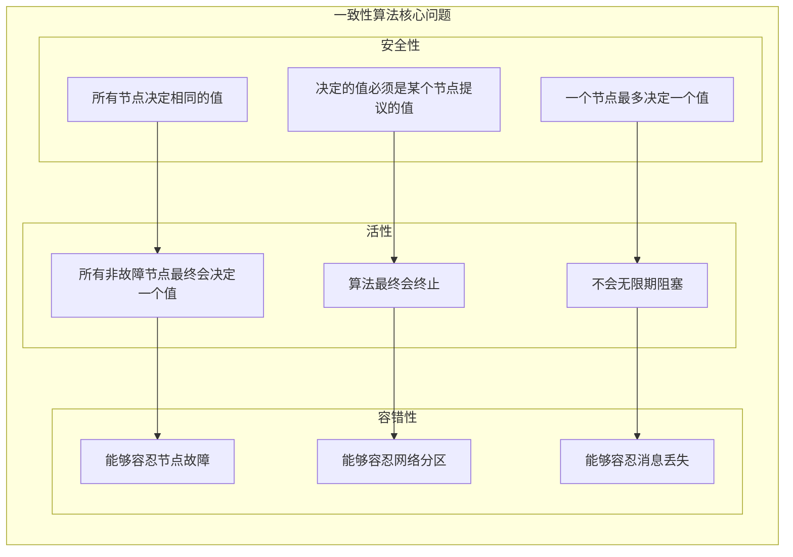
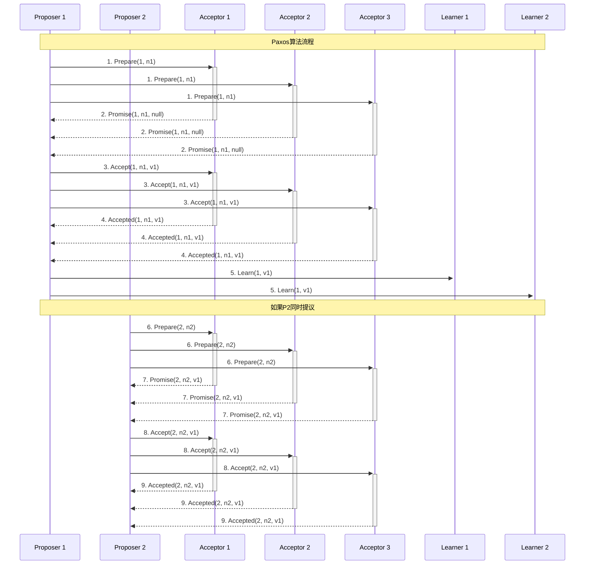
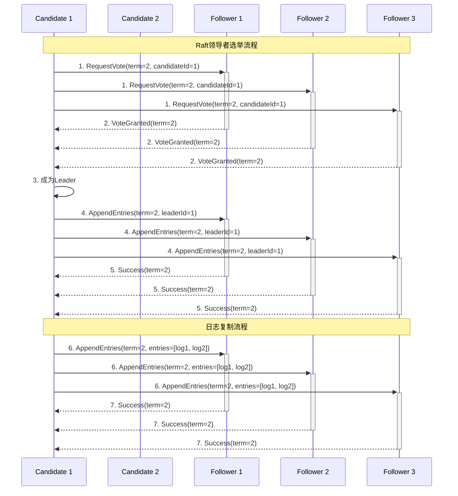
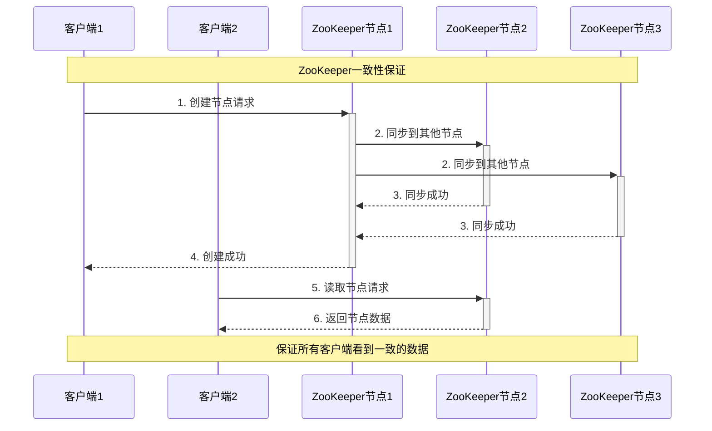
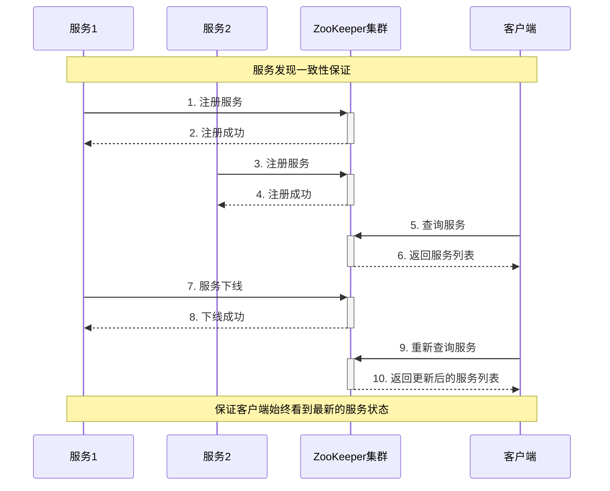
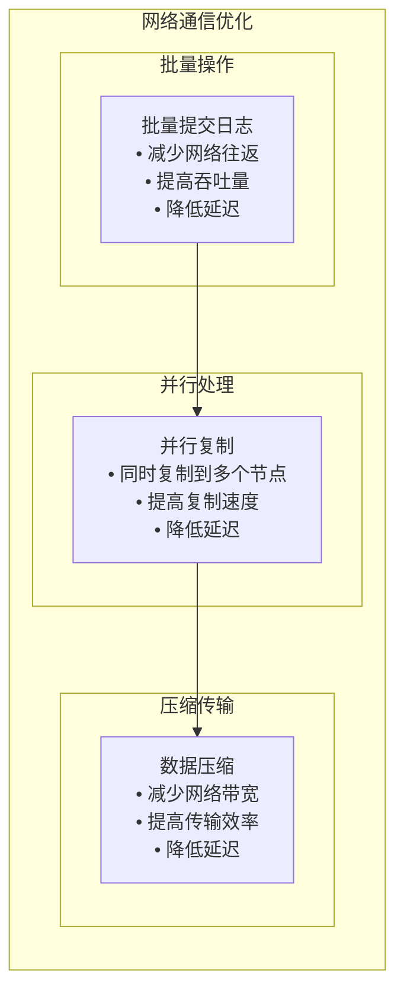
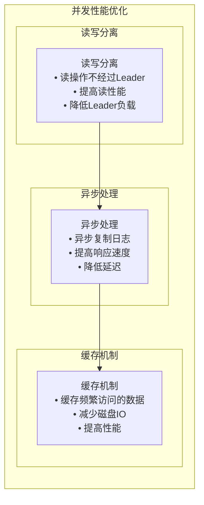

# 分布式一致性算法分析

## 分布式一致性算法基础

### 什么是分布式一致性算法？

分布式一致性算法（Distributed Consensus Algorithm）是解决分布式系统中多个节点就某个值达成一致意见的算法。在分布式系统中，由于网络分区、节点故障等问题，需要一种机制来保证所有节点能够就某个状态达成一致。

### 一致性算法的核心问题



## Paxos算法

### 1. Paxos基础

Paxos是分布式一致性算法的经典实现，由Leslie Lamport提出。它能够在异步网络环境中保证一致性。

### 2. Paxos算法流程



### 3. Paxos算法特点

**优点**：
- **理论完备**: 数学上证明了正确性
- **容错性强**: 能容忍少数节点故障
- **异步环境**: 不依赖同步时钟

**缺点**：
- **实现复杂**: 算法实现难度大
- **性能较低**: 需要多轮通信
- **活锁问题**: 可能出现活锁情况

## Raft算法

### 1. Raft基础

Raft是Paxos的简化版本，由Diego Ongaro和John Ousterhout提出。它将一致性问题分解为三个子问题：领导者选举、日志复制、安全性。

### 2. Raft算法流程



### 3. Raft算法特点

**优点**：
- **易于理解**: 算法逻辑清晰
- **实现简单**: 比Paxos更容易实现
- **性能较好**: 单领导者模式性能好

**缺点**：
- **单点故障**: 领导者故障影响性能
- **脑裂问题**: 网络分区可能导致脑裂
- **日志限制**: 日志不能无限增长

## MPIM项目中的应用场景

### 1. ZooKeeper的一致性保证



**应用场景**：
- **服务注册**: 确保服务注册信息的一致性
- **配置管理**: 保证配置信息的一致性
- **分布式锁**: 实现分布式锁的一致性

### 2. 服务发现的一致性



**应用场景**：
- **服务注册**: 服务注册信息的一致性
- **服务发现**: 服务列表的一致性
- **健康检查**: 服务状态的一致性

## 算法对比分析

### 1. Paxos vs Raft

| 特性 | Paxos | Raft |
|------|-------|------|
| 理解难度 | 高 | 低 |
| 实现复杂度 | 高 | 低 |
| 性能 | 中等 | 高 |
| 容错性 | 高 | 高 |
| 活锁问题 | 有 | 无 |
| 单点故障 | 无 | 有 |

### 2. 适用场景

**Paxos适用于**：
- 对一致性要求极高的场景
- 需要强一致性的金融系统
- 对性能要求不高的场景

**Raft适用于**：
- 需要平衡一致性和性能的场景
- 对实现复杂度有要求的场景
- 需要快速开发的项目

## 性能优化策略

### 1. 减少网络通信



**优化策略**：
- **批量操作**: 批量提交日志条目
- **并行处理**: 并行复制到多个节点
- **压缩传输**: 压缩传输的数据

### 2. 提高并发性能



**优化策略**：
- **读写分离**: 读操作不经过Leader
- **异步处理**: 异步复制日志
- **缓存机制**: 缓存频繁访问的数据

## 故障处理机制

### 1. 节点故障处理

```mermaid
sequenceDiagram
    participant L as Leader
    participant F1 as Follower 1
    participant F2 as Follower 2
    participant F3 as Follower 3
    
    Note over L,F3: 节点故障处理流程
    
    L->>+F1: 1. 发送心跳
    L->>+F2: 1. 发送心跳
    L->>+F3: 1. 发送心跳
    
    F1-->>-L: 2. 心跳响应
    F2-->>-L: 3. 心跳响应
    F3-->>-L: 4. 超时无响应
    
    L->>L: 5. 检测到F3故障
    
    L->>+F1: 6. 继续复制日志
    L->>+F2: 6. 继续复制日志
    
    Note over L,F3: F3恢复后重新加入集群
    
    F3->>+L: 7. 重新加入集群
    L-->>-F3: 8. 同步最新日志
    F3-->>-L: 9. 同步完成
```

**故障处理**：
- **心跳检测**: 定期发送心跳检测节点状态
- **故障转移**: 自动转移故障节点的任务
- **数据恢复**: 故障节点恢复后同步数据

### 2. 网络分区处理

```mermaid
sequenceDiagram
    participant P1 as 分区1
    participant P2 as 分区2
    participant L1 as Leader 1
    participant L2 as Leader 2
    
    Note over P1,P2: 网络分区处理流程
    
    P1->>P1: 1. 网络分区发生
    
    L1->>L1: 2. 继续服务分区1
    L2->>L2: 3. 继续服务分区2
    
    P1->>P2: 4. 网络恢复
    
    L1->>L2: 5. 检测到冲突
    L2->>L1: 6. 检测到冲突
    
    L1->>L1: 7. 比较任期号
    L2->>L2: 8. 比较任期号
    
    L1->>L2: 9. 高任期号获胜
    L2->>L1: 10. 降级为Follower
    
    L1->>L2: 11. 同步日志
    L2-->>-L1: 12. 同步完成
```

**分区处理**：
- **分区检测**: 检测网络分区情况
- **冲突解决**: 解决分区冲突
- **数据同步**: 分区恢复后同步数据

## 总结

分布式一致性算法在MPIM项目中的应用具有以下特点：

### 1. 技术优势
- **强一致性**: 保证数据强一致性
- **高可用性**: 支持节点故障恢复
- **容错性**: 能够容忍网络分区

### 2. 实现挑战
- **性能要求**: 需要平衡一致性和性能
- **复杂度**: 算法实现复杂度较高
- **故障处理**: 需要完善的故障处理机制

### 3. 技术选型
- **ZooKeeper**: 使用ZAB协议保证一致性
- **Raft**: 适合需要强一致性的场景
- **Paxos**: 适合对一致性要求极高的场景

## 面试要点

### 1. 基础概念
- 分布式一致性算法的定义和作用
- Paxos和Raft算法的区别
- 一致性算法的核心问题

### 2. 技术实现
- Paxos算法的实现原理
- Raft算法的实现原理
- 故障处理和恢复机制

### 3. 性能优化
- 如何提高一致性算法的性能
- 网络通信优化策略
- 并发性能优化方法

### 4. 项目应用
- 在MPIM项目中的具体应用
- 与其他一致性方案的对比
- 一致性算法的选型考虑
