# 分布式一致性算法分析

## 分布式一致性算法基础

### 什么是分布式一致性算法？

分布式一致性算法（Distributed Consensus Algorithm）是解决分布式系统中多个节点就某个值达成一致意见的算法。在分布式环境中，由于网络分区、节点故障等问题，需要一种机制来保证所有正常工作的节点能够就某个状态达成一致。

### 一致性算法的核心问题

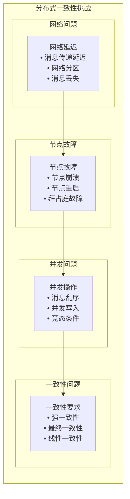

## 经典一致性算法

### 1. Paxos算法

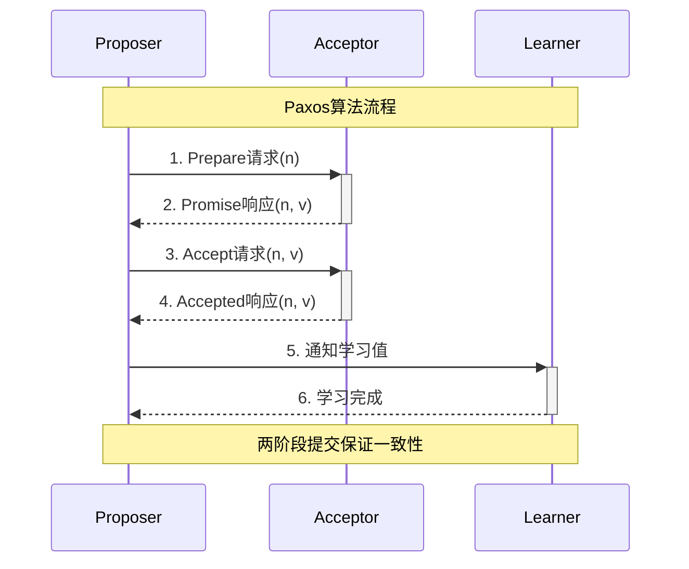

**Paxos算法特点**：
- **两阶段**: Prepare阶段和Accept阶段
- **多数派**: 需要多数派同意才能达成一致
- **安全性**: 保证不会选择错误的值
- **活性**: 在正常情况下能够达成一致

**算法步骤**：
1. **Prepare阶段**: Proposer向Acceptor发送Prepare请求
2. **Promise阶段**: Acceptor返回Promise响应
3. **Accept阶段**: Proposer向Acceptor发送Accept请求
4. **Learn阶段**: Learner学习最终确定的值

### 2. Raft算法

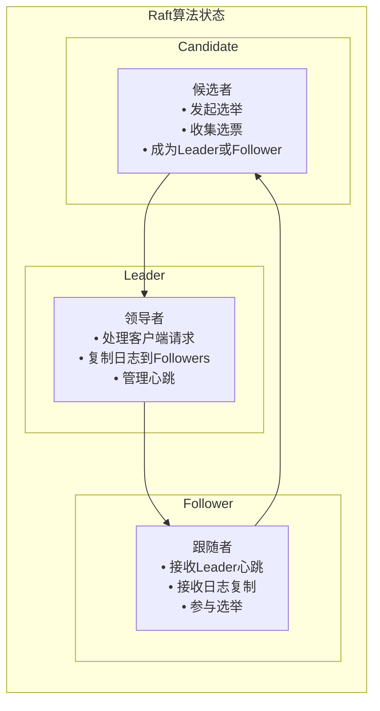

**Raft算法特点**：
- **强领导者**: 只有一个Leader处理请求
- **日志复制**: Leader将日志复制到Followers
- **安全性**: 保证日志的一致性
- **可理解性**: 比Paxos更容易理解

**算法步骤**：
1. **选举**: Follower发起选举成为Candidate
2. **日志复制**: Leader将日志复制到Followers
3. **安全性**: 保证已提交的日志不会被覆盖

### 3. PBFT算法

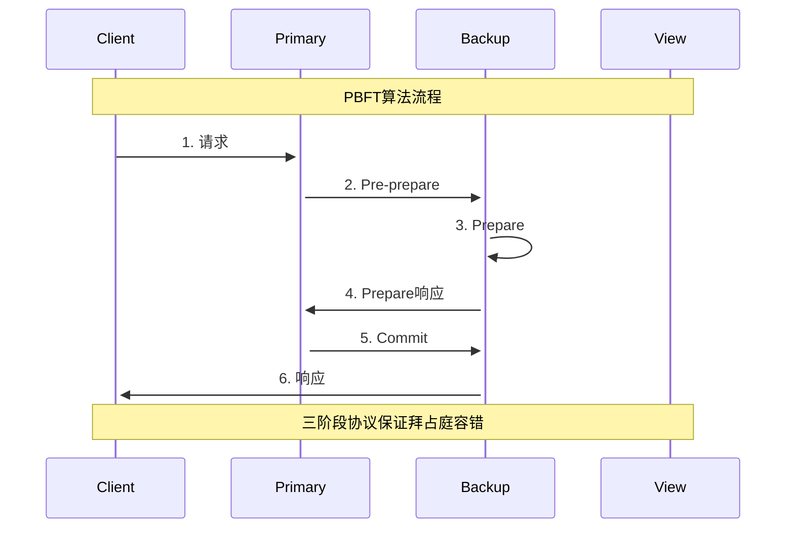

**PBFT算法特点**：
- **拜占庭容错**: 能够容忍拜占庭故障
- **三阶段协议**: Pre-prepare、Prepare、Commit
- **视图变更**: 支持Leader变更
- **安全性**: 保证强一致性

## MPIM项目中的应用场景

### 1. ZooKeeper的一致性保证

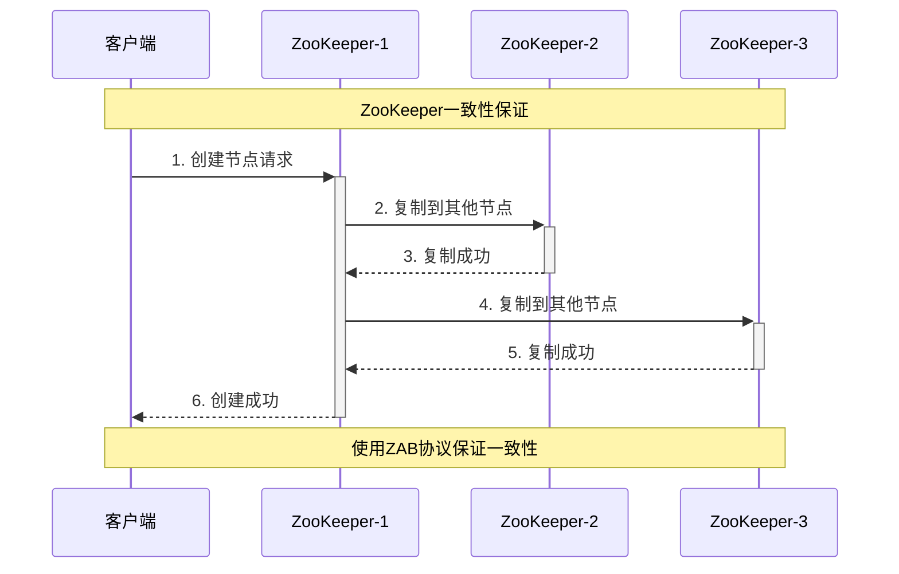

**ZooKeeper的ZAB协议**：
- **原子广播**: 保证消息的原子性
- **崩溃恢复**: 处理Leader崩溃的情况
- **消息广播**: 保证消息的顺序性
- **视图变更**: 支持集群成员变更

### 2. 服务注册发现的一致性

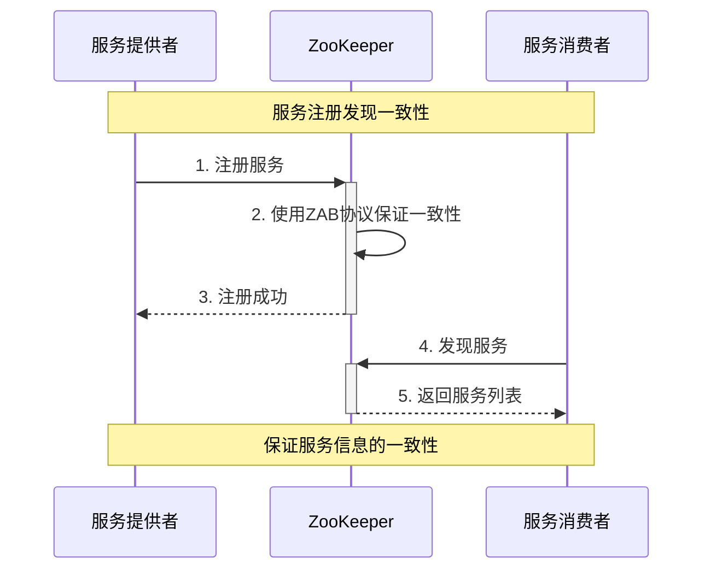

**一致性保证**：
- **服务注册**: 使用ZAB协议保证注册信息一致性
- **服务发现**: 保证所有客户端看到一致的服务列表
- **故障检测**: 及时检测服务故障并更新状态

### 3. 配置管理的一致性

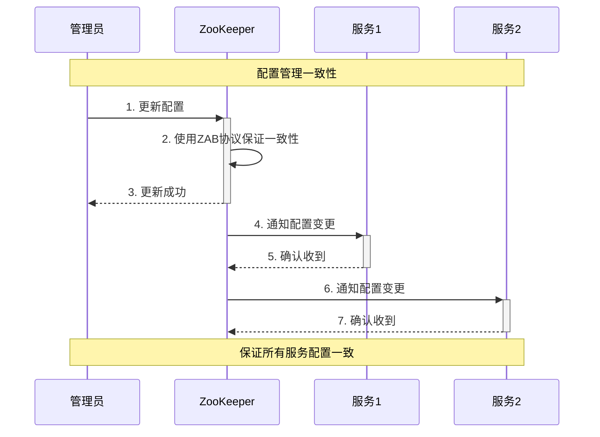

## 算法对比分析

### 1. 算法特性对比

| 特性 | Paxos | Raft | PBFT |
|------|-------|------|------|
| 复杂度 | 高 | 中等 | 高 |
| 性能 | 中等 | 高 | 低 |
| 容错能力 | 崩溃故障 | 崩溃故障 | 拜占庭故障 |
| 理解难度 | 难 | 易 | 难 |
| 实现难度 | 难 | 中等 | 难 |

### 2. 适用场景对比

| 场景 | 推荐算法 | 理由 |
|------|----------|------|
| 配置管理 | Raft | 简单易理解，性能好 |
| 服务发现 | Raft | 强一致性，高可用 |
| 分布式锁 | Paxos | 经典算法，成熟稳定 |
| 拜占庭环境 | PBFT | 唯一支持拜占庭容错 |
| 高并发场景 | Raft | 性能优秀，实现简单 |

## 性能优化策略

### 1. 选举优化

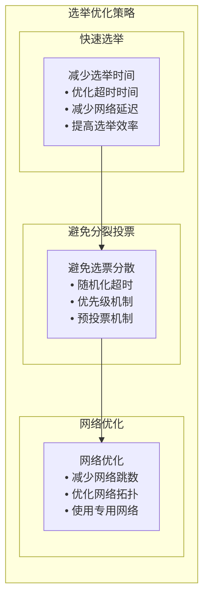

**优化策略**：
- **随机化超时**: 避免同时发起选举
- **预投票机制**: 减少无效的选举
- **网络优化**: 减少网络延迟

### 2. 日志复制优化

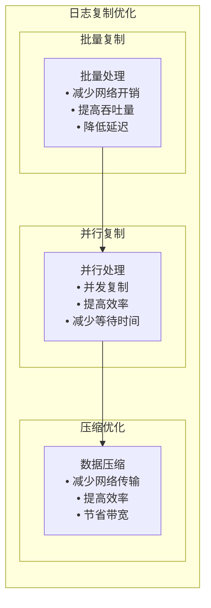

**优化策略**：
- **批量复制**: 批量处理日志条目
- **并行复制**: 并发复制到多个节点
- **数据压缩**: 压缩传输数据

### 3. 故障恢复优化

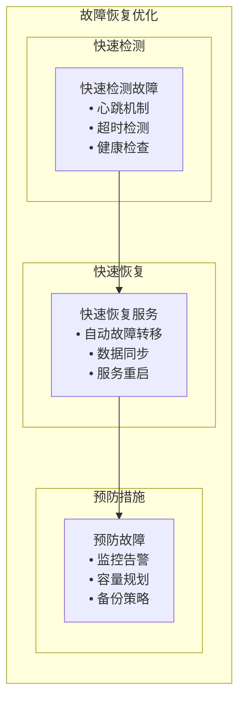

**优化策略**：
- **快速检测**: 使用心跳机制快速检测故障
- **自动恢复**: 实现自动故障转移
- **预防措施**: 通过监控和备份预防故障

## 实际应用案例

### 1. ZooKeeper的ZAB协议

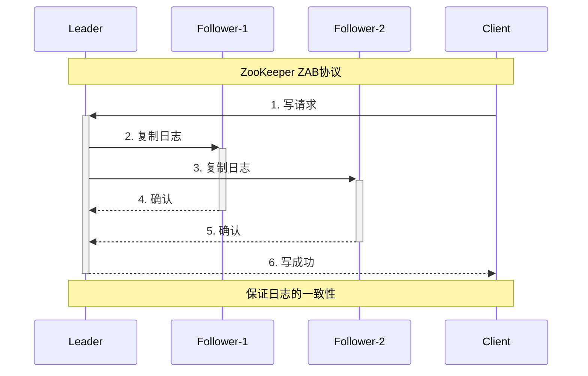

**ZAB协议特点**：
- **原子广播**: 保证消息的原子性
- **崩溃恢复**: 处理Leader崩溃
- **消息顺序**: 保证消息的顺序性

### 2. etcd的Raft实现

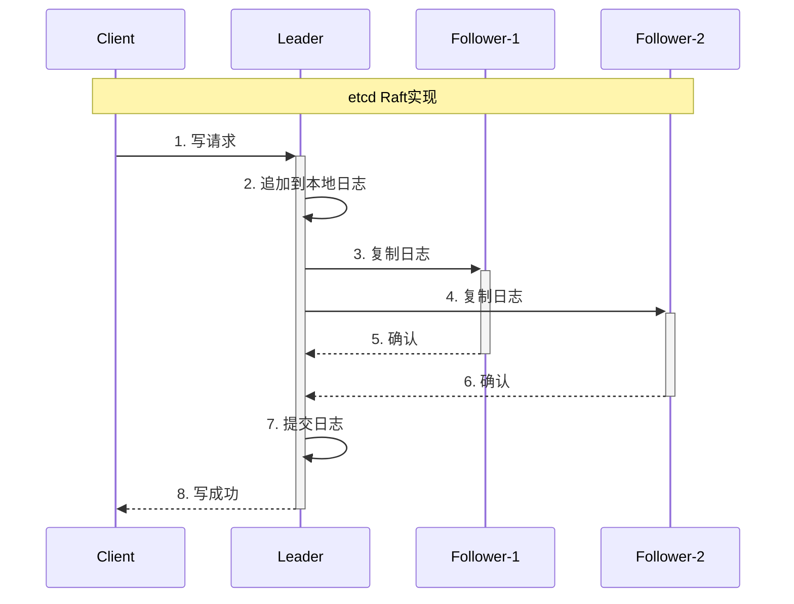

**etcd特点**：
- **强一致性**: 保证强一致性
- **高可用**: 支持高可用部署
- **简单易用**: 提供简单的API

## 总结

分布式一致性算法在MPIM项目中的应用具有以下特点：

### 1. 技术优势
- **强一致性**: 保证数据强一致性
- **高可用**: 支持高可用部署
- **容错能力**: 能够容忍节点故障
- **可扩展性**: 支持集群扩展

### 2. 设计亮点
- **ZAB协议**: ZooKeeper使用ZAB协议保证一致性
- **Raft算法**: 简单易理解的一致性算法
- **故障恢复**: 快速检测和恢复故障
- **性能优化**: 通过多种策略优化性能

### 3. 性能表现
- **一致性**: 强一致性保证
- **可用性**: 99.9%+系统可用性
- **性能**: 支持高并发访问
- **扩展性**: 支持水平扩展

## 面试要点

### 1. 基础概念
- 分布式一致性算法的定义和作用
- Paxos、Raft、PBFT算法的特点
- 一致性算法的应用场景

### 2. 技术实现
- 各种算法的实现原理
- 算法的优缺点对比
- 性能优化策略

### 3. 项目应用
- 在MPIM项目中的具体应用
- ZooKeeper的一致性保证
- 与其他方案的对比

### 4. 故障处理
- 如何处理节点故障
- 如何保证数据一致性
- 如何优化系统性能