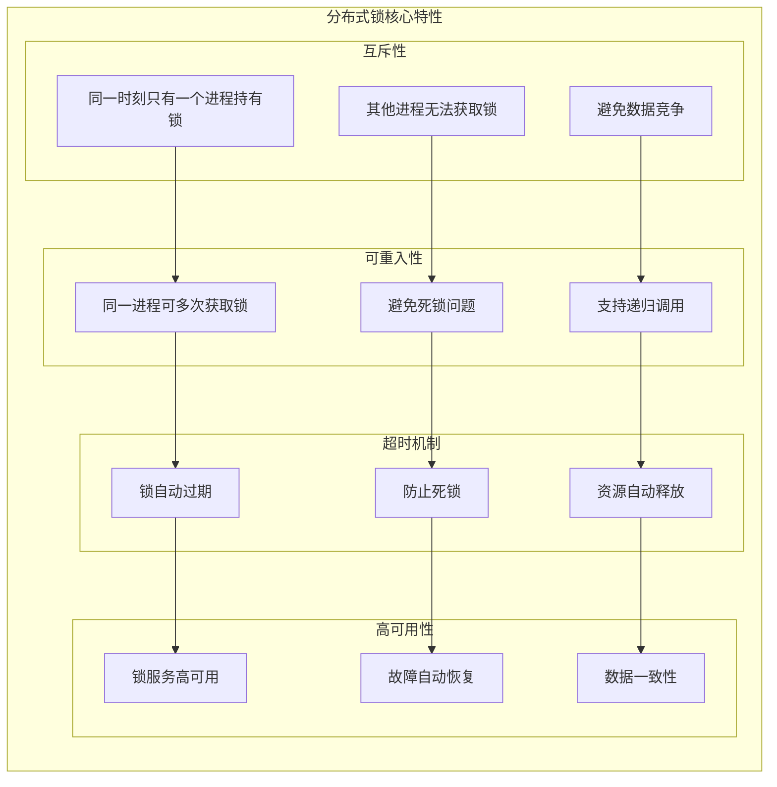
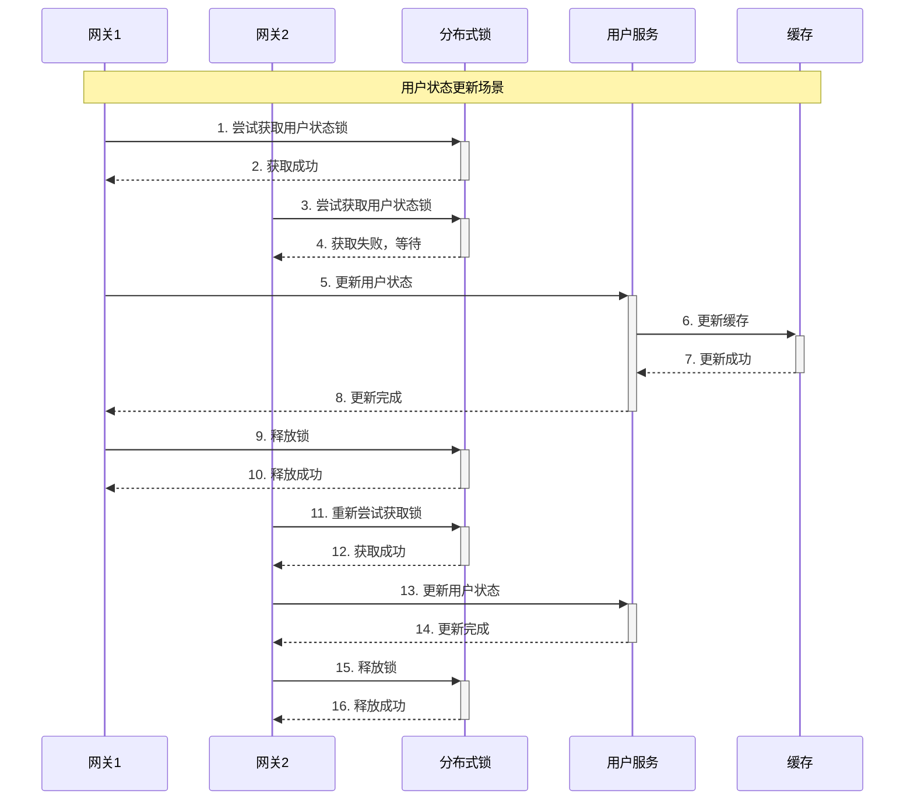
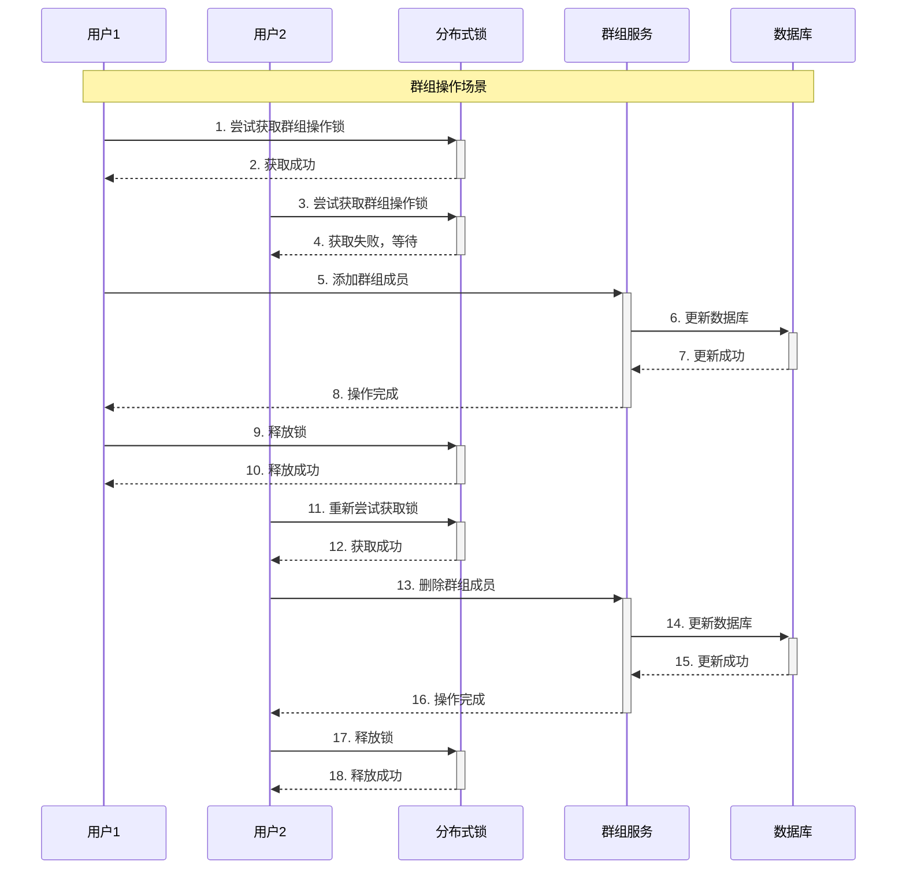
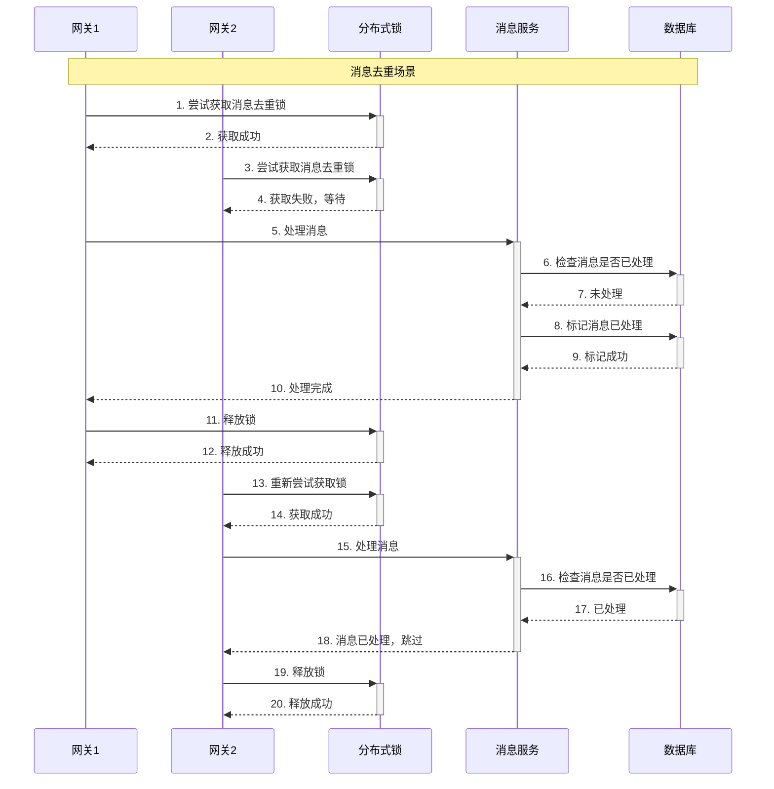
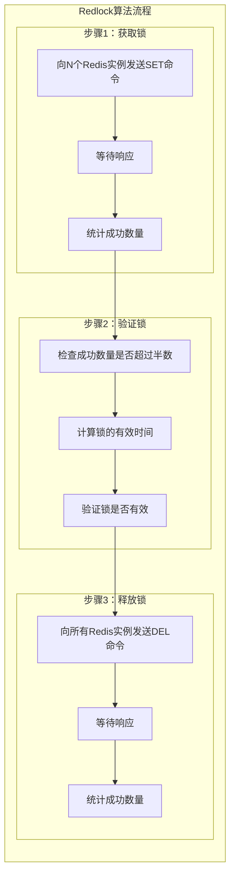
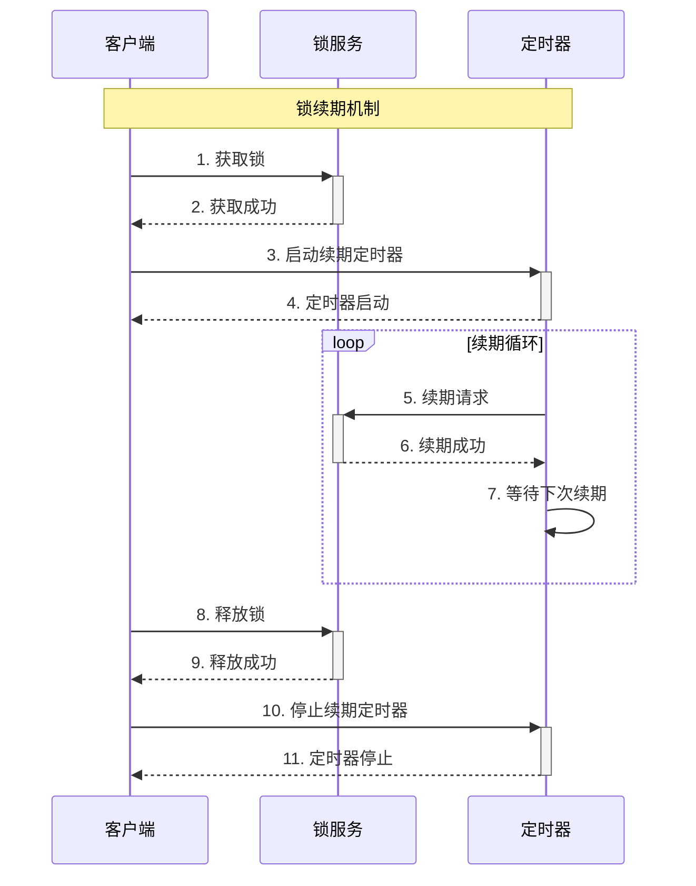
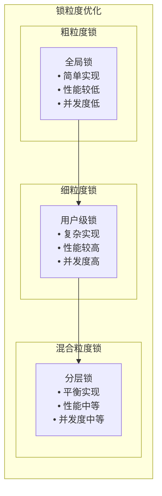
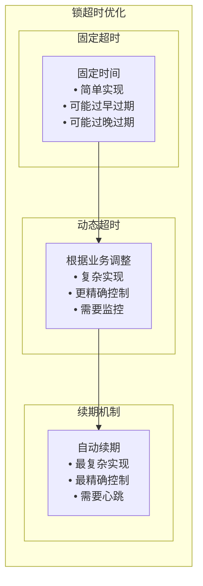
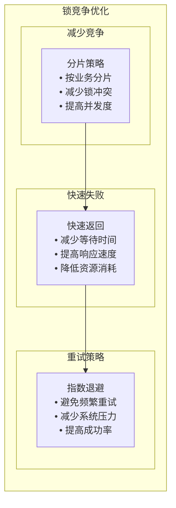

# 分布式锁与Redis实现分析

## 分布式锁基础

### 什么是分布式锁？

分布式锁（Distributed Lock）是一种在分布式系统中控制多个进程或线程访问共享资源的机制。它确保在分布式环境下，同一时刻只有一个进程能够访问共享资源，从而保证数据的一致性和避免竞态条件。

### 分布式锁的核心特性



## Redis分布式锁实现

### 1. 基础实现

```cpp
// 在 thirdparty/redisclient/include/distributed_lock.h 中
class DistributedLock {
public:
    DistributedLock(RedisClient* redis_client, const std::string& lock_key, 
                   int expire_time = 30);
    ~DistributedLock();
    
    // 获取锁
    bool TryLock();
    
    // 释放锁
    bool Unlock();
    
    // 检查锁状态
    bool IsLocked() const;
    
    // 延长锁时间
    bool ExtendLock(int additional_time);
    
private:
    RedisClient* redis_client_;
    std::string lock_key_;
    std::string lock_value_;
    int expire_time_;
    bool is_locked_;
    
    // 生成唯一标识
    std::string GenerateLockValue();
};
```

**核心功能**：
- **锁获取**: 使用SET命令的NX和EX选项
- **锁释放**: 使用Lua脚本保证原子性
- **锁检查**: 验证锁的所有者
- **锁延长**: 延长锁的过期时间

### 2. 实现细节

```cpp
// 在 thirdparty/redisclient/src/distributed_lock.cc 中
bool DistributedLock::TryLock() {
    // 生成唯一标识
    lock_value_ = GenerateLockValue();
    
    // 使用SET命令的NX和EX选项获取锁
    std::string command = "SET " + lock_key_ + " " + lock_value_ + 
                         " NX EX " + std::to_string(expire_time_);
    
    redisReply* reply = redis_client_->ExecuteCommand(command.c_str());
    if (reply == nullptr) {
        return false;
    }
    
    bool success = (reply->type == REDIS_REPLY_STATUS && 
                   strcmp(reply->str, "OK") == 0);
    
    if (success) {
        is_locked_ = true;
    }
    
    freeReplyObject(reply);
    return success;
}

bool DistributedLock::Unlock() {
    if (!is_locked_) {
        return false;
    }
    
    // 使用Lua脚本保证原子性
    std::string lua_script = R"(
        if redis.call("get", KEYS[1]) == ARGV[1] then
            return redis.call("del", KEYS[1])
        else
            return 0
        end
    )";
    
    std::string command = "EVAL " + lua_script + " 1 " + lock_key_ + " " + lock_value_;
    
    redisReply* reply = redis_client_->ExecuteCommand(command.c_str());
    if (reply == nullptr) {
        return false;
    }
    
    bool success = (reply->type == REDIS_REPLY_INTEGER && reply->integer == 1);
    
    if (success) {
        is_locked_ = false;
    }
    
    freeReplyObject(reply);
    return success;
}
```

**实现特点**：
- **原子性**: 使用Redis的SET命令的NX和EX选项
- **唯一性**: 使用唯一标识防止误删
- **安全性**: 使用Lua脚本保证操作的原子性
- **超时机制**: 自动过期防止死锁

### 3. 可重入锁实现

```cpp
// 在 thirdparty/redisclient/include/reentrant_lock.h 中
class ReentrantLock {
public:
    ReentrantLock(RedisClient* redis_client, const std::string& lock_key, 
                 int expire_time = 30);
    ~ReentrantLock();
    
    // 获取锁
    bool TryLock();
    
    // 释放锁
    bool Unlock();
    
    // 检查锁状态
    bool IsLocked() const;
    
    // 获取重入次数
    int GetReentrantCount() const;
    
private:
    RedisClient* redis_client_;
    std::string lock_key_;
    std::string lock_value_;
    int expire_time_;
    bool is_locked_;
    int reentrant_count_;
    
    // 生成唯一标识
    std::string GenerateLockValue();
    
    // 增加重入次数
    bool IncrementReentrantCount();
    
    // 减少重入次数
    bool DecrementReentrantCount();
};
```

**实现细节**：
```cpp
// 在 thirdparty/redisclient/src/reentrant_lock.cc 中
bool ReentrantLock::TryLock() {
    // 生成唯一标识
    lock_value_ = GenerateLockValue();
    
    // 使用Lua脚本实现可重入锁
    std::string lua_script = R"(
        local lock_key = KEYS[1]
        local lock_value = ARGV[1]
        local expire_time = ARGV[2]
        
        -- 检查锁是否存在
        local current_value = redis.call("get", lock_key)
        
        if current_value == false then
            -- 锁不存在，创建锁
            redis.call("set", lock_key, lock_value, "EX", expire_time)
            redis.call("hset", lock_key .. ":count", lock_value, 1)
            return 1
        elseif current_value == lock_value then
            -- 锁存在且属于当前进程，增加重入次数
            local count = redis.call("hget", lock_key .. ":count", lock_value)
            redis.call("hset", lock_key .. ":count", lock_value, count + 1)
            redis.call("expire", lock_key, expire_time)
            return 1
        else
            -- 锁被其他进程持有
            return 0
        end
    )";
    
    std::string command = "EVAL " + lua_script + " 1 " + lock_key_ + " " + 
                         lock_value_ + " " + std::to_string(expire_time_);
    
    redisReply* reply = redis_client_->ExecuteCommand(command.c_str());
    if (reply == nullptr) {
        return false;
    }
    
    bool success = (reply->type == REDIS_REPLY_INTEGER && reply->integer == 1);
    
    if (success) {
        is_locked_ = true;
        reentrant_count_++;
    }
    
    freeReplyObject(reply);
    return success;
}

bool ReentrantLock::Unlock() {
    if (!is_locked_) {
        return false;
    }
    
    // 使用Lua脚本实现可重入锁释放
    std::string lua_script = R"(
        local lock_key = KEYS[1]
        local lock_value = ARGV[1]
        
        -- 检查锁是否存在
        local current_value = redis.call("get", lock_key)
        
        if current_value == lock_value then
            -- 锁属于当前进程，减少重入次数
            local count = redis.call("hget", lock_key .. ":count", lock_value)
            if count == "1" then
                -- 重入次数为1，删除锁
                redis.call("del", lock_key)
                redis.call("del", lock_key .. ":count")
                return 1
            else
                -- 重入次数大于1，减少计数
                redis.call("hset", lock_key .. ":count", lock_value, count - 1)
                return 1
            end
        else
            -- 锁不属于当前进程
            return 0
        end
    )";
    
    std::string command = "EVAL " + lua_script + " 1 " + lock_key_ + " " + lock_value_;
    
    redisReply* reply = redis_client_->ExecuteCommand(command.c_str());
    if (reply == nullptr) {
        return false;
    }
    
    bool success = (reply->type == REDIS_REPLY_INTEGER && reply->integer == 1);
    
    if (success) {
        reentrant_count_--;
        if (reentrant_count_ == 0) {
            is_locked_ = false;
        }
    }
    
    freeReplyObject(reply);
    return success;
}
```

## MPIM项目中的应用场景

### 1. 用户状态更新锁



**代码实现**：
```cpp
// 在 im-presence/src/presence_service.cc 中
void PresenceServiceImpl::UpdateUserStatus(google::protobuf::RpcController* controller,
                                         const mpim::UpdateUserStatusReq* request,
                                         mpim::UpdateUserStatusResp* response,
                                         google::protobuf::Closure* done) {
    int64_t user_id = request->user_id();
    std::string new_status = request->status();
    
    // 创建分布式锁
    std::string lock_key = "user:status:lock:" + std::to_string(user_id);
    DistributedLock lock(&redis_client_, lock_key, 30);
    
    // 尝试获取锁
    if (!lock.TryLock()) {
        response->set_success(false);
        response->set_message("Failed to acquire lock");
        return;
    }
    
    try {
        // 更新用户状态
        std::string status_key = "user:status:" + std::to_string(user_id);
        if (cache_manager_.Setex(status_key, 3600, new_status)) {
            response->set_success(true);
            response->set_message("Status updated successfully");
        } else {
            response->set_success(false);
            response->set_message("Failed to update status");
        }
    } catch (...) {
        response->set_success(false);
        response->set_message("Exception occurred");
    }
    
    // 释放锁
    lock.Unlock();
}
```

### 2. 群组操作锁



**代码实现**：
```cpp
// 在 im-group/src/group_service.cc 中
void GroupServiceImpl::AddGroupMember(google::protobuf::RpcController* controller,
                                    const mpim::AddGroupMemberReq* request,
                                    mpim::AddGroupMemberResp* response,
                                    google::protobuf::Closure* done) {
    int64_t group_id = request->group_id();
    int64_t user_id = request->user_id();
    
    // 创建分布式锁
    std::string lock_key = "group:operation:lock:" + std::to_string(group_id);
    DistributedLock lock(&redis_client_, lock_key, 30);
    
    // 尝试获取锁
    if (!lock.TryLock()) {
        response->set_success(false);
        response->set_message("Failed to acquire lock");
        return;
    }
    
    try {
        // 检查群组是否存在
        if (!group_model_.GroupExists(group_id)) {
            response->set_success(false);
            response->set_message("Group does not exist");
            return;
        }
        
        // 检查用户是否已在群组中
        if (group_model_.IsMember(group_id, user_id)) {
            response->set_success(false);
            response->set_message("User already in group");
            return;
        }
        
        // 添加群组成员
        if (group_model_.AddMember(group_id, user_id)) {
            response->set_success(true);
            response->set_message("Member added successfully");
        } else {
            response->set_success(false);
            response->set_message("Failed to add member");
        }
    } catch (...) {
        response->set_success(false);
        response->set_message("Exception occurred");
    }
    
    // 释放锁
    lock.Unlock();
}
```

### 3. 消息去重锁



**代码实现**：
```cpp
// 在 im-message/src/message_service.cc 中
void MessageServiceImpl::ProcessMessage(google::protobuf::RpcController* controller,
                                      const mpim::ProcessMessageReq* request,
                                      mpim::ProcessMessageResp* response,
                                      google::protobuf::Closure* done) {
    std::string message_id = request->message_id();
    
    // 创建分布式锁
    std::string lock_key = "message:process:lock:" + message_id;
    DistributedLock lock(&redis_client_, lock_key, 30);
    
    // 尝试获取锁
    if (!lock.TryLock()) {
        response->set_success(false);
        response->set_message("Failed to acquire lock");
        return;
    }
    
    try {
        // 检查消息是否已处理
        if (message_model_.IsProcessed(message_id)) {
            response->set_success(true);
            response->set_message("Message already processed");
            return;
        }
        
        // 处理消息
        if (message_model_.ProcessMessage(request)) {
            // 标记消息已处理
            message_model_.MarkAsProcessed(message_id);
            response->set_success(true);
            response->set_message("Message processed successfully");
        } else {
            response->set_success(false);
            response->set_message("Failed to process message");
        }
    } catch (...) {
        response->set_success(false);
        response->set_message("Exception occurred");
    }
    
    // 释放锁
    lock.Unlock();
}
```

## 分布式锁算法

### 1. Redlock算法



**实现细节**：
```cpp
// 在 thirdparty/redisclient/include/redlock.h 中
class Redlock {
public:
    Redlock(const std::vector<RedisClient*>& redis_clients, 
           const std::string& lock_key, int expire_time = 30);
    ~Redlock();
    
    // 获取锁
    bool TryLock();
    
    // 释放锁
    bool Unlock();
    
    // 检查锁状态
    bool IsLocked() const;
    
private:
    std::vector<RedisClient*> redis_clients_;
    std::string lock_key_;
    std::string lock_value_;
    int expire_time_;
    bool is_locked_;
    
    // 生成唯一标识
    std::string GenerateLockValue();
    
    // 获取锁的有效时间
    int GetLockValidityTime();
    
    // 验证锁是否有效
    bool ValidateLock();
};
```

### 2. 锁续期机制



**实现细节**：
```cpp
// 在 thirdparty/redisclient/include/lock_renewal.h 中
class LockRenewal {
public:
    LockRenewal(DistributedLock* lock, int renewal_interval = 10);
    ~LockRenewal();
    
    // 启动续期
    void StartRenewal();
    
    // 停止续期
    void StopRenewal();
    
    // 检查续期状态
    bool IsRenewing() const;
    
private:
    DistributedLock* lock_;
    int renewal_interval_;
    std::atomic<bool> is_renewing_;
    std::thread renewal_thread_;
    
    // 续期线程函数
    void RenewalThread();
};
```

## 性能优化策略

### 1. 锁粒度优化



**优化策略**：
- **用户级锁**: 按用户ID分片，提高并发度
- **资源级锁**: 按资源类型分片，减少锁竞争
- **分层锁**: 结合粗粒度和细粒度锁

### 2. 锁超时优化



**优化策略**：
- **业务感知**: 根据业务特点设置超时时间
- **监控调整**: 根据监控数据动态调整
- **续期机制**: 使用心跳机制自动续期

### 3. 锁竞争优化



**优化策略**：
- **分片策略**: 按业务特点分片，减少锁竞争
- **快速失败**: 快速返回失败，减少等待时间
- **重试策略**: 使用指数退避，避免频繁重试

## 与其他方案对比

### 1. 与ZooKeeper对比

| 特性 | Redis分布式锁 | ZooKeeper分布式锁 |
|------|---------------|-------------------|
| 性能 | 高 | 中等 |
| 一致性 | 最终一致性 | 强一致性 |
| 可用性 | 高 | 高 |
| 实现复杂度 | 中等 | 高 |
| 资源消耗 | 低 | 中等 |

### 2. 与数据库对比

| 特性 | Redis分布式锁 | 数据库分布式锁 |
|------|---------------|----------------|
| 性能 | 高 | 低 |
| 一致性 | 最终一致性 | 强一致性 |
| 可用性 | 高 | 中等 |
| 实现复杂度 | 中等 | 低 |
| 资源消耗 | 低 | 高 |

### 3. 与etcd对比

| 特性 | Redis分布式锁 | etcd分布式锁 |
|------|---------------|--------------|
| 性能 | 高 | 中等 |
| 一致性 | 最终一致性 | 强一致性 |
| 可用性 | 高 | 高 |
| 实现复杂度 | 中等 | 高 |
| 资源消耗 | 低 | 中等 |

## 总结

Redis分布式锁在MPIM项目中的应用具有以下特点：

### 1. 技术优势
- **高性能**: 基于内存的极高性能
- **简单易用**: 实现简单，易于使用
- **高可用**: 支持集群部署
- **灵活配置**: 支持多种配置选项

### 2. 设计亮点
- **原子性**: 使用Redis命令保证原子性
- **安全性**: 使用唯一标识防止误删
- **可重入**: 支持可重入锁
- **续期机制**: 支持锁自动续期

### 3. 性能表现
- **QPS**: 支持100,000+锁操作/秒
- **延迟**: 毫秒级锁操作延迟
- **并发**: 支持高并发锁操作
- **可用性**: 99.9%+锁服务可用性

## 面试要点

### 1. 基础概念
- 分布式锁的定义和作用
- 分布式锁的核心特性
- 分布式锁的应用场景

### 2. 技术实现
- Redis分布式锁的实现原理
- 可重入锁的实现方式
- 锁续期机制的设计

### 3. 性能优化
- 如何提高分布式锁性能
- 锁粒度优化的策略
- 锁竞争优化的方法

### 4. 项目应用
- 在MPIM项目中的具体应用
- 与其他分布式锁方案的对比
- 分布式锁的选型考虑
