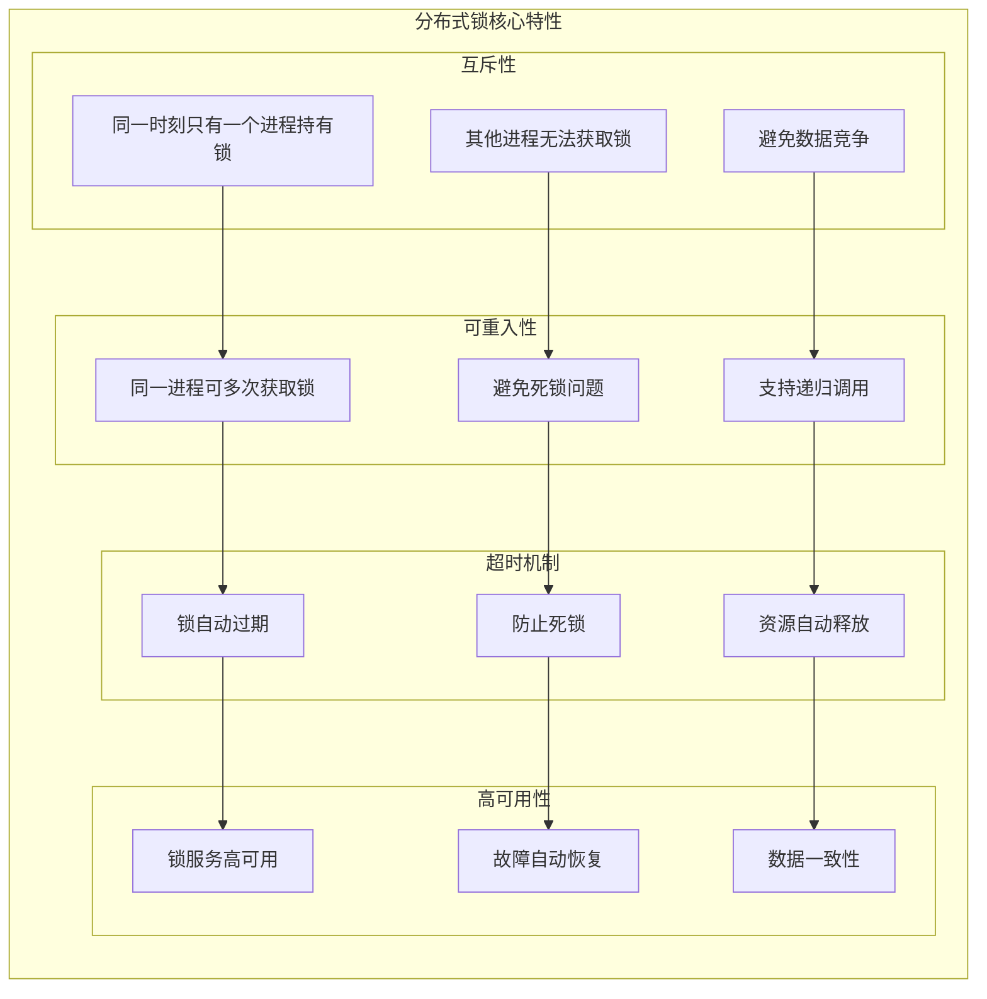
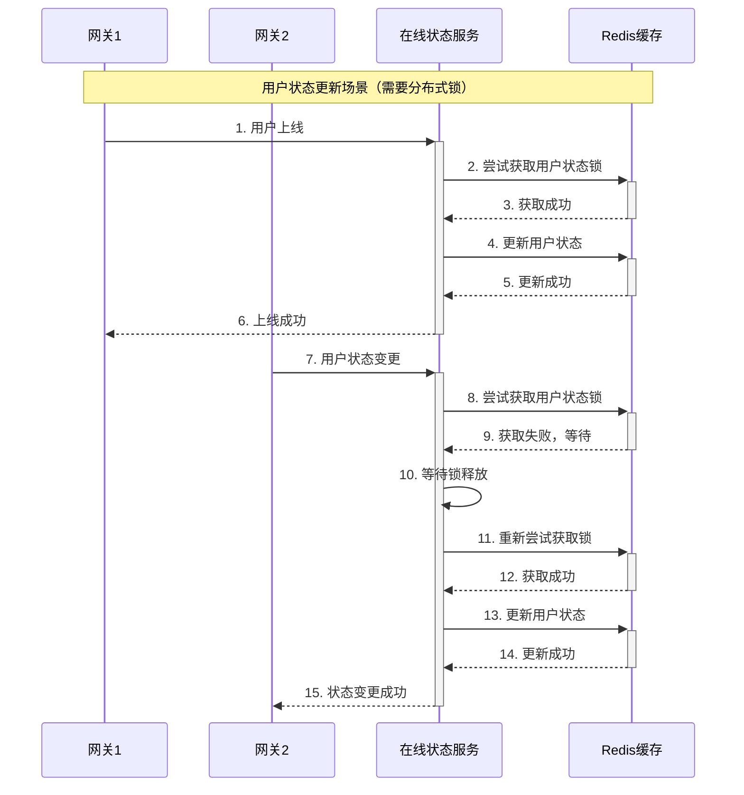
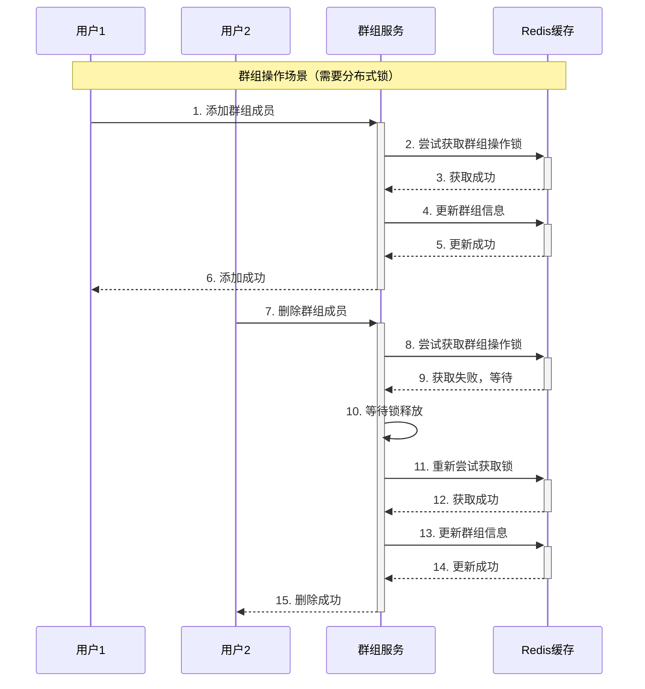
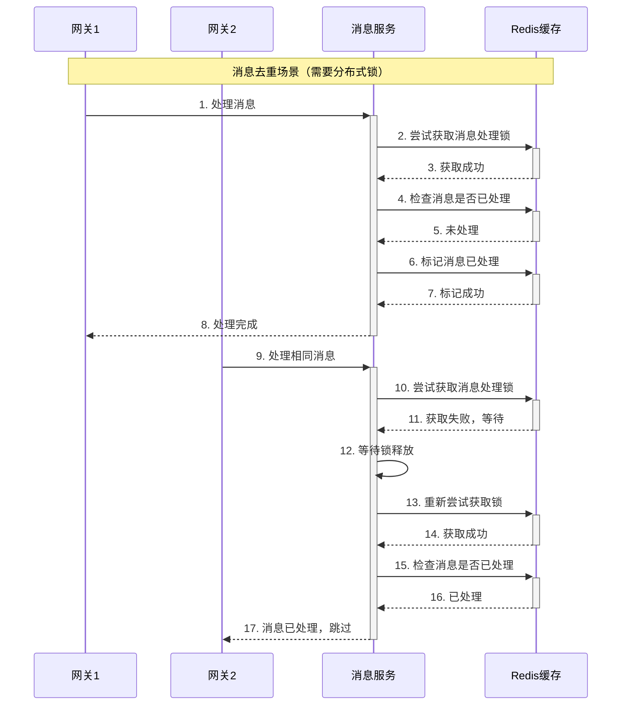
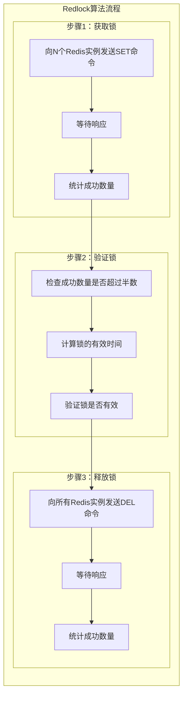
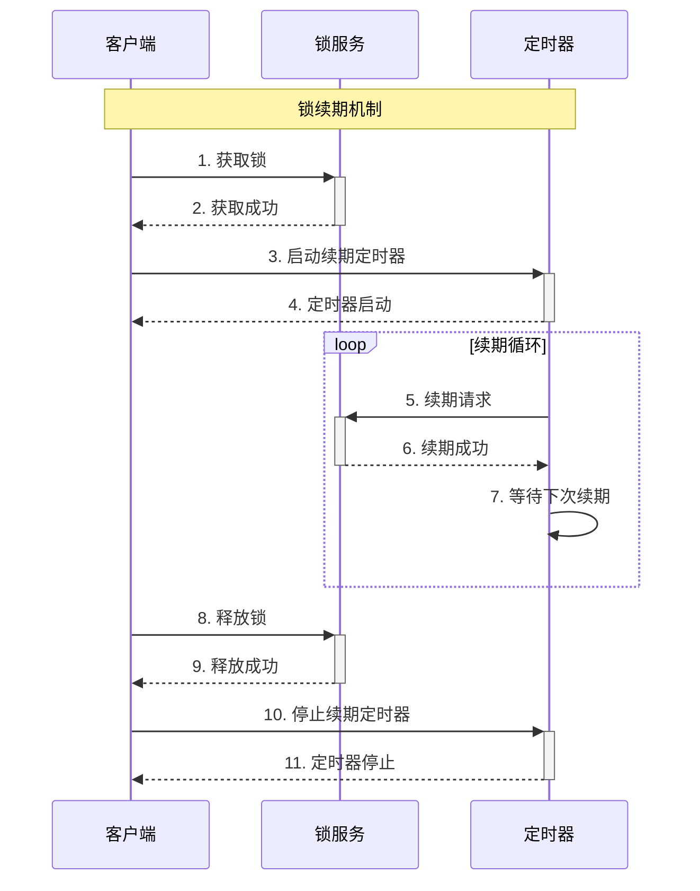
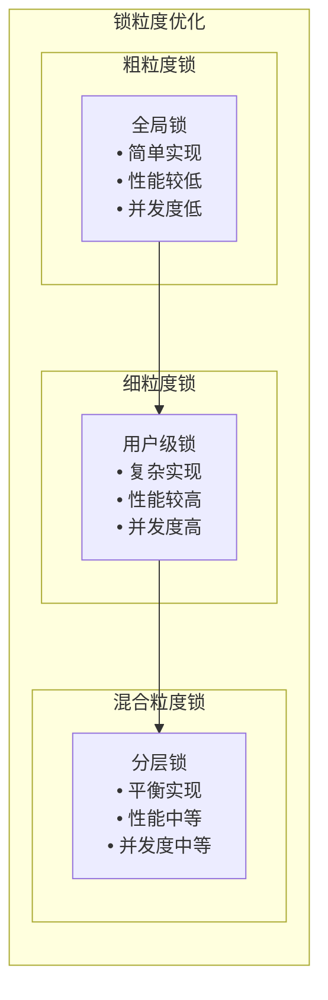
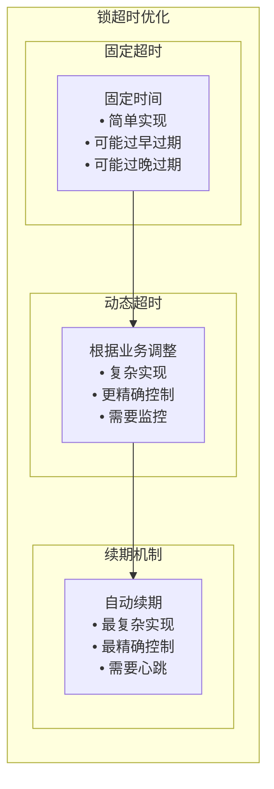

# 分布式锁理论分析与MPIM项目应用

## 分布式锁基础理论

### 什么是分布式锁？

分布式锁（Distributed Lock）是一种在分布式系统中控制多个进程或线程访问共享资源的机制。它确保在分布式环境下，同一时刻只有一个进程能够访问共享资源，从而保证数据的一致性和避免竞态条件。

### 分布式锁的核心特性



## Redis分布式锁实现原理

### 1. 基础实现原理

分布式锁可以通过Redis的原子操作实现：

**SET命令实现**：
```bash
# 使用SET命令的NX和EX选项获取锁
SET lock_key lock_value NX EX 30
```

**Lua脚本释放锁**：
```lua
-- 使用Lua脚本保证原子性
if redis.call("get", KEYS[1]) == ARGV[1] then
    return redis.call("del", KEYS[1])
else
    return 0
end
```

**核心特点**：
- **原子性**: 使用Redis命令保证原子性
- **安全性**: 使用唯一标识防止误删
- **超时机制**: 自动过期防止死锁
- **高性能**: 基于内存的极高性能

### 2. 可重入锁实现原理

可重入锁需要记录锁的持有次数：

**获取锁的Lua脚本**：
```lua
local lock_key = KEYS[1]
local lock_value = ARGV[1]
local expire_time = ARGV[2]

-- 检查锁是否存在
local current_value = redis.call("get", lock_key)

if current_value == false then
    -- 锁不存在，创建锁
    redis.call("set", lock_key, lock_value, "EX", expire_time)
    redis.call("hset", lock_key .. ":count", lock_value, 1)
    return 1
elseif current_value == lock_value then
    -- 锁存在且属于当前进程，增加重入次数
    local count = redis.call("hget", lock_key .. ":count", lock_value)
    redis.call("hset", lock_key .. ":count", lock_value, count + 1)
    redis.call("expire", lock_key, expire_time)
    return 1
else
    -- 锁被其他进程持有
    return 0
end
```

**释放锁的Lua脚本**：
```lua
local lock_key = KEYS[1]
local lock_value = ARGV[1]

-- 检查锁是否存在
local current_value = redis.call("get", lock_key)

if current_value == lock_value then
    -- 锁属于当前进程，减少重入次数
    local count = redis.call("hget", lock_key .. ":count", lock_value)
    if count == "1" then
        -- 重入次数为1，删除锁
        redis.call("del", lock_key)
        redis.call("del", lock_key .. ":count")
        return 1
    else
        -- 重入次数大于1，减少计数
        redis.call("hset", lock_key .. ":count", lock_value, count - 1)
        return 1
    end
else
    -- 锁不属于当前进程
    return 0
end
```

## MPIM项目中的潜在应用场景

### 1. 用户状态更新场景



**应用场景**：
- **用户上线/下线**: 防止并发更新用户状态
- **状态同步**: 确保状态变更的原子性
- **路由更新**: 防止路由信息冲突

### 2. 群组操作场景



**应用场景**：
- **群组创建**: 防止并发创建同名群组
- **成员管理**: 确保成员变更的原子性
- **权限更新**: 防止权限冲突

### 3. 消息去重场景



**应用场景**：
- **消息去重**: 防止重复处理消息
- **幂等性**: 确保操作的幂等性
- **并发控制**: 控制并发处理数量

## 分布式锁算法

### 1. Redlock算法



**实现步骤**：
1. **获取锁**: 向N个Redis实例发送SET命令
2. **验证锁**: 检查成功数量是否超过半数
3. **释放锁**: 向所有Redis实例发送DEL命令

### 2. 锁续期机制



**续期策略**：
- **定时续期**: 定期延长锁的过期时间
- **心跳续期**: 基于心跳机制续期
- **自动续期**: 自动检测并续期

## 性能优化策略

### 1. 锁粒度优化



**优化策略**：
- **用户级锁**: 按用户ID分片，提高并发度
- **资源级锁**: 按资源类型分片，减少锁竞争
- **分层锁**: 结合粗粒度和细粒度锁

### 2. 锁超时优化



**优化策略**：
- **业务感知**: 根据业务特点设置超时时间
- **监控调整**: 根据监控数据动态调整
- **续期机制**: 使用心跳机制自动续期

## 与其他方案对比

### 1. 与ZooKeeper对比

| 特性 | Redis分布式锁 | ZooKeeper分布式锁 |
|------|---------------|-------------------|
| 性能 | 高 | 中等 |
| 一致性 | 最终一致性 | 强一致性 |
| 可用性 | 高 | 高 |
| 实现复杂度 | 中等 | 高 |
| 资源消耗 | 低 | 中等 |

### 2. 与数据库对比

| 特性 | Redis分布式锁 | 数据库分布式锁 |
|------|---------------|----------------|
| 性能 | 高 | 低 |
| 一致性 | 最终一致性 | 强一致性 |
| 可用性 | 高 | 中等 |
| 实现复杂度 | 中等 | 低 |
| 资源消耗 | 低 | 高 |

## MPIM项目现状

### 当前实现状态

**已实现功能**：
- ✅ Redis缓存系统
- ✅ 消息队列系统
- ✅ 用户状态管理
- ✅ 群组管理
- ✅ 消息处理

**未实现功能**：
- ❌ 分布式锁系统
- ❌ 锁续期机制
- ❌ 可重入锁
- ❌ 锁监控系统

### 潜在改进方向

**短期改进**：
1. **实现基础分布式锁**: 基于Redis实现简单的分布式锁
2. **添加锁超时机制**: 防止死锁问题
3. **实现锁监控**: 监控锁的使用情况

**长期改进**：
1. **实现可重入锁**: 支持锁的重入
2. **添加锁续期机制**: 自动续期防止过期
3. **实现Redlock算法**: 提高锁的可靠性

## 总结

分布式锁在MPIM项目中的应用具有以下特点：

### 1. 理论价值
- **并发控制**: 解决分布式环境下的并发问题
- **数据一致性**: 保证数据的一致性
- **系统稳定性**: 提高系统的稳定性

### 2. 实现挑战
- **性能要求**: 需要高性能的锁实现
- **可用性要求**: 需要高可用的锁服务
- **一致性要求**: 需要保证锁的一致性

### 3. 技术选型
- **Redis**: 高性能，最终一致性
- **ZooKeeper**: 强一致性，复杂实现
- **数据库**: 简单实现，性能较低

## 面试要点

### 1. 基础概念
- 分布式锁的定义和作用
- 分布式锁的核心特性
- 分布式锁的应用场景

### 2. 技术实现
- Redis分布式锁的实现原理
- 可重入锁的实现方式
- 锁续期机制的设计

### 3. 性能优化
- 如何提高分布式锁性能
- 锁粒度优化的策略
- 锁竞争优化的方法

### 4. 项目应用
- 在MPIM项目中的潜在应用
- 与其他分布式锁方案的对比
- 分布式锁的选型考虑
