# 分布式监控与追踪分析

## 分布式监控基础

### 什么是分布式监控？

分布式监控（Distributed Monitoring）是指在分布式系统中，通过收集、分析、展示系统运行状态和性能指标，实现对系统健康状态的实时监控和问题诊断。它包括指标监控、日志监控、链路追踪等多个方面。

### 分布式监控的核心挑战

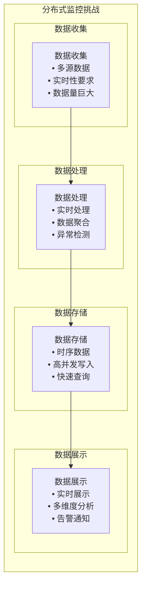

## 监控指标体系

### 1. 系统指标

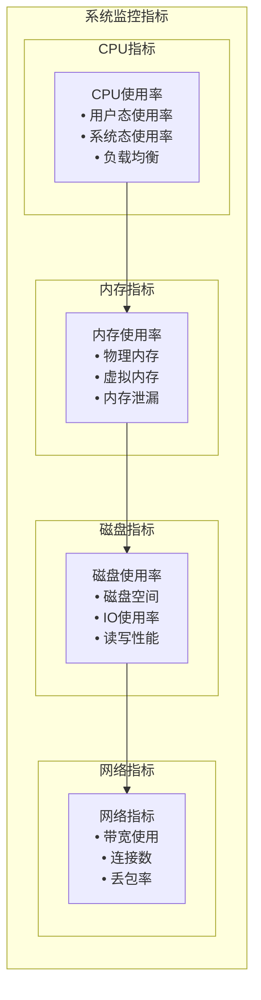

**系统指标**：
- **CPU**: 使用率、负载、上下文切换
- **内存**: 使用率、可用内存、交换分区
- **磁盘**: 使用率、IOPS、吞吐量
- **网络**: 带宽、连接数、丢包率

### 2. 应用指标

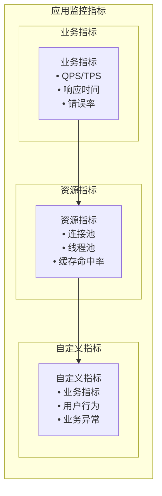

**应用指标**：
- **业务指标**: QPS、响应时间、错误率
- **资源指标**: 连接池、线程池、缓存
- **自定义指标**: 业务特定指标

### 3. 基础设施指标

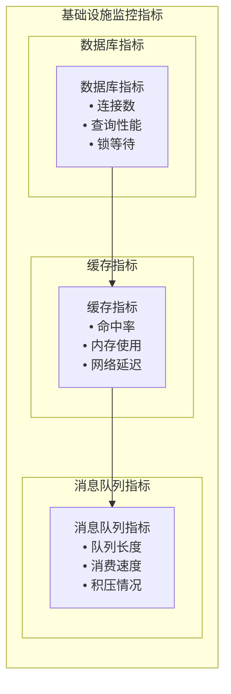

**基础设施指标**：
- **数据库**: 连接数、查询性能、锁等待
- **缓存**: 命中率、内存使用、延迟
- **消息队列**: 队列长度、消费速度

## 链路追踪系统

### 1. 链路追踪原理

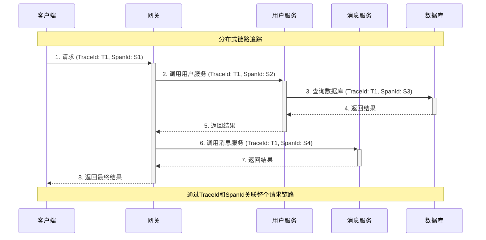

**链路追踪核心概念**：
- **Trace**: 一次完整的请求链路
- **Span**: 链路中的一个操作单元
- **TraceId**: 唯一标识一个请求链路
- **SpanId**: 唯一标识一个操作单元

### 2. 链路追踪实现

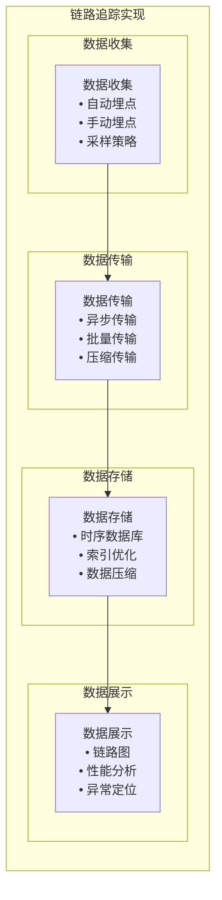

**实现策略**：
- **自动埋点**: 通过AOP自动埋点
- **手动埋点**: 关键业务逻辑手动埋点
- **采样策略**: 根据业务需求设置采样率
- **异步传输**: 避免影响业务性能

## MPIM项目中的监控实现

### 1. 系统监控架构

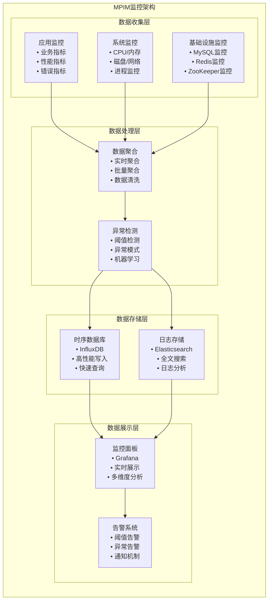

### 2. 业务监控实现

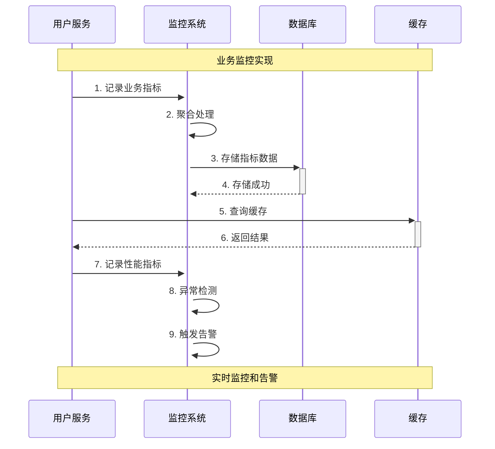

**业务监控指标**：
- **用户服务**: 注册数、登录数、好友操作数
- **消息服务**: 发送消息数、接收消息数、消息延迟
- **群组服务**: 创建群组数、加入群组数、群组操作数
- **在线状态**: 在线用户数、连接数、状态变更数

### 3. 性能监控实现

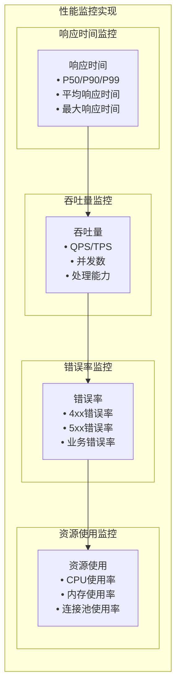

**性能监控指标**：
- **响应时间**: P50/P90/P99响应时间
- **吞吐量**: QPS、TPS、并发数
- **错误率**: 4xx/5xx错误率
- **资源使用**: CPU、内存、连接池

## 告警系统设计

### 1. 告警规则设计

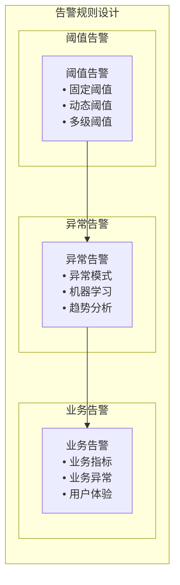

**告警规则**：
- **阈值告警**: 设置固定或动态阈值
- **异常告警**: 检测异常模式和趋势
- **业务告警**: 监控业务指标和用户体验

### 2. 告警处理流程

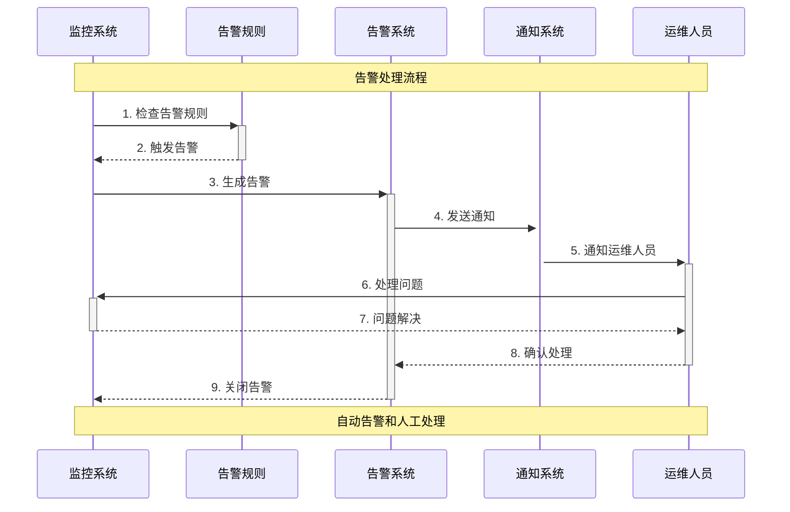

**告警处理**：
- **告警生成**: 根据规则生成告警
- **告警通知**: 多渠道通知运维人员
- **告警处理**: 人工处理或自动恢复
- **告警关闭**: 问题解决后关闭告警

## 日志监控与分析

### 1. 日志收集架构

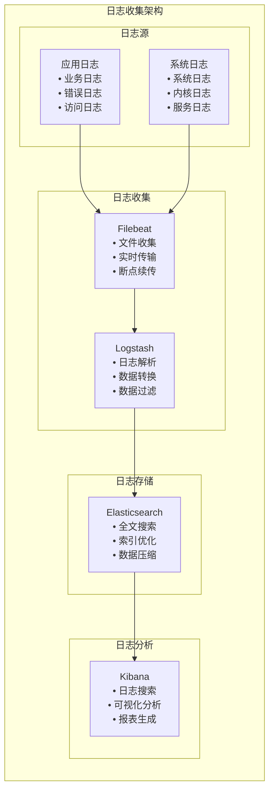

### 2. 日志分析实现

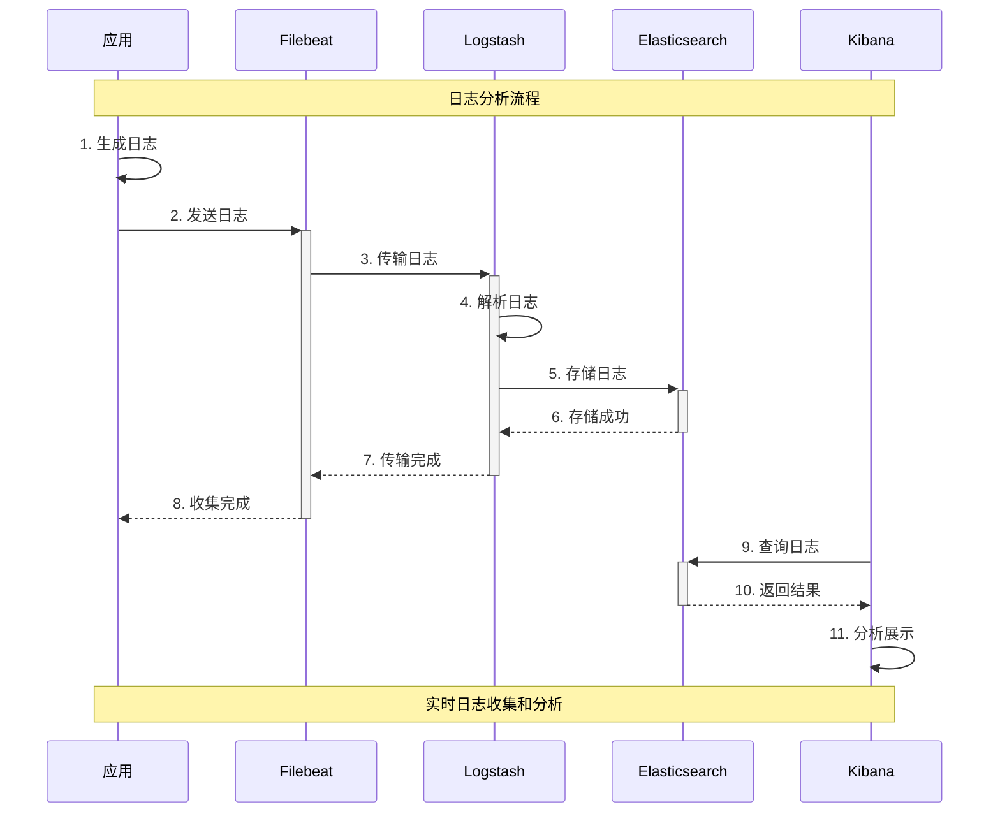

**日志分析功能**：
- **日志搜索**: 全文搜索和条件过滤
- **日志分析**: 统计分析和趋势分析
- **异常检测**: 自动检测异常日志
- **报表生成**: 生成各种分析报表

## 监控数据可视化

### 1. 监控面板设计

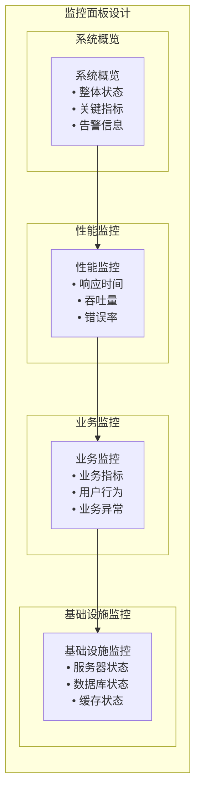

### 2. 可视化实现

```mermaid
sequenceDiagram
    participant G as Grafana
    participant D as 数据源
    participant U as 用户
    participant A as 告警系统
    
    Note over G,A: 可视化实现流程
    
    U->>+G: 1. 访问监控面板
    G->>+D: 2. 查询数据
    D-->>-G: 3. 返回数据
    G->>G: 4. 渲染图表
    G-->>-U: 5. 展示监控面板
    
    G->>+A: 6. 检查告警
    A-->>-G: 7. 告警状态
    G->>G: 8. 更新告警信息
    G-->>-U: 9. 显示告警
    
    Note over G,A: 实时监控和告警展示
```

**可视化功能**：
- **实时监控**: 实时展示系统状态
- **历史分析**: 历史数据分析和趋势
- **多维度分析**: 多维度数据展示
- **告警展示**: 实时告警信息展示

## 性能优化策略

### 1. 数据收集优化

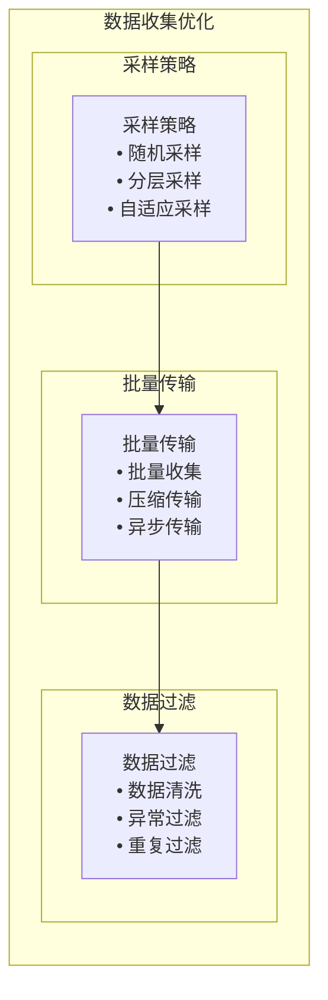

**优化策略**：
- **采样策略**: 根据业务需求设置采样率
- **批量传输**: 批量收集和传输数据
- **数据过滤**: 过滤无效和重复数据

### 2. 存储优化

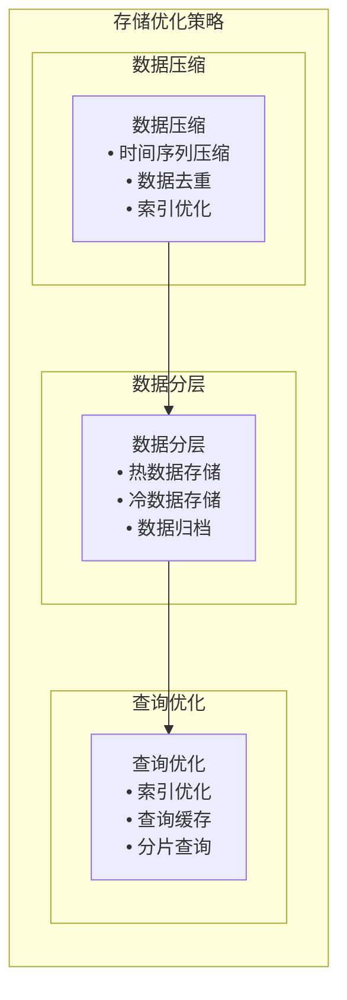

**优化策略**：
- **数据压缩**: 压缩存储数据
- **数据分层**: 热冷数据分离存储
- **查询优化**: 优化查询性能

## 总结

分布式监控与追踪在MPIM项目中的应用具有以下特点：

### 1. 技术优势
- **全链路监控**: 覆盖整个系统链路
- **实时监控**: 实时展示系统状态
- **智能告警**: 智能检测和告警
- **可视化分析**: 直观的数据展示

### 2. 设计亮点
- **多维度监控**: 系统、应用、业务多维度监控
- **链路追踪**: 完整的请求链路追踪
- **智能告警**: 基于机器学习的异常检测
- **可视化展示**: 丰富的监控面板

### 3. 性能表现
- **实时性**: 秒级监控数据更新
- **准确性**: 高精度的监控数据
- **可用性**: 99.9%+监控系统可用性
- **扩展性**: 支持大规模系统监控

## 面试要点

### 1. 基础概念
- 分布式监控的定义和特点
- 监控指标体系和分类
- 链路追踪的原理和实现

### 2. 技术实现
- 监控系统的架构设计
- 数据收集和处理策略
- 告警系统的设计

### 3. 项目应用
- 在MPIM项目中的具体应用
- 监控系统的选型考虑
- 与其他监控方案的对比

### 4. 性能优化
- 如何优化监控系统性能
- 如何处理大规模监控数据
- 如何设计高效的告警系统
