# 分布式存储系统分析

## 分布式存储基础

### 什么是分布式存储？

分布式存储（Distributed Storage）是指将数据分散存储在多个物理节点上，通过网络连接形成一个统一的存储系统。它通过数据分片、副本、一致性等技术，提供高可用、高性能、可扩展的存储服务。

### 分布式存储的核心挑战

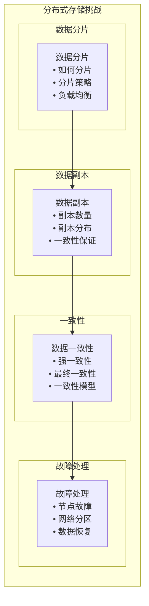

## 数据分片策略

### 1. 水平分片（Horizontal Sharding）

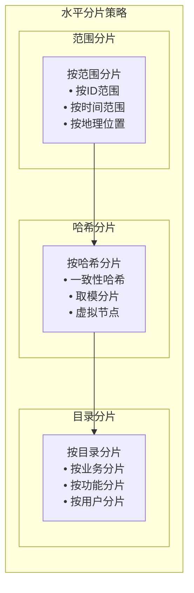

**分片策略对比**：

| 策略 | 优点 | 缺点 | 适用场景 |
|------|------|------|----------|
| 范围分片 | 查询效率高，支持范围查询 | 负载不均衡，热点问题 | 时序数据，范围查询多 |
| 哈希分片 | 负载均衡，分布均匀 | 不支持范围查询 | 用户数据，随机访问 |
| 目录分片 | 业务逻辑清晰，易于管理 | 分片数量固定，扩展性差 | 业务系统，功能模块 |

### 2. 一致性哈希

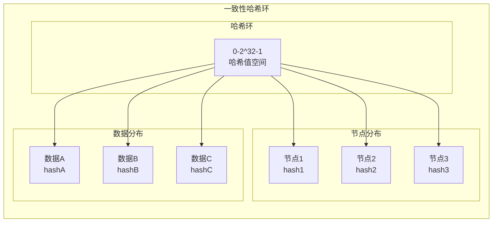

**一致性哈希特点**：
- **均匀分布**: 数据在环上均匀分布
- **动态扩展**: 支持节点的动态添加和删除
- **负载均衡**: 通过虚拟节点实现负载均衡
- **故障容错**: 节点故障时影响范围小

## 数据副本策略

### 1. 副本放置策略

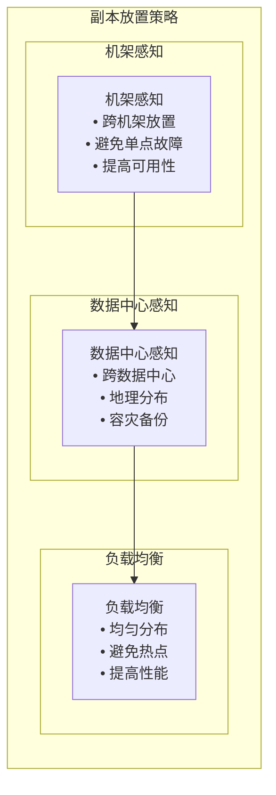

**副本策略**：
- **3副本策略**: 1个主副本，2个从副本
- **机架感知**: 副本放在不同机架上
- **数据中心感知**: 副本放在不同数据中心
- **负载均衡**: 副本均匀分布在各节点

### 2. 副本一致性

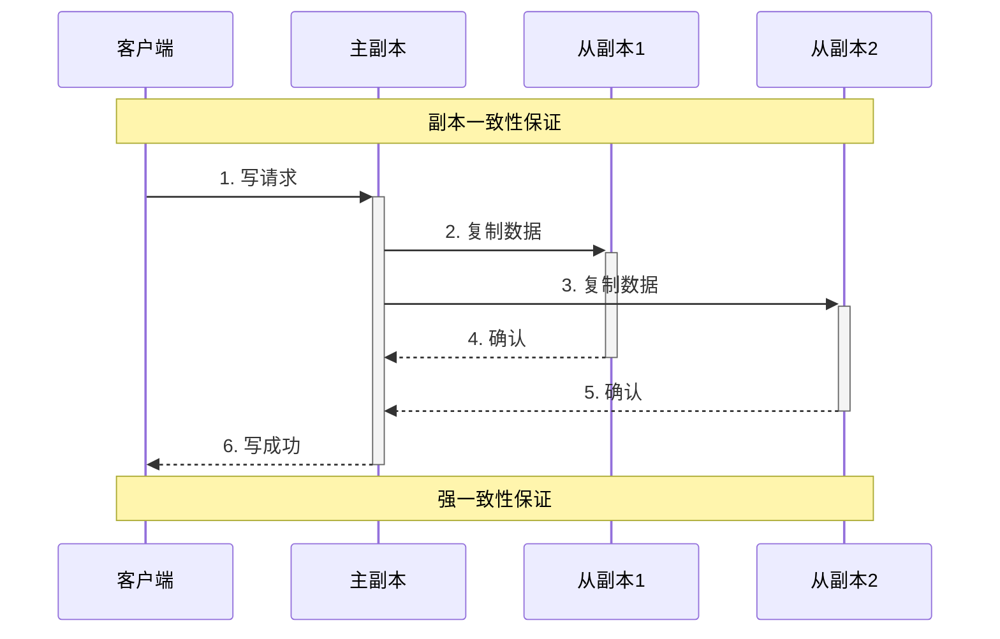

**一致性模型**：
- **强一致性**: 所有副本数据完全一致
- **最终一致性**: 最终所有副本数据一致
- **弱一致性**: 允许短暂的不一致

## MPIM项目中的存储设计

### 1. 用户数据存储

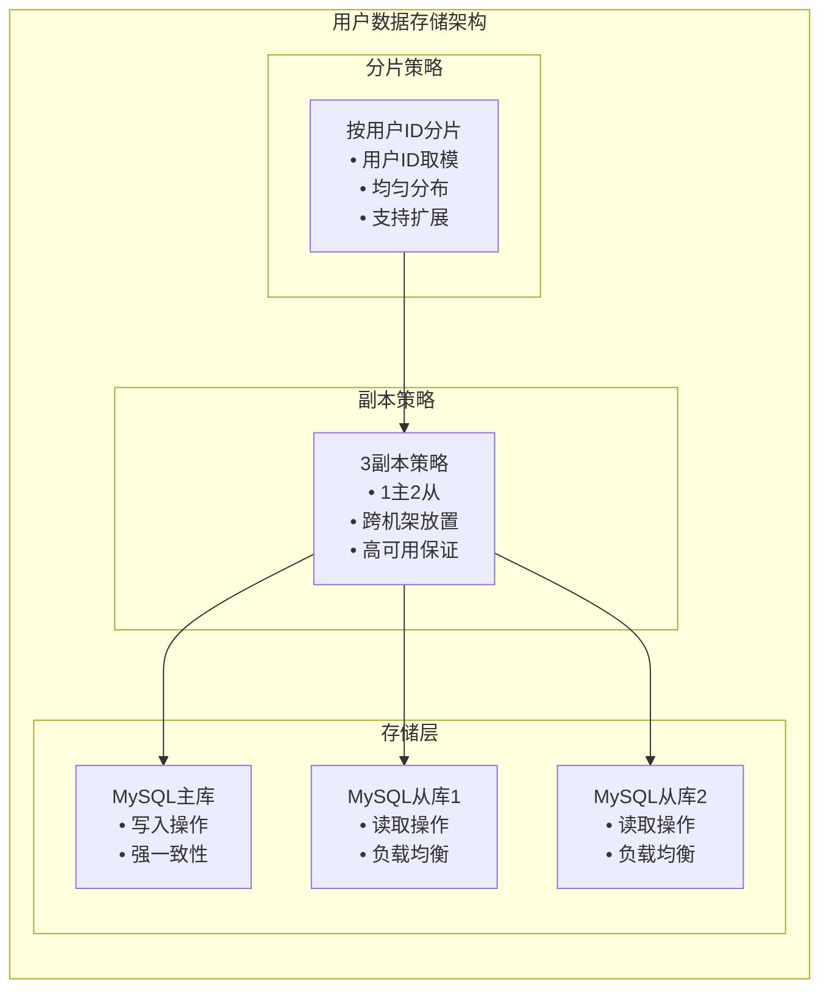

**存储设计**：
- **分片策略**: 按用户ID取模分片
- **副本策略**: 3副本，1主2从
- **一致性**: 主库强一致性，从库最终一致性
- **扩展性**: 支持水平扩展

### 2. 消息数据存储

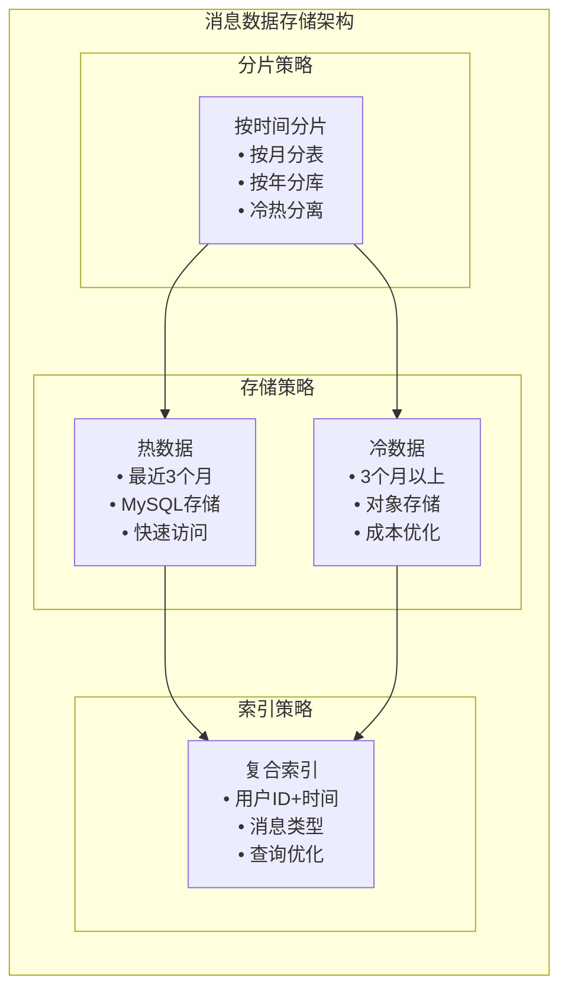

**存储设计**：
- **分片策略**: 按时间分片，按月分表
- **存储策略**: 热数据MySQL，冷数据对象存储
- **索引策略**: 复合索引优化查询
- **成本优化**: 冷热数据分离

### 3. 群组数据存储

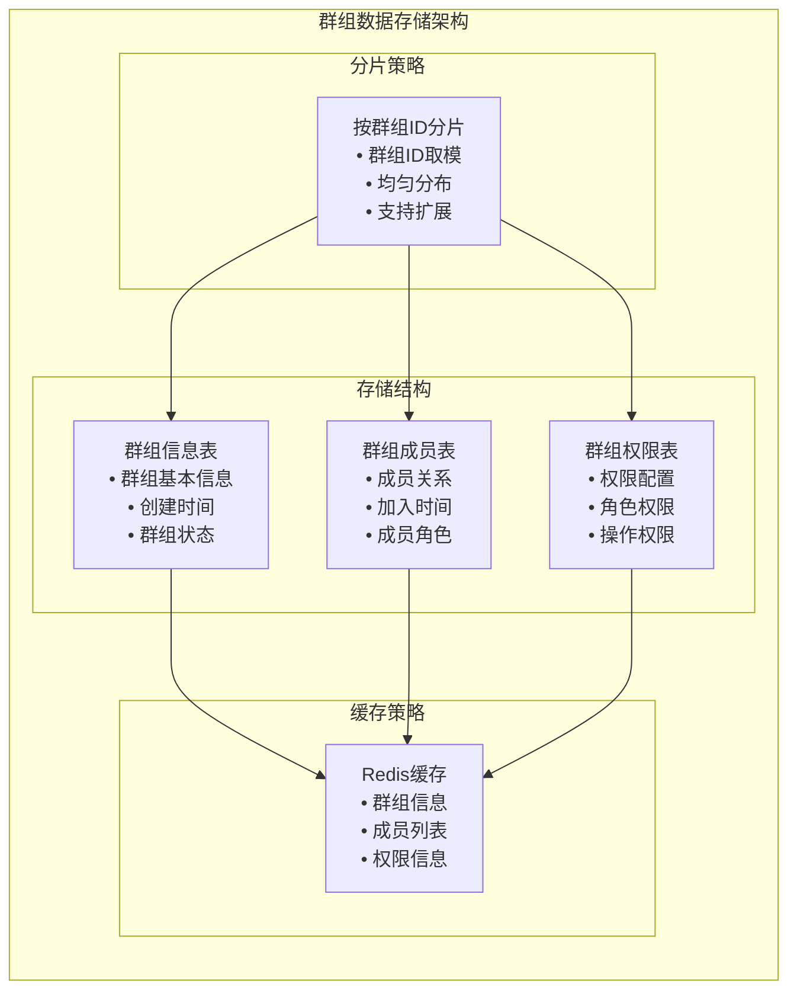

**存储设计**：
- **分片策略**: 按群组ID分片
- **存储结构**: 群组信息、成员、权限分离存储
- **缓存策略**: Redis缓存热点数据
- **查询优化**: 复合索引优化查询

## 数据一致性保证

### 1. 强一致性实现

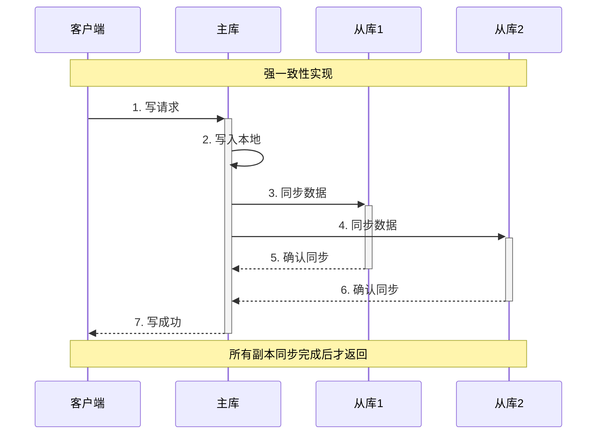

**实现策略**：
- **同步复制**: 所有副本同步完成后才返回
- **事务保证**: 使用数据库事务保证原子性
- **锁机制**: 使用分布式锁避免并发冲突

### 2. 最终一致性实现

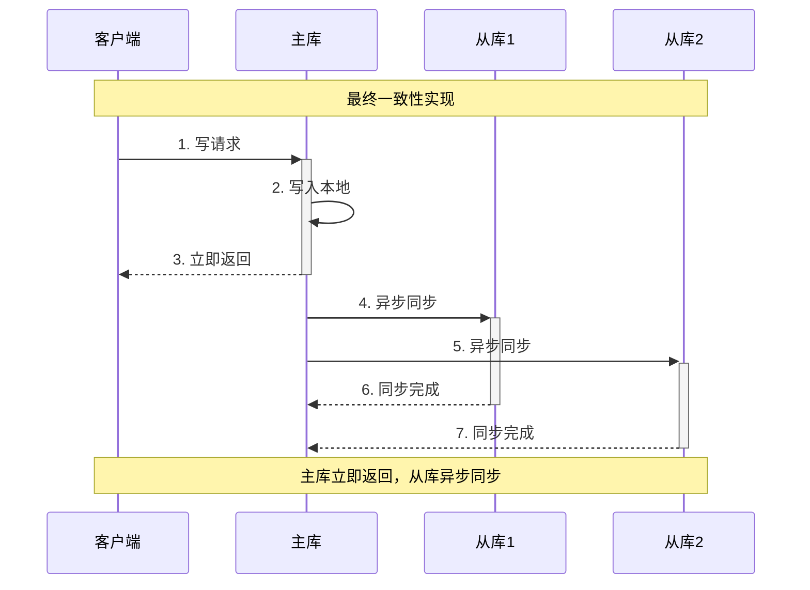

**实现策略**：
- **异步复制**: 主库立即返回，从库异步同步
- **冲突解决**: 使用时间戳或版本号解决冲突
- **补偿机制**: 通过补偿操作保证最终一致性

## 性能优化策略

### 1. 读写分离

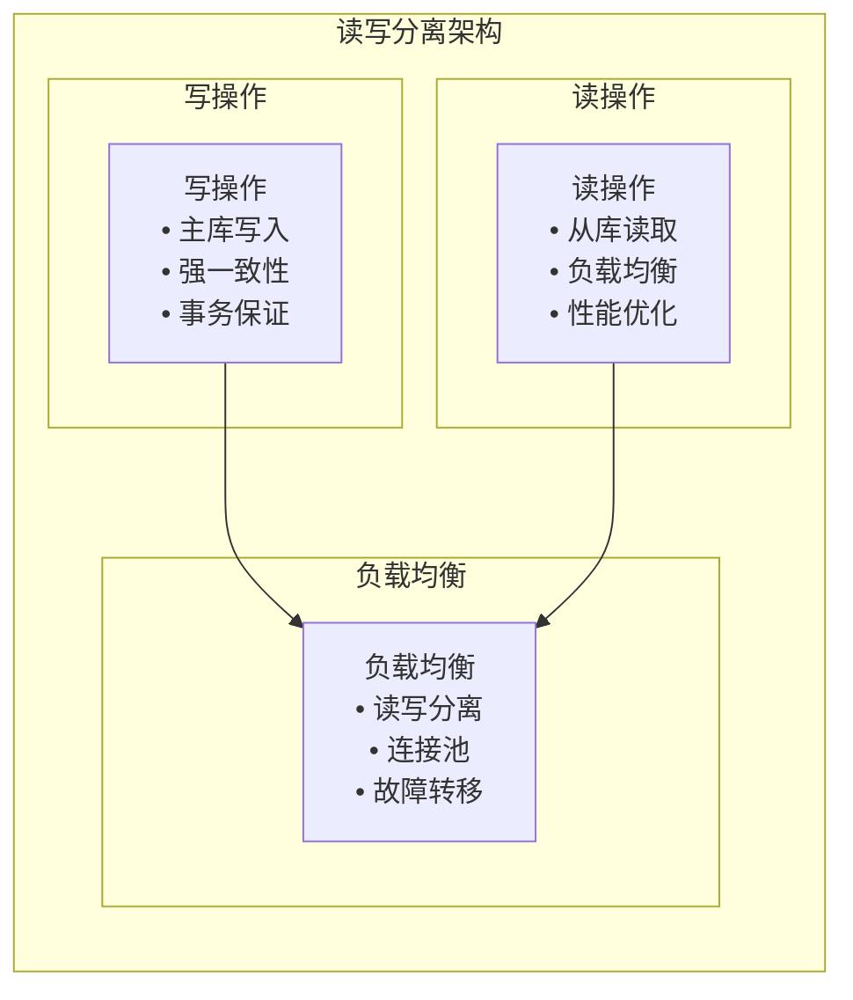

**优化策略**：
- **读写分离**: 写操作主库，读操作从库
- **连接池**: 使用连接池管理数据库连接
- **负载均衡**: 读操作负载均衡到多个从库

### 2. 缓存优化

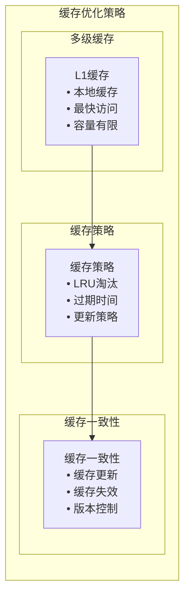

**优化策略**：
- **多级缓存**: 本地缓存+分布式缓存
- **缓存策略**: LRU淘汰，设置过期时间
- **缓存一致性**: 缓存更新和失效机制

### 3. 分片优化

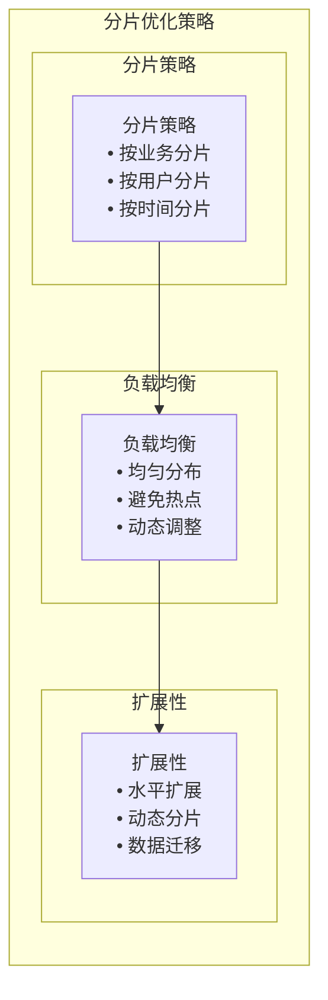

**优化策略**：
- **分片策略**: 根据业务特点选择分片策略
- **负载均衡**: 避免热点，均匀分布负载
- **扩展性**: 支持动态扩展和数据迁移

## 故障处理与恢复

### 1. 节点故障处理

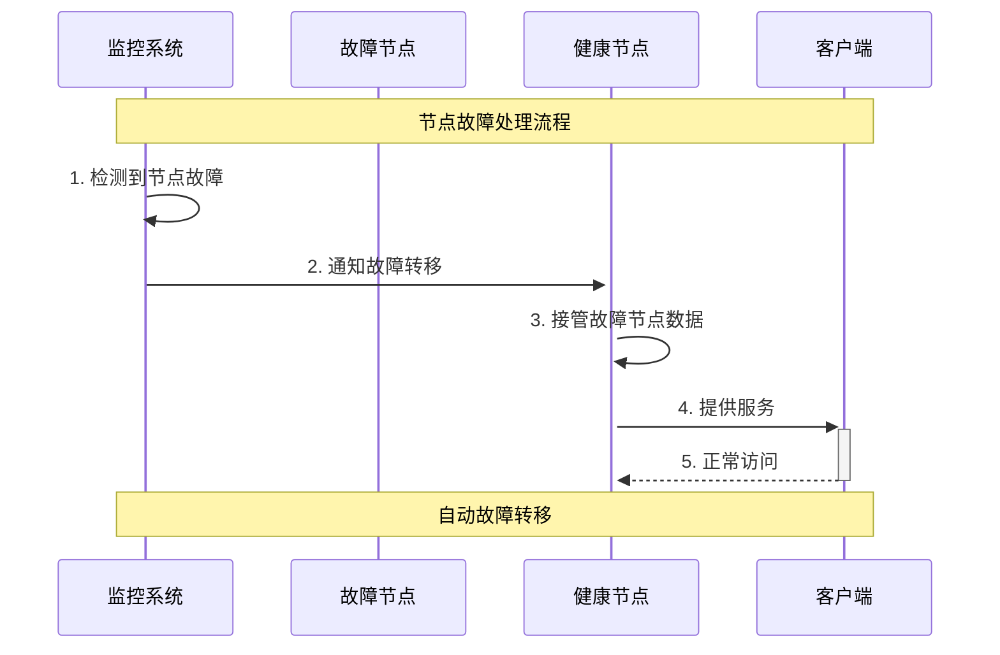

**故障处理**：
- **故障检测**: 使用心跳机制检测节点故障
- **故障转移**: 自动将流量转移到健康节点
- **数据恢复**: 从其他副本恢复数据

### 2. 数据恢复策略

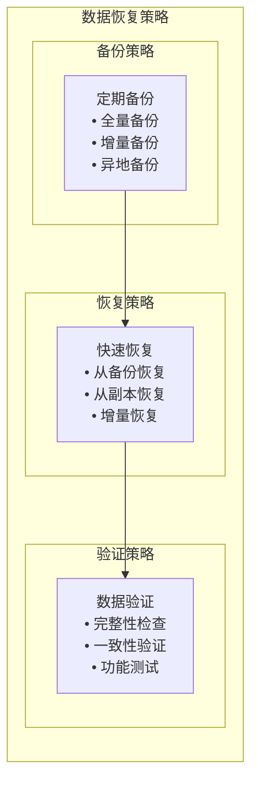

**恢复策略**：
- **备份策略**: 定期全量和增量备份
- **恢复策略**: 从备份或副本快速恢复
- **验证策略**: 恢复后验证数据完整性

## 监控与运维

### 1. 性能监控

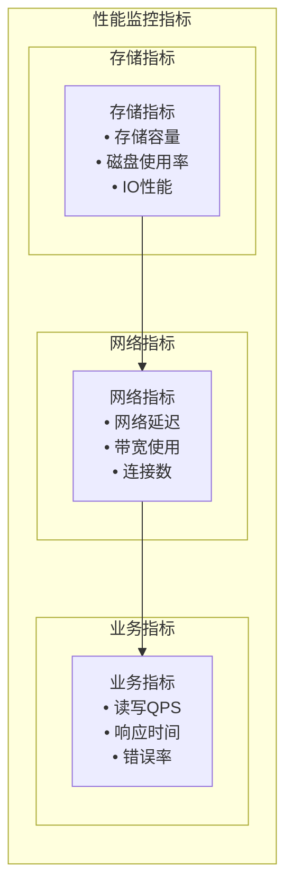

**监控指标**：
- **存储指标**: 容量、使用率、IO性能
- **网络指标**: 延迟、带宽、连接数
- **业务指标**: QPS、响应时间、错误率

### 2. 告警机制

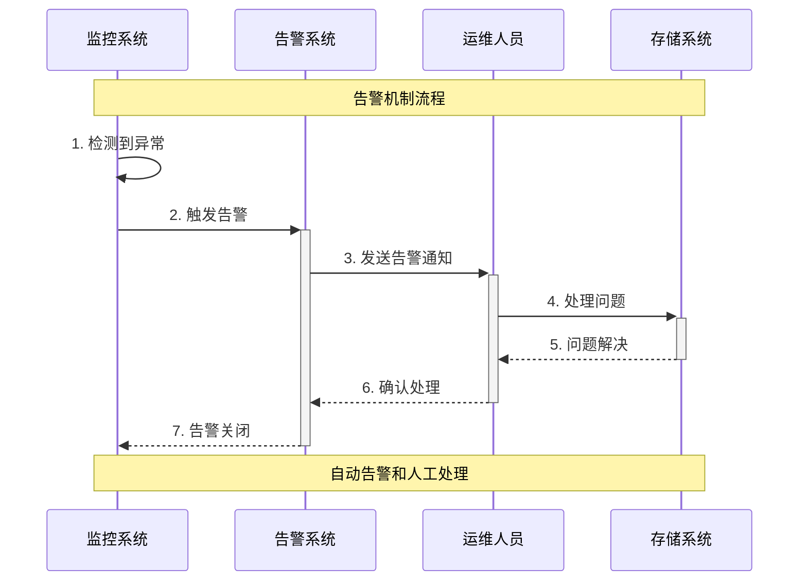

**告警机制**：
- **阈值告警**: 设置性能指标阈值
- **异常告警**: 检测异常模式
- **自动恢复**: 部分问题自动恢复

## 总结

分布式存储系统在MPIM项目中的应用具有以下特点：

### 1. 技术优势
- **高可用**: 通过副本和故障转移保证高可用
- **高性能**: 通过分片和缓存提高性能
- **可扩展**: 支持水平扩展和动态调整
- **数据安全**: 通过备份和恢复保证数据安全

### 2. 设计亮点
- **分片策略**: 根据业务特点选择合适的分片策略
- **副本策略**: 3副本策略保证高可用
- **缓存优化**: 多级缓存提高性能
- **故障处理**: 自动故障检测和转移

### 3. 性能表现
- **可用性**: 99.9%+存储可用性
- **性能**: 支持高并发读写
- **扩展性**: 支持PB级数据存储
- **一致性**: 根据业务需求选择一致性级别

## 面试要点

### 1. 基础概念
- 分布式存储的定义和特点
- 数据分片和副本策略
- 一致性模型和保证机制

### 2. 技术实现
- 各种分片策略的优缺点
- 副本一致性的实现方式
- 性能优化的策略

### 3. 项目应用
- 在MPIM项目中的具体应用
- 与其他存储方案的对比
- 存储系统的选型考虑

### 4. 故障处理
- 如何处理节点故障
- 如何保证数据一致性
- 如何优化系统性能
