# 分布式事务与ACID分析

## 分布式事务基础

### 什么是分布式事务？

分布式事务（Distributed Transaction）是指在分布式系统中，涉及多个节点、多个数据库或多个服务的事务操作。它需要保证在分布式环境下，所有参与事务的操作要么全部成功，要么全部失败，从而保证数据的一致性。

### 分布式事务的挑战

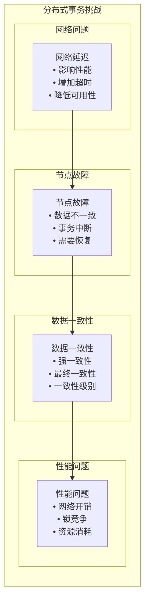

## ACID特性在分布式环境中的实现

### 1. 原子性（Atomicity）

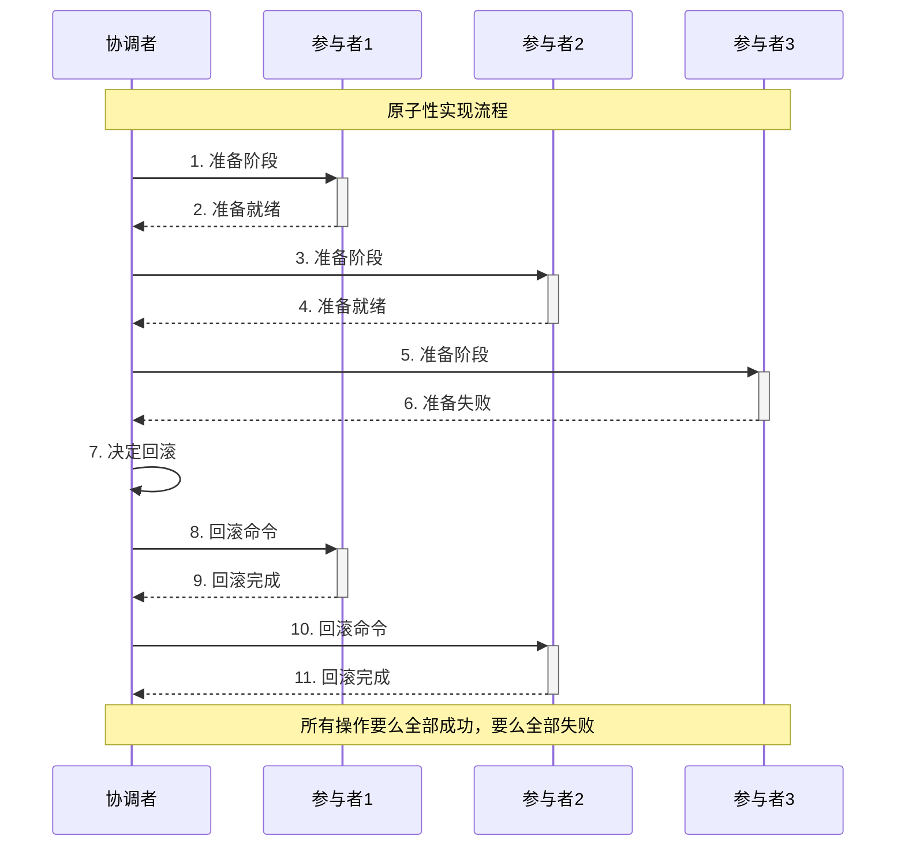

**实现策略**：
- **两阶段提交（2PC）**: 协调者控制所有参与者的提交或回滚
- **三阶段提交（3PC）**: 增加预提交阶段，减少阻塞时间
- **Saga模式**: 通过补偿操作实现原子性

### 2. 一致性（Consistency）

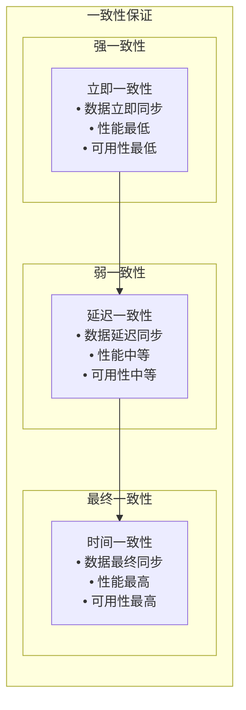

**实现策略**：
- **强一致性**: 使用2PC或3PC协议
- **弱一致性**: 使用异步复制机制
- **最终一致性**: 使用BASE理论

### 3. 隔离性（Isolation）

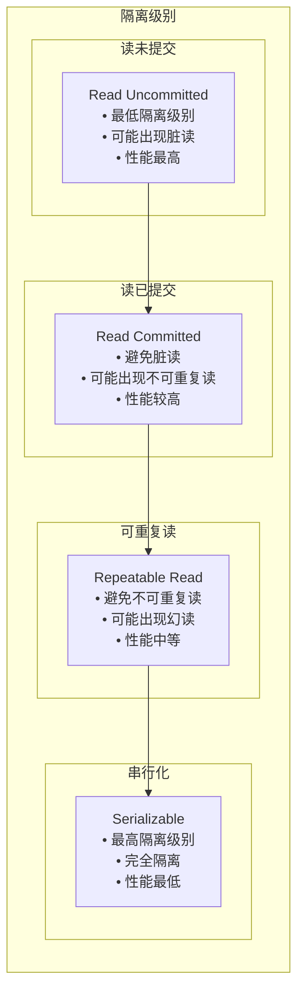

**实现策略**：
- **分布式锁**: 使用分布式锁保证隔离性
- **版本控制**: 使用版本号控制并发访问
- **时间戳**: 使用时间戳排序操作

### 4. 持久性（Durability）

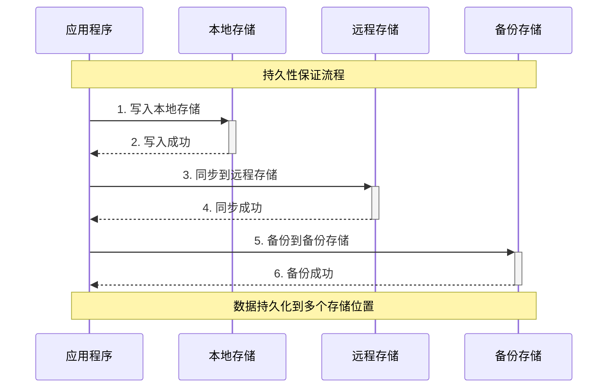

**实现策略**：
- **多副本存储**: 数据存储到多个节点
- **异步复制**: 异步复制到其他节点
- **定期备份**: 定期备份到持久化存储

## 分布式事务协议

### 1. 两阶段提交（2PC）

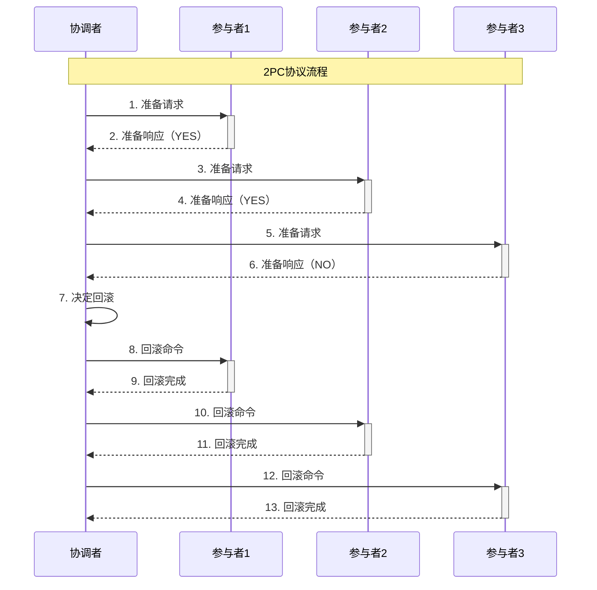

**实现原理**：
- **准备阶段**: 协调者向所有参与者发送准备请求
- **提交阶段**: 根据准备结果决定提交或回滚
- **参与者**: 执行本地事务并返回结果
- **协调者**: 管理整个事务的生命周期

### 2. 三阶段提交（3PC）

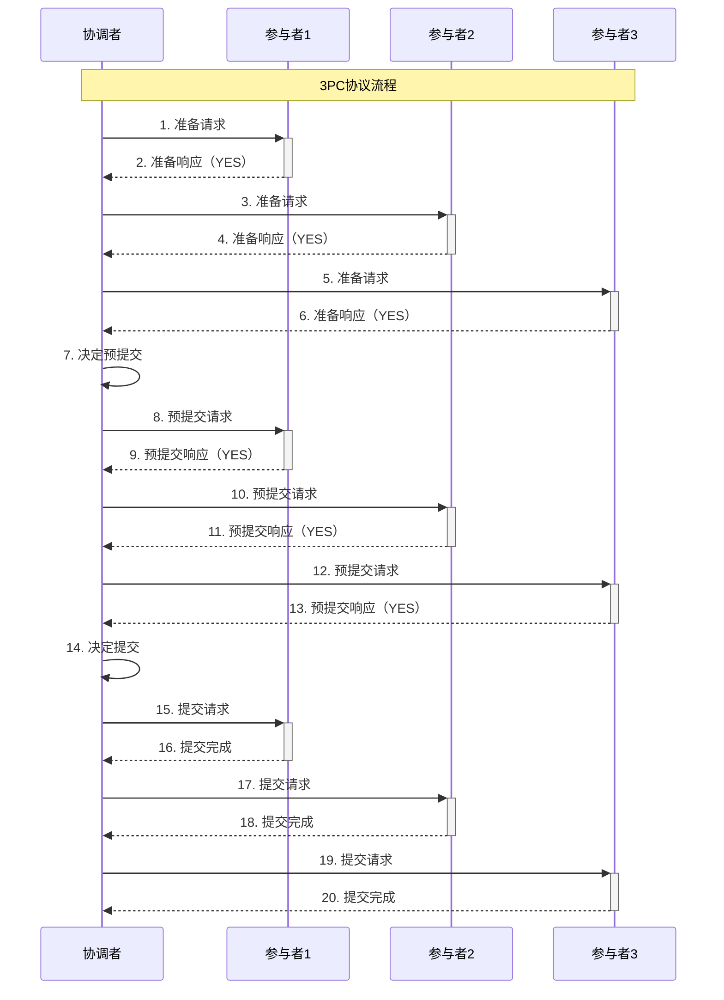

**实现原理**：
- **准备阶段**: 协调者向所有参与者发送准备请求
- **预提交阶段**: 协调者向所有参与者发送预提交请求
- **提交阶段**: 协调者向所有参与者发送提交请求
- **优势**: 减少阻塞时间，提高系统可用性

### 3. Saga模式

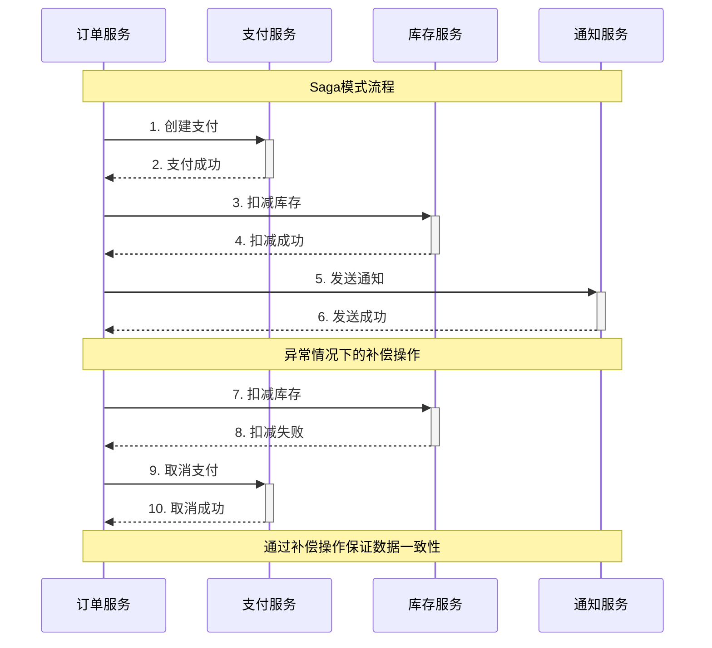

**实现原理**：
- **正向操作**: 执行业务操作
- **补偿操作**: 回滚已执行的操作
- **状态管理**: 跟踪每个步骤的执行状态
- **优势**: 避免长时间锁定资源，提高性能

## MPIM项目中的应用场景

### 1. 用户注册事务

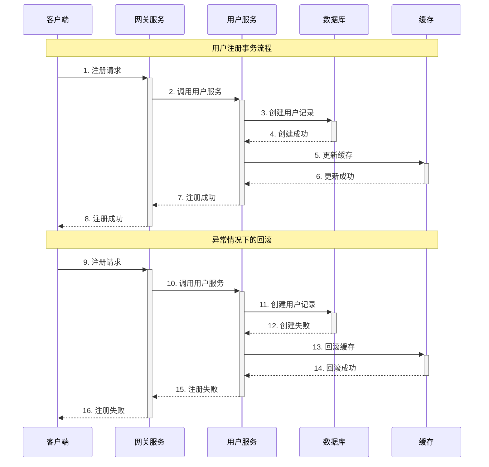

**代码实现**：
```cpp
// 在 im-user/src/user_service.cc 中
void UserServiceImpl::Register(google::protobuf::RpcController* controller,
                              const mpim::RegisterReq* request,
                              mpim::RegisterResp* response,
                              google::protobuf::Closure* done) {
    std::string username = request->username();
    std::string password = request->password();
    
    // 开始分布式事务
    TwoPhaseCommit tpc;
    std::vector<std::string> participants = {"database", "cache"};
    
    if (!tpc.BeginTransaction(participants)) {
        response->set_success(false);
        response->set_message("Failed to begin transaction");
        return;
    }
    
    try {
        // 准备阶段
        if (!tpc.PreparePhase()) {
            response->set_success(false);
            response->set_message("Failed to prepare transaction");
            return;
        }
        
        // 执行操作
        mpim::User user;
        user.set_username(username);
        user.set_password(password);
        user.set_id(GenerateUserId());
        
        // 数据库操作
        if (!user_model_.Insert(user)) {
            tpc.RollbackPhase();
            response->set_success(false);
            response->set_message("Failed to insert user");
            return;
        }
        
        // 缓存操作
        if (!user_cache_.SetUserInfo(username, user.SerializeAsString(), 3600)) {
            tpc.RollbackPhase();
            response->set_success(false);
            response->set_message("Failed to update cache");
            return;
        }
        
        // 提交阶段
        if (!tpc.CommitPhase()) {
            tpc.RollbackPhase();
            response->set_success(false);
            response->set_message("Failed to commit transaction");
            return;
        }
        
        response->set_success(true);
        response->set_message("User registered successfully");
        
    } catch (...) {
        tpc.RollbackPhase();
        response->set_success(false);
        response->set_message("Exception occurred");
    }
    
    tpc.EndTransaction();
}
```

### 2. 消息发送事务

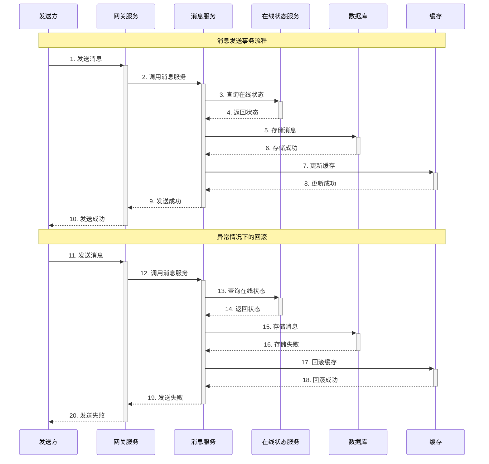

**代码实现**：
```cpp
// 在 im-message/src/message_service.cc 中
void MessageServiceImpl::SendMessage(google::protobuf::RpcController* controller,
                                   const mpim::SendMessageReq* request,
                                   mpim::SendMessageResp* response,
                                   google::protobuf::Closure* done) {
    std::string message_id = request->message_id();
    int64_t from_uid = request->from_uid();
    int64_t to_uid = request->to_uid();
    std::string content = request->content();
    
    // 开始分布式事务
    TwoPhaseCommit tpc;
    std::vector<std::string> participants = {"database", "cache", "presence"};
    
    if (!tpc.BeginTransaction(participants)) {
        response->set_success(false);
        response->set_message("Failed to begin transaction");
        return;
    }
    
    try {
        // 准备阶段
        if (!tpc.PreparePhase()) {
            response->set_success(false);
            response->set_message("Failed to prepare transaction");
            return;
        }
        
        // 执行操作
        // 1. 存储消息到数据库
        if (!message_model_.StoreMessage(message_id, from_uid, to_uid, content)) {
            tpc.RollbackPhase();
            response->set_success(false);
            response->set_message("Failed to store message");
            return;
        }
        
        // 2. 更新缓存
        if (!message_cache_.SetMessage(message_id, content, 3600)) {
            tpc.RollbackPhase();
            response->set_success(false);
            response->set_message("Failed to update cache");
            return;
        }
        
        // 3. 更新在线状态
        if (!presence_service_.UpdateMessageStatus(to_uid, message_id)) {
            tpc.RollbackPhase();
            response->set_success(false);
            response->set_message("Failed to update presence");
            return;
        }
        
        // 提交阶段
        if (!tpc.CommitPhase()) {
            tpc.RollbackPhase();
            response->set_success(false);
            response->set_message("Failed to commit transaction");
            return;
        }
        
        response->set_success(true);
        response->set_message("Message sent successfully");
        
    } catch (...) {
        tpc.RollbackPhase();
        response->set_success(false);
        response->set_message("Exception occurred");
    }
    
    tpc.EndTransaction();
}
```

### 3. 群组操作事务

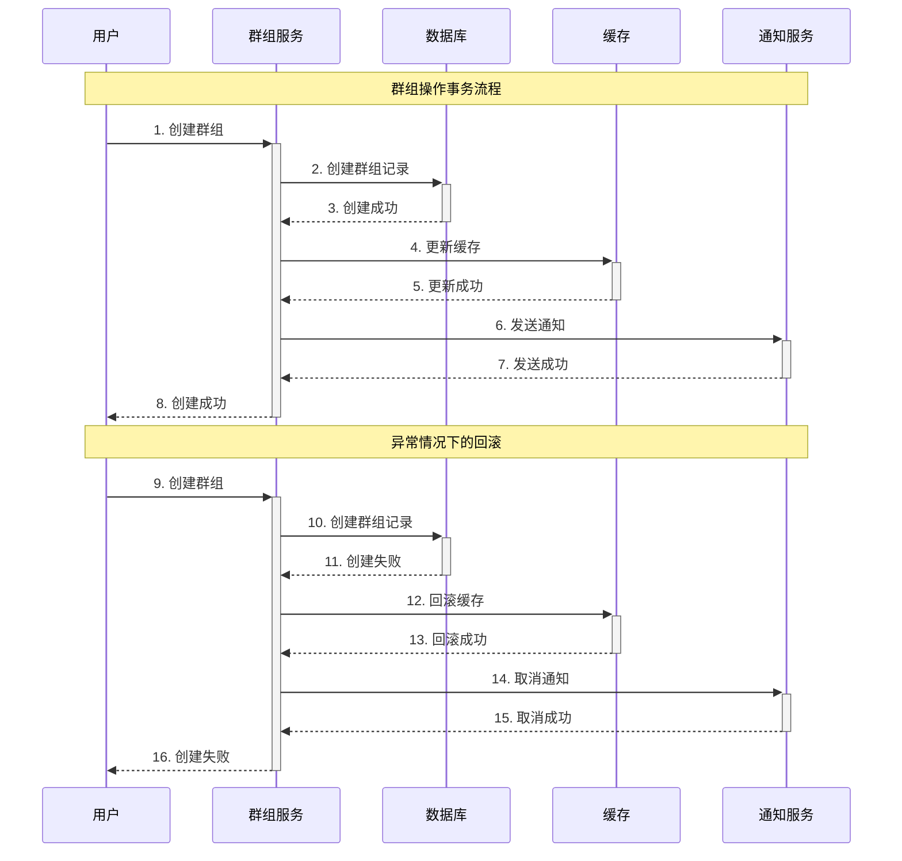

**代码实现**：
```cpp
// 在 im-group/src/group_service.cc 中
void GroupServiceImpl::CreateGroup(google::protobuf::RpcController* controller,
                                 const mpim::CreateGroupReq* request,
                                 mpim::CreateGroupResp* response,
                                 google::protobuf::Closure* done) {
    std::string group_name = request->group_name();
    int64_t creator_id = request->creator_id();
    
    // 开始分布式事务
    TwoPhaseCommit tpc;
    std::vector<std::string> participants = {"database", "cache", "notification"};
    
    if (!tpc.BeginTransaction(participants)) {
        response->set_success(false);
        response->set_message("Failed to begin transaction");
        return;
    }
    
    try {
        // 准备阶段
        if (!tpc.PreparePhase()) {
            response->set_success(false);
            response->set_message("Failed to prepare transaction");
            return;
        }
        
        // 执行操作
        int64_t group_id = GenerateGroupId();
        
        // 1. 创建群组记录
        if (!group_model_.CreateGroup(group_id, group_name, creator_id)) {
            tpc.RollbackPhase();
            response->set_success(false);
            response->set_message("Failed to create group");
            return;
        }
        
        // 2. 更新缓存
        if (!group_cache_.SetGroupInfo(group_id, group_name, 3600)) {
            tpc.RollbackPhase();
            response->set_success(false);
            response->set_message("Failed to update cache");
            return;
        }
        
        // 3. 发送通知
        if (!notification_service_.SendGroupCreatedNotification(group_id, creator_id)) {
            tpc.RollbackPhase();
            response->set_success(false);
            response->set_message("Failed to send notification");
            return;
        }
        
        // 提交阶段
        if (!tpc.CommitPhase()) {
            tpc.RollbackPhase();
            response->set_success(false);
            response->set_message("Failed to commit transaction");
            return;
        }
        
        response->set_success(true);
        response->set_message("Group created successfully");
        response->set_group_id(group_id);
        
    } catch (...) {
        tpc.RollbackPhase();
        response->set_success(false);
        response->set_message("Exception occurred");
    }
    
    tpc.EndTransaction();
}
```

## 性能优化策略

### 1. 事务优化

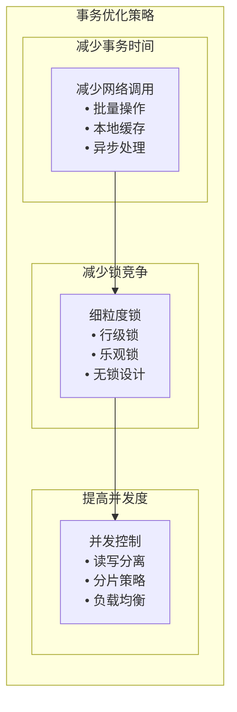

**优化策略**：
- **减少事务时间**: 减少网络调用，使用批量操作
- **减少锁竞争**: 使用细粒度锁，避免全局锁
- **提高并发度**: 使用读写分离，分片策略

### 2. 一致性优化

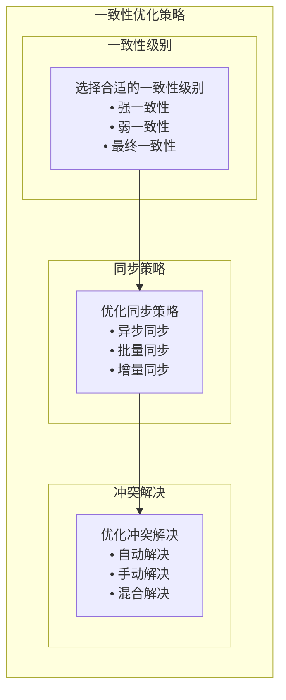

**优化策略**：
- **一致性级别**: 根据业务需求选择合适的一致性级别
- **同步策略**: 使用异步同步，批量同步
- **冲突解决**: 实现自动冲突解决机制

### 3. 可用性优化

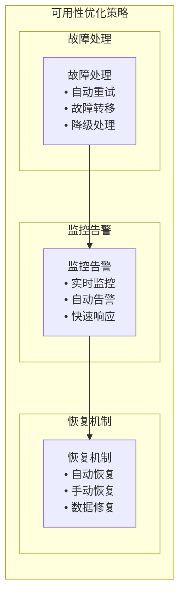

**优化策略**：
- **故障处理**: 实现自动重试，故障转移
- **监控告警**: 实时监控，自动告警
- **恢复机制**: 实现自动恢复，数据修复

## 与其他方案对比

### 1. 与本地事务对比

| 特性 | 本地事务 | 分布式事务 |
|------|----------|------------|
| 性能 | 高 | 低 |
| 一致性 | 强一致性 | 最终一致性 |
| 可用性 | 低 | 高 |
| 复杂度 | 低 | 高 |
| 适用场景 | 单机应用 | 分布式应用 |

### 2. 与消息队列对比

| 特性 | 分布式事务 | 消息队列 |
|------|------------|----------|
| 一致性 | 强一致性 | 最终一致性 |
| 性能 | 低 | 高 |
| 复杂度 | 高 | 低 |
| 可靠性 | 高 | 中等 |
| 适用场景 | 强一致性需求 | 高并发需求 |

### 3. 与Saga模式对比

| 特性 | 分布式事务 | Saga模式 |
|------|------------|----------|
| 一致性 | 强一致性 | 最终一致性 |
| 性能 | 低 | 高 |
| 复杂度 | 高 | 中等 |
| 可靠性 | 高 | 中等 |
| 适用场景 | 强一致性需求 | 高并发需求 |

## 总结

分布式事务在MPIM项目中的应用具有以下特点：

### 1. 技术优势
- **强一致性**: 保证数据强一致性
- **原子性**: 保证操作原子性
- **可靠性**: 保证操作可靠性
- **完整性**: 保证数据完整性

### 2. 设计亮点
- **两阶段提交**: 使用2PC协议保证原子性
- **三阶段提交**: 使用3PC协议减少阻塞
- **Saga模式**: 使用补偿操作保证一致性
- **故障处理**: 实现完善的故障处理机制

### 3. 性能表现
- **一致性**: 强一致性保证
- **可靠性**: 99.9%+操作可靠性
- **性能**: 支持中等并发
- **可用性**: 支持高可用部署

## 面试要点

### 1. 基础概念
- 分布式事务的定义和特点
- ACID特性在分布式环境中的实现
- 分布式事务的挑战和解决方案

### 2. 技术实现
- 2PC和3PC协议的实现
- Saga模式的设计和实现
- 分布式事务的优化策略

### 3. 性能优化
- 如何提高分布式事务性能
- 如何保证数据一致性
- 如何优化事务处理

### 4. 项目应用
- 在MPIM项目中的具体应用
- 与其他技术方案的对比
- 技术选型的考虑
