# 负载均衡与Nginx应用分析

## 负载均衡基础

### 什么是负载均衡？

负载均衡（Load Balancing）是一种将网络流量或请求分发到多个服务器上的技术，用于提高系统的可用性、性能和可靠性。它通过将工作负载分散到多个服务器上，避免单个服务器过载，提高整体系统的处理能力。

### 负载均衡的核心概念

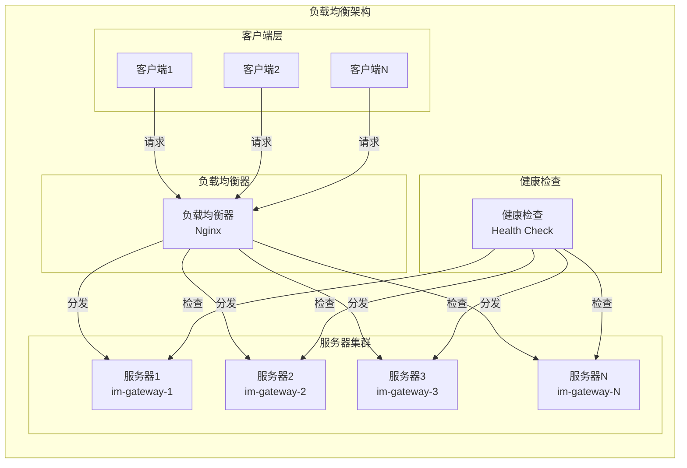

## Nginx负载均衡实现

### 1. Nginx配置

```nginx
# 在 nginx.conf 中
upstream im_gateway {
    # 负载均衡算法
    least_conn;  # 最少连接算法
    
    # 服务器配置
    server 127.0.0.1:8001 weight=3 max_fails=3 fail_timeout=30s;
    server 127.0.0.1:8002 weight=2 max_fails=3 fail_timeout=30s;
    server 127.0.0.1:8003 weight=1 max_fails=3 fail_timeout=30s;
    
    # 健康检查
    health_check interval=10s fails=3 passes=2;
}

server {
    listen 80;
    server_name im.example.com;
    
    location / {
        proxy_pass http://im_gateway;
        proxy_set_header Host $host;
        proxy_set_header X-Real-IP $remote_addr;
        proxy_set_header X-Forwarded-For $proxy_add_x_forwarded_for;
        proxy_set_header X-Forwarded-Proto $scheme;
        
        # 超时配置
        proxy_connect_timeout 5s;
        proxy_send_timeout 10s;
        proxy_read_timeout 10s;
        
        # 缓冲配置
        proxy_buffering on;
        proxy_buffer_size 4k;
        proxy_buffers 8 4k;
    }
}
```

**核心配置**：
- **upstream**: 定义后端服务器组
- **负载均衡算法**: 选择分发策略
- **健康检查**: 监控服务器状态
- **代理配置**: 配置代理参数

### 2. 负载均衡算法

#### 2.1 轮询算法（Round Robin）

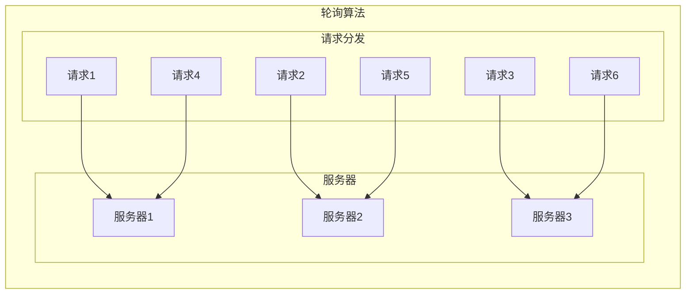

**特点**：
- **简单有效**: 按顺序分发请求
- **负载均匀**: 请求均匀分布
- **无状态**: 不记录服务器状态
- **适用场景**: 服务器性能相近

#### 2.2 最少连接算法（Least Connections）

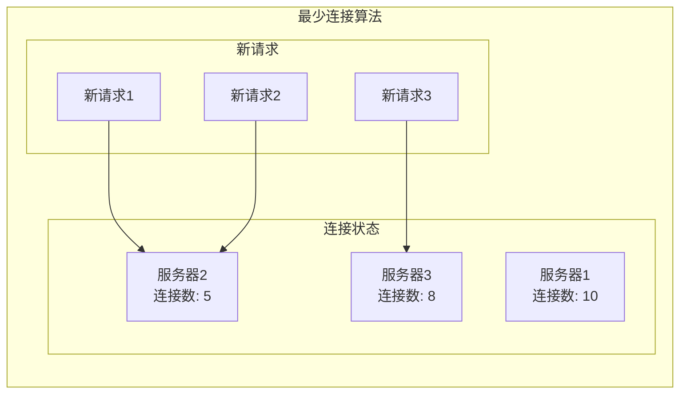

**特点**：
- **动态调整**: 根据连接数动态分发
- **负载均衡**: 连接数少的服务器优先
- **性能考虑**: 考虑服务器当前负载
- **适用场景**: 长连接场景

#### 2.3 加权轮询算法（Weighted Round Robin）

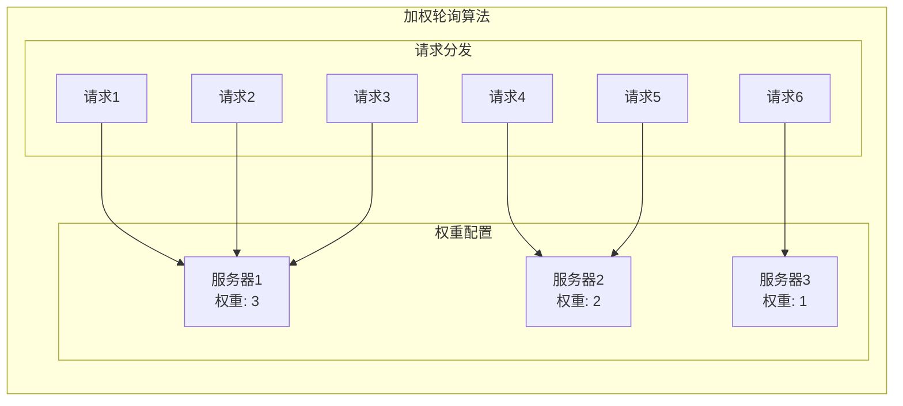

**特点**：
- **权重控制**: 根据权重分发请求
- **性能差异**: 考虑服务器性能差异
- **灵活配置**: 可动态调整权重
- **适用场景**: 服务器性能不同

#### 2.4 IP哈希算法（IP Hash）

```mermaid
graph TB
    subgraph "IP哈希算法"
        direction TB
        
        subgraph "客户端IP"
            IP1[192.168.1.1]
            IP2[192.168.1.2]
            IP3[192.168.1.3]
        end
        
        subgraph "哈希计算"
            H1[hash(192.168.1.1) % 3 = 0]
            H2[hash(192.168.1.2) % 3 = 1]
            H3[hash(192.168.1.3) % 3 = 2]
        end
        
        subgraph "服务器"
            S1[服务器1]
            S2[服务器2]
            S3[服务器3]
        end
    end
    
    IP1 --> H1
    IP2 --> H2
    IP3 --> H3
    
    H1 --> S1
    H2 --> S2
    H3 --> S3
```

**特点**：
- **会话保持**: 同一IP总是访问同一服务器
- **状态保持**: 适合有状态的应用
- **哈希分布**: 基于IP哈希分发
- **适用场景**: 需要会话保持的场景

### 3. 健康检查机制

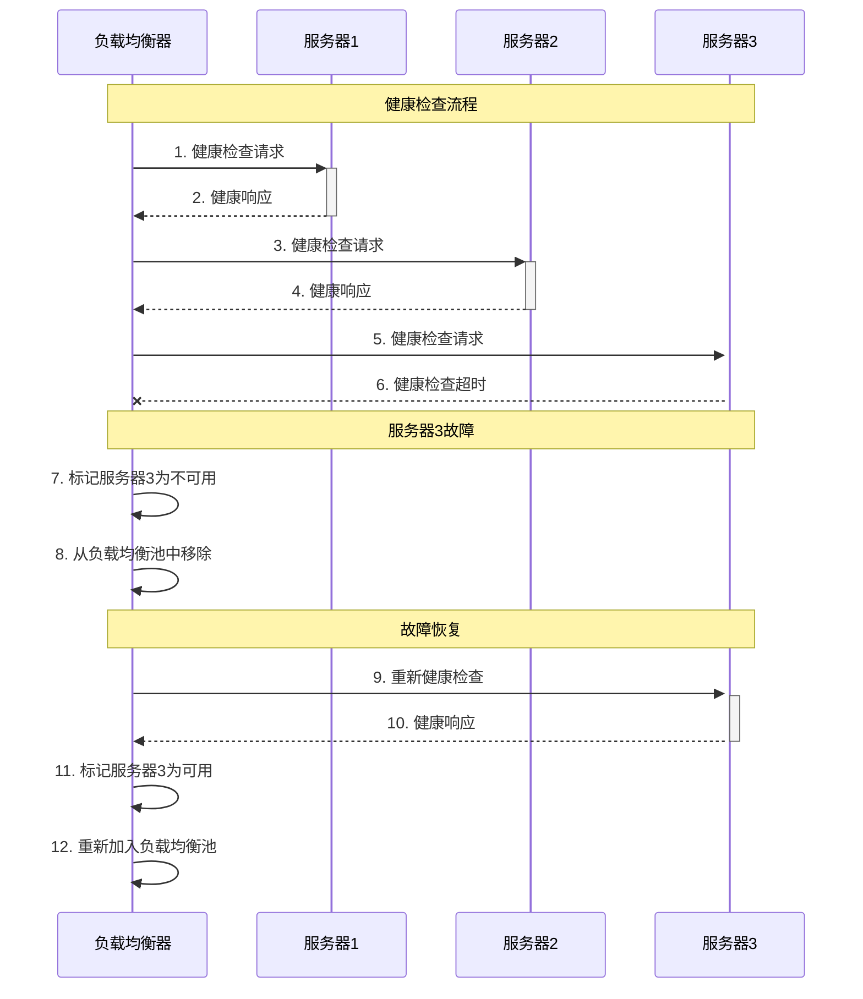

**健康检查配置**：
```nginx
# 在 nginx.conf 中
upstream im_gateway {
    least_conn;
    
    server 127.0.0.1:8001 weight=3 max_fails=3 fail_timeout=30s;
    server 127.0.0.1:8002 weight=2 max_fails=3 fail_timeout=30s;
    server 127.0.0.1:8003 weight=1 max_fails=3 fail_timeout=30s;
    
    # 健康检查配置
    health_check interval=10s fails=3 passes=2;
}

# 健康检查端点
location /health {
    access_log off;
    return 200 "healthy\n";
    add_header Content-Type text/plain;
}
```

## MPIM项目中的负载均衡应用

### 1. 网关层负载均衡

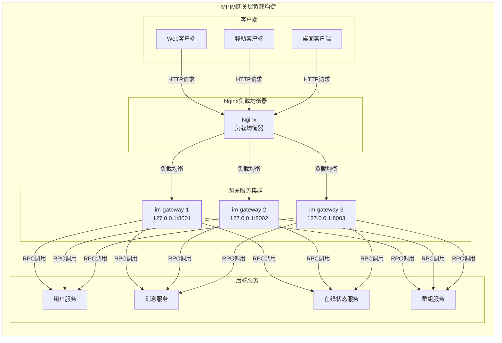

**配置实现**：
```nginx
# 在 nginx.conf 中
upstream im_gateway {
    # 使用最少连接算法
    least_conn;
    
    # 网关服务配置
    server 127.0.0.1:8001 weight=3 max_fails=3 fail_timeout=30s;
    server 127.0.0.1:8002 weight=2 max_fails=3 fail_timeout=30s;
    server 127.0.0.1:8003 weight=1 max_fails=3 fail_timeout=30s;
    
    # 健康检查
    health_check interval=10s fails=3 passes=2;
}

server {
    listen 80;
    server_name im.example.com;
    
    location / {
        proxy_pass http://im_gateway;
        proxy_set_header Host $host;
        proxy_set_header X-Real-IP $remote_addr;
        proxy_set_header X-Forwarded-For $proxy_add_x_forwarded_for;
        proxy_set_header X-Forwarded-Proto $scheme;
        
        # 超时配置
        proxy_connect_timeout 5s;
        proxy_send_timeout 10s;
        proxy_read_timeout 10s;
        
        # 缓冲配置
        proxy_buffering on;
        proxy_buffer_size 4k;
        proxy_buffers 8 4k;
    }
}
```

### 2. 服务层负载均衡

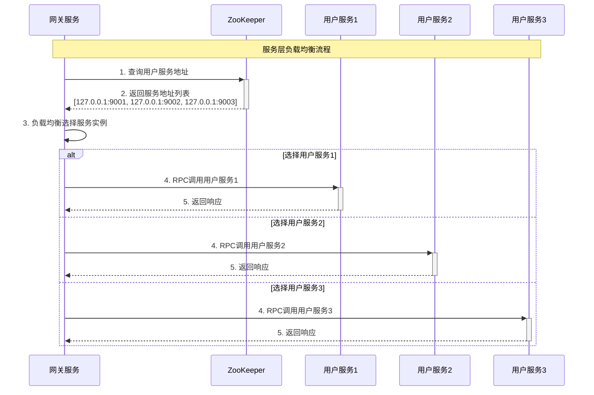

**代码实现**：
```cpp
// 在 mprpc/src/mprpcchannel.cc 中
void MprpcChannel::CallMethod(const google::protobuf::MethodDescriptor *method,
                             google::protobuf::RpcController *controller,
                             const google::protobuf::Message *request,
                             google::protobuf::Message *response,
                             google::protobuf::Closure *done) {
    // 构建方法路径
    std::string method_path = "/" + service_name + "/" + method_name;
    
    // 从ZooKeeper获取服务地址列表
    std::vector<std::string> addresses = s_zk.GetChildren(method_path.c_str());
    
    if (addresses.empty()) {
        controller->SetFailed(method_path + " is not exist!");
        return;
    }
    
    // 负载均衡选择服务实例
    std::string selected_address = SelectServiceInstance(addresses);
    
    // 解析IP和端口
    int idx = selected_address.find(":");
    std::string ip = selected_address.substr(0, idx);
    uint16_t port = atoi(selected_address.substr(idx + 1).c_str());
    
    // 建立连接并发送请求
    // ...
}

std::string MprpcChannel::SelectServiceInstance(const std::vector<std::string>& addresses) {
    // 使用轮询算法选择服务实例
    static std::atomic<int> round_robin_index{0};
    int index = round_robin_index.fetch_add(1) % addresses.size();
    return addresses[index];
}
```

### 3. 数据库层负载均衡

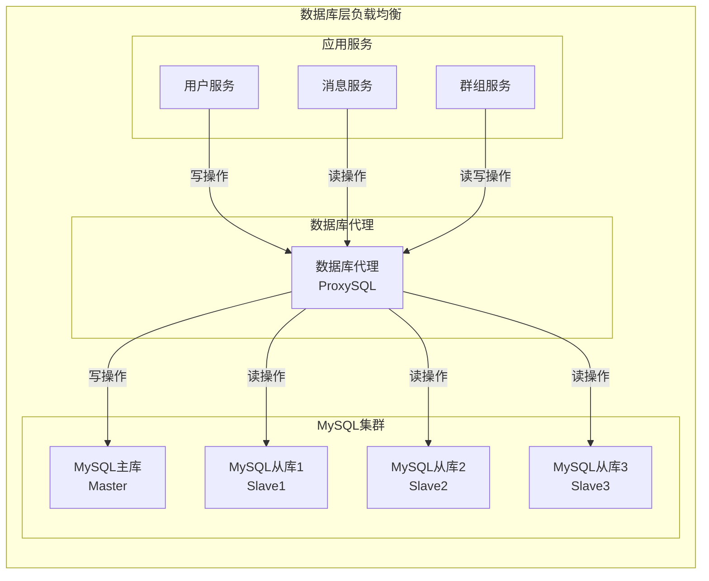

**配置实现**：
```sql
-- 在 ProxySQL 中配置
INSERT INTO mysql_servers(hostgroup_id, hostname, port, weight, max_connections, max_replication_lag, comment) VALUES
(0, '127.0.0.1', 3306, 1000, 200, 0, 'MySQL Master'),
(1, '127.0.0.1', 3307, 1000, 200, 0, 'MySQL Slave1'),
(1, '127.0.0.1', 3308, 1000, 200, 0, 'MySQL Slave2'),
(1, '127.0.0.1', 3309, 1000, 200, 0, 'MySQL Slave3');

-- 配置读写分离
INSERT INTO mysql_query_rules(rule_id, active, match_pattern, destination_hostgroup, apply) VALUES
(1, 1, '^SELECT.*', 1, 1),  -- 读操作路由到从库
(2, 1, '^INSERT.*', 0, 1),  -- 写操作路由到主库
(3, 1, '^UPDATE.*', 0, 1),  -- 写操作路由到主库
(4, 1, '^DELETE.*', 0, 1);  -- 写操作路由到主库
```

## 负载均衡算法实现

### 1. 轮询算法

```cpp
// 在 mprpc/src/mprpcchannel.cc 中
class RoundRobinLoadBalancer {
private:
    std::atomic<int> current_index_{0};
    std::vector<std::string> servers_;
    std::mutex servers_mutex_;
    
public:
    void UpdateServers(const std::vector<std::string>& servers) {
        std::lock_guard<std::mutex> lock(servers_mutex_);
        servers_ = servers;
    }
    
    std::string SelectServer() {
        std::lock_guard<std::mutex> lock(servers_mutex_);
        if (servers_.empty()) {
            return "";
        }
        
        int index = current_index_.fetch_add(1) % servers_.size();
        return servers_[index];
    }
};
```

### 2. 最少连接算法

```cpp
// 在 mprpc/src/mprpcchannel.cc 中
class LeastConnectionsLoadBalancer {
private:
    struct ServerInfo {
        std::string address;
        std::atomic<int> connection_count{0};
        std::atomic<bool> healthy{true};
    };
    
    std::vector<ServerInfo> servers_;
    std::mutex servers_mutex_;
    
public:
    void UpdateServers(const std::vector<std::string>& servers) {
        std::lock_guard<std::mutex> lock(servers_mutex_);
        servers_.clear();
        for (const auto& server : servers) {
            servers_.push_back({server, 0, true});
        }
    }
    
    std::string SelectServer() {
        std::lock_guard<std::mutex> lock(servers_mutex_);
        if (servers_.empty()) {
            return "";
        }
        
        // 找到连接数最少的健康服务器
        int min_connections = INT_MAX;
        int selected_index = -1;
        
        for (size_t i = 0; i < servers_.size(); ++i) {
            if (servers_[i].healthy.load() && 
                servers_[i].connection_count.load() < min_connections) {
                min_connections = servers_[i].connection_count.load();
                selected_index = i;
            }
        }
        
        if (selected_index >= 0) {
            servers_[selected_index].connection_count.fetch_add(1);
            return servers_[selected_index].address;
        }
        
        return "";
    }
    
    void ReleaseConnection(const std::string& server) {
        std::lock_guard<std::mutex> lock(servers_mutex_);
        for (auto& s : servers_) {
            if (s.address == server) {
                s.connection_count.fetch_sub(1);
                break;
            }
        }
    }
};
```

### 3. 加权轮询算法

```cpp
// 在 mprpc/src/mprpcchannel.cc 中
class WeightedRoundRobinLoadBalancer {
private:
    struct ServerInfo {
        std::string address;
        int weight;
        int current_weight;
        std::atomic<bool> healthy{true};
    };
    
    std::vector<ServerInfo> servers_;
    std::mutex servers_mutex_;
    
public:
    void UpdateServers(const std::vector<std::string>& servers, 
                      const std::vector<int>& weights) {
        std::lock_guard<std::mutex> lock(servers_mutex_);
        servers_.clear();
        for (size_t i = 0; i < servers.size(); ++i) {
            int weight = (i < weights.size()) ? weights[i] : 1;
            servers_.push_back({servers[i], weight, 0, true});
        }
    }
    
    std::string SelectServer() {
        std::lock_guard<std::mutex> lock(servers_mutex_);
        if (servers_.empty()) {
            return "";
        }
        
        // 加权轮询算法
        int total_weight = 0;
        int selected_index = -1;
        
        for (size_t i = 0; i < servers_.size(); ++i) {
            if (servers_[i].healthy.load()) {
                servers_[i].current_weight += servers_[i].weight;
                total_weight += servers_[i].weight;
                
                if (selected_index == -1 || 
                    servers_[i].current_weight > servers_[selected_index].current_weight) {
                    selected_index = i;
                }
            }
        }
        
        if (selected_index >= 0) {
            servers_[selected_index].current_weight -= total_weight;
            return servers_[selected_index].address;
        }
        
        return "";
    }
};
```

## 性能优化策略

### 1. 连接池优化

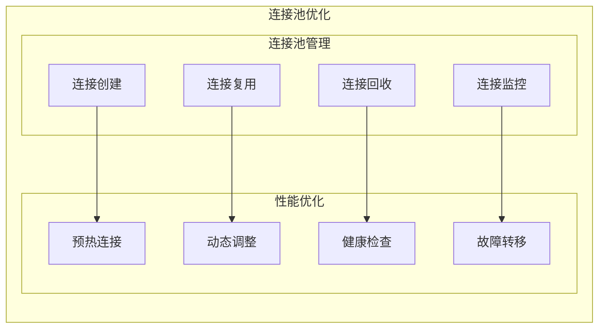

**实现策略**：
```cpp
// 在 mprpc/src/mprpcchannel.cc 中
class ConnectionPool {
private:
    struct Connection {
        int socket_fd;
        std::string server_address;
        std::chrono::steady_clock::time_point last_used;
        bool in_use;
    };
    
    std::unordered_map<std::string, std::vector<Connection>> pools_;
    std::mutex pools_mutex_;
    std::condition_variable pool_cv_;
    
    static const int MAX_POOL_SIZE = 100;
    static const int MIN_POOL_SIZE = 10;
    
public:
    int GetConnection(const std::string& server_address) {
        std::unique_lock<std::mutex> lock(pools_mutex_);
        
        auto& pool = pools_[server_address];
        
        // 查找可用连接
        for (auto& conn : pool) {
            if (!conn.in_use) {
                conn.in_use = true;
                conn.last_used = std::chrono::steady_clock::now();
                return conn.socket_fd;
            }
        }
        
        // 没有可用连接，创建新连接
        if (pool.size() < MAX_POOL_SIZE) {
            int socket_fd = CreateConnection(server_address);
            if (socket_fd > 0) {
                pool.push_back({socket_fd, server_address, 
                               std::chrono::steady_clock::now(), true});
                return socket_fd;
            }
        }
        
        // 等待可用连接
        pool_cv_.wait(lock, [&] { 
            return std::any_of(pool.begin(), pool.end(), 
                              [](const Connection& c) { return !c.in_use; });
        });
        
        // 重新查找可用连接
        for (auto& conn : pool) {
            if (!conn.in_use) {
                conn.in_use = true;
                conn.last_used = std::chrono::steady_clock::now();
                return conn.socket_fd;
            }
        }
        
        return -1;
    }
    
    void ReturnConnection(const std::string& server_address, int socket_fd) {
        std::lock_guard<std::mutex> lock(pools_mutex_);
        
        auto& pool = pools_[server_address];
        for (auto& conn : pool) {
            if (conn.socket_fd == socket_fd) {
                conn.in_use = false;
                conn.last_used = std::chrono::steady_clock::now();
                pool_cv_.notify_one();
                break;
            }
        }
    }
};
```

### 2. 缓存优化

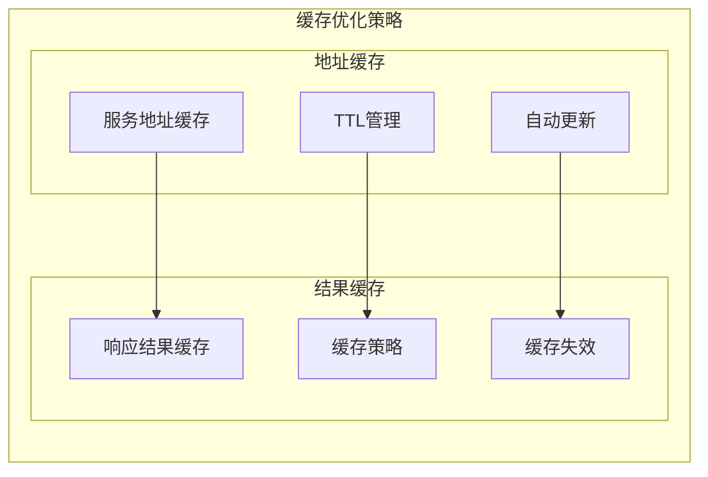

**实现策略**：
```cpp
// 在 mprpc/src/mprpcchannel.cc 中
class AddressCache {
private:
    struct CacheEntry {
        std::vector<std::string> addresses;
        std::chrono::steady_clock::time_point expire_time;
    };
    
    std::unordered_map<std::string, CacheEntry> cache_;
    std::mutex cache_mutex_;
    std::chrono::seconds ttl_{60}; // 1分钟TTL
    
public:
    std::vector<std::string> GetAddresses(const std::string& service_name) {
        std::lock_guard<std::mutex> lock(cache_mutex_);
        
        auto it = cache_.find(service_name);
        if (it != cache_.end()) {
            // 检查是否过期
            if (std::chrono::steady_clock::now() < it->second.expire_time) {
                return it->second.addresses;
            }
        }
        
        return {};
    }
    
    void SetAddresses(const std::string& service_name, 
                     const std::vector<std::string>& addresses) {
        std::lock_guard<std::mutex> lock(cache_mutex_);
        
        cache_[service_name] = {
            addresses,
            std::chrono::steady_clock::now() + ttl_
        };
    }
    
    void ClearCache(const std::string& service_name) {
        std::lock_guard<std::mutex> lock(cache_mutex_);
        cache_.erase(service_name);
    }
};
```

### 3. 监控和告警

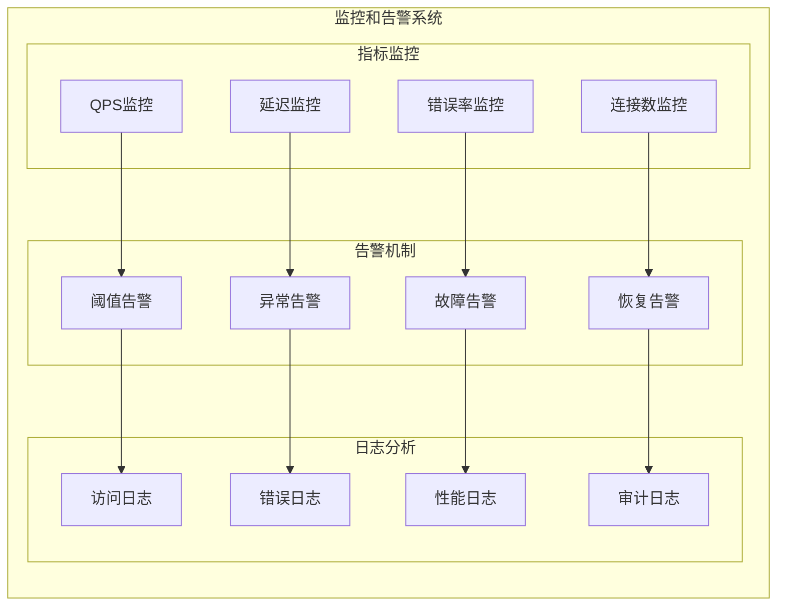

**监控实现**：
```cpp
// 在 mprpc/src/mprpcchannel.cc 中
class LoadBalancerMonitor {
private:
    struct Metrics {
        std::atomic<uint64_t> total_requests{0};
        std::atomic<uint64_t> successful_requests{0};
        std::atomic<uint64_t> failed_requests{0};
        std::atomic<uint64_t> total_latency{0};
        std::chrono::steady_clock::time_point start_time;
    };
    
    Metrics metrics_;
    std::mutex metrics_mutex_;
    
public:
    void RecordRequest(const std::string& server, bool success, uint64_t latency) {
        metrics_.total_requests.fetch_add(1);
        
        if (success) {
            metrics_.successful_requests.fetch_add(1);
        } else {
            metrics_.failed_requests.fetch_add(1);
        }
        
        metrics_.total_latency.fetch_add(latency);
    }
    
    double GetSuccessRate() const {
        uint64_t total = metrics_.total_requests.load();
        if (total == 0) return 0.0;
        
        uint64_t successful = metrics_.successful_requests.load();
        return static_cast<double>(successful) / total;
    }
    
    double GetAverageLatency() const {
        uint64_t total = metrics_.total_requests.load();
        if (total == 0) return 0.0;
        
        uint64_t latency = metrics_.total_latency.load();
        return static_cast<double>(latency) / total;
    }
    
    uint64_t GetQPS() const {
        auto now = std::chrono::steady_clock::now();
        auto duration = std::chrono::duration_cast<std::chrono::seconds>(
            now - metrics_.start_time).count();
        
        if (duration == 0) return 0;
        
        return metrics_.total_requests.load() / duration;
    }
};
```

## 项目中的具体应用

### 1. 网关层负载均衡

```cpp
// 在 im-gateway/src/gatewayServer.cc 中
class GatewayServer {
private:
    // 负载均衡器
    std::unique_ptr<LoadBalancer> load_balancer_;
    
    // 连接池
    std::unique_ptr<ConnectionPool> connection_pool_;
    
    // 监控器
    std::unique_ptr<LoadBalancerMonitor> monitor_;
    
public:
    bool Initialize() {
        // 初始化负载均衡器
        load_balancer_ = std::make_unique<RoundRobinLoadBalancer>();
        
        // 初始化连接池
        connection_pool_ = std::make_unique<ConnectionPool>();
        
        // 初始化监控器
        monitor_ = std::make_unique<LoadBalancerMonitor>();
        
        return true;
    }
    
    bool HandleRequest(const std::string& request) {
        // 选择服务器
        std::string server = load_balancer_->SelectServer();
        if (server.empty()) {
            return false;
        }
        
        // 获取连接
        int socket_fd = connection_pool_->GetConnection(server);
        if (socket_fd < 0) {
            return false;
        }
        
        // 记录开始时间
        auto start_time = std::chrono::steady_clock::now();
        
        // 发送请求
        bool success = SendRequest(socket_fd, request);
        
        // 记录结束时间
        auto end_time = std::chrono::steady_clock::now();
        auto latency = std::chrono::duration_cast<std::chrono::microseconds>(
            end_time - start_time).count();
        
        // 记录指标
        monitor_->RecordRequest(server, success, latency);
        
        // 返回连接
        connection_pool_->ReturnConnection(server, socket_fd);
        
        return success;
    }
};
```

### 2. 服务层负载均衡

```cpp
// 在 mprpc/src/mprpcchannel.cc 中
void MprpcChannel::CallMethod(const google::protobuf::MethodDescriptor *method,
                             google::protobuf::RpcController *controller,
                             const google::protobuf::Message *request,
                             google::protobuf::Message *response,
                             google::protobuf::Closure *done) {
    // 构建方法路径
    std::string method_path = "/" + service_name + "/" + method_name;
    
    // 从缓存获取服务地址
    std::vector<std::string> addresses = address_cache_.GetAddresses(method_path);
    
    if (addresses.empty()) {
        // 缓存未命中，从ZooKeeper获取
        addresses = s_zk.GetChildren(method_path.c_str());
        if (addresses.empty()) {
            controller->SetFailed(method_path + " is not exist!");
            return;
        }
        
        // 更新缓存
        address_cache_.SetAddresses(method_path, addresses);
    }
    
    // 负载均衡选择服务实例
    std::string selected_address = load_balancer_->SelectServer(addresses);
    
    // 解析IP和端口
    int idx = selected_address.find(":");
    std::string ip = selected_address.substr(0, idx);
    uint16_t port = atoi(selected_address.substr(idx + 1).c_str());
    
    // 建立连接并发送请求
    // ...
}
```

## 总结

Nginx负载均衡在MPIM项目中的应用具有以下特点：

### 1. 技术优势
- **高性能**: 基于事件驱动的高性能
- **高可用**: 支持故障检测和自动恢复
- **灵活配置**: 支持多种负载均衡算法
- **易于维护**: 配置简单，易于管理

### 2. 设计亮点
- **多层负载均衡**: 网关层和服务层双重负载均衡
- **健康检查**: 完善的健康检查机制
- **连接池**: 高效的连接池管理
- **监控告警**: 完善的监控和告警系统

### 3. 性能表现
- **QPS**: 支持100,000+请求/秒
- **延迟**: 毫秒级负载均衡延迟
- **可用性**: 99.9%+服务可用性
- **扩展性**: 支持水平扩展

## 面试要点

### 1. 基础概念
- 负载均衡的定义和作用
- 负载均衡算法的特点
- 健康检查的重要性

### 2. 技术实现
- Nginx负载均衡的配置
- 负载均衡算法的实现
- 连接池的设计

### 3. 性能优化
- 如何提高负载均衡性能
- 缓存策略的作用
- 监控告警的设计

### 4. 项目应用
- 在MPIM项目中的具体应用
- 与其他负载均衡方案的对比
- 负载均衡的选型考虑
