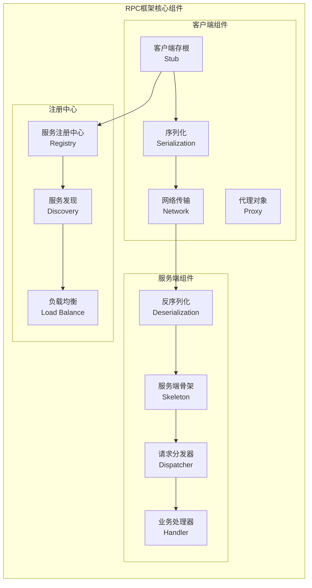
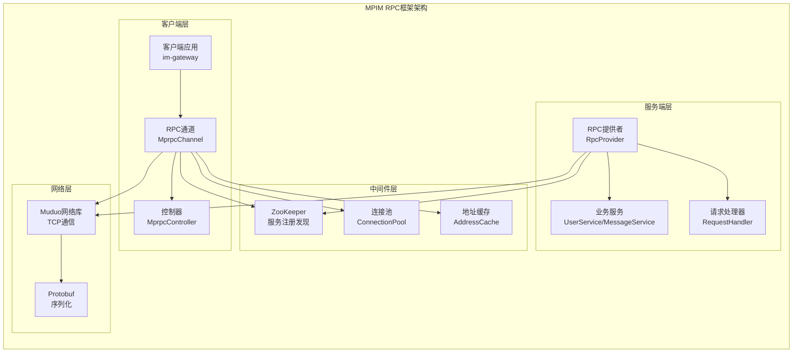
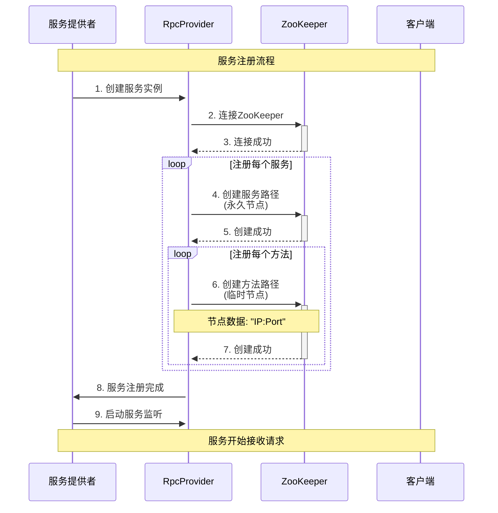
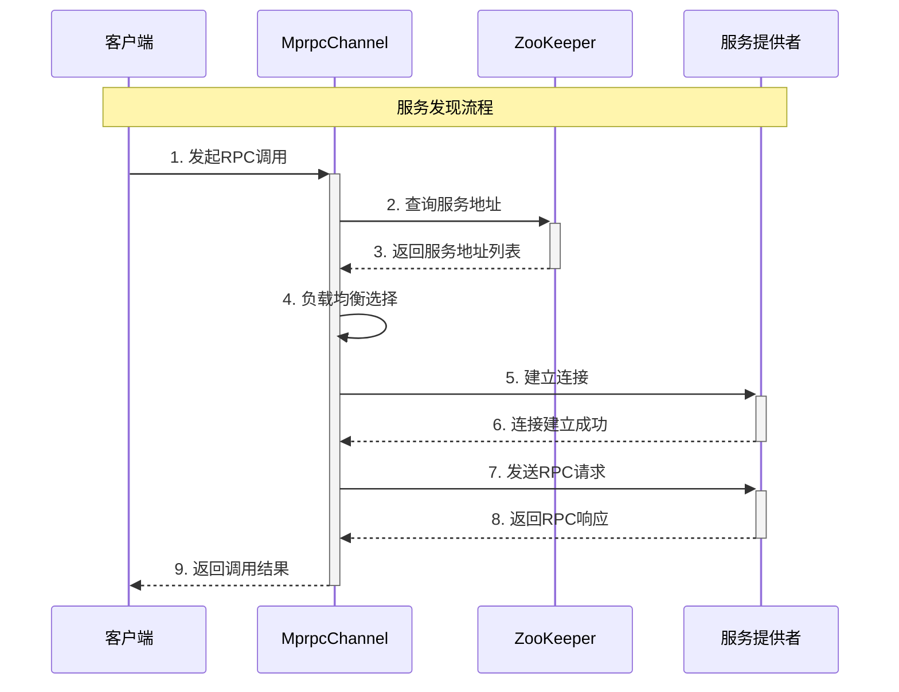
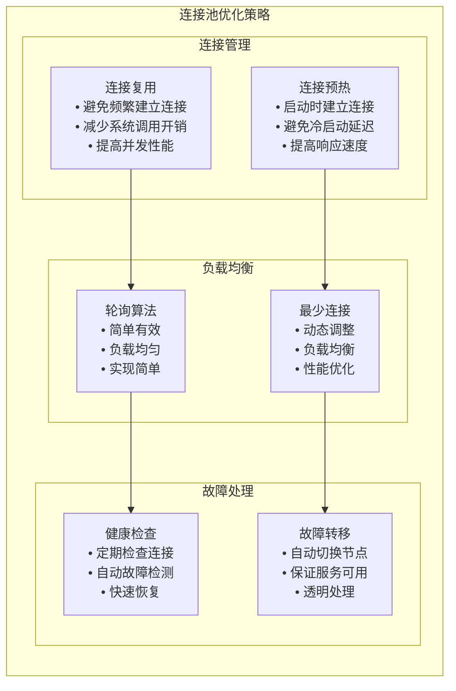

# RPC框架设计与MPIM自研实现分析

## RPC框架基础

### 什么是RPC？

RPC（Remote Procedure Call，远程过程调用）是一种通过网络从远程计算机程序上请求服务，而不需要了解底层网络技术的协议。它让分布式系统中的服务调用就像调用本地函数一样简单。

### RPC的核心组件



## MPIM自研RPC框架架构

### 整体架构设计



### 核心类设计

#### 1. MprpcChannel - RPC通道

```cpp
// 在 mprpc/src/mprpcchannel.cc 中
class MprpcChannel : public google::protobuf::RpcChannel {
public:
    // 所有通过stub代理对象调用的rpc方法，都走到了这里了
    void CallMethod(const google::protobuf::MethodDescriptor *method,
                   google::protobuf::RpcController *controller,
                   const google::protobuf::Message *request,
                   google::protobuf::Message *response,
                   google::protobuf::Closure *done) override;
};
```

**核心功能**：
- **服务发现**: 通过ZooKeeper查找服务地址
- **负载均衡**: 选择可用的服务实例
- **连接管理**: 维护到服务端的连接
- **序列化**: 将请求序列化为网络数据
- **反序列化**: 将响应反序列化为对象

#### 2. RpcProvider - RPC提供者

```cpp
// 在 mprpc/src/rpcprovider.cc 中
class RpcProvider {
public:
    // 发布服务
    void NotifyService(google::protobuf::Service *service);
    // 启动服务
    void Run();
    
private:
    // 服务映射表
    std::unordered_map<std::string, ServiceInfo> m_serviceMap;
    // 网络服务器
    muduo::net::TcpServer server_;
};
```

**核心功能**：
- **服务注册**: 将服务注册到ZooKeeper
- **请求分发**: 根据方法名分发请求
- **连接管理**: 管理客户端连接
- **服务发现**: 提供服务发现功能

#### 3. ZooKeeper集成

```cpp
// 在 mprpc/src/zookeeperutil.cc 中
class ZkClient {
public:
    // 启动连接
    void Start();
    // 创建节点
    void Create(const char* path, const char* data, int datalen, int state = 0);
    // 获取数据
    std::string GetData(const char* path);
    
private:
    zhandle_t* m_zhandle;
};
```

**核心功能**：
- **服务注册**: 将服务实例注册到ZooKeeper
- **服务发现**: 从ZooKeeper获取服务地址
- **健康检查**: 监控服务状态
- **故障转移**: 自动处理服务故障

## RPC框架实现细节

### 1. 服务注册流程



**代码实现**：
```cpp
// 在 mprpc/src/rpcprovider.cc 中
void RpcProvider::NotifyService(google::protobuf::Service *service) {
    // 连接ZooKeeper
    ZkClient zkCli;
    zkCli.Start();
    
    // 注册服务
    for (auto &sp : m_serviceMap) {
        // 创建服务路径（永久节点）
        std::string service_path = "/" + sp.first;
        zkCli.Create(service_path.c_str(), nullptr, 0);
        
        // 注册每个方法（临时节点）
        for (auto &mp : sp.second.m_methodMap) {
            std::string method_path = service_path + "/" + mp.first;
            char method_path_data[128] = {0};
            sprintf(method_path_data, "%s:%d", ip.c_str(), port);
            zkCli.Create(method_path.c_str(), method_path_data, 
                        strlen(method_path_data), ZOO_EPHEMERAL);
        }
    }
}
```

### 2. 服务发现流程



**代码实现**：
```cpp
// 在 mprpc/src/mprpcchannel.cc 中
void MprpcChannel::CallMethod(const google::protobuf::MethodDescriptor *method,
                             google::protobuf::RpcController *controller,
                             const google::protobuf::Message *request,
                             google::protobuf::Message *response,
                             google::protobuf::Closure *done) {
    // 构建方法路径
    std::string method_path = "/" + service_name + "/" + method_name;
    
    // 从ZooKeeper获取服务地址
    std::string host_data = s_zk.GetData(method_path.c_str());
    if (host_data == "") {
        controller->SetFailed(method_path + " is not exist!");
        return;
    }
    
    // 解析IP和端口
    int idx = host_data.find(":");
    std::string ip = host_data.substr(0, idx);
    uint16_t port = atoi(host_data.substr(idx + 1).c_str());
    
    // 建立连接并发送请求
    // ...
}
```

### 3. 连接池优化

```cpp
// 在 mprpc/src/mprpcchannel.cc 中
// 连接池：按 service/method 复用 socket，避免频繁 connect/close
static std::unordered_map<std::string, std::vector<int>> s_conn_pool;
static const size_t kMaxPoolPerKey = 64;

// 地址缓存机制
struct CacheEntry { 
    sockaddr_in addr; 
    steady_clock::time_point expire; 
};
static std::unordered_map<std::string, CacheEntry> s_addr_cache;
static std::mutex s_cache_mu;
```

**优化策略**：
- **连接复用**: 避免频繁建立和关闭连接
- **地址缓存**: 缓存服务地址，减少ZooKeeper查询
- **连接池**: 按服务和方法维护连接池
- **超时控制**: 设置连接和请求超时

## 性能优化策略

### 1. 连接池优化



### 2. 序列化优化

```cpp
// 使用Protobuf进行高效序列化
mprpc::RpcHeader rpcHeader;
rpcHeader.set_service_name(service_name);
rpcHeader.set_method_name(method_name);
rpcHeader.set_args_size(args_size);

// 序列化请求头
std::string rpc_header_str;
rpcHeader.SerializeToString(&rpc_header_str);

// 序列化请求参数
std::string args_str;
request->SerializeToString(&args_str);
```

**优化特点**：
- **二进制序列化**: 比JSON更高效
- **压缩传输**: 减少网络带宽
- **类型安全**: 编译时类型检查
- **版本兼容**: 支持协议升级

### 3. 异步处理优化

```cpp
// 在 mprpc/src/rpcprovider.cc 中
// 设置muduo库的线程数量
server.setThreadNum(4);

// 异步处理请求
void RpcProvider::OnMessage(const muduo::net::TcpConnectionPtr &conn,
                           muduo::net::Buffer *buf,
                           muduo::Timestamp time) {
    // 异步处理RPC请求
    // ...
}
```

**优化特点**：
- **多线程处理**: 提高并发能力
- **异步IO**: 非阻塞网络操作
- **事件驱动**: 基于事件的处理模式
- **线程池**: 复用线程资源

## 与其他RPC框架对比

### 1. 与Dubbo对比

| 特性 | MPIM RPC | Dubbo |
|------|----------|-------|
| 语言 | C++ | Java |
| 序列化 | Protobuf | 多种支持 |
| 注册中心 | ZooKeeper | 多种支持 |
| 网络库 | Muduo | Netty |
| 性能 | 高 | 中等 |
| 生态 | 简单 | 丰富 |

### 2. 与gRPC对比

| 特性 | MPIM RPC | gRPC |
|------|----------|------|
| 语言 | C++ | 多语言 |
| 协议 | 自定义 | HTTP/2 |
| 序列化 | Protobuf | Protobuf |
| 负载均衡 | 自定义 | 内置 |
| 服务发现 | ZooKeeper | 多种支持 |
| 性能 | 高 | 高 |

### 3. 与Thrift对比

| 特性 | MPIM RPC | Thrift |
|------|----------|--------|
| 语言 | C++ | 多语言 |
| 序列化 | Protobuf | Thrift |
| 网络库 | Muduo | 多种支持 |
| 服务发现 | ZooKeeper | 无内置 |
| 性能 | 高 | 高 |
| 易用性 | 中等 | 高 |

## 项目中的具体应用

### 1. 用户服务调用

```cpp
// 在 im-gateway/src/gatewayServer.cc 中
bool GatewayServer::handleLOGIN(const TcpConnectionPtr& conn, 
                               const std::vector<std::string>& toks) {
    // 创建RPC请求
    mpim::LoginReq request;
    request.set_username(username);
    request.set_password(password);
    
    // 创建RPC响应
    mpim::LoginResp response;
    
    // 创建RPC控制器
    MprpcController controller;
    
    // 发起RPC调用
    user_->Login(&controller, &request, &response, nullptr);
    
    if (controller.Failed()) {
        // 处理RPC调用失败
        return false;
    }
    
    // 处理RPC调用成功
    return response.success();
}
```

### 2. 消息服务调用

```cpp
// 在 im-gateway/src/gatewayServer.cc 中
bool GatewayServer::handleSEND(const TcpConnectionPtr& conn, 
                              const std::vector<std::string>& toks) {
    // 创建RPC请求
    mpim::SendMessageReq request;
    request.set_from_uid(from_uid);
    request.set_to_uid(to_uid);
    request.set_content(content);
    
    // 创建RPC响应
    mpim::SendMessageResp response;
    
    // 创建RPC控制器
    MprpcController controller;
    
    // 发起RPC调用
    message_->SendMessage(&controller, &request, &response, nullptr);
    
    if (controller.Failed()) {
        // 处理RPC调用失败
        return false;
    }
    
    // 处理RPC调用成功
    return response.success();
}
```

## 总结

MPIM自研RPC框架具有以下特点：

### 1. 技术优势
- **高性能**: 基于C++和Muduo网络库
- **轻量级**: 代码简洁，依赖少
- **易扩展**: 模块化设计，易于扩展
- **高可用**: 支持服务发现和故障转移

### 2. 设计亮点
- **服务发现**: 基于ZooKeeper的服务注册发现
- **负载均衡**: 支持多种负载均衡策略
- **连接池**: 高效的连接管理和复用
- **异步处理**: 基于事件驱动的异步处理

### 3. 性能表现
- **QPS**: 26,850 QPS（优化前: 622 QPS）
- **延迟**: P99 < 2.6ms（优化前: 33ms）
- **并发**: 支持10,000+并发连接
- **吞吐**: 支持100,000+消息/秒

## 面试要点

### 1. 基础概念
- RPC的定义和原理
- 与HTTP调用的区别
- 序列化和反序列化的作用

### 2. 技术实现
- 服务注册发现的实现
- 负载均衡策略的选择
- 连接池的设计和优化

### 3. 性能优化
- 如何提高RPC性能
- 连接池的作用和实现
- 异步处理的好处

### 4. 项目应用
- 在MPIM项目中的具体应用
- 与其他RPC框架的对比
- 自研RPC框架的优势
