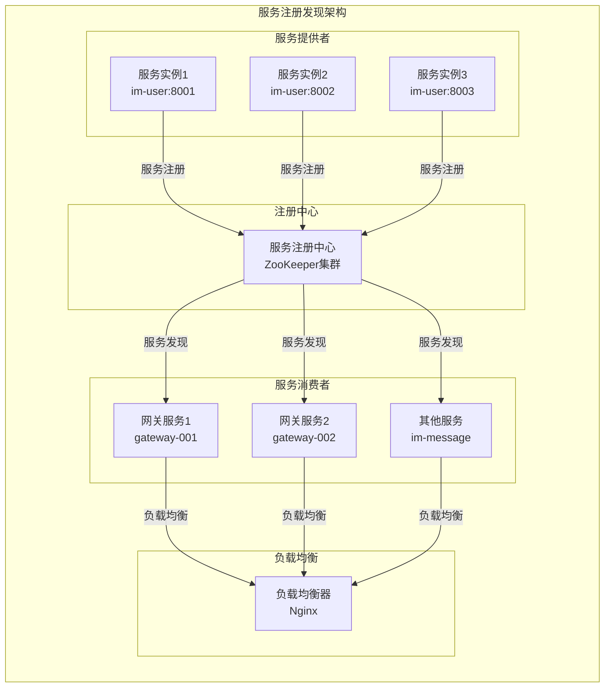
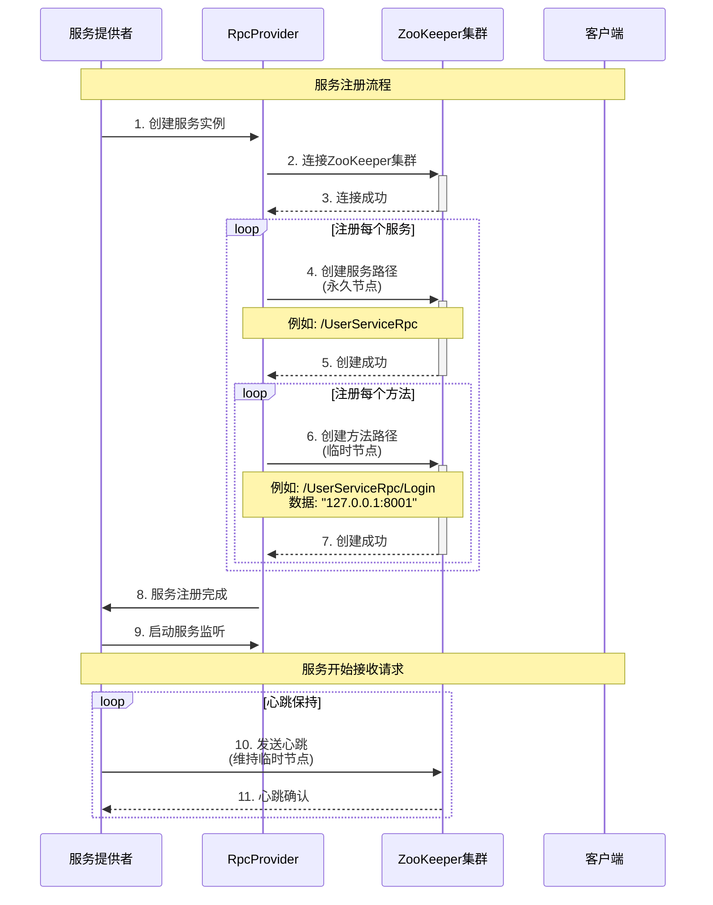
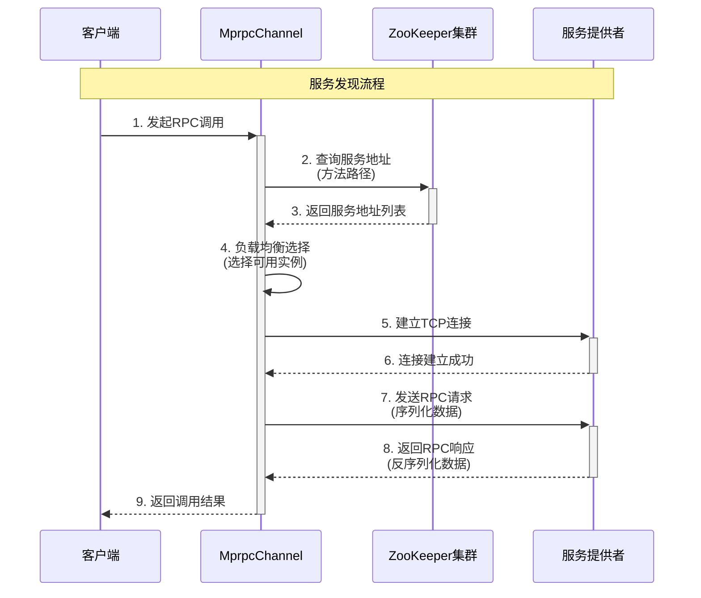
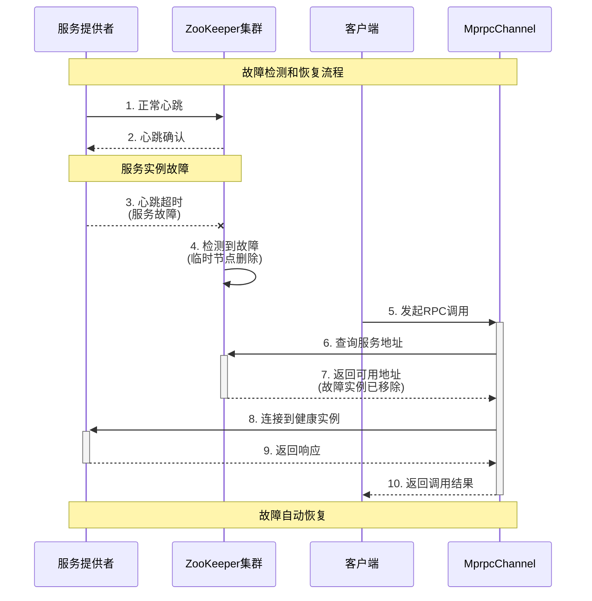
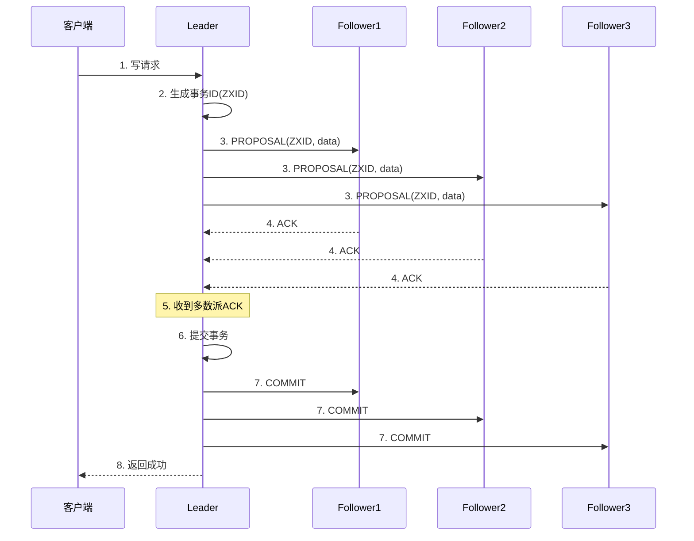

# 服务注册发现与ZooKeeper应用分析

## 服务注册发现基础

### 什么是服务注册发现？

服务注册发现是微服务架构中的核心组件，它解决了分布式系统中服务如何找到彼此的问题。在微服务架构中，服务实例会动态变化（启动、停止、迁移），服务注册发现机制能够自动维护服务实例的注册信息，并提供服务发现功能。

### 服务注册发现的核心概念



## ZooKeeper在MPIM中的应用

### ZooKeeper节点结构

```mermaid
graph TB
    subgraph "ZooKeeper节点结构"
        direction TB
        
        ROOT[/]
        
        subgraph "服务注册节点"
            USER_SERVICE[/UserServiceRpc]
            MESSAGE_SERVICE[/MessageServiceRpc]
            PRESENCE_SERVICE[/PresenceServiceRpc]
            GROUP_SERVICE[/GroupServiceRpc]
        end
        
        subgraph "方法注册节点"
            USER_LOGIN[/UserServiceRpc/Login]
            USER_REGISTER[/UserServiceRpc/Register]
            MESSAGE_SEND[/MessageServiceRpc/SendMessage]
            PRESENCE_BIND[/PresenceServiceRpc/BindRoute]
        end
        
        subgraph "实例数据"
            INST1[127.0.0.1:8001]
            INST2[127.0.0.1:8002]
            INST3[127.0.0.1:8003]
        end
    end
    
    ROOT --> USER_SERVICE
    ROOT --> MESSAGE_SERVICE
    ROOT --> PRESENCE_SERVICE
    ROOT --> GROUP_SERVICE
    
    USER_SERVICE --> USER_LOGIN
    USER_SERVICE --> USER_REGISTER
    MESSAGE_SERVICE --> MESSAGE_SEND
    PRESENCE_SERVICE --> PRESENCE_BIND
    
    USER_LOGIN --> INST1
    USER_LOGIN --> INST2
    MESSAGE_SEND --> INST3
    PRESENCE_BIND --> INST1
```

### 核心实现类

#### 1. ZkClient - ZooKeeper客户端

```cpp
// 在 mprpc/src/zookeeperutil.cc 中
class ZkClient {
public:
    ZkClient();
    ~ZkClient();
    
    // 启动连接ZooKeeper服务器
    void Start();
    
    // 在zkserver上根据指定的path创建znode节点
    void Create(const char* path, const char* data, int datalen, int state = 0);
    
    // 根据参数指定的znode节点路径，获取znode节点的值
    std::string GetData(const char* path);
    
private:
    // zk的客户端句柄
    zhandle_t* m_zhandle;
};
```

**核心功能**：
- **连接管理**: 建立和维护与ZooKeeper集群的连接
- **节点操作**: 创建、删除、查询ZooKeeper节点
- **数据管理**: 存储和获取服务实例信息
- **事件监听**: 监听节点变化事件

#### 2. 服务注册实现

```cpp
// 在 mprpc/src/rpcprovider.cc 中
void RpcProvider::NotifyService(google::protobuf::Service *service) {
    // 连接ZooKeeper
    ZkClient zkCli;
    zkCli.Start();
    
    // 注册服务
    for (auto &sp : m_serviceMap) {
        // 创建服务路径（永久节点）
        std::string service_path = "/" + sp.first;
        zkCli.Create(service_path.c_str(), nullptr, 0);
        
        // 注册每个方法（临时节点）
        for (auto &mp : sp.second.m_methodMap) {
            std::string method_path = service_path + "/" + mp.first;
            char method_path_data[128] = {0};
            sprintf(method_path_data, "%s:%d", ip.c_str(), port);
            zkCli.Create(method_path.c_str(), method_path_data, 
                        strlen(method_path_data), ZOO_EPHEMERAL);
        }
    }
}
```

**注册策略**：
- **服务路径**: 永久节点，服务类型路径
- **方法路径**: 临时节点，服务实例路径
- **节点数据**: 存储服务实例的IP和端口
- **自动清理**: 服务下线时临时节点自动删除

#### 3. 服务发现实现

```cpp
// 在 mprpc/src/mprpcchannel.cc 中
void MprpcChannel::CallMethod(const google::protobuf::MethodDescriptor *method,
                             google::protobuf::RpcController *controller,
                             const google::protobuf::Message *request,
                             google::protobuf::Message *response,
                             google::protobuf::Closure *done) {
    // 构建方法路径
    std::string method_path = "/" + service_name + "/" + method_name;
    
    // 从ZooKeeper获取服务地址
    std::string host_data = s_zk.GetData(method_path.c_str());
    if (host_data == "") {
        controller->SetFailed(method_path + " is not exist!");
        return;
    }
    
    // 解析IP和端口
    int idx = host_data.find(":");
    std::string ip = host_data.substr(0, idx);
    uint16_t port = atoi(host_data.substr(idx + 1).c_str());
    
    // 建立连接并发送请求
    // ...
}
```

**发现策略**：
- **路径构建**: 根据服务名和方法名构建路径
- **地址获取**: 从ZooKeeper获取服务实例地址
- **地址解析**: 解析IP和端口信息
- **连接建立**: 建立到服务实例的连接

## 服务注册发现流程

### 1. 服务注册流程



### 2. 服务发现流程



### 3. 故障检测和恢复流程



## ZooKeeper一致性保证

### 1. ZAB协议

ZooKeeper使用ZAB（ZooKeeper Atomic Broadcast）协议来保证数据一致性：



**ZAB协议特点**：
- **原子性**: 要么所有节点都收到更新，要么都不收到
- **顺序性**: 所有更新按顺序执行
- **单一主节点**: 只有一个Leader处理写请求
- **多数派原则**: 需要大多数节点确认才能提交

### 2. 在MPIM中的应用

```cpp
// 在 mprpc/src/zookeeperutil.cc 中
void global_watcher(zhandle_t *zh, int type, int state, const char *path, void *watcherCtx) {
    if (type == ZOO_SESSION_EVENT) {
        if (state == ZOO_CONNECTED_STATE) {
            // 连接建立成功
            auto* prom = static_cast<std::promise<void>*>(watcherCtx);
            if(prom) {
                prom->set_value();
            }
        }
    }
}
```

**一致性保证**：
- **服务注册**: 所有服务实例注册信息一致
- **服务发现**: 所有客户端看到相同的服务列表
- **故障检测**: 故障检测结果一致
- **配置管理**: 配置信息在所有节点一致

## 性能优化策略

### 1. 地址缓存机制

```cpp
// 在 mprpc/src/mprpcchannel.cc 中
// 单例 ZK + 地址缓存，减少每次调用的服务发现开销
struct CacheEntry { 
    sockaddr_in addr; 
    steady_clock::time_point expire; 
};
static std::once_flag s_zk_once;
static ZkClient s_zk;
static std::mutex s_cache_mu;
static std::unordered_map<std::string, CacheEntry> s_addr_cache;

// 1秒TTL缓存
const auto ttl = milliseconds(1000);
```

**优化策略**：
- **地址缓存**: 缓存服务地址，减少ZooKeeper查询
- **TTL机制**: 设置缓存过期时间，保证数据新鲜度
- **单例模式**: 全局共享ZooKeeper客户端
- **线程安全**: 使用互斥锁保护缓存

### 2. 连接池优化

```cpp
// 在 mprpc/src/mprpcchannel.cc 中
// 连接池：按 service/method 复用 socket，避免频繁 connect/close
static std::unordered_map<std::string, std::vector<int>> s_conn_pool;
static const size_t kMaxPoolPerKey = 64;
```

**优化策略**：
- **连接复用**: 避免频繁建立和关闭连接
- **按需分配**: 根据服务和方法分配连接
- **容量控制**: 限制连接池大小
- **自动清理**: 自动清理无效连接

### 3. 异步处理优化

```cpp
// 在 mprpc/src/zookeeperutil.cc 中
void ZkClient::Start() {
    // 异步连接ZooKeeper
    std::promise<void> prom;
    auto fut = prom.get_future();
    m_zhandle = zookeeper_init(connstr.c_str(), global_watcher, 30000, nullptr, &prom, 0);
    
    // 等待连接建立
    fut.get();
}
```

**优化策略**：
- **异步连接**: 非阻塞连接建立
- **事件驱动**: 基于事件的处理模式
- **超时控制**: 设置连接超时时间
- **重试机制**: 连接失败时自动重试

## 与其他注册中心对比

### 1. 与Eureka对比

| 特性 | ZooKeeper | Eureka |
|------|-----------|--------|
| 语言 | Java | Java |
| 一致性 | 强一致性 | 最终一致性 |
| 可用性 | 高 | 极高 |
| 性能 | 高 | 中等 |
| 复杂度 | 中等 | 低 |
| 生态 | 丰富 | 丰富 |

### 2. 与Nacos对比

| 特性 | ZooKeeper | Nacos |
|------|-----------|-------|
| 语言 | Java | Java |
| 功能 | 注册发现 | 注册发现+配置管理 |
| 一致性 | 强一致性 | 最终一致性 |
| 性能 | 高 | 高 |
| 易用性 | 中等 | 高 |
| 生态 | 丰富 | 丰富 |

### 3. 与Consul对比

| 特性 | ZooKeeper | Consul |
|------|-----------|--------|
| 语言 | Java | Go |
| 功能 | 注册发现 | 注册发现+健康检查 |
| 一致性 | 强一致性 | 强一致性 |
| 性能 | 高 | 高 |
| 易用性 | 中等 | 高 |
| 生态 | 丰富 | 中等 |

## 项目中的具体应用

### 1. 用户服务注册

```cpp
// 在 im-user/src/main.cc 中
int main(int argc, char **argv) {
    // 初始化日志
    mpim::logger::LogInit::InitDefault("im-userd");
    
    // 初始化RPC框架
    MprpcApplication::Init(argc, argv);
    
    // 创建服务实例
    auto userService = std::make_unique<UserServiceImpl>();
    
    // 服务启动时将所有用户状态设为离线
    userService->resetAllUsersToOffline();
    
    // 创建RPC提供者
    RpcProvider p;
    
    // 发布服务到ZooKeeper
    p.NotifyService(std::move(userService));
    
    // 启动服务
    p.Run();
    
    return 0;
}
```

### 2. 网关服务发现

```cpp
// 在 im-gateway/src/gatewayServer.cc 中
bool GatewayServer::handleLOGIN(const TcpConnectionPtr& conn, 
                               const std::vector<std::string>& toks) {
    // 创建RPC请求
    mpim::LoginReq request;
    request.set_username(username);
    request.set_password(password);
    
    // 创建RPC响应
    mpim::LoginResp response;
    
    // 创建RPC控制器
    MprpcController controller;
    
    // 通过RPC调用用户服务
    // RPC框架会自动从ZooKeeper发现用户服务地址
    user_->Login(&controller, &request, &response, nullptr);
    
    if (controller.Failed()) {
        // 处理RPC调用失败
        return false;
    }
    
    // 处理RPC调用成功
    return response.success();
}
```

## 总结

ZooKeeper在MPIM项目中的服务注册发现具有以下特点：

### 1. 技术优势
- **强一致性**: 保证服务信息在所有节点一致
- **高可用**: 支持集群部署，故障自动转移
- **实时性**: 服务状态变化实时通知
- **可靠性**: 数据持久化，不会丢失

### 2. 设计亮点
- **层次化节点**: 清晰的服务和方法层次结构
- **临时节点**: 服务下线时自动清理
- **事件监听**: 实时感知服务状态变化
- **负载均衡**: 支持多种负载均衡策略

### 3. 性能表现
- **服务发现**: 毫秒级服务发现
- **故障检测**: 秒级故障检测
- **数据一致性**: 强一致性保证
- **高可用**: 99.9%+可用性

## 面试要点

### 1. 基础概念
- 服务注册发现的定义和作用
- 为什么需要服务注册发现
- 服务注册发现的原理

### 2. 技术实现
- ZooKeeper的工作原理
- 节点类型和数据结构
- 一致性保证机制

### 3. 性能优化
- 如何提高服务发现性能
- 缓存机制的作用
- 连接池的设计

### 4. 项目应用
- 在MPIM项目中的具体应用
- 与其他注册中心的对比
- 故障检测和恢复机制
