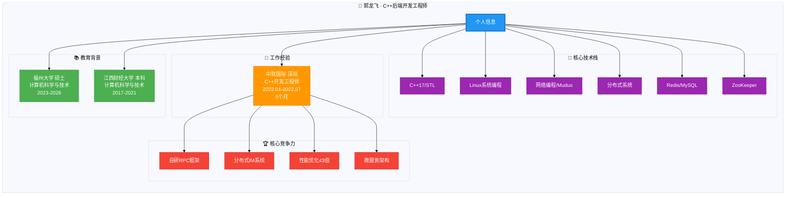
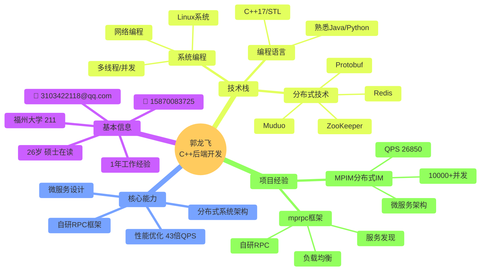
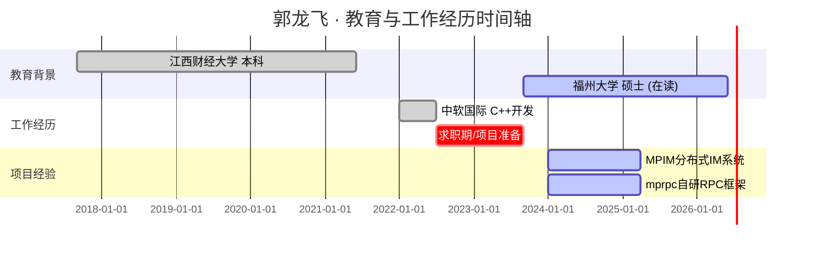
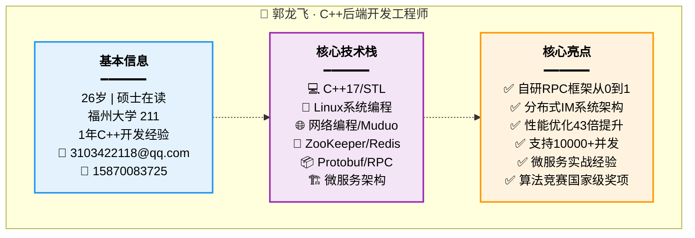

# PPT第一页：个人介绍

> **用途：** PPT开场，1-1.5分钟  
> **目标：** 让面试官30秒内记住你的核心亮点

---

## 📋 PPT内容（直接复制使用）

### 标题
```
郭龙飞
C++后端开发工程师
```

### 基本信息
```
📧 3103422118@qq.com  |  📱 15870083725
🎓 福州大学 (211) · 计算机科学与技术硕士 · 在读
💼 1年开发经验 (中软国际6个月 + 自研项目1年)
```

### 核心竞争力（用数据说话）
```
✅ 自研RPC框架从0到1 (基于Protobuf + Muduo + ZooKeeper)
✅ 分布式IM系统架构 (微服务 + 10,000+并发)
✅ 性能优化43倍提升 (QPS: 622 → 26,850，延迟降低87%)
✅ 算法竞赛国家级奖项 (蓝桥杯全国三等奖)
```

### 核心技术栈
```
C++17/STL  |  Linux系统编程  |  网络编程/Muduo
ZooKeeper  |  Redis/MySQL   |  Protobuf/RPC
```

---

## 🎨 Mermaid可视化（选一个用）

### 方案1：思维导图（推荐）



### 2. 技术能力象限图（推荐用于PPT）



### 3. 时间轴（教育+工作经历）



### 4. 技术栈图标墙（简洁版）



---

## 📝 PPT第一页文案建议

### 标题区域
```
郭龙飞
C++后端开发工程师
```

### 副标题
```
福州大学硕士在读 | 1年C++开发经验 | 专注分布式系统架构与性能优化
```

### 核心信息区（左侧或中间）
```
📧 邮箱：3103422118@qq.com
📱 手机：15870083725
🎓 学历：福州大学（211）· 计算机科学与技术硕士
💼 工作：中软国际 · C++开发工程师（6个月）
```

### 核心竞争力标签（右侧或底部）
```
🎯 核心竞争力
━━━━━━━━━━━━━━━━━━━━━
✅ 自研RPC框架：从0到1设计实现完整RPC通信框架
✅ 分布式系统：微服务架构 + ZooKeeper服务发现
✅ 性能优化：QPS提升43倍（622→26,850），延迟降低87%
✅ 高并发处理：支持10,000+并发连接，消息吞吐100,000+/s
✅ 算法能力：蓝桥杯全国三等奖，LeetCode/ACM刷题经验
```

### 技术栈图标墙
```
━━━━━━━━━━━━━━━━━━━━━
核心技术栈
━━━━━━━━━━━━━━━━━━━━━

编程语言      系统编程        分布式技术
────────      ────────        ──────────
C++17         Linux           ZooKeeper
STL/RAII      多线程          Redis
Protobuf      网络编程        Muduo
              epoll/IO        MySQL
```

---

## 🎨 设计建议

### 配色方案
- **主色调**：深蓝色 (#2196F3) - 代表专业、技术
- **辅助色**：橙色 (#FF9800) - 用于高亮重点数据
- **强调色**：绿色 (#4CAF50) - 用于核心亮点
- **背景色**：白色/浅灰 (#FAFAFA)

### 字体建议
- **标题**：思源黑体 Bold / Roboto Bold (36-48pt)
- **副标题**：思源黑体 Medium (24-28pt)
- **正文**：思源黑体 Regular (18-20pt)
- **数据高亮**：思源黑体 Bold (28-32pt，橙色)

### 布局建议
1. **照片位置**：右上角，圆形裁剪或带边框的矩形
2. **信息布局**：左侧为基本信息，右侧为核心亮点
3. **留白**：页面留白至少30%，不要太拥挤
4. **图标使用**：用图标增强视觉效果（📧📱🎓💼等）

---

## ⚠️ 您简历中缺少的关键信息

### 1. GitHub/项目主页链接 ❌
**建议添加：**
```
🔗 GitHub: https://github.com/sunyusen/mpim
🔗 项目文档: [如果有在线文档]
```

### 2. 工作年限不够明确 ⚠️
**现状：** 简历显示6个月工作经验（2022.01-2022.07）
**建议：** 
- 如果做了MPIM项目，可以说"1年+项目开发经验"
- 或者"6个月企业工作经验 + 1年自研项目经验"

### 3. 核心亮点一句话总结 ❌
**建议添加（选其一）：**
- "专注于高性能分布式系统架构设计与性能优化"
- "具备从0到1自研框架能力，擅长分布式IM系统架构"
- "C++后端开发工程师，精通分布式系统与微服务架构"

### 4. 期望薪资/工作地点 ⚠️（可选）
如果面试官要求，可以在PPT或口述中提及：
- 期望薪资：XXK-XXK
- 工作地点：深圳/杭州/北京等

### 5. MPIM项目时间线不清晰 ⚠️
**建议补充：**
- 项目开始时间：2024-XX
- 项目持续时长：X个月
- 项目当前状态：已完成核心功能/持续优化中

---

## 📊 演讲脚本建议（1-1.5分钟）

```
【开场 - 5秒】
各位面试官好，我是郭龙飞，来自福州大学计算机科学与技术专业，目前研一在读。

【核心定位 - 10秒】
我应聘的是C++后端开发工程师岗位。我有1年的C++开发经验，
包括6个月在中软国际的企业级开发，以及近1年的自研项目经验。

【技术亮点 - 30秒】
我的核心技术能力集中在分布式系统架构和性能优化方面：
• 从0到1设计并实现了一个基于Protobuf的RPC通信框架
• 基于这个RPC框架开发了一个分布式即时通讯系统MPIM
• 通过Redis缓存优化、网络层优化等手段，将系统QPS从622提升到26,850，提升了43倍
• 系统支持10,000+并发连接，消息吞吐量达到100,000+/s

【技术栈 - 20秒】
在技术栈方面，我熟练掌握C++17及STL，有扎实的Linux系统编程基础，
熟悉网络编程和多线程开发，使用过Muduo网络库、ZooKeeper服务发现、Redis缓存等。

【算法能力 - 10秒】
此外，我有较强的算法能力，获得过蓝桥杯全国三等奖，
经常在LeetCode等平台刷题，参加过ACM竞赛。

【结束语 - 5秒】
接下来我将详细介绍我的项目经历和技术亮点，谢谢！
```

**时间分配：** 5s + 10s + 30s + 20s + 10s + 5s = **80秒（1分20秒）**

---

## ✅ 检查清单

在制作PPT前，请确认以下信息：

- [x] 基本信息：姓名、年龄、学历、联系方式 ✅
- [x] 教育背景：学校、专业、时间、GPA ✅
- [x] 工作经历：公司、岗位、时间 ✅
- [x] 技术栈：编程语言、工具、框架 ✅
- [x] 竞赛经历：奖项、时间 ✅
- [ ] GitHub链接：项目代码仓库 ❌ 建议补充
- [ ] 一句话亮点：核心竞争力总结 ❌ 建议补充
- [ ] 工作年限：明确"X年经验" ⚠️ 需明确说法
- [ ] 项目时间线：MPIM项目开始/结束时间 ⚠️ 需补充

---

## 🎯 总结

### PPT第一页的核心目标
1. **30秒内让面试官记住你** - 姓名 + 核心亮点
2. **建立专业形象** - 清晰的技术栈 + 教育背景
3. **引起兴趣** - 用数据展示成果（43倍、10000+并发）
4. **为后续铺垫** - 引出项目介绍

### 最重要的3个元素
1. ✅ **数据化的亮点**：43倍QPS、10000+并发、26850 QPS
2. ✅ **差异化的能力**：自研RPC框架（不是用开源的）
3. ✅ **清晰的定位**：C++后端 + 分布式系统 + 性能优化

---

**下一步：** 需要我帮您制作第二部分（项目概览）吗？或者您想先确定第一页的具体设计方案？

