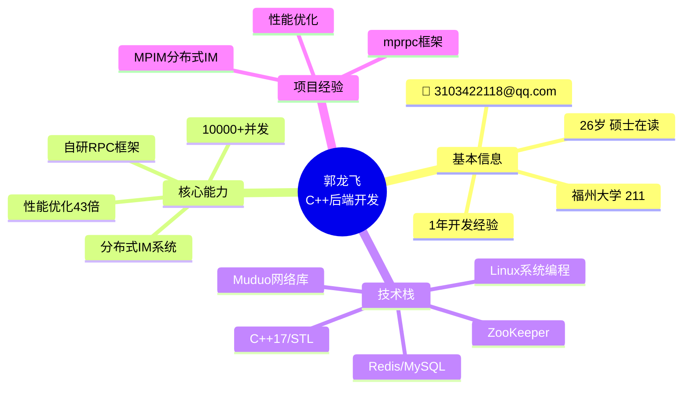
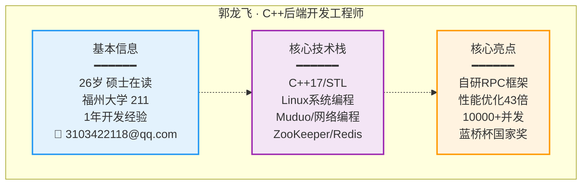

# PPT第一页：个人介绍

---

## 📋 PPT内容（直接复制）

### 标题
```
郭龙飞
C++后端开发工程师
```

### 基本信息
```
📧 3103422118@qq.com  |  📱 15870083725
🎓 福州大学 (211) · 计算机科学与技术硕士 · 在读
💼 1年开发经验 (中软国际6个月 + 自研项目1年)
```

### 核心竞争力
```
✅ 自研RPC框架从0到1 (Protobuf + Muduo + ZooKeeper)
✅ 分布式IM系统架构 (微服务 + 10,000+并发)
✅ 性能优化43倍提升 (QPS: 622 → 26,850，延迟降低87%)
✅ 算法竞赛国家级奖项 (蓝桥杯全国三等奖)
```

### 核心技术栈
```
C++17/STL | Linux | 网络编程/Muduo | ZooKeeper | Redis | Protobuf
```

---

## 🎨 Mermaid图（复制到 https://mermaid.live 预览）

### 方案1：思维导图



### 方案2：信息卡片



---

## 🎤 演讲脚本（1分钟）

```
各位面试官好，我是郭龙飞，来自福州大学计算机科学与技术专业，
目前研一在读，应聘C++后端开发工程师岗位。

我有1年的C++开发经验，核心技术能力集中在分布式系统架构和性能优化：

1. 从0到1设计并实现了基于Protobuf的RPC通信框架
2. 基于这个框架开发了分布式即时通讯系统MPIM
3. 通过缓存优化和网络层优化，将系统QPS从622提升到26,850，提升了43倍
4. 系统支持10,000+并发连接

技术栈方面，熟练掌握C++17、Linux系统编程、Muduo网络库、
ZooKeeper服务发现、Redis缓存等。

接下来我将详细介绍项目经历，谢谢！
```

---

## ⚠️ 补充建议

您简历中缺少的信息：
1. **GitHub链接** - 建议加上项目地址
2. **MPIM项目时间** - 补充项目开始/结束时间
3. **一句话总结** - "专注高性能分布式系统架构与性能优化"
