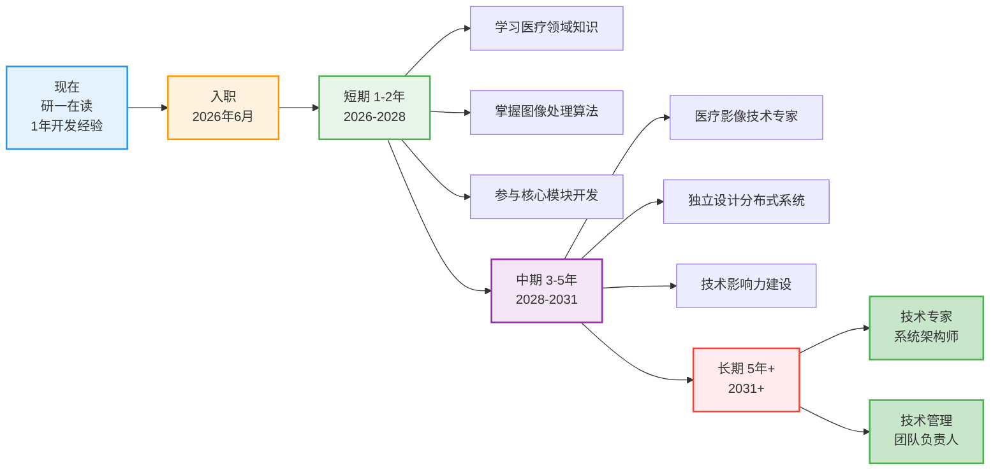
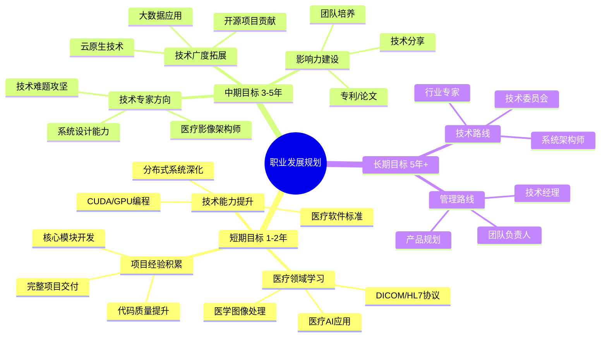
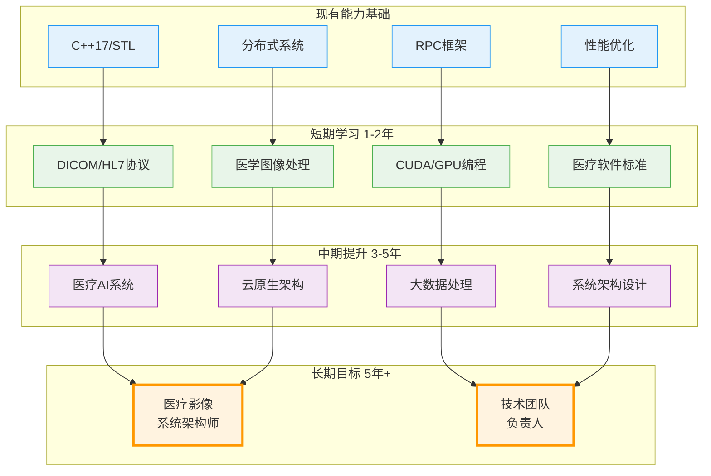

# PPT第五部分：应聘岗位与职业规划

---

## 📋 PPT内容（直接复制）

### 标题
```
应聘岗位理解与职业规划
```

---

## 🎯 一、为什么适合这个岗位

### 岗位匹配度分析

#### ✅ 技术能力匹配

| 岗位要求 | 我的能力 | 匹配度 |
|---------|---------|--------|
| **C++/Java等语言** | C++17深度开发，1年项目经验 | ⭐⭐⭐⭐⭐ |
| **分布式/微服务** | 自研RPC框架 + 微服务架构实践 | ⭐⭐⭐⭐⭐ |
| **Linux系统** | 熟悉Linux系统编程、网络编程 | ⭐⭐⭐⭐⭐ |
| **TCP/IP协议** | 熟悉三次握手、四次挥手，网络编程 | ⭐⭐⭐⭐ |
| **团队协作能力** | 中软国际团队开发经验 | ⭐⭐⭐⭐ |

#### ✅ 项目经验匹配

```
岗位侧重：医疗影像软件开发、分布式系统、AI计算机视觉

我的优势：
1. 分布式系统架构经验 → 可应用于医疗影像设备创新服务平台
2. 高性能优化经验 → 可用于医学图像处理性能优化
3. 自研框架能力 → 可参与AI计算机视觉软件系统开发
4. 微服务架构 → 符合医疗系统软件模块化设计
```

#### ✅ 学习能力与迁移能力

```
虽然我之前做的是IM系统，但核心能力可以快速迁移：

• 分布式架构设计 → 医疗影像设备创新服务平台
• 高并发高性能优化 → 医学图像处理实时性要求
• 协议设计与序列化 → 医疗设备协议（DICOM/HL7等）
• 自研框架经验 → AI计算机视觉软件系统开发
```

---

## 🚀 二、职业规划

### 短期规划（1-2年）

#### 技术深度提升
```
1. 医疗领域技术学习
   • 深入学习DICOM、HL7等医疗影像协议
   • 掌握医学图像处理算法（分割、配准、重建）
   • 了解AI计算机视觉在医疗领域的应用
   
2. 专业技能强化
   • 深入研究分布式系统理论（Raft、Paxos）
   • 学习医疗软件质量标准（IEC 62304等）
   • 提升CUDA/GPU编程能力（医学图像加速）
   
3. 项目经验积累
   • 参与医疗影像平台核心模块开发
   • 独立负责1-2个重要技术模块
   • 积累医疗软件完整项目经验
```

#### 业务理解深化
```
• 理解医疗影像业务流程（PACS系统、影像诊断）
• 学习医疗行业标准与规范
• 熟悉医疗软件监管要求
```

### 中期规划（3-5年）

#### 成为技术专家
```
1. 技术专家方向
   • 成为医疗影像领域的技术专家
   • 能独立设计大型分布式医疗影像系统
   • 具备医疗AI系统架构能力
   
2. 技术广度拓展
   • 掌握更多医疗设备接口协议
   • 了解云原生技术在医疗领域应用
   • 学习大数据在医疗影像中的应用
   
3. 影响力建设
   • 在团队内部进行技术分享
   • 参与开源医疗项目贡献
   • 发表技术文章/专利
```

### 长期规划（5年+）

#### 技术管理双轨发展
```
技术路线：
• 成为医疗影像系统架构师
• 主导公司核心产品技术架构
• 在医疗AI领域有深度积累

或

管理路线：
• 技术团队负责人/技术经理
• 带领团队完成重大项目
• 培养技术人才
```

---

## 💡 三、为什么选择贵公司

### 公司吸引力

```
1. 行业前景
   • 医疗影像是AI+医疗的核心应用场景
   • 国家政策支持医疗信息化建设
   • 市场需求持续增长

2. 技术挑战
   • 医疗影像涉及分布式、高性能、AI等前沿技术
   • 可以接触到真实的医疗场景和业务
   • 技术难度高，有利于个人成长

3. 社会价值
   • 医疗软件直接服务于患者
   • 技术创新可以改善医疗诊断效率
   • 有社会意义和成就感

4. 个人发展
   • 校园招聘提供系统培养机会
   • 团队氛围和成长空间
   • 可以从基础做起，扎实成长
```

---

## 🎤 演讲脚本（1.5-2分钟）

### 版本1：重点突出匹配度

```
关于应聘岗位和职业规划，我想从三个方面来说：

【为什么适合这个岗位】
首先，我认为我的技术背景与这个岗位高度匹配。

岗位要求的C++开发、分布式系统、Linux系统编程，
都是我在MPIM项目和mprpc框架中深度实践过的核心技能。

虽然我之前做的是IM系统，但很多技术是相通的：
• 分布式架构设计可以应用于医疗影像设备服务平台
• 高性能优化经验可以用于医学图像处理
• 自研框架能力可以参与AI计算机视觉系统开发

更重要的是，我具备快速学习能力。从我的项目经历可以看出，
我能够从0到1自学并实现完整的RPC框架，这说明我有能力
快速掌握医疗影像领域的专业知识。

【短期规划】
入职后1-2年，我的目标是：
1. 快速学习医疗领域知识，掌握DICOM、HL7等协议
2. 深入医学图像处理算法，提升CUDA/GPU编程能力
3. 参与核心模块开发，积累医疗软件完整项目经验

【长期规划】
3-5年，我希望成长为医疗影像领域的技术专家，
能够独立设计大型分布式医疗影像系统。

未来可以在技术专家或技术管理方向发展，
为公司的产品创新和团队建设做出贡献。

【为什么选择贵公司】
我选择贵公司有三个原因：
1. 医疗影像是AI+医疗的核心方向，技术挑战大，有利于成长
2. 医疗软件有社会价值，技术创新能直接帮助患者
3. 校园招聘能提供系统培养，让我从基础扎实成长

我相信凭借我的技术基础和学习能力，
能够快速融入团队，为公司创造价值。谢谢！
```

### 版本2：简洁版（1分钟）

```
最后谈谈应聘岗位和职业规划。

【岗位匹配】
我认为自己很适合这个岗位：
• 技术栈匹配：C++、分布式、Linux都是我的强项
• 有框架开发经验：自研RPC展示了我的技术深度
• 学习能力强：可以快速掌握医疗影像领域知识

【职业规划】
短期（1-2年）：快速学习医疗领域知识，掌握DICOM协议、
                医学图像处理算法，参与核心模块开发

中期（3-5年）：成长为医疗影像技术专家，能独立设计
                大型分布式医疗系统

长期：在技术专家或技术管理方向发展

【选择理由】
选择贵公司是因为：医疗影像技术挑战大、有社会价值、
能系统培养新人，符合我的发展期望。

我相信能为公司创造价值，谢谢！
```

---

## 🎨 Mermaid可视化

### 职业发展路径图



### 能力提升计划



### 技术学习路线图



---

## 💡 回答技巧

### 面试官可能的追问

#### Q1: "你没有医疗行业经验，怎么快速上手？"

```
A: 我理解这个顾虑。但我认为技术迁移能力比行业经验更重要。

从我的经历可以看出：
1. 我能从0到1自研RPC框架，说明我有快速学习和实践能力
2. 分布式系统、高性能优化这些核心技术是通用的
3. 我有很强的学习意愿，入职前就可以开始学习DICOM等协议

我相信凭借扎实的技术基础，3个月内可以熟悉医疗影像业务，
6个月内就能独立承担开发任务。
```

#### Q2: "你更想做技术还是管理？"

```
A: 我目前更倾向于技术专家方向。

原因是：
1. 我对技术有热情，喜欢解决复杂的技术问题
2. 医疗影像领域技术深度足够，值得深耕
3. 我现在还年轻，需要先打好技术基础

但我也不排斥管理，如果将来公司需要，
我也愿意在技术管理方向发展，回馈公司的培养。

关键是做好当下的每一件事。
```

#### Q3: "为什么不选择互联网大厂而选择医疗行业？"

```
A: 我考虑过互联网，但更看好医疗行业的长期价值：

1. 技术挑战：医疗影像涉及分布式、AI、图像处理等前沿技术
2. 社会价值：医疗软件能直接帮助患者，有成就感
3. 行业前景：医疗信息化是国家重点支持方向
4. 个人成长：医疗行业更稳定，可以长期深耕

我希望用技术创造社会价值，而不只是追求高薪。
```

#### Q4: "你对薪资有什么期望？"

```
A: 我更看重成长机会和平台，薪资方面相信公司会有合理的安排。

如果一定要说期望，我了解到应届硕士在贵司的薪资范围，
我希望能在这个范围内，具体可以根据我的面试表现和公司标准来定。

最重要的是能加入团队，参与有挑战的项目，快速成长。
```

---

## ✅ 要点总结

### PPT设计建议
- **1页PPT** 即可，不要太多
- **用图表展示** 职业规划路径（Mermaid时间线）
- **数据化表达** 岗位匹配度（用表格或评分）
- **真诚态度** 不要过于模板化

### 演讲要点
1. **诚实** - 承认没有医疗经验，但强调学习能力
2. **自信** - 用项目经历证明技术迁移能力
3. **谦虚** - 表达学习意愿，愿意从基础做起
4. **热情** - 展示对医疗行业的兴趣和认同

### 核心策略
```
不要回避劣势（无医疗经验）
→ 转化为优势（学习能力强、技术可迁移）
→ 用案例证明（自研RPC框架的学习过程）
→ 表达意愿（愿意快速学习医疗知识）
```

---

**建议演讲时长：** 1.5-2分钟  
**核心信息：** 岗位匹配 + 职业规划 + 选择理由  
**关键印象：** 技术扎实 + 学习能力强 + 有规划 + 有热情

