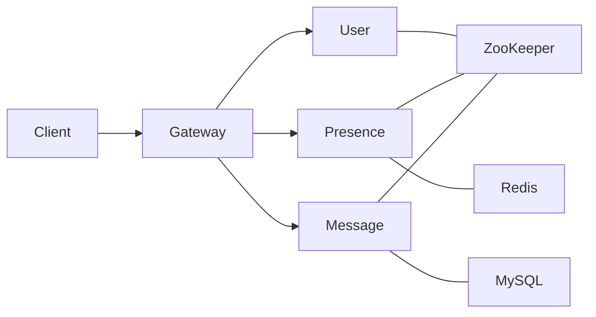

# MPIM — 分布式即时通讯系统（C++/Muduo/Protobuf/ZooKeeper/Redis/MySQL）

一个可运行的、可扩展的分布式 IM 项目：Gateway 统一接入，后端三服务（User/Presence/Message）通过 MPRPC 通信，服务发现用 ZooKeeper，在线路由与离线消息分别使用 Redis 和 MySQL。带交互式 CLI 客户端、启动脚本、可选的单元测试与基准测试。

---

## 架构与数据流

## 功能
+ 登录鉴权（UserService）
+ 在线路由与投递（PresenceService + Redis）
+ 点对点消息发送、离线拉取与ACK（MessageService + MySQL）
+ 网关统一接入（Muduo TCP，简单行协议）
+ 自研RPC（MPRPC + ZooKeeper 服务注册发现）
+ CLI客户端（login / chat / pull / help）

## 目录结构
im-gateway/      # TCP 接入
im-user/         # 登录
im-presence/     # 路由/投递
im-message/      # 离线/ACK
im-common/       # proto 与通用代码
mprpc/           # 自研 RPC 框架
thirdparty/      # MySQL / hiredis 等轻封装
im-client/       # 交互式 CLI 客户端
bin/             # 可执行文件、配置、启动脚本与日志

## 环境依赖
C++17、CMake ≥ 3.16、POSIX Threads

Muduo（网关）

Protobuf（含 protoc 编译器）

ZooKeeper 客户端库（如 libzookeeper-mt）

Redis 与 hiredis

MySQL 客户端开发包（libmysqlclient）

## 构建

## 快速开始

## 配置

## 测试与基准
