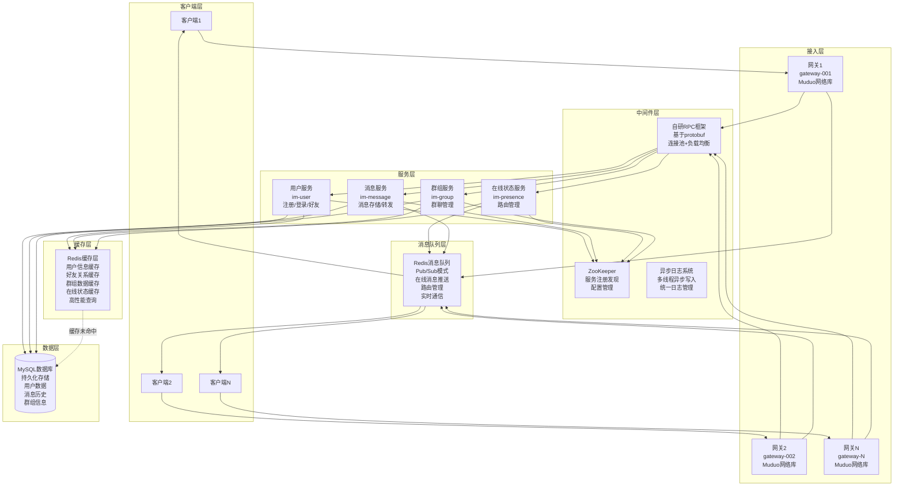

# MPIM分层架构设计 - Redis双重角色分离

## 概述

MPIM系统采用分层架构设计，将Redis的两个不同角色（缓存层和消息队列层）分别放在不同的架构层中，使系统层次更加清晰，职责更加明确。

## 分层架构图



## 架构分层详细说明

### 1. 客户端层 (Client Layer)
- **职责**: 用户交互界面，消息发送和接收
- **技术**: 命令行客户端、Web客户端、移动客户端
- **特点**: 多平台支持、用户友好

### 2. 接入层 (Gateway Layer)
- **职责**: 客户端连接管理、协议解析、负载均衡
- **技术**: Muduo网络库、Nginx负载均衡
- **特点**: 高并发、高可用、协议转换

### 3. 服务层 (Service Layer)
- **用户服务**: 用户注册、登录、好友管理
- **消息服务**: 消息存储、转发、离线消息处理
- **在线状态服务**: 用户路由管理、在线状态维护
- **群组服务**: 群聊管理、群成员管理

### 4. 中间件层 (Middleware Layer)
- **自研RPC框架**: 基于protobuf的服务间通信
- **ZooKeeper**: 服务注册发现、配置管理
- **异步日志系统**: 统一日志管理、性能监控

### 5. 消息队列层 (Message Queue Layer)
- **Redis消息队列**: 基于Pub/Sub的实时消息推送
- **路由管理**: 在线用户路由信息管理
- **实时通信**: 支持单聊、群聊实时消息推送

### 6. 缓存层 (Cache Layer)
- **Redis缓存层**: 高性能数据缓存
- **用户信息缓存**: 用户基本信息、状态信息
- **关系数据缓存**: 好友关系、群组关系
- **查询优化**: 减少数据库查询，提升响应速度

### 7. 数据层 (Data Layer)
- **MySQL数据库**: 持久化数据存储
- **数据完整性**: 保证数据一致性和可靠性
- **历史数据**: 消息历史、用户数据、群组信息

## Redis双重角色分离的优势

### 1. 架构清晰
- **职责分离**: 缓存和消息队列功能分离，职责更明确
- **层次分明**: 不同功能放在不同架构层，层次更清晰
- **易于理解**: 开发者可以更容易理解系统架构

### 2. 维护便利
- **独立维护**: 缓存层和消息队列层可以独立维护
- **故障隔离**: 一个功能故障不会影响另一个功能
- **扩展灵活**: 可以独立扩展缓存或消息队列能力

### 3. 性能优化
- **针对性优化**: 可以针对不同功能采用不同的优化策略
- **资源分配**: 可以独立分配资源给缓存和消息队列
- **监控分离**: 可以分别监控缓存和消息队列的性能

## 数据流向分析

### 1. 用户登录流程
```
客户端 → 网关 → 用户服务 → 缓存层(查询用户信息) → 数据层(缓存未命中时)
```

### 2. 消息发送流程
```
客户端 → 网关 → 消息服务 → 消息队列层(推送消息) → 客户端(接收者)
```

### 3. 好友关系查询流程
```
客户端 → 网关 → 用户服务 → 缓存层(查询好友关系) → 数据层(缓存未命中时)
```

### 4. 群聊消息流程
```
客户端 → 网关 → 消息服务 → 消息队列层(群组消息推送) → 多个客户端
```

## 技术实现细节

### 1. 缓存层实现
```cpp
// 缓存管理器
class CacheManager {
    // 用户信息缓存
    bool SetUserInfo(const std::string& username, const std::string& data);
    std::string GetUserInfo(const std::string& username);
    
    // 好友关系缓存
    bool SetFriends(int64_t user_id, const std::string& friends_data);
    std::string GetFriends(int64_t user_id);
    
    // 群组信息缓存
    bool SetGroupInfo(int64_t group_id, const std::string& data);
    std::string GetGroupInfo(int64_t group_id);
};
```

### 2. 消息队列层实现
```cpp
// 消息队列管理器
class MessageQueue {
    // 发布消息
    bool Publish(const std::string& channel, const std::string& message);
    
    // 订阅频道
    bool Subscribe(const std::string& channel, 
                   std::function<void(const std::string&)> callback);
    
    // 停止订阅
    void Stop();
};
```

## 配置建议

### 1. 缓存层配置
```ini
[redis_cache]
host = 127.0.0.1
port = 6379
database = 0
max_connections = 50
timeout = 5000

# 缓存TTL配置
user_info_ttl = 3600
friends_ttl = 1800
group_info_ttl = 3600
status_ttl = 3600
```

### 2. 消息队列层配置
```ini
[redis_queue]
host = 127.0.0.1
port = 6379
database = 1
max_connections = 100
timeout = 5000

# 消息队列配置
batch_size = 100
batch_timeout = 1000
max_retries = 3
```

## 监控指标

### 1. 缓存层监控
- **缓存命中率**: 缓存查询命中比例
- **缓存响应时间**: 缓存操作平均延迟
- **缓存使用率**: Redis内存使用情况
- **缓存错误率**: 缓存操作失败率

### 2. 消息队列层监控
- **消息吞吐量**: 每秒处理消息数
- **消息延迟**: 消息发送到接收的延迟
- **队列长度**: 当前队列中消息数量
- **消息丢失率**: 消息丢失比例

## 总结

通过将Redis的双重角色分离到不同的架构层，MPIM系统实现了：

1. **架构清晰**: 缓存层和消息队列层职责分离，架构更清晰
2. **维护便利**: 各层独立维护，故障隔离，扩展灵活
3. **性能优化**: 针对不同功能采用不同优化策略
4. **监控完善**: 分层监控，问题定位更准确
5. **扩展性强**: 可以独立扩展缓存或消息队列能力

这种分层设计使系统更加模块化、可维护，为后续的功能扩展和性能优化提供了良好的基础。
