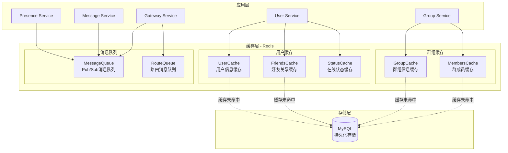

# Redis缓存架构设计

## 概述

MPIM系统采用Redis作为缓存层，实现高性能的数据访问和消息队列功能。Redis在系统中承担双重角色：
1. **缓存层**: 缓存用户信息、好友关系、群组数据等，减少数据库查询
2. **消息队列**: 基于Pub/Sub实现实时消息推送

## 缓存架构图



## 缓存设计原则

### 1. Cache-Aside模式
- **读操作**: 先查缓存，未命中时查数据库并写入缓存
- **写操作**: 先写数据库，再更新或删除缓存
- **优势**: 简单可靠，数据一致性较好

### 2. TTL管理策略
- **用户信息**: 1小时 (3600秒)
- **好友关系**: 30分钟 (1800秒)
- **群组信息**: 1小时 (3600秒)
- **在线状态**: 1小时 (3600秒)
- **用户名存在性**: 5分钟 (300秒)

### 3. 降级处理
- **Redis不可用**: 自动降级到数据库查询
- **连接失败**: 记录错误日志，继续服务
- **超时处理**: 设置合理的超时时间

## 缓存键设计

### 命名规范
```
{模块}:{数据类型}:{标识符}
```

### 具体键设计

#### 用户相关缓存
```
user:info:{username}          # 用户基本信息
user:friends:{user_id}        # 好友关系集合
user:status:{user_id}         # 用户在线状态
user:exists:{username}        # 用户名存在性
```

#### 群组相关缓存
```
group:info:{group_id}         # 群组基本信息
group:members:{group_id}      # 群组成员列表
user:groups:{user_id}         # 用户群组列表
```

#### 消息相关缓存
```
message:queue:{user_id}       # 用户消息队列
presence:route:{user_id}      # 用户路由信息
```

## 缓存实现架构

### 1. Redis客户端封装

```cpp
// 基础Redis连接管理
class RedisClient {
    redisContext* context_;
    std::string ip_;
    int port_;
public:
    bool Connect(const std::string& ip, int port);
    redisReply* ExecuteCommand(const char* format, ...);
    void Disconnect();
};

// 缓存管理器
class CacheManager {
    RedisClient client_;
public:
    // 字符串操作
    bool Setex(const std::string& key, int ttl, const std::string& value);
    std::string Get(const std::string& key);
    
    // 哈希操作
    bool Hset(const std::string& key, const std::string& field, const std::string& value);
    std::string Hget(const std::string& key, const std::string& field);
    
    // 集合操作
    bool Sadd(const std::string& key, const std::string& member);
    bool Srem(const std::string& key, const std::string& member);
    std::vector<std::string> Smembers(const std::string& key);
};
```

### 2. 业务缓存类

#### UserCache - 用户缓存
```cpp
class UserCache {
    CacheManager cache_manager_;
public:
    // 用户信息缓存
    std::string GetUserInfo(const std::string& username);
    bool SetUserInfo(const std::string& username, const std::string& data, int ttl);
    
    // 好友关系缓存
    std::string GetFriends(int64_t user_id);
    bool SetFriends(int64_t user_id, const std::string& friends_data, int ttl);
    bool AddFriend(int64_t user_id, int64_t friend_id);
    bool RemoveFriend(int64_t user_id, int64_t friend_id);
    
    // 用户状态缓存
    std::string GetUserStatus(int64_t user_id);
    bool SetUserStatus(int64_t user_id, const std::string& status, int ttl);
    
    // 用户名存在性缓存
    bool IsUsernameExists(const std::string& username);
    bool SetUsernameExists(const std::string& username, bool exists, int ttl);
};
```

#### GroupCache - 群组缓存
```cpp
class GroupCache {
    CacheManager cache_manager_;
public:
    // 群组信息缓存
    std::string GetGroupInfo(int64_t group_id);
    bool SetGroupInfo(int64_t group_id, const std::string& data, int ttl);
    
    // 群组成员缓存
    std::string GetGroupMembers(int64_t group_id);
    bool SetGroupMembers(int64_t group_id, const std::string& members_data, int ttl);
    
    // 用户群组列表缓存
    std::string GetUserGroups(int64_t user_id);
    bool SetUserGroups(int64_t user_id, const std::string& groups_data, int ttl);
};
```

### 3. 消息队列实现

```cpp
class MessageQueue {
    RedisClient client_;
    std::atomic<bool> is_running_;
    std::thread observer_thread_;
public:
    // 发布消息
    bool Publish(const std::string& channel, const std::string& message);
    
    // 订阅频道
    bool Subscribe(const std::string& channel, 
                   std::function<void(const std::string&)> callback);
    
    // 停止订阅
    void Stop();
};
```

## 缓存使用示例

### 用户登录缓存流程
```cpp
// 1. 先查缓存
std::string cached_user = user_cache.GetUserInfo(username);
if (!cached_user.empty()) {
    // 缓存命中，直接返回
    return deserializeUser(cached_user);
}

// 2. 缓存未命中，查数据库
User user = queryUserFromDatabase(username);
if (user.isValid()) {
    // 3. 写入缓存
    user_cache.SetUserInfo(username, serializeUser(user), 3600);
    return user;
}
```

### 好友关系缓存流程
```cpp
// 添加好友
bool addFriend(int64_t user_id, int64_t friend_id) {
    // 1. 更新数据库
    if (!updateDatabaseFriendship(user_id, friend_id)) {
        return false;
    }
    
    // 2. 更新缓存
    user_cache.AddFriend(user_id, friend_id);
    user_cache.AddFriend(friend_id, user_id);
    
    // 3. 清除好友列表缓存，强制下次重新加载
    user_cache.DelFriends(user_id);
    user_cache.DelFriends(friend_id);
    
    return true;
}
```

## 性能优化策略

### 1. 连接池管理
- 使用单例模式管理Redis连接
- 避免频繁连接/断开连接
- 支持连接复用

### 2. 批量操作
- 使用Pipeline减少网络往返
- 批量设置/获取缓存数据
- 减少Redis命令执行次数

### 3. 内存优化
- 合理设置TTL避免内存泄漏
- 使用LRU淘汰策略
- 监控Redis内存使用情况

### 4. 监控指标
- 缓存命中率
- 平均响应时间
- 连接池状态
- 内存使用情况

## 故障处理

### 1. Redis连接失败
```cpp
if (!user_cache.IsConnected()) {
    LOG_WARN << "Redis connection failed, falling back to database";
    return queryFromDatabase();
}
```

### 2. 缓存操作超时
```cpp
// 设置合理的超时时间
redisContext* context = redisConnectWithTimeout(ip, port, timeout);
```

### 3. 数据一致性
- 写操作时同步更新缓存和数据库
- 使用事务保证数据一致性
- 定期清理过期缓存

## 配置建议

### Redis配置
```conf
# 内存配置
maxmemory 256mb
maxmemory-policy allkeys-lru

# 持久化配置
save 900 1
save 300 10
save 60 10000

# 网络配置
tcp-keepalive 60
timeout 300
```

### 应用配置
```cpp
// 连接配置
const std::string REDIS_HOST = "127.0.0.1";
const int REDIS_PORT = 6379;
const int REDIS_TIMEOUT = 5000; // 5秒

// TTL配置
const int USER_INFO_TTL = 3600;      // 1小时
const int FRIENDS_TTL = 1800;        // 30分钟
const int GROUP_INFO_TTL = 3600;     // 1小时
const int STATUS_TTL = 3600;         // 1小时
```

## 总结

Redis缓存系统为MPIM提供了：
1. **高性能**: 缓存命中响应时间 < 1ms
2. **高可用**: 降级处理保证服务可用性
3. **可扩展**: 支持集群部署和水平扩展
4. **易维护**: 清晰的架构设计和监控指标

通过合理的缓存策略和实现，系统在保证数据一致性的同时，大幅提升了查询性能和用户体验。
