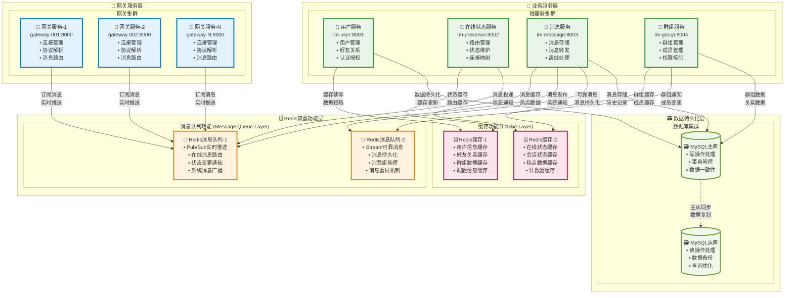
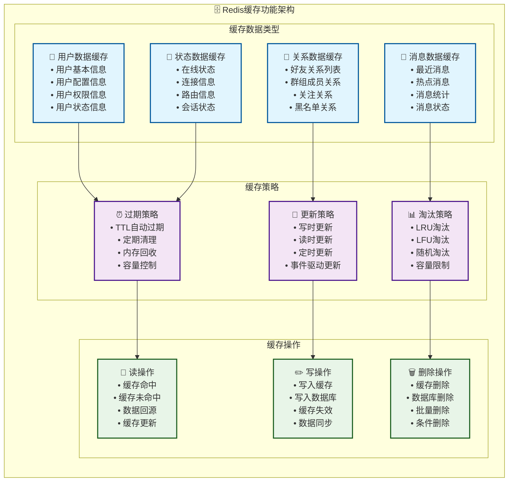
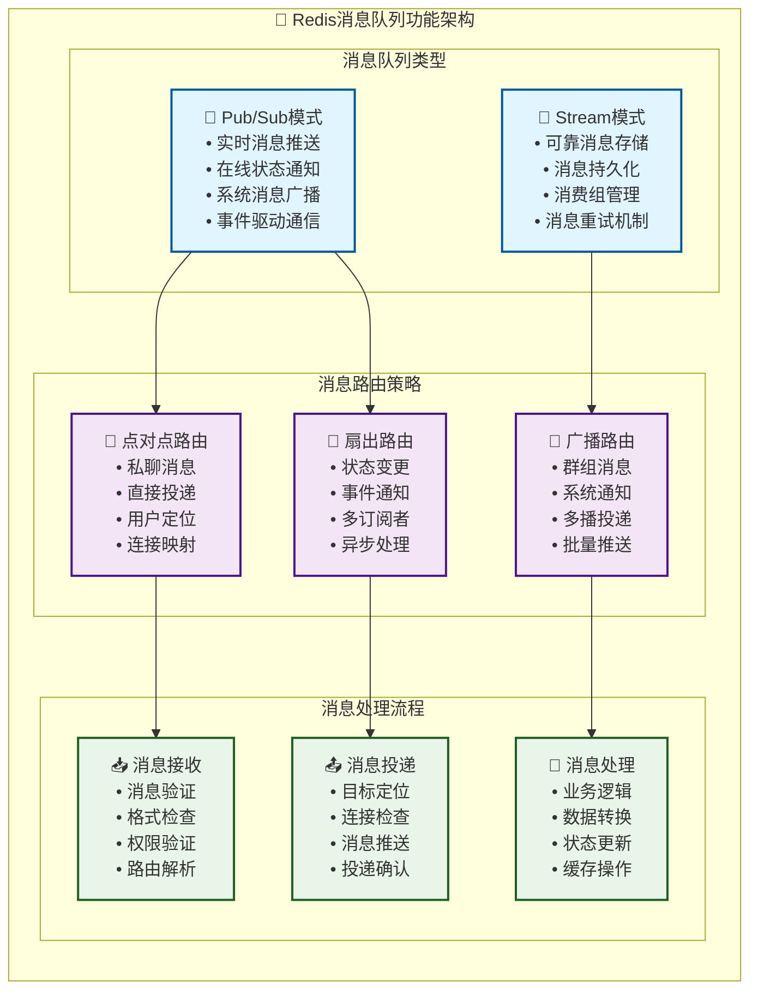
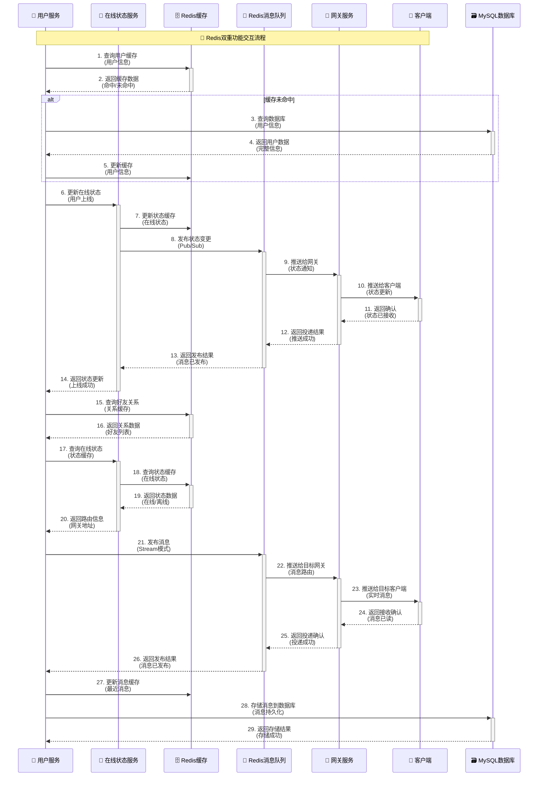
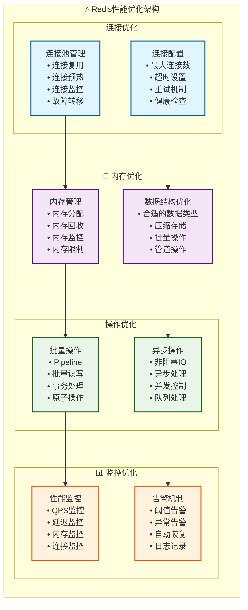

# Redis双重功能架构 - 增强版

## Redis双重功能概述

MPIM系统中Redis承担双重角色：**缓存层**和**消息队列层**。这种设计既提高了系统性能，又简化了架构复杂度，是一个典型的多功能中间件应用案例。

## Redis双重功能架构图

### 1. 整体架构图

### 2. Redis缓存功能详细架构

### 3. Redis消息队列功能详细架构

### 4. Redis双重功能交互时序图

### 5. Redis性能优化架构

## Redis双重功能特点

### 1. 缓存功能特点
- **高性能**: 内存存储，毫秒级响应
- **多数据类型**: 支持字符串、哈希、列表、集合、有序集合
- **过期策略**: TTL自动过期，内存自动回收
- **持久化**: RDB和AOF双重持久化保障

### 2. 消息队列功能特点
- **实时性**: Pub/Sub模式支持实时消息推送
- **可靠性**: Stream模式支持消息持久化和重试
- **扩展性**: 支持多消费者和消费组
- **灵活性**: 支持多种消息路由策略

### 3. 双重功能优势
- **架构简化**: 一个中间件承担两种功能
- **成本降低**: 减少中间件数量，降低运维成本
- **性能提升**: 减少网络跳转，提高响应速度
- **数据一致性**: 缓存和消息队列共享数据源

### 4. 应用场景
- **用户信息缓存**: 减少数据库查询，提高响应速度
- **在线状态管理**: 实时维护用户在线状态
- **消息实时推送**: 支持私聊和群聊消息推送
- **系统通知**: 支持系统级消息广播

## 总结

Redis在MPIM系统中承担双重角色，既作为高性能缓存层提高数据访问速度，又作为消息队列层实现实时消息推送。这种设计既简化了系统架构，又提高了系统性能，是一个典型的多功能中间件应用案例。通过合理的缓存策略和消息路由机制，系统实现了高性能、高可靠、实时性强的即时通讯服务。