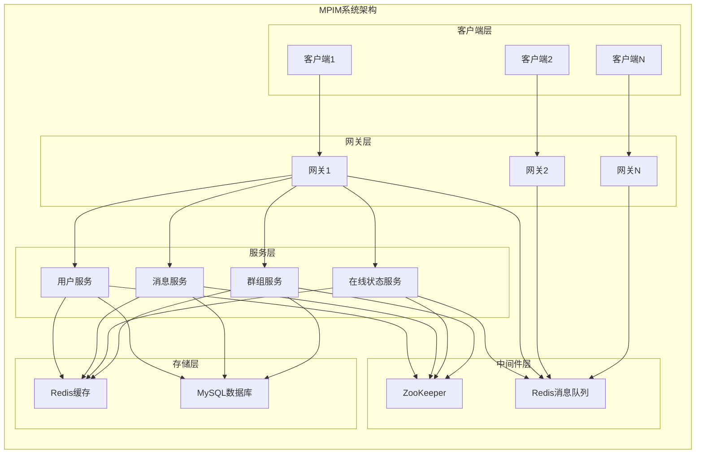
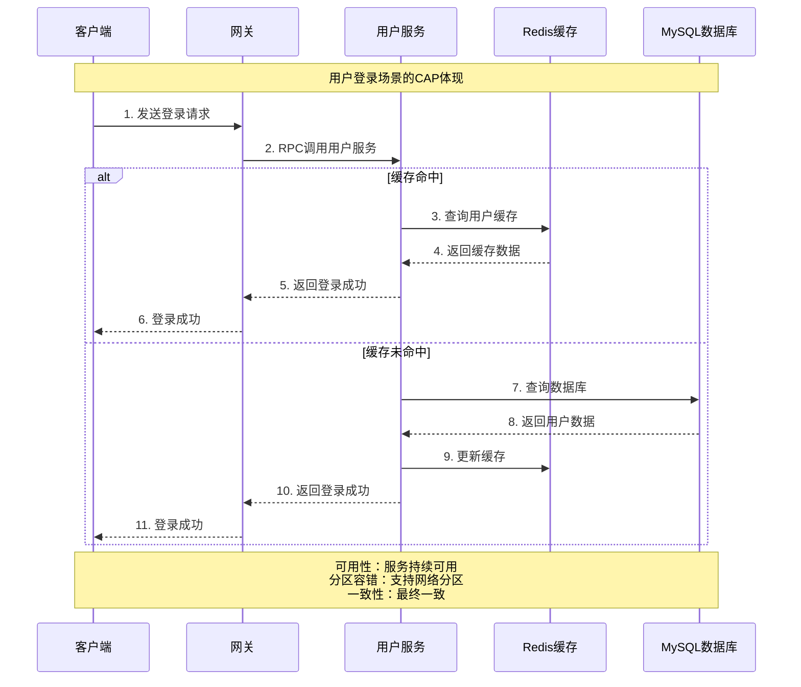
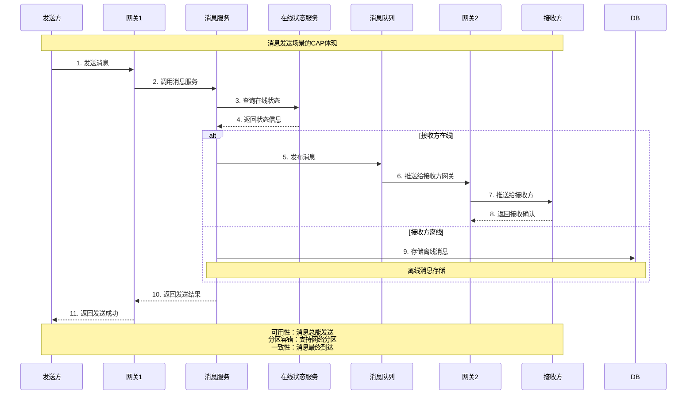

# CAP定理与MPIM系统设计分析

## CAP定理基础

### 什么是CAP定理？

CAP定理是分布式系统设计的基础理论，由Eric Brewer在2000年提出，2002年被严格证明。它指出在分布式系统中，**一致性(Consistency)**、**可用性(Availability)**、**分区容错性(Partition Tolerance)** 三个特性**不能同时满足**，最多只能同时满足其中两个。

### 三个特性的定义

#### 1. 一致性 (Consistency)
- **定义**: 所有节点在同一时刻看到的数据是一致的
- **特点**: 强一致性，所有读操作都能获得最新的数据
- **实现**: 通过数据同步、事务机制保证

#### 2. 可用性 (Availability)
- **定义**: 系统在任何时候都能提供服务
- **特点**: 系统持续可用，不会因为节点故障而停止服务
- **实现**: 通过冗余、故障转移、负载均衡保证

#### 3. 分区容错性 (Partition Tolerance)
- **定义**: 系统能够容忍网络分区故障
- **特点**: 即使网络中断，系统仍能继续工作
- **实现**: 通过分布式架构、数据复制保证

## MPIM系统的CAP选择

### 系统架构回顾



### MPIM系统的CAP选择：AP系统

MPIM系统选择了**AP系统**（可用性 + 分区容错性），牺牲了强一致性。

#### 为什么选择AP？

1. **即时通讯的特性需求**
   - 用户更关心消息能否及时送达（可用性）
   - 网络分区是常见情况（分区容错性）
   - 可以接受短暂的数据不一致（最终一致性）

2. **技术架构的考虑**
   - 微服务架构天然需要分区容错
   - 高并发场景下强一致性会成为瓶颈
   - 缓存机制与强一致性冲突

3. **业务场景的适配**
   - 消息顺序可以接受轻微延迟
   - 用户状态可以最终一致
   - 系统可用性比强一致性更重要

## MPIM系统中CAP的具体体现

### 1. 可用性 (Availability) 的实现

#### 1.1 服务层高可用
```cpp
// 在 mprpc/src/mprpcchannel.cc 中
// 服务发现和故障转移机制
std::string host_data = s_zk.GetData(method_path.c_str());
if (host_data == "") {
    // 服务不可用时的处理
    controller->SetFailed(method_path + " is not exist!");
    return;
}
```

**实现策略**：
- **服务集群**: 每个服务部署多个实例
- **负载均衡**: 自动分发请求到健康节点
- **故障转移**: 自动切换到可用节点
- **健康检查**: 定期检查服务状态

#### 1.2 网关层高可用
```cpp
// 在 im-gateway/include/gatewayServer.h 中
class GatewayServer {
private:
    // 连接名 -> 会话
    std::unordered_map<std::string, Session> sessions_;
    // uid -> 连接（在线快速下发）
    std::unordered_map<int64_t, WeakConn> uid2conn_;
};
```

**实现策略**：
- **连接管理**: 维护客户端连接状态
- **会话保持**: 支持负载均衡器会话保持
- **故障恢复**: 连接断开后自动重连

#### 1.3 存储层高可用
```cpp
// 在 im-user/src/user_cache.cc 中
bool UserCache::Connect(const std::string& ip, int port) {
    if (connected_.load()) {
        return true;
    }
    if (cache_manager_.Connect(ip, port)) {
        connected_.store(true);
        return true;
    }
    return false;
}
```

**实现策略**：
- **Redis集群**: 主从复制，故障自动切换
- **MySQL主从**: 读写分离，主库故障时从库接管
- **缓存降级**: 缓存不可用时直接访问数据库

### 2. 分区容错性 (Partition Tolerance) 的实现

#### 2.1 网络分区处理
```cpp
// 在 mprpc/src/zookeeperutil.cc 中
void global_watcher(zhandle_t *zh, int type, int state, const char *path, void *watcherCtx) {
    if (type == ZOO_SESSION_EVENT) {
        if (state == ZOO_CONNECTED_STATE) {
            // 连接恢复
            auto* prom = static_cast<std::promise<void>*>(watcherCtx);
            if(prom) {
                prom->set_value();
            }
        }
    }
}
```

**实现策略**：
- **ZooKeeper集群**: 多数派原则，容忍部分节点故障
- **服务发现**: 自动检测和恢复服务连接
- **消息队列**: Redis Pub/Sub支持网络分区

#### 2.2 数据分区处理
```cpp
// 在 im-presence/src/presence_service.cc 中
void PresenceServiceImpl::BindRoute(google::protobuf::RpcController* controller,
                                   const mpim::BindRouteReq* request,
                                   mpim::BindRouteResp* response,
                                   google::protobuf::Closure* done) {
    // 路由绑定，支持分区
    std::string gateway_id = request->gateway_id();
    int64_t uid = request->uid();
    
    // 存储路由信息到Redis
    cache_manager_.Setex("route:" + std::to_string(uid), 3600, gateway_id);
}
```

**实现策略**：
- **数据复制**: 关键数据在多个节点复制
- **分区感知**: 服务能够感知和处理分区
- **故障恢复**: 分区恢复后自动同步数据

### 3. 一致性 (Consistency) 的牺牲和补偿

#### 3.1 强一致性的牺牲
MPIM系统在以下场景牺牲了强一致性：

1. **用户在线状态**
   - 不同网关可能看到不同的在线状态
   - 状态更新有延迟
   - 网络分区时状态可能不一致

2. **消息顺序**
   - 群组消息可能乱序到达
   - 网络延迟导致消息顺序问题
   - 不同用户看到的消息顺序可能不同

3. **缓存数据**
   - 缓存和数据库可能短暂不一致
   - 缓存更新有延迟
   - 不同节点缓存可能不同步

#### 3.2 最终一致性的实现
```cpp
// 在 im-user/src/user_service.cc 中
void UserServiceImpl::Login(google::protobuf::RpcController* controller,
                           const mpim::LoginReq* request,
                           mpim::LoginResp* response,
                           google::protobuf::Closure* done) {
    // 1. 先查缓存
    std::string cached_user = user_cache_.GetUserInfo(username);
    if (!cached_user.empty()) {
        // 缓存命中，直接返回
        response->set_success(true);
        return;
    }
    
    // 2. 缓存未命中，查数据库
    User user;
    if (user_model_.QueryByName(username, &user)) {
        // 3. 更新缓存
        user_cache_.SetUserInfo(username, user.SerializeAsString(), 3600);
        response->set_success(true);
    }
}
```

**实现策略**：
- **缓存更新**: 数据库更新后异步更新缓存
- **状态同步**: 定期同步各节点状态
- **消息重试**: 失败消息自动重试
- **数据校验**: 定期校验数据一致性

## CAP定理在MPIM中的具体应用场景

### 场景1：用户登录



**CAP体现**：
- **可用性**: 即使缓存不可用，仍能通过数据库提供服务
- **分区容错**: 网络分区时仍能处理登录请求
- **一致性**: 缓存和数据库最终会一致

### 场景2：消息发送



**CAP体现**：
- **可用性**: 消息服务持续可用，支持在线和离线消息
- **分区容错**: 网络分区时消息仍能存储和投递
- **一致性**: 消息最终会到达接收方

## 与其他系统的对比

### 1. CP系统（如银行系统）
- **特点**: 强一致性 + 分区容错性
- **牺牲**: 可用性
- **场景**: 金融交易、账户余额
- **问题**: 网络分区时服务不可用

### 2. CA系统（如单机数据库）
- **特点**: 一致性 + 可用性
- **牺牲**: 分区容错性
- **场景**: 单机应用、本地数据库
- **问题**: 不支持分布式部署

### 3. AP系统（如MPIM）
- **特点**: 可用性 + 分区容错性
- **牺牲**: 强一致性
- **场景**: 即时通讯、社交网络
- **优势**: 高可用、高性能、易扩展

## 总结

MPIM系统选择AP架构是经过深思熟虑的：

1. **业务特性决定**: 即时通讯更注重可用性和实时性
2. **技术架构适配**: 微服务架构天然需要分区容错
3. **性能考虑**: 强一致性会成为性能瓶颈
4. **用户体验**: 用户更关心消息能否及时送达

通过合理的架构设计和补偿机制，MPIM系统在保证高可用和分区容错的同时，实现了最终一致性，满足了即时通讯系统的业务需求。

## 面试要点

### 1. 基础概念
- CAP定理的定义和三个特性
- 为什么只能满足两个特性
- 不同系统的CAP选择

### 2. 项目应用
- MPIM系统为什么选择AP
- 具体如何实现可用性和分区容错
- 如何保证最终一致性

### 3. 技术细节
- 服务发现和故障转移机制
- 缓存策略和一致性保证
- 消息队列的可靠性设计

### 4. 对比分析
- 与其他系统架构的对比
- AP系统的优缺点
- 如何权衡一致性、可用性和分区容错性
