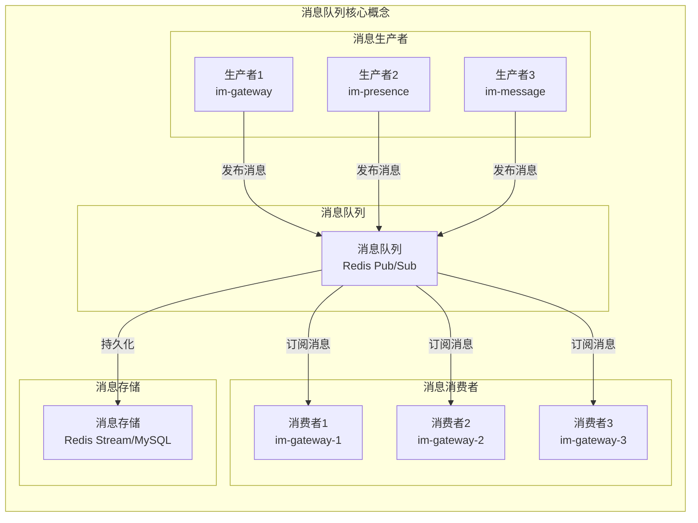
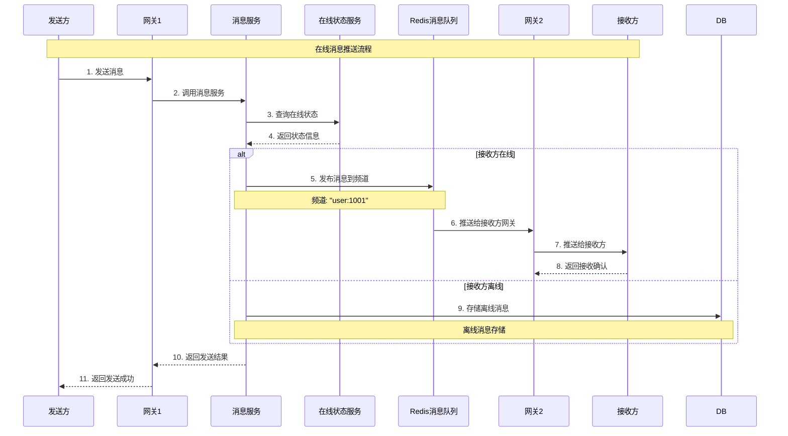
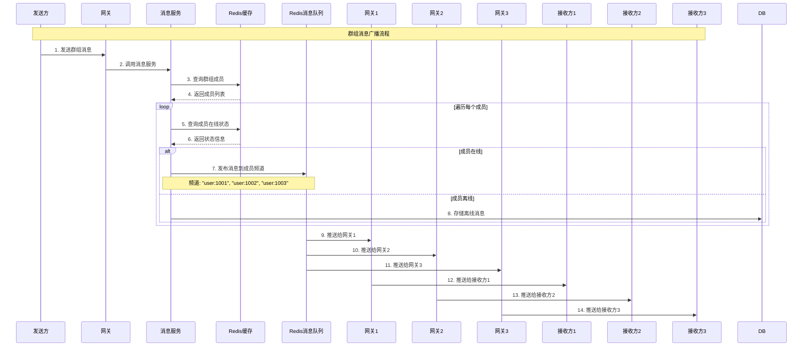

# 消息队列与Redis应用分析

## 消息队列基础

### 什么是消息队列？

消息队列（Message Queue）是一种异步通信机制，用于在分布式系统中传递消息。它解耦了消息的生产者和消费者，提供了可靠的消息传递、流量削峰、异步处理等功能。

### 消息队列的核心概念



## Redis消息队列实现

### 1. Redis Pub/Sub - 实时消息推送

```cpp
// 在 thirdparty/redisclient/include/message_queue.h 中
class MessageQueue {
public:
    MessageQueue();
    ~MessageQueue();
    
    // 发布消息
    bool Publish(const std::string& channel, const std::string& message);
    
    // 订阅消息
    bool Subscribe(const std::string& channel, 
                   std::function<void(const std::string&)> callback);
    
    // 取消订阅
    bool Unsubscribe(const std::string& channel);
    
    // 检查连接状态
    bool IsConnected() const;
    
private:
    RedisClient redis_client_;
    std::atomic<bool> connected_;
    std::atomic<bool> is_running_;
    std::thread observer_thread_;
    std::unordered_map<std::string, std::function<void(const std::string&)>> callbacks_;
    std::mutex callbacks_mutex_;
};
```

**核心功能**：
- **实时推送**: 消息立即推送给在线用户
- **多频道支持**: 支持多个消息频道
- **异步处理**: 基于观察者模式的异步消息处理
- **连接管理**: 自动维护Redis连接

### 2. Redis Stream - 可靠消息存储

```cpp
// 在 thirdparty/redisclient/include/message_queue.h 中
class MessageQueue {
public:
    // Stream相关方法
    bool XAdd(const std::string& stream, const std::string& id, 
              const std::map<std::string, std::string>& fields);
    
    bool XRead(const std::string& stream, const std::string& start_id,
               std::vector<std::map<std::string, std::string>>& messages);
    
    bool XGroupCreate(const std::string& stream, const std::string& group);
    
    bool XReadGroup(const std::string& stream, const std::string& group,
                    const std::string& consumer, const std::string& start_id,
                    std::vector<std::map<std::string, std::string>>& messages);
};
```

**核心功能**：
- **消息持久化**: 消息持久化存储，不会丢失
- **消费者组**: 支持多个消费者组并行处理
- **消息确认**: 支持消息确认机制
- **消息重试**: 支持消息重试和死信队列

## MPIM项目中的消息队列应用

### 1. 在线消息推送



**代码实现**：
```cpp
// 在 im-presence/src/presence_service.cc 中
void PresenceServiceImpl::Deliver(google::protobuf::RpcController* controller,
                                 const mpim::DeliverReq* request,
                                 mpim::DeliverResp* response,
                                 google::protobuf::Closure* done) {
    // 获取接收方UID
    int64_t to_uid = request->to_uid();
    
    // 查询用户在线状态
    std::string status = cache_manager_.Get("user:status:" + std::to_string(to_uid));
    
    if (status == "online") {
        // 用户在线，通过消息队列推送
        std::string channel = "user:" + std::to_string(to_uid);
        std::string message = request->message();
        
        if (message_queue_.Publish(channel, message)) {
            response->set_success(true);
            response->set_message("Message delivered via queue");
        } else {
            response->set_success(false);
            response->set_message("Failed to publish message");
        }
    } else {
        // 用户离线，存储到数据库
        // ... 存储离线消息逻辑
    }
}
```

### 2. 群组消息广播



**代码实现**：
```cpp
// 在 im-message/src/message_service.cc 中
void MessageServiceImpl::SendGroupMessage(google::protobuf::RpcController* controller,
                                        const mpim::SendGroupMessageReq* request,
                                        mpim::SendGroupMessageResp* response,
                                        google::protobuf::Closure* done) {
    // 获取群组ID
    int64_t group_id = request->group_id();
    
    // 查询群组成员
    std::vector<int64_t> members = group_model_.GetGroupMembers(group_id);
    
    // 遍历每个成员
    for (int64_t member_id : members) {
        // 查询成员在线状态
        std::string status = cache_manager_.Get("user:status:" + std::to_string(member_id));
        
        if (status == "online") {
            // 成员在线，通过消息队列推送
            std::string channel = "user:" + std::to_string(member_id);
            std::string message = request->content();
            
            message_queue_.Publish(channel, message);
        } else {
            // 成员离线，存储离线消息
            offline_model_.StoreOfflineMessage(member_id, group_id, request->content());
        }
    }
    
    response->set_success(true);
}
```

## 消息队列可靠性保证

### 1. 消息投递语义

#### 1.1 At Most Once（最多一次）
- **定义**: 消息最多投递一次，可能丢失
- **实现**: Redis Pub/Sub默认行为
- **适用场景**: 对消息丢失不敏感的场景

#### 1.2 At Least Once（至少一次）
- **定义**: 消息至少投递一次，可能重复
- **实现**: 消息确认机制
- **适用场景**: 对消息丢失敏感的场景

#### 1.3 Exactly Once（恰好一次）
- **定义**: 消息恰好投递一次，不丢失不重复
- **实现**: 幂等性设计
- **适用场景**: 对消息一致性要求极高的场景

### 2. 消息幂等性设计

```cpp
// 在 im-message/src/message_service.cc 中
void MessageServiceImpl::SendMessage(google::protobuf::RpcController* controller,
                                   const mpim::SendMessageReq* request,
                                   mpim::SendMessageResp* response,
                                   google::protobuf::Closure* done) {
    // 生成消息ID（基于时间戳和随机数）
    std::string message_id = GenerateMessageId();
    
    // 检查消息是否已处理（幂等性检查）
    if (IsMessageProcessed(message_id)) {
        response->set_success(true);
        response->set_message("Message already processed");
        return;
    }
    
    // 标记消息为已处理
    MarkMessageAsProcessed(message_id);
    
    // 处理消息
    ProcessMessage(request);
    
    response->set_success(true);
}
```

**幂等性策略**：
- **消息ID**: 为每个消息生成唯一ID
- **去重检查**: 处理前检查消息是否已处理
- **状态标记**: 处理完成后标记消息状态
- **重试机制**: 支持消息重试和去重

### 3. 消息顺序性保证

```cpp
// 在 im-message/src/message_service.cc 中
void MessageServiceImpl::SendMessage(google::protobuf::RpcController* controller,
                                   const mpim::SendMessageReq* request,
                                   mpim::SendMessageResp* response,
                                   google::protobuf::Closure* done) {
    // 获取消息序号
    int64_t sequence = GetNextSequence(request->from_uid(), request->to_uid());
    
    // 设置消息序号
    request->set_sequence(sequence);
    
    // 处理消息
    ProcessMessage(request);
    
    response->set_success(true);
}
```

**顺序性策略**：
- **消息序号**: 为每个消息分配递增序号
- **单线程处理**: 同一会话的消息单线程处理
- **序号检查**: 处理时检查消息序号
- **乱序处理**: 处理乱序到达的消息

## 性能优化策略

### 1. 消息批量处理

```cpp
// 在 im-gateway/src/gatewayServer.cc 中
class GatewayServer {
private:
    // 消息批量处理
    std::vector<std::string> message_batch_;
    std::mutex batch_mutex_;
    std::chrono::steady_clock::time_point last_batch_time_;
    
public:
    void AddMessageToBatch(const std::string& message) {
        std::lock_guard<std::mutex> lock(batch_mutex_);
        message_batch_.push_back(message);
        
        // 批量大小达到阈值或时间间隔达到阈值时处理
        if (message_batch_.size() >= BATCH_SIZE || 
            ShouldProcessBatch()) {
            ProcessBatch();
        }
    }
    
private:
    void ProcessBatch() {
        if (message_batch_.empty()) return;
        
        // 批量发送消息
        for (const auto& message : message_batch_) {
            // 发送消息
        }
        
        message_batch_.clear();
        last_batch_time_ = std::chrono::steady_clock::now();
    }
};
```

**优化策略**：
- **批量发送**: 减少网络调用次数
- **时间窗口**: 设置批量处理时间窗口
- **大小控制**: 控制批量大小
- **异步处理**: 异步处理批量消息

### 2. 消息压缩

```cpp
// 在 thirdparty/redisclient/src/message_queue.cc 中
bool MessageQueue::Publish(const std::string& channel, const std::string& message) {
    // 压缩消息
    std::string compressed_message = CompressMessage(message);
    
    // 发布压缩后的消息
    return redis_client_.ExecuteCommand("PUBLISH %s %b", 
                                       channel.c_str(), 
                                       compressed_message.data(), 
                                       compressed_message.size());
}

std::string MessageQueue::CompressMessage(const std::string& message) {
    // 使用zlib压缩
    // ... 压缩实现
}
```

**优化策略**：
- **消息压缩**: 减少网络传输量
- **压缩算法**: 选择合适的压缩算法
- **压缩阈值**: 设置压缩阈值
- **解压缩**: 消费者端解压缩

### 3. 连接池优化

```cpp
// 在 thirdparty/redisclient/src/redis_client.cc 中
class RedisClient {
private:
    // 连接池
    std::vector<redisContext*> connection_pool_;
    std::mutex pool_mutex_;
    std::condition_variable pool_cv_;
    
public:
    redisContext* GetConnection() {
        std::unique_lock<std::mutex> lock(pool_mutex_);
        
        // 等待可用连接
        pool_cv_.wait(lock, [this] { return !connection_pool_.empty(); });
        
        redisContext* conn = connection_pool_.back();
        connection_pool_.pop_back();
        
        return conn;
    }
    
    void ReturnConnection(redisContext* conn) {
        std::lock_guard<std::mutex> lock(pool_mutex_);
        connection_pool_.push_back(conn);
        pool_cv_.notify_one();
    }
};
```

**优化策略**：
- **连接复用**: 避免频繁建立连接
- **连接池**: 维护连接池
- **连接管理**: 自动管理连接生命周期
- **负载均衡**: 连接池负载均衡

## 与其他消息队列对比

### 1. 与RabbitMQ对比

| 特性 | Redis Pub/Sub | RabbitMQ |
|------|---------------|----------|
| 性能 | 极高 | 高 |
| 可靠性 | 低 | 高 |
| 持久化 | 无 | 有 |
| 消息确认 | 无 | 有 |
| 路由 | 简单 | 复杂 |
| 管理 | 简单 | 复杂 |

### 2. 与Kafka对比

| 特性 | Redis Pub/Sub | Kafka |
|------|---------------|-------|
| 性能 | 极高 | 极高 |
| 可靠性 | 低 | 高 |
| 持久化 | 无 | 有 |
| 分区 | 无 | 有 |
| 消费者组 | 无 | 有 |
| 顺序性 | 无 | 有 |

### 3. 与RocketMQ对比

| 特性 | Redis Pub/Sub | RocketMQ |
|------|---------------|----------|
| 性能 | 极高 | 高 |
| 可靠性 | 低 | 高 |
| 持久化 | 无 | 有 |
| 事务 | 无 | 有 |
| 延迟消息 | 无 | 有 |
| 死信队列 | 无 | 有 |

## 项目中的具体应用

### 1. 用户状态通知

```cpp
// 在 im-presence/src/presence_service.cc 中
void PresenceServiceImpl::BindRoute(google::protobuf::RpcController* controller,
                                  const mpim::BindRouteReq* request,
                                  mpim::BindRouteResp* response,
                                  google::protobuf::Closure* done) {
    // 绑定用户路由
    int64_t uid = request->uid();
    std::string gateway_id = request->gateway_id();
    
    // 存储路由信息
    cache_manager_.Setex("route:" + std::to_string(uid), 3600, gateway_id);
    
    // 发布用户上线通知
    std::string channel = "user:status:" + std::to_string(uid);
    std::string message = "online:" + gateway_id;
    message_queue_.Publish(channel, message);
    
    response->set_success(true);
}
```

### 2. 系统通知广播

```cpp
// 在 im-gateway/src/gatewayServer.cc 中
void GatewayServer::BroadcastSystemMessage(const std::string& message) {
    // 广播系统消息给所有在线用户
    std::string channel = "system:broadcast";
    message_queue_.Publish(channel, message);
}
```

## 总结

Redis消息队列在MPIM项目中的应用具有以下特点：

### 1. 技术优势
- **高性能**: 基于内存的极高性能
- **简单易用**: 简单的API接口
- **实时性**: 毫秒级消息推送
- **轻量级**: 无需额外的消息队列服务

### 2. 设计亮点
- **双重功能**: 既做缓存又做消息队列
- **实时推送**: 支持在线用户实时消息推送
- **频道管理**: 支持多频道消息管理
- **异步处理**: 基于观察者模式的异步处理

### 3. 性能表现
- **QPS**: 支持100,000+消息/秒
- **延迟**: 毫秒级消息推送延迟
- **并发**: 支持10,000+并发连接
- **吞吐**: 支持高并发消息处理

## 面试要点

### 1. 基础概念
- 消息队列的定义和作用
- 消息投递语义的理解
- 消息队列的可靠性保证

### 2. 技术实现
- Redis Pub/Sub的实现原理
- 消息幂等性的设计
- 消息顺序性的保证

### 3. 性能优化
- 如何提高消息队列性能
- 批量处理的作用
- 连接池的设计

### 4. 项目应用
- 在MPIM项目中的具体应用
- 与其他消息队列的对比
- 消息队列的选型考虑
