# 微服务架构与MPIM设计分析

## 微服务架构基础

### 什么是微服务架构？

微服务架构（Microservices Architecture）是一种将单一应用程序开发为一组小型服务的方法，每个服务运行在自己的进程中，并通过轻量级机制（通常是HTTP API）进行通信。每个服务都围绕特定业务功能构建，可以独立部署、扩展和维护。

### 微服务架构的核心特征

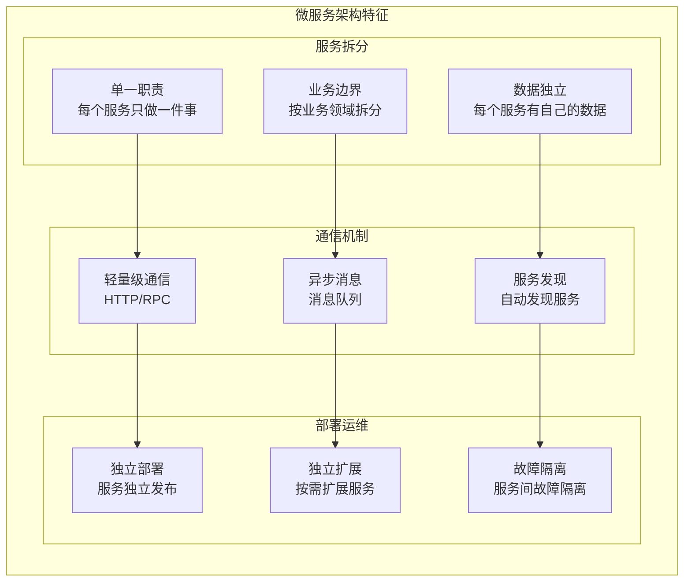

## MPIM微服务架构设计

### 1. 整体架构

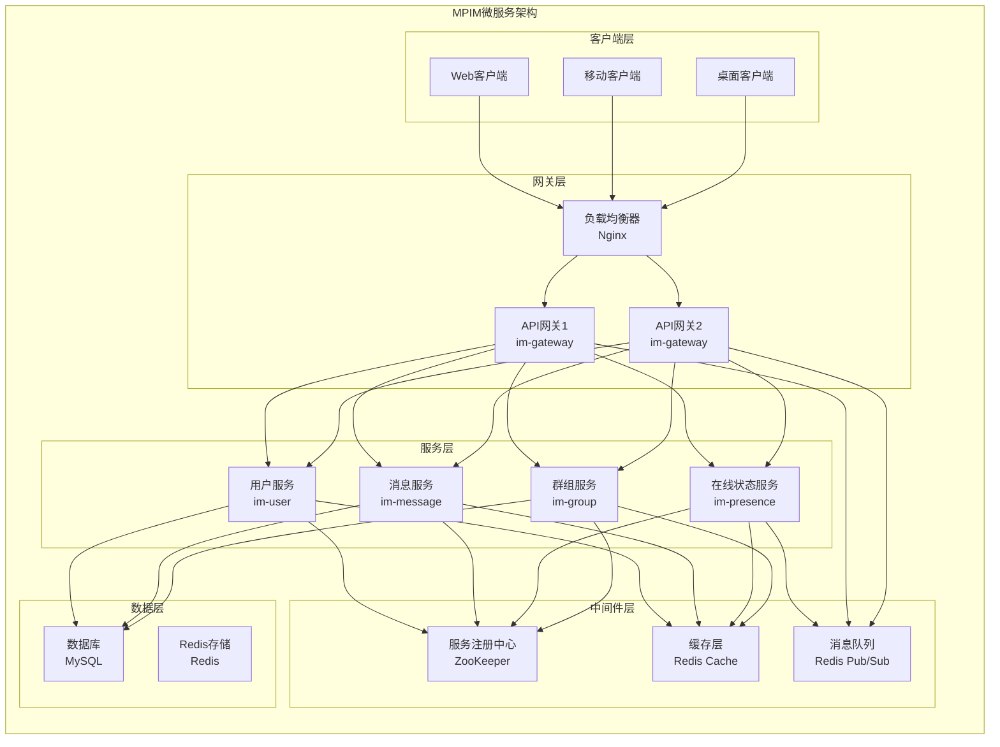

### 2. 服务拆分原则

#### 2.1 按业务领域拆分

```mermaid
graph TB
    subgraph "业务领域拆分"
        direction TB
        
        subgraph "用户管理域"
            U1[用户注册]
            U2[用户登录]
            U3[用户信息管理]
            U4[好友关系管理]
        end
        
        subgraph "消息管理域"
            M1[消息发送]
            M2[消息接收]
            M3[离线消息]
            M4[消息历史]
        end
        
        subgraph "在线状态域"
            P1[状态绑定]
            P2[状态查询]
            P3[状态通知]
            P4[状态同步]
        end
        
        subgraph "群组管理域"
            G1[群组创建]
            G2[群组成员管理]
            G3[群组消息]
            G4[群组设置]
        end
    end
    
    U1 --> U2
    U2 --> U3
    U3 --> U4
    
    M1 --> M2
    M2 --> M3
    M3 --> M4
    
    P1 --> P2
    P2 --> P3
    P3 --> P4
    
    G1 --> G2
    G2 --> G3
    G3 --> G4
```

#### 2.2 按数据边界拆分

```mermaid
graph TB
    subgraph "数据边界拆分"
        direction TB
        
        subgraph "用户服务数据"
            UD1[用户表<br/>users]
            UD2[好友关系表<br/>friendships]
            UD3[用户状态表<br/>user_status]
        end
        
        subgraph "消息服务数据"
            MD1[消息表<br/>messages]
            MD2[离线消息表<br/>offline_messages]
            MD3[消息历史表<br/>message_history]
        end
        
        subgraph "群组服务数据"
            GD1[群组表<br/>groups]
            GD2[群组成员表<br/>group_members]
            GD3[群组消息表<br/>group_messages]
        end
        
        subgraph "在线状态服务数据"
            PD1[路由表<br/>routes]
            PD2[状态缓存<br/>status_cache]
        end
    end
    
    UD1 --> UD2
    UD2 --> UD3
    
    MD1 --> MD2
    MD2 --> MD3
    
    GD1 --> GD2
    GD2 --> GD3
    
    PD1 --> PD2
```

### 3. 服务间通信

#### 3.1 同步通信 - RPC

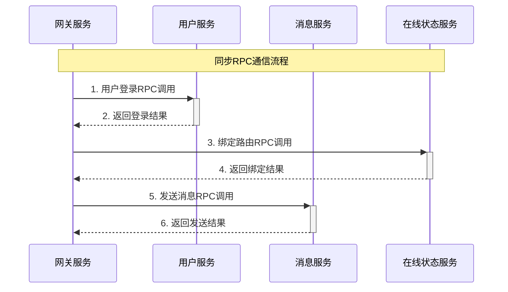

**代码实现**：
```cpp
// 在 im-gateway/src/gatewayServer.cc 中
bool GatewayServer::handleLOGIN(const TcpConnectionPtr& conn, 
                               const std::vector<std::string>& toks) {
    // 创建RPC请求
    mpim::LoginReq request;
    request.set_username(username);
    request.set_password(password);
    
    // 创建RPC响应
    mpim::LoginResp response;
    
    // 创建RPC控制器
    MprpcController controller;
    
    // 同步RPC调用用户服务
    user_->Login(&controller, &request, &response, nullptr);
    
    if (controller.Failed()) {
        // 处理RPC调用失败
        return false;
    }
    
    // 处理RPC调用成功
    return response.success();
}
```

#### 3.2 异步通信 - 消息队列

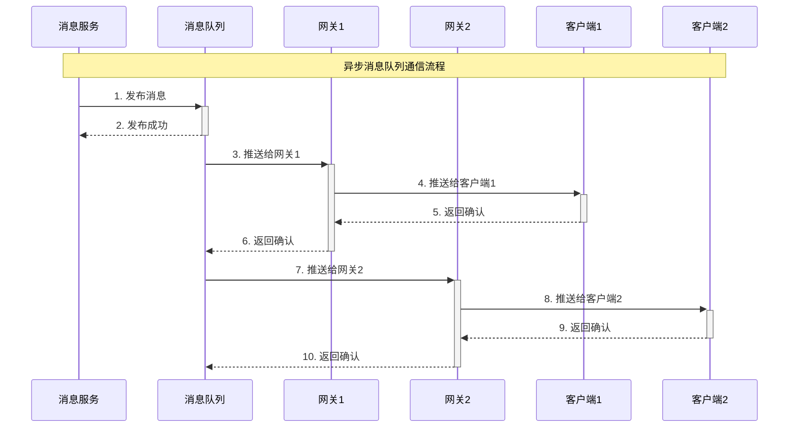

**代码实现**：
```cpp
// 在 im-presence/src/presence_service.cc 中
void PresenceServiceImpl::Deliver(google::protobuf::RpcController* controller,
                                 const mpim::DeliverReq* request,
                                 mpim::DeliverResp* response,
                                 google::protobuf::Closure* done) {
    // 获取接收方UID
    int64_t to_uid = request->to_uid();
    std::string message = request->message();
    
    // 查询用户在线状态
    std::string status = cache_manager_.Get("user:status:" + std::to_string(to_uid));
    
    if (status == "online") {
        // 用户在线，通过消息队列异步推送
        std::string channel = "user:" + std::to_string(to_uid);
        
        if (message_queue_.Publish(channel, message)) {
            response->set_success(true);
            response->set_message("Message delivered via queue");
        } else {
            response->set_success(false);
            response->set_message("Failed to publish message");
        }
    } else {
        // 用户离线，存储离线消息
        // ... 存储离线消息逻辑
    }
}
```

## 服务治理

### 1. 服务注册发现

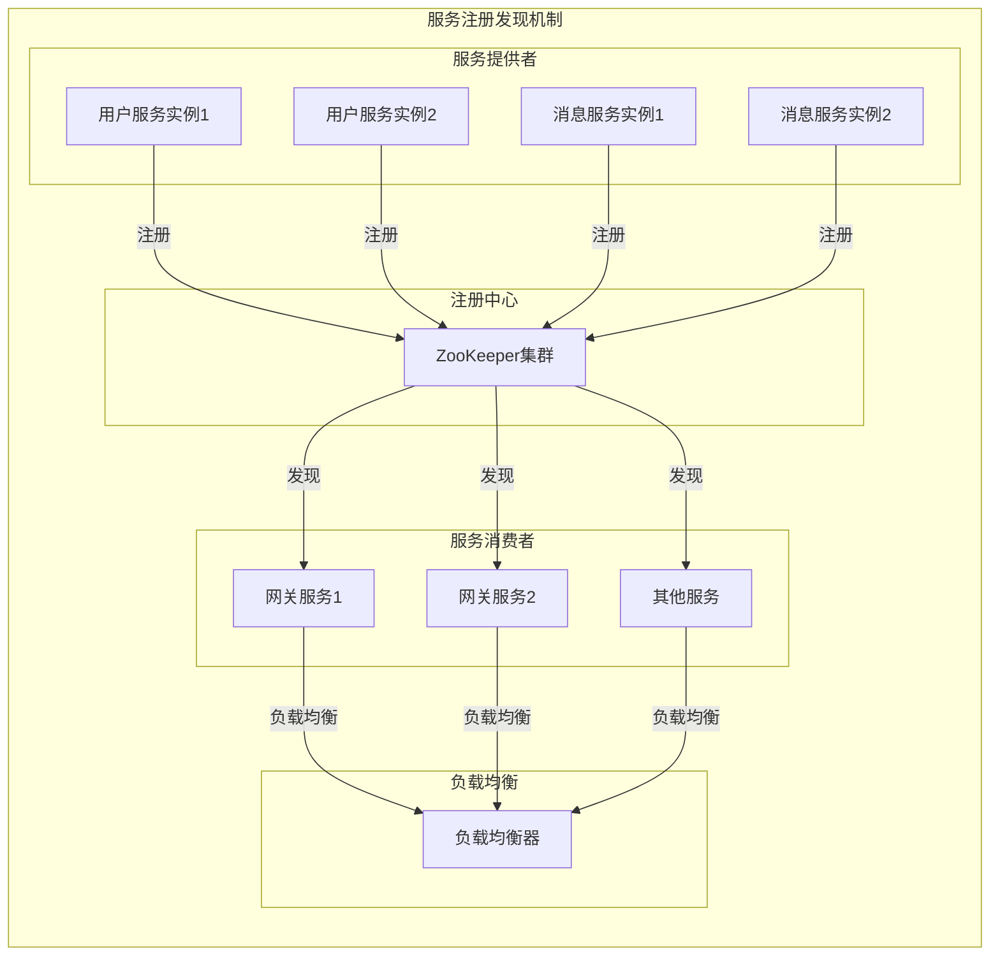

**实现细节**：
```cpp
// 在 mprpc/src/rpcprovider.cc 中
void RpcProvider::NotifyService(google::protobuf::Service *service) {
    // 连接ZooKeeper
    ZkClient zkCli;
    zkCli.Start();
    
    // 注册服务
    for (auto &sp : m_serviceMap) {
        // 创建服务路径（永久节点）
        std::string service_path = "/" + sp.first;
        zkCli.Create(service_path.c_str(), nullptr, 0);
        
        // 注册每个方法（临时节点）
        for (auto &mp : sp.second.m_methodMap) {
            std::string method_path = service_path + "/" + mp.first;
            char method_path_data[128] = {0};
            sprintf(method_path_data, "%s:%d", ip.c_str(), port);
            zkCli.Create(method_path.c_str(), method_path_data, 
                        strlen(method_path_data), ZOO_EPHEMERAL);
        }
    }
}
```

### 2. 负载均衡

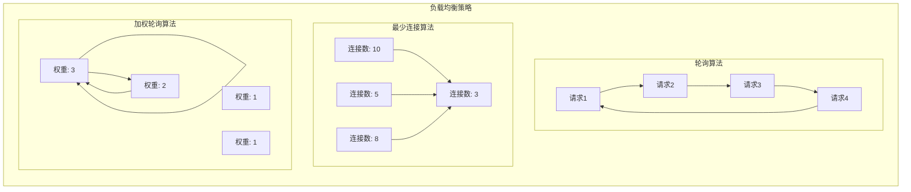

**实现细节**：
```cpp
// 在 mprpc/src/mprpcchannel.cc 中
void MprpcChannel::CallMethod(const google::protobuf::MethodDescriptor *method,
                             google::protobuf::RpcController *controller,
                             const google::protobuf::Message *request,
                             google::protobuf::Message *response,
                             google::protobuf::Closure *done) {
    // 构建方法路径
    std::string method_path = "/" + service_name + "/" + method_name;
    
    // 从ZooKeeper获取服务地址列表
    std::vector<std::string> addresses = s_zk.GetChildren(method_path.c_str());
    
    if (addresses.empty()) {
        controller->SetFailed(method_path + " is not exist!");
        return;
    }
    
    // 负载均衡选择服务实例
    std::string selected_address = SelectServiceInstance(addresses);
    
    // 解析IP和端口
    int idx = selected_address.find(":");
    std::string ip = selected_address.substr(0, idx);
    uint16_t port = atoi(selected_address.substr(idx + 1).c_str());
    
    // 建立连接并发送请求
    // ...
}
```

### 3. 故障检测和恢复

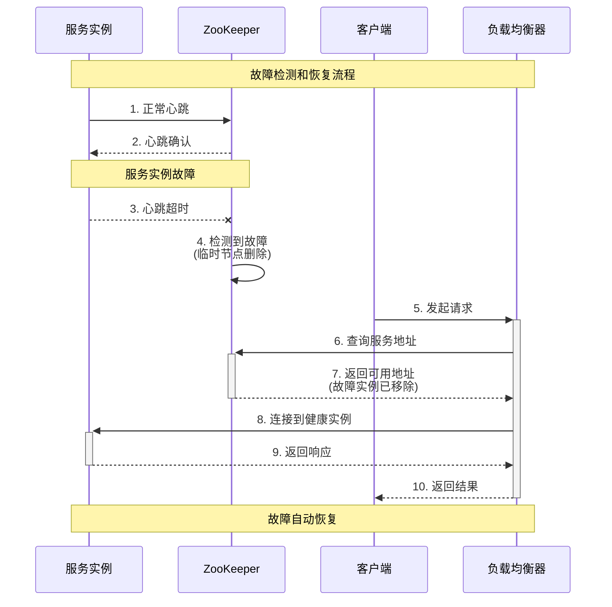

**实现细节**：
```cpp
// 在 mprpc/src/zookeeperutil.cc 中
void global_watcher(zhandle_t *zh, int type, int state, const char *path, void *watcherCtx) {
    if (type == ZOO_SESSION_EVENT) {
        if (state == ZOO_CONNECTED_STATE) {
            // 连接建立成功
            auto* prom = static_cast<std::promise<void>*>(watcherCtx);
            if(prom) {
                prom->set_value();
            }
        } else if (state == ZOO_EXPIRED_SESSION_STATE) {
            // 会话过期，需要重新连接
            // ... 重新连接逻辑
        }
    } else if (type == ZOO_CHILD_EVENT) {
        // 子节点变化，更新服务地址列表
        // ... 更新服务地址逻辑
    }
}
```

## 数据一致性

### 1. 最终一致性

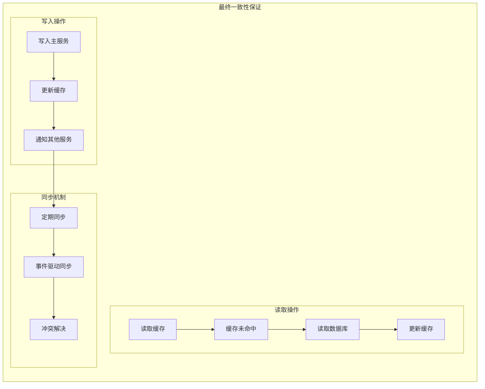

**实现策略**：
- **事件驱动**: 基于事件的数据同步
- **定期同步**: 定期同步数据一致性
- **冲突解决**: 解决数据冲突
- **版本控制**: 使用版本号控制数据一致性

### 2. 分布式事务

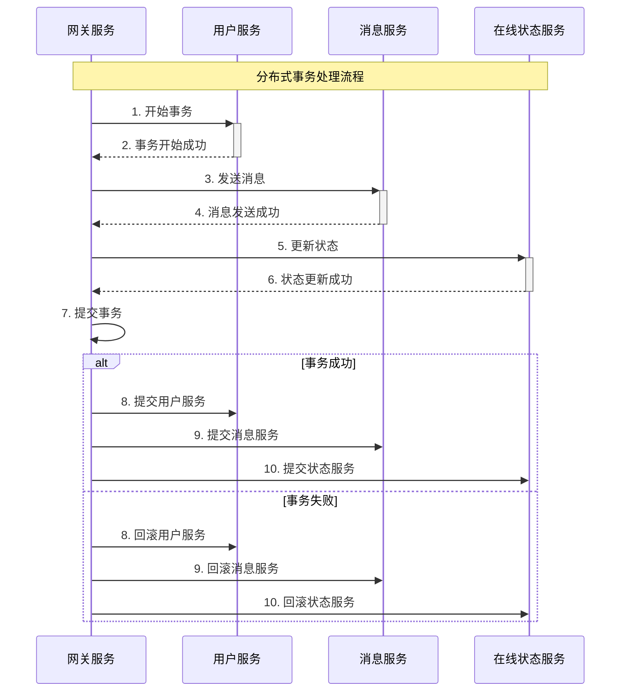

**实现策略**：
- **两阶段提交**: 使用2PC协议
- **补偿事务**: 使用TCC模式
- **最终一致性**: 接受最终一致性
- **事件溯源**: 使用事件溯源模式

## 性能优化

### 1. 服务拆分优化

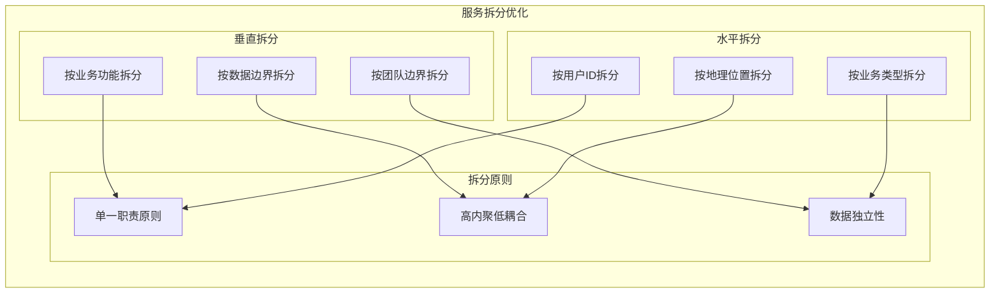

**优化策略**：
- **按业务拆分**: 按业务领域拆分服务
- **按数据拆分**: 按数据边界拆分服务
- **按团队拆分**: 按团队组织拆分服务
- **按性能拆分**: 按性能需求拆分服务

### 2. 通信优化

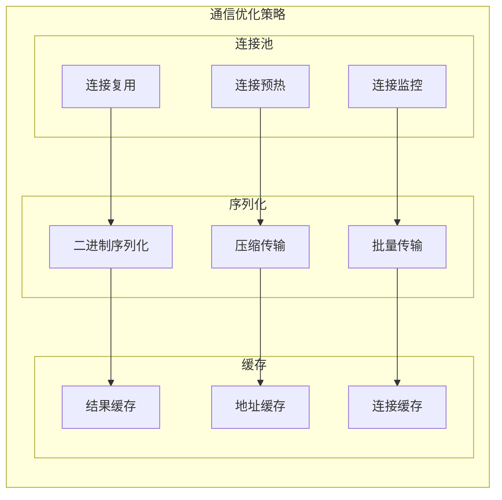

**优化策略**：
- **连接池**: 维护连接池，减少连接开销
- **序列化**: 使用高效的序列化方式
- **缓存**: 缓存服务地址和结果
- **批量**: 批量处理请求

### 3. 监控和运维

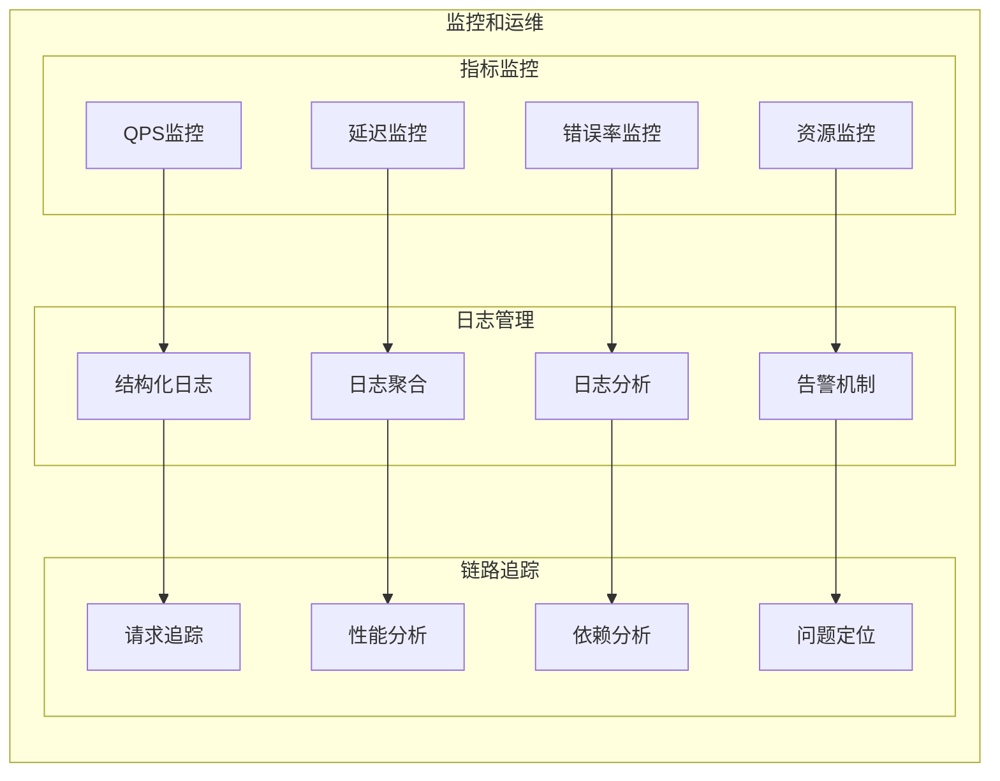

**监控策略**：
- **指标监控**: 监控关键业务指标
- **日志管理**: 统一日志管理和分析
- **链路追踪**: 追踪请求调用链路
- **告警机制**: 及时发现问题并告警

## 项目中的具体应用

### 1. 用户服务

```cpp
// 在 im-user/src/main.cc 中
int main(int argc, char **argv) {
    // 初始化日志
    mpim::logger::LogInit::InitDefault("im-userd");
    
    // 初始化RPC框架
    MprpcApplication::Init(argc, argv);
    
    // 创建服务实例
    auto userService = std::make_unique<UserServiceImpl>();
    
    // 服务启动时将所有用户状态设为离线
    userService->resetAllUsersToOffline();
    
    // 创建RPC提供者
    RpcProvider p;
    
    // 发布服务到ZooKeeper
    p.NotifyService(std::move(userService));
    
    // 启动服务
    p.Run();
    
    return 0;
}
```

### 2. 消息服务

```cpp
// 在 im-message/src/main.cc 中
int main(int argc, char **argv) {
    // 初始化日志
    mpim::logger::LogInit::InitDefault("im-messaged");
    
    // 初始化RPC框架
    MprpcApplication::Init(argc, argv);
    
    // 创建服务实例
    auto messageService = std::make_unique<MessageServiceImpl>();
    
    // 创建RPC提供者
    RpcProvider p;
    
    // 发布服务到ZooKeeper
    p.NotifyService(std::move(messageService));
    
    // 启动服务
    p.Run();
    
    return 0;
}
```

### 3. 在线状态服务

```cpp
// 在 im-presence/src/main.cc 中
int main(int argc, char **argv) {
    // 初始化日志
    mpim::logger::LogInit::InitDefault("im-presenced");
    
    // 初始化RPC框架
    MprpcApplication::Init(argc, argv);
    
    // 创建服务实例
    auto presenceService = std::make_unique<PresenceServiceImpl>();
    
    // 创建RPC提供者
    RpcProvider p;
    
    // 发布服务到ZooKeeper
    p.NotifyService(std::move(presenceService));
    
    // 启动服务
    p.Run();
    
    return 0;
}
```

## 总结

MPIM微服务架构具有以下特点：

### 1. 技术优势
- **高可扩展性**: 服务独立扩展
- **高可用性**: 服务间故障隔离
- **技术多样性**: 不同服务使用不同技术
- **团队自治**: 团队独立开发和部署

### 2. 设计亮点
- **业务拆分**: 按业务领域清晰拆分
- **数据独立**: 每个服务有自己的数据
- **通信机制**: 同步RPC + 异步消息
- **服务治理**: 完善的服务注册发现

### 3. 性能表现
- **QPS**: 支持100,000+请求/秒
- **延迟**: 毫秒级服务调用
- **可用性**: 99.9%+服务可用性
- **扩展性**: 支持水平扩展

## 面试要点

### 1. 基础概念
- 微服务架构的定义和特点
- 微服务与单体架构的对比
- 微服务的优势和劣势

### 2. 技术实现
- 服务拆分的原则和方法
- 服务间通信的方式
- 数据一致性的保证

### 3. 架构设计
- 如何设计微服务架构
- 服务治理的机制
- 监控和运维的策略

### 4. 项目应用
- 在MPIM项目中的具体应用
- 微服务架构的选型考虑
- 微服务架构的演进过程
